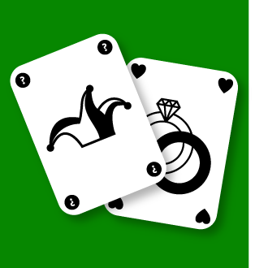
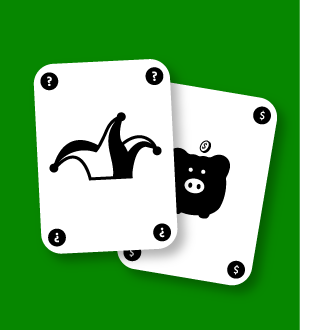
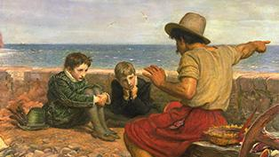
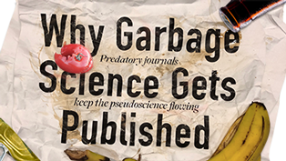
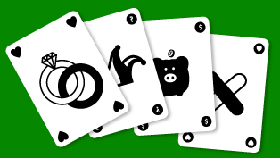
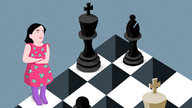
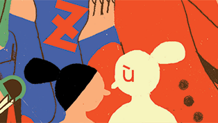

The Resulting Fallacy Is Ruining Your Decisions - Issue 55: Trust - Nautilus

 [ ](https://www.paypal.com/cgi-bin/webscr?cmd=_s-xclick&hosted_button_id=Q6JLSZ3H4UFVC)

|     |     |     |
| --- | --- | --- |
| [Culture](http://nautil.us/term/l/Culture) |     | [Psychology](http://nautil.us/term/f/Psychology) |

# The Resulting Fallacy Is Ruining Your Decisions

## Are you judging your decisions on their outcomes?

By Stuart Firestein Introduction by Nautilus StaffDecember 7, 2017

- [*c* Add a comment](http://nautil.us/issue/55/trust/the-resulting-fallacy-is-ruining-your-decisions#comm)

- [*f* Facebook](https://www.facebook.com/sharer/sharer.php?s=100&p%5Bsite_name%5D=Nautilus&p%5Btype%5D=website&p%5Burl%5D=http%3A%2F%2Fnautil.us%2Fissue%2F55%2Ftrust%2Fthe-resulting-fallacy-is-ruining-your-decisions&p%5Btitle%5D=The+Resulting+Fallacy+Is+Ruining+Your+Decisions+-+Issue+55%3A+Trust+-+Nautilus&p%5Bsummary%5D=Most+poker+players+didn%E2%80%99t+go+to+graduate+school+for+cognitive+linguistics.+Then+again%2C+most+poker+players+aren%E2%80%99t+Annie+Duke.+After%26%238230%3B&p%5Bimages%5D%5B0%5D=http%3A%2F%2Fstatic.nautil.us%2F13843_9181a74736d3b86345dadbc90e29390e.png)

- [*t* Twitter](https://twitter.com/share?url=http%3A%2F%2Fnautil.us%2Fissue%2F55%2Ftrust%2Fthe-resulting-fallacy-is-ruining-your-decisions&text=The+Resulting+Fallacy+Is+Ruining+Your+Decisions&via=NautilusMag)

- [*m* Email](http://nautil.us/issue/55/trust/the-resulting-fallacy-is-ruining-your-decisionsmailto:?subject=Nautilus:%20The%20Resulting%20Fallacy%20Is%20Ruining%20Your%20Decisions&body=I%20saw%20this%20article%20on%20Nautil.us%20and%20wanted%20to%20share%20it%20with%20you.%0D%0A---------------------------%0D%0AThe%20Resulting%20Fallacy%20Is%20Ruining%20Your%20Decisions%0D%0APsychology:Are%20you%20judging%20your%20decisions%20on%20their%20outcomes?%0D%0A%0D%0AMost%20poker%20players%20didn%E2%80%99t%20go%20to%20graduate%20school%20for%20cognitive%20linguistics.%0D%0A%0D%0Ahttp://nautil.us/issue/55/trust/the-resulting-fallacy-is-ruining-your-decisions)

- [*U* Sharing]()
- [*X* Reddit](http://www.reddit.com/submit?title=The+Resulting+Fallacy+Is+Ruining+Your+Decisions&url=http%3A%2F%2Fnautil.us%2Fissue%2F55%2Ftrust%2Fthe-resulting-fallacy-is-ruining-your-decisions)

- [*Y* Stumbleupon](http://www.stumbleupon.com/badge/?url=http%3A%2F%2Fnautil.us%2Fissue%2F55%2Ftrust%2Fthe-resulting-fallacy-is-ruining-your-decisions)

- [*V* Tumblr](http://tumblr.com/share?s=&v=3&t=The+Resulting+Fallacy+Is+Ruining+Your+Decisions&u=http%3A%2F%2Fnautil.us%2Fissue%2F55%2Ftrust%2Fthe-resulting-fallacy-is-ruining-your-decisions)

- [*L* Pocket](https://getpocket.com/save?url=http%3A%2F%2Fnautil.us%2Fissue%2F55%2Ftrust%2Fthe-resulting-fallacy-is-ruining-your-decisions&title=The+Resulting+Fallacy+Is+Ruining+Your+Decisions)

Most poker players didn’t go to graduate school for cognitive linguistics. Then again, most poker players aren’t Annie Duke.

After pursuing a psychology Ph.D. on childhood language acquisition, Duke turned her skills to the poker table, where she has taken home over $4 million in lifetime earnings. For a time she was the leading female money winner in World Series of Poker history, and remains in the top five. She’s written two books on poker strategy, and next year will release a book called *Thinking in Bets: Making Smarter Decisions When You Don’t Have All the Facts*.

> Don’t be so hard on yourself when things go badly and don’t be so proud of yourself when they go well.

>

In it, Duke parlays her experience with cards into general lessons about decision making that are relevant for all of us. If a well-reasoned decision leads to a negative outcome, was it the wrong decision? How do we distinguish between luck and skill? And how do we move beyond our cognitive biases?

Stuart Firestein, a professor of neuroscience at Columbia University, sat down with Duke in October to talk to her about life and poker.

**Not a resulter :** Annie Duke at the 2007 World Series of Poker.flipchip / lasvegas.com

**How did you get into science?**

From when I was very young I set out on an academic path. My parents were both teachers. My dad taught at a small private school in New England. My mother taught at the local public school until she had babies. (It was the ’60s, and that was the usual path for women then.) I grew up on the campus of the school and then went to Columbia. When I entered Columbia I thought I would follow in my father’s footsteps and major in English and go on to graduate school. In my family, it was really this idea of, “Where are you going to go to graduate school?” not “if.” I ended up double majoring in English and psychology. The whole time I was at Columbia, I worked in Barbara Landau’s lab as a research assistant. She was looking at first language acquisition, which was a topic I fell in love with—it’s what I ended up actually studying when I went to graduate school.

**What interested you in language acquisition?**

You end up studying kind of the whole ecosystem of what learning looks like. What’s the brain doing that it can learn this very, very complex system so quickly? A 1-year-old does very well with new languages, and that’s interesting in terms of brain plasticity and learning. Then there’s the question of how a baby figures out what goes with what. There are a lot of noises flying around and the child has to figure out what are words and what aren’t. Nobody hands the child a map or a key. Then the child has to figure out where the boundaries are. How do you figure out what the end of a word is? How do you figure out what the end of a phrase is? It’s really thinking about this very uncertain system. So, I started off very young in my academic career saying, “I’m really interested in these sort of uncertain systems, and how you take feedback in an uncertain system and actually map it properly and try to learn from it.”

> That’s the hidden information problem. We know the facts that we know, but there may be facts that we don’t know.

>

**What was your approach in graduate school?**

Landau sent me on my way to Penn to study with Lila and Henry Gleitman, whom she’d studied under. Lila was actually a student of Noam Chomsky, who argues that grammar is built into our brains just like math is. If you have this kind of access to the grammar, it narrows down the uncertainty in the system. I began looking at something called syntactic bootstrapping. The idea was that if the child has access to a built-in grammar, then you can get a long way to actually being able to bootstrap the meaning of words from that. I also looked at the rhythm of mothers’ speech to children to show that the rhythm actually mirrors the grammatical structure of the language. That means the child has access to the grammar through the rhythm of maternal speech.

**How did you get into poker from academia?**

Right at the end of graduate school I got sick. Landed in the hospital for two weeks. Had a very bad stomach problem. Didn’t figure out what was wrong with me for a long time. It’s something that sort of flares and goes, and flares and goes. But it was right as I was supposed to be going and doing all of my job talks. I called all the places I had job talks at and said, “You know what? I really need to wait a second because I’m sick.” So, I delayed everything until the next season. Just rescheduled. So, I went off and had this sort of year off in 1992. I’m like, “Okay. Well, now what am I going to do?” I started playing poker in that year, which sounds kind of crazy, but it’s actually not that accidental because my brother, when he was 18, had moved to New York to study chess. His name is Howard Lederer. And he had moved to New York to study chess with a grandmaster, and actually landed in a poker game along the way. He lost his college fund, which was $6,300, by the way, but that turned out to pay off really well. By the time he was 21, he was one of the best players in the world. By the time he was 23, he had made the final table of the World Series of Poker. So my brother made the suggestion, “You’ve got this time off and you need some money. Why don’t you try playing poker to make some money while you’re waiting to go back?” So, I did, and the wait was 20 years long.

**Did you have an instant knack for poker?**

I think that I had a big leg up. As part of my training in experimental psych, I had done a lot of statistics and probability work, which is really important to poker. I understood the rigor. And then I had done all this work on uncertainty, and I think that you have to deeply embed yourself in uncertainty in order to become good at poker. And then I also had the advantage of my brother who taught me all those lessons without me needing to lose my college fund like he had. He actually was incredibly helpful and really coached me. I spent a lot of time watching him play.

**Do you think you were underestimated as a woman at the poker table, and could you use that to your advantage?**

I started playing in Montana, weirdly, because during my time off I got married to a man whose family lived in Montana. So, we went and lived in Montana for a few years and I started playing in these little tiny bars. There was this bar called the Crystal Lounge, and a place across the way called the Monte Carlo. The Crystal Lounge had a poker room in the basement and it was sort of what you’d expect. Ranchers, people who were retired and were on disability, that kind of thing. I can’t imagine a lot of them are alive anymore, but if you could find one, I think they would tell you that I was the luckiest person that ever lived. They would not tell you I was any good. That was a big advantage, having them just think I was lucky.

**Why is it that luck and skill can be so easily confused?**

This is actually a topic that I go into very deeply in my book. I think about it the same way that I was thinking about the way you learn a first language. Now, what does a word apply to? Nobody gives you a map. Nobody tells you, “This was skill,” or, “This was luck.” Say you go through a green light and you get through safely. Was that skill or luck? Well, we know it’s some combination. Trying to figure out what combination is really hard. And that’s a very simple example. You get into these complex situations where the outcome is the result of multiple decisions. Sometimes the decision is incredibly remote from the outcome. I could make a decision about raising my kids or what my disciplinary style is when they’re 5, and not see the results until they’re 18. So, now they’re misbehaving when they’re 18—is it something that I did in the distant past? That gets very complicated. The problem is that you only have the outcome to look at.

> You have to deeply embed yourself in uncertainty in order to become good at poker.

>

**How should we deal with the fact that there is so much luck involved in decisions?**

Wrap your arms around the uncertainty. Accept it. Know that the way things turn out has a lot of luck involved so don’t be so hard on yourself when things go badly and don’t be so proud of yourself when they go well. Focus on process instead.

Say I have a fair coin. I can tell you exactly what the probability of heads or tails on the next flip is. But I can’t tell you what the next flip will be. That’s what accepting outcomes is like. Accepting that you don’t know if the coin will land heads or tails on the next flip. That means that if you offer me a $2-to-$1 gambling proposition on this coin, I should be willing to do that. Even if I lose the next 10 flips, that doesn’t mean that I made a bad decision. And I should strive to be happy that I made a good decision and not focus on the result. It’s a mindset thing.

In life, it’s usually even more complicated because in most real decisions we haven’t examined the coin. We don’t know if it is a fair coin, if it has two sides with a heads and tails on it and is weighted properly. That’s the hidden information problem. We can’t see everything. We haven’t experienced everything. We know the facts that we know, but there may be facts that we don’t know. Then the job of the decider is to reduce the uncertainty as much as they possibly can, but to understand that they’re always working within a range and they have limited control over how things turn out on any given try.

**What mistakes do we make in evaluating our decisions?**

There’s this word that we use in poker: “resulting.” It’s a really important word. You can think about it as creating too tight a relationship between the quality of the outcome and the quality of the decision. You can’t use outcome quality as a perfect signal of decision quality, not with a small sample size anyway. I mean, certainly, if someone has gotten in 15 car accidents in the last year, I can certainly work backward from the outcome quality to their decision quality. But one accident doesn’t tell me much.

In chess, if I lose a game, it’s pretty certain that I made a bad decision somewhere and I can go look for it. That’s a totally reasonable strategy. But it is a very unreasonable strategy in poker. If I lose a hand, I may have played the hand literally perfectly and still lost because there’s this luck element to it. The problem is that we’re all resulters at heart. Think about the 2015 Super Bowl. The Seahawks are on the 1-yard line, they’re down by four, there’s 26 seconds left in the game, Pete Carroll has Russell Wilson throw and it’s intercepted. Do you remember what the headlines looked like the next day? “Worst play in Super Bowl history,” “What was he thinking?” “Idiot.” That kind of thing. But imagine it was caught—what do you think the headlines would have looked like then? The outcome was irrelevant to the decision quality. And just as a teaser, the decision quality was actually pretty brilliant. I won’t go into the details of why; you’ll have to read my book for that.

[Also in Psychology](http://nautil.us/term/f/Psychology)

#### [What’s Your Story?](http://nautil.us/issue/30/Identity/whats-your-story)

By Jennifer Ouellette

We’re all stories in the end.— “The Big Bang,” Doctor Who...**[READ MORE](http://nautil.us/issue/30/Identity/whats-your-story)**

**Why are we all resulters?**

Knowing the outcome infects us. We’re rational beings that think things are supposed to make sense. It’s very hard for us to wrap our heads around a bad outcome when we didn’t do anything wrong. Or that there’s a good outcome that’s just random. We’re really uncomfortable with randomness in that way. It’s just the way we’re built: to recognize patterns. Which can be bad for decision making in some ways, but is a good thing in others because otherwise we wouldn’t be able to recognize our mother’s face and then we’d be dead.

**How do we stop being resulters?**

If we know that outcomes infect us, we want to separate ourselves from outcomes as much as we possibly can when we’re thinking about decision quality. And we can really do that. Doesn’t matter to me whether you got in an accident or not—I should be able to ask you questions to decide whether your decision quality while you were driving was good, because there’s certain things that I do know go into a good decision about driving. You should be sort of trying to think about that for yourself, but also, don’t talk about the outcome when you’re asking other people about the quality of their decisions. This is something that really great poker players do. If I were to describe a hand to you that I had a question about, I would give a lot of detail. The kinds of details that I know you need to know. Then I’m going to tell you the decision point. But I may not tell you the decision I made, because that might infect you. And you can go out and do that in your own life.

*Stuart Firestein is a professor of neuroscience in the Department of Biological Sciences at Columbia University. He is a fellow of the American Association for the Advancement of Science, a Guggenheim Fellow, and serves as an advisor to the Alfred P. Sloan Foundation.*

## Issue 055

### Trust

#### [Explore This Issue](http://nautil.us/issue/55/trust)

- Chapter one

Legacy

    - [  Science Practice   Why Garbage Science Gets Published](http://nautil.us/issue/55/trust/why-garbage-science-gets-published)
    - [  Psychology   Parents Shouldn’t Spy on Their Kids](http://nautil.us/issue/55/trust/parents-shouldnt-spy-on-their-kids-rp)
    - [  Psychology   The Resulting Fallacy Is Ruining Your Decisions](http://nautil.us/issue/55/trust/the-resulting-fallacy-is-ruining-your-decisions)

Join the Discussion

## Next Article:

Numbers

### [The Bitcoin Paradox](http://nautil.us/issue/55/trust/the-bitcoin-paradox)

*By Simon DeDeo*

## Related Articles:

- Biology

### [Learning Chess at 40](http://nautil.us/issue/36/aging/learning-chess-at-40)

*By Tom Vanderbilt*

- Numbers

### [Claude Shannon, the Las Vegas Shark](http://nautil.us/issue/50/emergence/claude-shannon-the-las-vegas-cheat)

*By Jimmy Soni & Rob Goodman*

- Culture

### [The Strange Persistence of First Languages](http://nautil.us/issue/30/identity/the-strange-persistence-of-first-languages)

*By Julie Sedivy*