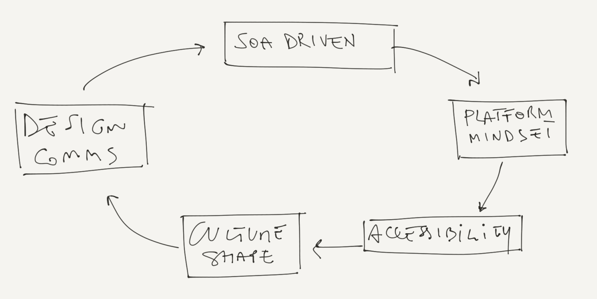
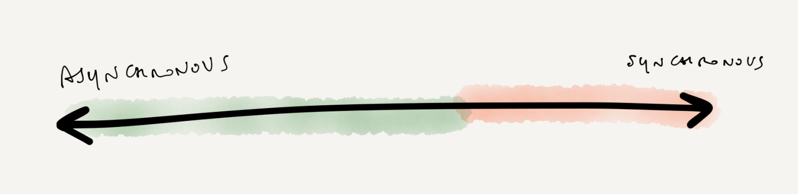
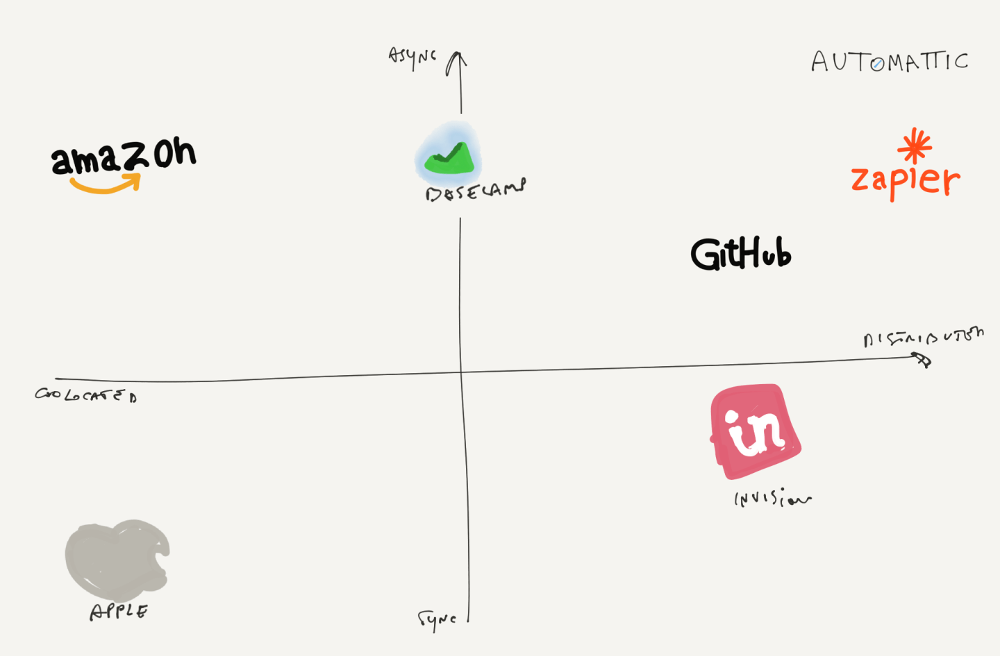
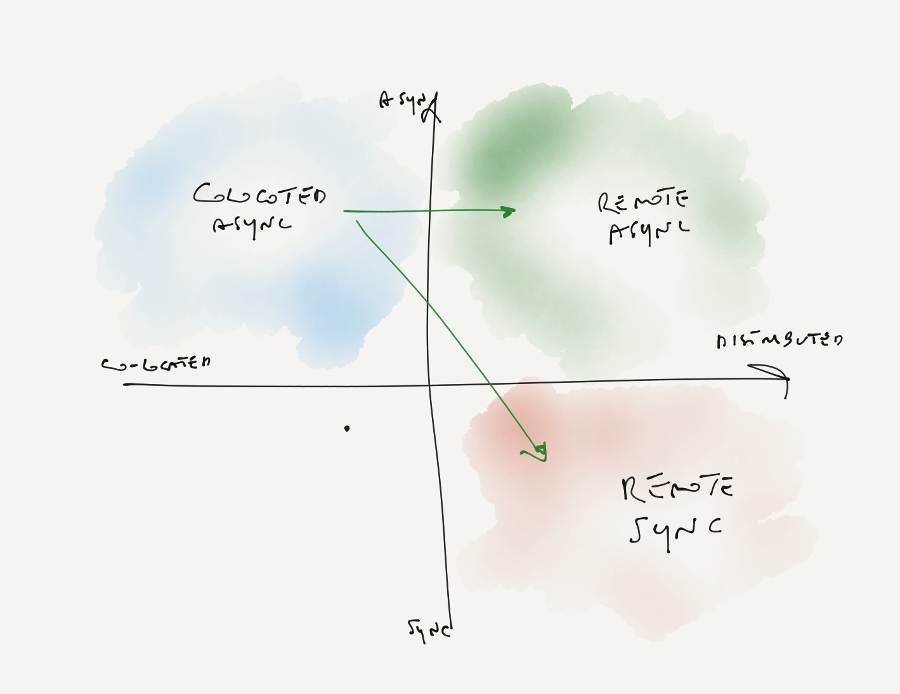
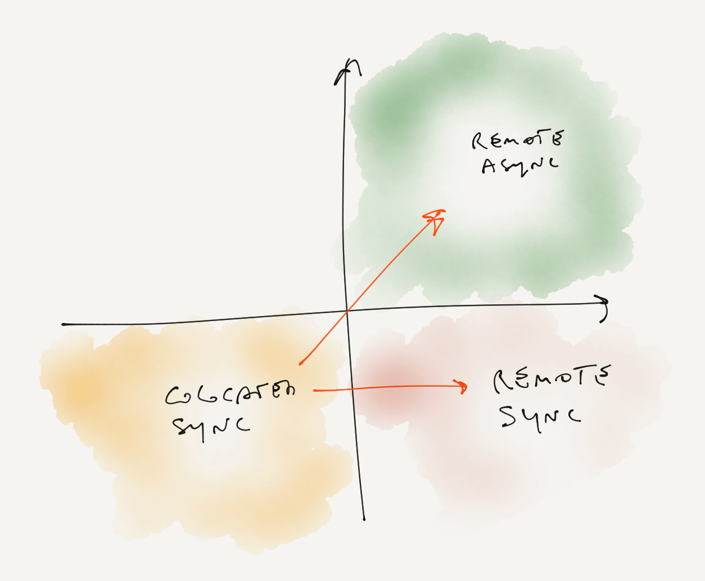
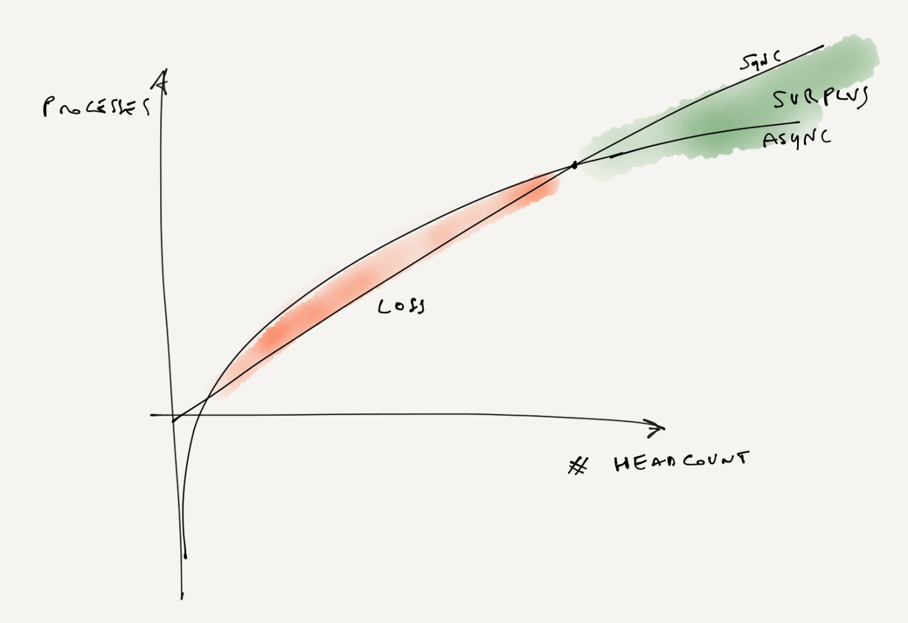

The Single Most Important Internal Email in the History of Amazon

 

Product
Solutions
[Enterprise](https://www.sametab.com/enterprise)
Resources
Company
[Pricing](https://www.sametab.com/pricing)
[Log in](https://app.sametab.com/)
[Get Started](https://app.sametab.com/signup)

### Blog

Join 800+ Operators
Essays and guides on remote work

1. [Blog](https://www.sametab.com/blog)
2. 
3. [Remote Work](https://www.sametab.com/blog-categories/remote-work)
October 2, 2019
[Remote Work](https://www.sametab.com/blog-categories/remote-work)

# The Single Most Important Internal Email in the History of Amazon

I never planned to do a series of articles, but this write-up almost came as a natural follow-up to the post I wrote last week about [Context over Control and the future of remote work](https://www.sametab.com/blog/future-remote-working). Last week I explored the ground rules of the future of work. Specifically, I talked about how and why the fundamental prerequisites of work have changed. Here I’m taking a step further and describing some of the literature behind today’s organizations’ communication systems. What they're made of, why they can be so impactful in today’s organizations, and how they’re related to the concept of remote working.

On to the write-up.

A good internal design communication system is one of the most important leverages an organization can have to make an impact.

In 2011, a post came out under the name of [Stevey’s Google Platforms Rant.](https://gist.github.com/chitchcock/1281611) I have revisited the article over and over again over the years (if you haven’t read it yet it really is fantastic) and to this day I think this is the single best article I’ve ever read about organization architecture and the management of IT.

Yegge’s rant is about what he’s noticed after spending  6 years  at Amazon and 6 years  at Google.

In short: Amazon figured out how to serve customers. It started out serving Amazon.com but critically, as Yegge noted, the relationship was very much at arm’s length: AWS has always treated Amazon.com no differently than any outside user, which prepared it to offer the right sort of services for any scalable web service. On the other side, Google, with its Cloud provider, Google Platform, does not serve most Google Products. In other words, while Amazon did manage to have discipline towards internal dogfooding, Google didn’t. And that made a world of difference.

In recent years, I started to realize that what I noted above was actually the gist of that post, but it was not the most interesting thing about it.

In the article, Yegge (again, read it if you haven’t yet) describes an internal Email Jeff Bezos sent to the 150-odd Amazon employees. Quoting Yegge’s post, the email was along these lines:

> 1) All teams will henceforth expose their data and functionality through service interfaces.

> 2) Teams must communicate with each other through these interfaces.

> 3) There will be no other form of interprocess communication allowed: no direct linking, no direct reads of another team’s data store, no shared-memory model, no back-doors whatsoever. The only communication allowed is via service interface calls over the network.

> 4) It doesn’t matter what technology they use. HTTP, Corba, Pubsub, custom protocols — doesn’t matter. Bezos doesn’t care.

> 5) All service interfaces, without exception, must be designed from the ground up to be externalizable. That is to say, the team must plan and design to be able to expose the interface to developers in the outside world. No exceptions.

> 6) Anyone who doesn’t do this will be fired.
> 7) Thank you; have a nice day!

Now I think that this internal email is what has actually  stuck with me the most. Bezos realized that he had to change the internal communication infrastructure before he could actually change the byproduct of the organization.

He understood that  a radical organizational change was required to arrange the internal dynamics in a way that would allow the creation of something like AWS.

Specifically, what he got right was an internal communication system designed to (1) embrace accessibility as its most important commandment in order to (2) enable a strong platform mindset and (3) incentivize extreme dogfooding.

While the third point makes all the  difference in the world, what Amazon really did get right that Google didn’t was an internal communication system designed to make all the rest possible.

Having teams acting like individual APIs and interacting with one another through interfaces over the network was the catalyst of a series of consequent actions that eventually made possible the realization of AWS in a way that couldn’t have been possible otherwise.

To this day I think the Amazon example might be one of the clearest case manifestations of Conway’s Law.

> Organizations which design systems are restricted to producing designs which are copies of their own communication structures.

## Frameworks for organization structures

Back to the initial premise of this article, it’s amazing how powerful and impactful internal communication infrastructures can be to an organization: from  day-to-day operations, to its culture, to the actual end-to-end user’s product.

There is one more additional point about Amazon’s case that is worth keeping in mind: Amazon didn’t perform any reorganization after Bezos's mandate. The internal organization structure was already there: same people, same teams, same chain management. What changed was the airflow: the policies, the processes, and the communications interfaces that regulated the internal dynamics of day-to-day operations. In other words, Amazon’s highly divisional organization was already suitable for such a big change.

Communication infrastructures are highly dependent on the organizational structures that are already in place. Because organizational structures depend on the people who are part of the company, these changes tend to happen over long time-frames (if they happen at all).

Lately, I’ve been thinking about what possible types of organizational structure there are, and what they empower.

### Functional organizations

Functional organizations are organized around areas of expertise. Apple might be one of the  most renowned examples of a functional organization. In the case of Apple, that means that design is one group (previously under Ive), product marketing is another (under Schiller), and operations a third (under Williams, who is also Chief Operating Officer), etc.

Functional Organization structure came to light as the embodiment of Fayol’s idea of *unity of direction*. The consequence of this principle is encapsulated in the name itself; an optimal shared level of consistency, coordination, and alignment across the entire organization. This, as in the case of Apple, often translates to vastly superior customer experiences.

On the other end, functional organizations tend to come with a lot of internal bureaucracy. Deep alignment and consistency come at the cost of a slower and more rigid  organization. Because of the low level of team autonomy, in these types of organizations, innovation tends to have a top-down (rather than bottom-up) trajectory.

### Divisional organizations

At the perennial opposite of the spectrum, we find divisional organizations. Divisional organizations sacrifice Fayol's principle of unity of direction and are organized around products rather than expertise. They started to be part of the playbook after DuPont's famous [reorganization](https://stratechery.com/2013/why-microsofts-reorganization-is-a-bad-idea/) in 1900.

Amazon is probably the best-known case of divisional organization. The two-pizza teams (introduced in its early years, and [still used today](https://www.allthingsdistributed.com/2019/08/modern-applications-at-aws.html)), their most common internal division, are the ultimate embodiment of a divisional organization. In these organizations, product teams act as independent entities within the wider organization. They have their own marketing, sales, engineering and finance functions so that each has autonomy and accountability. Each product has its own profit-and-loss statement (P&L), whereas  Apple famously had  a single P&L.

Two-pizza teams excel at agility, structure, clarity, speed of (mainly bottom-up) innovation, meaning, and impact. On the other hand, this profound divisional organization comes at the cost of inconsistency, a *high-maintenance* communication structure and an inferior  product experience.  As Yegge rightly noticed in his rant:

"Amazon’s recruiting process is fundamentally flawed by having teams hire for themselves, so their hiring bar is incredibly inconsistent across teams, despite various efforts they’ve made to level it out."

### Hybrid strategy

Then there are hybrid organization structures. Fundamentally, these are either functional organizations that adopted some divisional principles or vice-versa. One example that immediately comes to mind is Netflix.

As CEO Reed Hastings wrote, in the [*Highly aligned, loosely coupled*](https://jobs.netflix.com/culture) principle:

> "As companies grow, they often become highly centralized and inflexible. Symptoms include:

> 1) Senior management is involved in many small decisions.

> 2) There are numerous cross-departmental buy-in meetings to socialize tactics.

> 3) Pleasing other internal groups takes precedence over pleasing customers

> 4) The organization is highly coordinated and less prone to error, but slow and frustrating.

> We avoid this by being highly aligned and loosely coupled. We spend lots of time debating strategy together, and then trust each other to execute on tactics without prior approvals. Often, two groups working on the same goals won’t know of or have approval over their peers' activities. If later the activities don’t seem right, we have a candid discussion. We may find that the strategy was too vague or the tactics were not aligned with the agreed strategy. And we discuss generally how we can do better in the future.

> The success of a “Highly Aligned, Loosely Coupled” work environment is dependent upon the collaborative efforts of high-performance individuals and effective context. Ultimately, the end goal is to grow the business for bigger impact while increasing flexibility and agility. We seek to be big, fast and nimble."

## Frameworks for internal communications

Internal communication frameworks are like air traffic control, coordinating  internal policies, procedures, and interfaces. There are many ways communication frameworks can be described, but generally, they can be part of a single spectrum: synchronous communication vs asynchronous communication.

### Synchronous vs Asynchronous communication

In traditional, co-located teams, most of the communications take place here and now, or *synchronously*. Everybody on the team is focused on the same things at the same time. Meetings, brainstorming sessions, 1:1, sync-ups, discussing problems over lunch, catching up in  coffee-breaks, and many other ways to interact with each other are all synchronous forms of communication.

These dynamics change when physical proximity is not part of the equation anymore. Remote teams tend to have little synchronous time and most of the work is coordinated online and *asynchronously*. Asynchronous frameworks allow us to exchange information at a convenient time for each participant in the process, independently of each other. Data is sent and received with a delay.

Interestingly, communication frameworks can work quite independently from the organization’s location. I haven’t found a single chart that captures the essence of how  current internal comms frameworks are related to companies' locations:

### Co-located synchronous

This is by far the most traditional and common approach of the last century. Apple  is one of the major embodiments of a co-located synchronous organization. Most of the companies that follow a similar configuration tend to be highly functionally organized.

Back to my previous point: these organizations are highly coordinated and synchronized through centralization, but they tend to be rigid and slow. Moreover, this slowness increases exponentially with headcount, making reorganization even more difficult.

There is one more additional point about co-located synchronous organization that is worth keeping in mind: it’s hard for them to implement principles of divisional organization and asynchronous communication, or to embrace a remote strategy.

### Co-located asynchronous

These are co-located companies that operate from the same location with asynchronous principles, Amazon  being a prime example.

To return to Yegge’s rent, the entire communication system in Amazon privileges autonomy and independence. [SOA-mindset](https://en.wikipedia.org/wiki/Service-oriented_architecture) is deeply embedded in the culture. Teams are used to interacting like APIs in an asynchronous fashion.

No doubt meetings are quite limited at Amazon as they represent an interference in  the usual communication between independent units or teams, as opposed to Apple, where meetings are catalysts of ideas and discussions.

### Distributed asynchronous

At the very end of the spectrum, an organization can also be distributed. In distributed organizations, there’s no physical presence (no HQs or other forms of operative locations). Teams’ autonomy is highly decentralized and localized at the edges. The asynchronous approach is the de facto setting for these types of configurations. It’s common for distributed teams to rely on divisional organizations and turn physical constraints into a competitive advantage.

### Distributed synchronous

Co-located organizations do not necessarily operate according to synchronous principles, similarily distributed organizations do not necessarily have to operate in an asynchronous fashion. InVision is one of the biggest organizations out there that embraced  this hybrid form of collaboration early on. As a distributed organization they don’t have any HQs but they tend to operate from the same time zone (9 AM – 9 PM EST).

Interestingly, they’ve decided to settle on a particular compromise. Fundamentally, they are still a synchronous company but with a 50% time span (and some policies surrounding that) , and a minimum of 4 hours overlap. They still need to be async on any given level, but that minimum sync time gives them room to be less rigid around documentations and be more responsive in case of emergency.

### Remote asynchronous

Asynchronous frameworks for internal communication give organizations that have a physical presence (main HQ) the opportunity to expand and embrace remote working more easily. Basecamp is headquartered in Chicago, even though a huge part of the team is spread out across 32 cities around the world.

## Asynchronous = Optionality

As I hope is now obvious, there’s no single way to organize remote work and there’s no evidence to form any strong conclusions about the efficacy of one configuration versus another.

One thing that is worth considering though is that an asynchronous setting gives more optionality. It allows you to reorganize the company in a divisional organization more easily and embrace remote working even if you’re co-located. Everything that works in an async fashion can also work sync but not vice-versa.

On the other hand, it’s way harder for co-located sync organizations to expand into adjacent areas and experiment with other configurations.

As more and more teams are embracing some form of distributed model because it  widens the talent pool from which they  can recruit,  transitions to asynchronous communication will become more evident.

The caveat here is that asynchronous communication can be very daunting at the beginning because it requires more processes, documentation, and infrastructure than synchronous communication. While synchronous communication tends to scale linearly, asynchronous communication follows a logarithmic trajectory and its efficiency surplus is only observable  in the long run.

## Conclusions

In my latest essay, I argued that part of the neoclassical economic literature on marginal productivity is fundamentally flawed. And because it's incredibly hard to [measure software productivity](https://martinfowler.com/bliki/CannotMeasureProductivity.html), it’s also quite impossible to hash out what can be the most productive remote configurations. That being said, here are some final thoughts based on these considerations:

- An organization's communication system can be one of the most important leverages you can have to make an impact on productivity. Be very intentional about it.
- There are different distribution patterns for teams, not just a simple co-located versus distributed dichotomy. The advantages, disadvantages and effective techniques for multi-site teams will often differ.
- Most groups of people will be more effective when working co-located due to the richer communications they have. But don’t  forget that some people seem to be more effective  in a remote-first model.
- Never forget that organizations can adopt asynchronous communication or synchronous communication regardless of their physical presence.
- Asynchronous communication is the form of internal communications that gives most optionality, and it’s preferable if you’re going to opt for a divisional organization. But it comes at the cost of high maintenance, which can be daunting, especially in the early days.
- When using a remote working pattern, pay attention to how the communication patterns form. Invest in improving communication, including travel and technology.

[ ###### Leonardo Federico](https://www.sametab.com/team/leonardo-federico)

[Share](https://www.addtoany.com/share#url=https%3A%2F%2Fwww.sametab.com%2Fblog%2Fframeworks-for-remote-working&title=The%20Single%20Most%20Important%20Internal%20Email%20in%20the%20History%20of%20Amazon)[Email](https://www.sametab.com/#email)[LinkedIn](https://www.sametab.com/#linkedin)[Facebook](https://www.sametab.com/#facebook)[Twitter](https://www.sametab.com/#twitter)

## Try Sametab now

A lightweight, secure and centralized way to streamline news, updates and stories across all your company browser's new tab.

[Talk to a product specialist](https://www.sametab.com/request-demo)

A lightweight internal home page to keep your team always on the same page.

###### Product

- [Features](https://www.sametab.com/features)
- [Browser Extension](https://www.sametab.com/browser-extension)
- [Nudges](https://www.sametab.com/email-nudges)
- [Analytics](https://www.sametab.com/analytics)
- [Enterprise](https://www.sametab.com/enterprise)

###### Solution

- [Agencies](https://www.sametab.com/industries/agencies)
- [Real Estate](https://www.sametab.com/industries/real-estate)
- [Logistics](https://www.sametab.com/industries/logistics)
- [Retails](https://www.sametab.com/industries/retail)

###### Company

- [Careers](https://www.sametab.com/careers)

We're Hiring

- [Press](https://www.sametab.com/blog/frameworks-for-remote-workingmailto:press@sametab.com?subject=re%3A%20Press)
- [Policy](https://www.sametab.com/policy)

###### Resources

- [Blog](https://www.sametab.com/blog)
- [Docs](https://docs.sametab.com/docs/getting-started/overview/)
- [Guides](https://www.sametab.com/guides)

Copyright © 2019 Sametab Inc. All rights reserved.