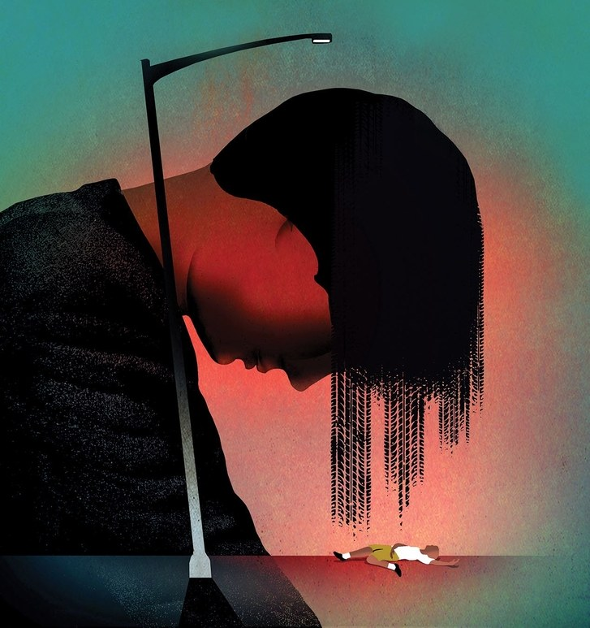
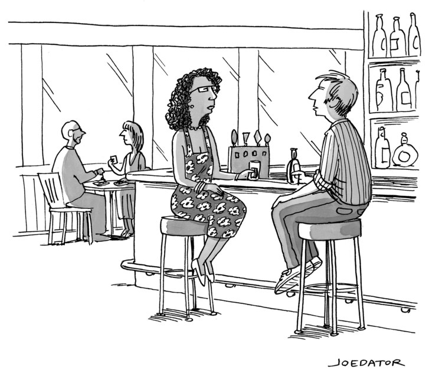

The Sorrow and the Shame of the Accidental Killer

*
There are no self-help books for those who have unintentionally killed someone.
*Illustration by Brian Stauffer

Until 3:35 *P*.*M*. on June 15, 1977, Maryann Gray was happy. She was twenty-two, and had just decided to take a leave of absence from Miami University, in Oxford, Ohio, where she was pursuing a master’s degree in clinical psychology. Graduate school had been her mother’s idea, and Gray was unpleasantly surprised by how scientific the program turned out to be. Inside the front cover of her statistics textbook was a squashed bug, which she had circled and labelled “Maryann at the end of Stat.”

That summer, Gray was preparing to move into a ramshackle Victorian mansion in a neglected area of Cincinnati, which its residents called an “urban commune.” There, she hoped, she would eat curry, burn incense, and talk politics late into the night with new friends. Her father, a businessman, and her mother, a homemaker, who lived on the Upper East Side of Manhattan, were not supportive of the plan. But Gray couldn’t wait to move in. She spent the day painting her new bedroom yellow.

By the afternoon, Gray was sweaty and paint-stained, and she decided to go back to her boxed-up apartment in Oxford to take a swim. The hot, hour-long drive crossed through suburban sprawl and then into emerald countryside. Gray had the windows of her father’s 1969 Mercury Cougar down, and the radio tuned to the news. She was only fifteen minutes from the apartment, driving at the posted forty-five miles per hour along a wooded, two-lane country road, when she saw a pale flash and felt a bump.

The statement Gray gave to the police later that afternoon is written in the neat script a young student might use on a final exam: “A child (blond male) ran into the street from my left, running in front of the car. I tried to go around him (left) but couldn’t get by. I hit my brakes instantly + skidded to the left.” The signature at the bottom of the page looks as though it had been written slowly and with care.

When Gray read the affidavit forty years later, she was surprised by the precision of her account. “There was no way I actually remembered that,” she told me. “Hitting him I remember, and I remember sort of pulling over on a side street, getting out of the car, and there I lose a few minutes.” Gray recalled crouching behind a bush, terrified and hiding. “I remember thinking, What’s that noise?, and then realizing it was me, screaming.” She was still concealed by the shrubbery when the boy’s mother ran out of her house and began to wail. “She was with two women, and her knees buckled. She began to fall, and they held her up,” Gray said. “She wanted to go to him, of course, but they held her back.”

The police arrived about twenty minutes later, and, rather than wait for an ambulance, they put the boy in the back seat of a squad car and drove him six miles to the hospital, where, Gray later learned, he was pronounced dead on arrival. Only after the boy had been taken away from the bloodied road did Gray emerge. A few policemen had stayed behind, and she approached them, with one hand raised. “Like a schoolgirl,” Gray recalled. “I was so young.” Her voice caught. “I said, ‘I did it. I did it.’ ”

She was ushered into the back of a police car, where she sat until a woman who lived nearby approached, offered her a cool towel, and asked an officer if Gray could wait at her house instead. The officer agreed, and Gray sat in the kind stranger’s kitchen, sipping water. It was early evening by the time the Butler County sheriff’s office finished its site evaluation and asked Gray if she would be O.K. driving home. She said no. A professor picked her up and persuaded her to call her parents, in New York. “I said, ‘Mommy, Mommy’—and I never called her that—‘it was an accident,’ ” Gray recalled. Her mother replied, “Of course it was.”

Gray’s father flew out and took care of logistics. He called the insurance company, got the car towed, hired a lawyer, and paid the condolence call. Gray spent the week refusing to leave her old bedroom. “I had what I now consider to be a hallucination,” she told me. “I heard this voice, so clearly, saying, ‘You took a son from his mother and your punishment is that you can never have your own child.’ ” She told her therapist, whom she had been seeing for two years, that she was afraid the accident would ruin her forever.

In the following months, Gray drove slowly and uncertainly. She would see vague figures in the road, slam on the brakes, and then realize that nobody was there. An insect hitting the windshield could send her into a panic. She didn’t know how to act around her new roommates, who treated her with a kind of hesitant benevolence. “Here I was in this house that was all about peace and love and community, and I had just killed a kid,” Gray said. “I really wanted these people to like me and to accept me, so I just tried to act sad but not crazy.”

By the first anniversary of the accident, Gray was packing up her yellow bedroom. She took on odd jobs—at an exercise studio and then at an accounting firm—and lived with a roommate whom she rarely saw. In 1979, she moved to Southern California and returned to graduate school, at U.C. Irvine. In Gray’s telling, her life improved with the elegance and the inevitability of a film dissolve. “It was a new start,” she said. “I felt like I was leaving the horribleness behind.” She loved her academic program, made friends, and went to the beach. But the accident remained with her. She said, “There was this voice: ‘You don’t deserve to feel happy. Look what happened last time you felt happy.’ I lived with a ghost, with this child inside me, speaking to me, not very kindly. But I never talked about it.”

There are self-help books written for seemingly every aberration of human experience: for alcoholics and opiate abusers; for widows, rape victims, gambling addicts, and anorexics; for the parents of children with disabilities; for sufferers of acne and shopping compulsions; for cancer survivors, asexuals, and people who just aren’t that happy and don’t know why. But there are no self-help books for anyone who has accidentally killed another person. An exhaustive search yielded no research on such people, and nothing in the way of therapeutic protocols, publicly listed support groups, or therapists who specialize in their treatment.

According to the Centers for Disease Control and Prevention, in 2015, the most recent year for which data are available, there were nearly a hundred and forty-seven thousand unintentional-injury deaths in the United States. About a quarter were caused by motor-vehicle accidents; the total also includes falls, firearm mishaps, accidental poisoning, and all the other inconceivably varied ways a healthy person’s life might end. The C.D.C.’s reports are broad and terse; they describe how we die, but not why. Of the more than thirty-six thousand fatal traffic accidents in 2015, for instance, we don’t know how many were the result of a single car hitting a tree, how many were head-on collisions in which both drivers perished, and how many were caused by a person who walked away physically intact but psychically wounded.

“As far as databases that track people who inadvertently cause the death of someone else, I’m not aware of any,” a representative for the Insurance Institute for Highway Safety told me. A representative of the National Transportation Safety Board said the same thing. Cops, social workers, and hospital personnel receive no special training in how to respond to people who have accidentally caused fatalities, and neither the American Counseling Association nor the American Psychological Association nor the American Automobile Association could, when I asked, name any experts in the field.

Mental-health workers who specialize in the treatment of veterans perhaps have the most relevant professional expertise. Accidental killers often report experiencing symptoms associated with post-traumatic stress disorder: flashbacks, hallucinations, nightmares, and what’s known as “moral injury.” William Nash, the Marine Corps’s director of psychological health, told me that such symptoms appear in the *Diagnostic and Statistical Manual of Mental Disorders* “as pathologized, distorted, inappropriate responses, and that’s crap in a situation like this. If you’re responsible for someone else’s accidental death, guilt and shame are appropriate emotions. They are telling you that you need to do something to atone or make amends for your error.”

Today, Gray, who is sixty-two, is a recently retired U.C.L.A. assistant provost. Divorced, but still friends with her ex-husband, she tends to an active social life and lives in a sunny two-story apartment in Santa Monica with her dog, Harvey. She never did have children. When I met her on a Saturday morning in April, Gray did not immediately strike me as a “vivid reminder of human fallibility and the capriciousness of fate,” as she has described herself in the past. Instead, she opened her front door in stocking feet, offered me coffee and fresh strawberries, and projected a generally cheerful demeanor. Trim, with curly blond hair, Gray is warm, self-reflective, and easy to talk to.

Gray’s lightness is the result of an unburdening that forced her to think differently about her accident. In July, 2003, not seven miles from where Gray was then living, an eighty-six-year-old man driving a Buick sedan mistakenly pressed his foot on the accelerator and plowed into the Santa Monica Farmers Market. Ten people died, and sixty-three were injured. His attorney called the crash an accident, but there was an outpouring of rage. “People were not just angry with the driver but called him a murderer,” Gray said. “To me, it was so obvious that he didn’t do it on purpose, and I thought the response was so cruel.” (Three years later, the driver, George Weller, was convicted of vehicular manslaughter and sentenced to five years’ probation.)

After reading about the reactions to the collision in the newspaper, Gray closed the door to her office and wrote a brief account of her own accident. She e-mailed the document, fewer than four hundred words in all, to the local NPR station, and got a call back within an hour. A producer wanted her to read a version of it on the air. “Like most people, I’m horrified and saddened by the devastating car accident,” Gray began. “My heart goes out to those who lost family members and friends. But, unlike most people, my deepest sympathies lie with the driver.” The segment first aired on “All Things Considered,” on July 18, 2003. It was broadcast at rush hour.

The producer warned Gray that she might receive hate mail, but the spiteful feedback she anticipated never came. Friends and colleagues she’d known for decades called her to express sympathetic surprise; she got e-mails from dozens of people who had caused accidental deaths, all of them grateful. One friend introduced Gray to her sister, who had killed a cyclist with her car in upstate New York. They discussed the morbid etiquette of whom you tell about the accident and whom you allow to remain ignorant, and the impulse to game out, pointlessly, alternate versions of the past. It was the first time that Gray spoke about her experience with another person who had accidentally caused a death.

Moved by the response to the NPR segment, Gray registered a Web site under the name Accidental Impacts. It included a link to the segment, reading recommendations (academic books about P.T.S.D., a few memoirs, some psychology-inflected guides to living a meaningful life in the wake of trauma), and short essays she had written on the subject. A few years later, with the help of her tech-savvy personal trainer, Gray opened it up to comments. The design of the site, which Gray says is for “good people who have unintentionally harmed others, in accidents occurring on the roads, at work, at play, or around the home,” is generic, with blue tabs and photographs of natural landscapes running across the top. Gray does nothing to publicize it and rarely posts updates. Still, Accidental Impacts receives an average of sixty hits per day. It readily comes up in a Google search only because, with the exception of a few online message boards, it has no competitors. “There’s nothing,” Gray said. “There’s my Web site. Period.”

Most people who post on Accidental Impacts were involved in fatal car crashes, but there are also cases of guns going off when they shouldn’t have, of boating mishaps, and of momentarily neglected babies. The comments are just as often statements of bitter and disheartening fellow-feeling as they are expressions of solace. In response to a woman whose niece had recently killed a bicyclist, one person wrote, “In my personal opinion and from my personal experience, I truly don’t think there’s anything anyone could do or say to make her feel any better at this moment.”

I spoke to six people who had caused accidental deaths, on the phone and in person, and the tone and the structure of their accounts were eerily uniform. They spoke quickly and compulsively, assuming the role of the sincere and reliable narrator of a realist novel. No detail seemed too small to share: the color of the sky that day, what song was playing on the radio. They spoke of losing time after the accident, and they apologized, often repeatedly, for the minutes for which they couldn’t account. Near the end of their stories, they would take a moment to catch their breath and offer a statement that got at the incomprehensible enormity of it all. Then they would apologize again, this time for having spoken for so long.

[        *“I’m thinking of stopping a podcast.”*](https://www.newyorker.com/cartoon/a21127)

[(L)](https://www.facebook.com/sharer/sharer.php?u=https%3A%2F%2Fwww.newyorker.com%2Fcartoon%2Fa21127&display=popup&ref=plugin)[(L)](https://twitter.com/intent/tweet?original_referer=https%3A%2F%2Fwww.newyorker.com%2Fcartoon%2Fa21127&text=A%20New%20Yorker%20Cartoon&tw_p=tweetbutton&url=https%3A%2F%2Fwww.newyorker.com%2Fcartoon%2Fa21127)[(L)](https://www.newyorker.com/magazine/2017/09/18/the-sorrow-and-the-shame-of-the-accidental-killer?utm_source=nextdraft&utm_medium=emailmailto:?subject=From%20newyorker.com:%20A%20New%20Yorker%20Cartoon&body=%26%238220%3BI%26%238217%3Bm%20thinking%20of%20stopping%20a%20podcast.%26%238221%3B%0D%0Ahttps%3A%2F%2Fwww.newyorker.com%2Fcartoon%2Fa21127)[(L)](https://condenaststore.com/conde-nast-brand/cartoonbank)

On May 9, 1998, Leigh Green, a high-school sophomore living in a Houston suburb, learned that she had made the school dance team. She drove home in her father’s pickup truck to call her boyfriend and tell him the good news. Then she got back in the truck to drive to the mall. She was reflecting on how much her life was beginning to resemble a teen movie when “Let Me Ride That Donkey,” a filthy song by the Florida-based hip-hop group 69 Boyz, came on the radio. In the moment it took her to look down and change the station, she T-boned a Ford Mustang. Inside were two girls from her school, both on the dance team.

Green’s truck spun. “I got out and saw that both girls were unconscious,” she said. There were sirens and screaming. A boy from school saw the accident and came to help. “That’s the last thing I remember,” Green said. “The rest is hazy, just pure shock.”

The Mustang’s driver was taken to the local emergency room in an ambulance and had regained consciousness by the time she arrived. The passenger, a girl named Steffani, was rushed to a trauma center in a helicopter, with extensive internal bleeding and brain damage. Two days later, Green met Steffani’s parents in her room at the I.C.U. Steffani’s father told stories about his daughter; her mother made Green promise to keep dancing. They asked her if she knew the Lord’s Prayer; Green, embarrassed, said she didn’t. They began reciting it slowly, encouraging her to say it with them. “At the time, I didn’t realize what it means to say that prayer around someone at the I.C.U.,” Green said. “And just the fact that they did that with me . . . This is a strange thing to say, but I felt lucky to be able to go see her with her parents.” The next day, Steffani was taken off life support.

Green learned about Accidental Impacts from a therapist, who told her, at the end of their first session, “I’m sorry, but I don’t have the resources to deal with this.” Green appreciates the site but isn’t surprised that there’s so little out there. “People just don’t want to talk about it,” she said. “When someone is raped, you can tell them, truthfully, ‘It’s not your fault.’ Well, in my case, that really can’t be said. My brother tells me, ‘You don’t deserve this.’ That’s nice and all, but it doesn’t fix it.” Green explained, “It’s a sob story, with no ‘and then.’ ”

In June, 2012, a forty-two-year-old paralegal living in Illinois, whom I’ll call Patricia, was driving home in the early evening when the sun suddenly hit her eyes. “I felt an impact, but a very strange impact. I thought maybe it was a deer,” she told me. Her air bags deployed, knocking her glasses off and burning her forearms. She pulled over, and ran into the road. There was blood everywhere. Then she saw a man, crumpled; his motorcycle lay beside him. Patricia tried to stanch his head wounds with her clothing. She whispered to him and called 911. A truck driver came upon the scene and pulled Patricia away from the body. “I couldn’t understand what was happening,” she recalled. “He started praying, but he was praying for *me*. I heard him say, ‘God, protect *her*. God, look out for *her*. God, give *her* strength.’ At that point, I just completely broke down.”

For two nights, Patricia couldn’t sleep. Every detail came back to her: the curve of the road, the “pink matter” ground into the asphalt. Her husband, not knowing what to do, took her to the E.R. Within a few minutes of the initial consultation, she was sent to the suicide unit, where she remained for six days. After her release, friends visited—to cook dinner, to clean the house—but she couldn’t stand how they kept telling her it was “just an accident.” She went to “umpteen” different counsellors, but none were helpful. She sent a letter to the state’s attorney asking him to please put her away. “I spent my whole life volunteering—for animal shelters, for Make-A-Wish,” she told me. “This just negates everything good I’ve ever done.”

Two months after the accident, the motorcyclist’s family mounted a wrongful-death suit against Patricia. Six months later, she was charged with reckless homicide. A trial date has been delayed multiple times. It has been five years since the accident, and Patricia leaves her house only to attend doctors’ appointments and court dates. She is unemployed and has lost touch with most of her friends. Though she wept while talking to me, she became impatient when recounting the loving reactions of friends and family. “Yes, it was an accident, and in a certain sense we were both to blame, but, at the end of the day, I *hit* him, I took *his* life,” she said. “No matter how much you want to dismiss it as an accident, I still feel responsible for it, and I am.” She cried, “I hit him! Why does nobody understand this?”

For those who were not acting negligently at the time of their accidents—not drunk, not distracted—it is a tragedy that all but precludes the possibility of a dénouement. Perhaps this is why the aftermath of accidental death is neglected by fiction writers. Violent unintentional deaths fill the pages of centuries’ worth of literature but seldom function as anything more than a grisly plot device. Two men die after a woman with a voice full of money drives her lover’s Rolls-Royce into her husband’s mistress. A feebleminded man inadvertently strangles a young wife in a barn, forcing his friend to shoot him in the head. A girl rides a cyclone into a magical kingdom, dropping her house atop a wicked witch. In each case, the unintended fatality sets off a chain of dramatic events, but the anguish of the culpable character receives at most cursory attention. “That just happened,” Dorothy explains to the Wizard when she finally reaches the Emerald City.

There are exceptions. In 2008, Curtis Sittenfeld published “American Wife,” a novel based on the life of Laura Bush. As a teen-ager, Bush ran a stop sign in Midland, Texas, causing a car accident that killed a high-school classmate. In Sittenfeld’s telling, the crash becomes a precursor to the former First Lady’s lifelong discomfort about her own agency. Years later, as she grapples with the extent of her complicity in the deaths of thousands of American soldiers and Iraqi civilians, the accident becomes a data point in her torturous calculations.

In Louise Erdrich’s “LaRose,” published last year, a Native American man accidentally shoots his friend’s son while deer hunting and turns to “an old form of justice,” which requires that he give his own son to the grieving family. The transaction creates new problems—the guilty father uses drugs, while his wife struggles with her maternal longings—but the fact that there is a ritual in place is its own kind of consolation.

To seriously and honestly ruminate on how causing a fatal accident affects a person requires, in a writer or an artist, a rare appetite for nihilism. “People have a hard time believing things are as random as they are, but it seems undeniably the case,” the writer and director Kenneth Lonergan told me. Two of Lonergan’s three films are about accidental killers, and attempt to narrate the experience of being both a victim and an agent of awesome chance. In “Manchester by the Sea” (2016), a depressed New England janitor is forced to return to the town where, five years earlier, he inadvertently set fire to his house and killed his three children. In “Margaret” (2011), a high-school student named Lisa flirts with a New York City bus driver; distracted, he hits a pedestrian.

“Margaret,” which Lonergan based loosely on the experience of an acquaintance, depicts, in his words, “this enormous intrusion into the life of someone who is not prepared to deal with it—not that anyone would be.” The accident occurs thirteen minutes into the three-hour-long film, and Lisa spends the rest of it punishing herself and those around her. She is relentlessly unkind to her mother, seduces her teacher, becomes obsessed with filing a wrongful-death suit against the bus driver, and forges a confused relationship with the victim’s best friend. The accident propels Lisa into a kind of parallel universe in which anyone who might be helpful to her is rendered useless. “Of course, everyone would have something to say,” Lonergan explained. “But it wouldn’t be the right thing.”

Accidentally causing a death is understood to be both meaningless and overwhelmingly consequential—a gruesomely reversed deus ex machina, in which an intractable problem is introduced rather than solved. In 1988, when the novelist Darin Strauss was in the twelfth grade, a classmate on a bicycle swerved in front of his car. He hit her, and she died in the hospital the next day. Twenty-two years later, he published “Half a Life,” an elegant and agonizing memoir that examines the repercussions of the accident and his adolescent reactions to them. “I became aware, at eighteen, that the world is a cruel place, that the randomness of life is profound,” Strauss told me. “If you leave the gas on and burn down your apartment building, you’re branded a villain. But what if you remembered to turn it off, just in the nick of time? In that case, everything ends up fine. But is the guy who has the close call really any better? Morally, I mean. Of course not.”

Strauss was circling a philosophical concept called moral luck. Introduced by Bernard Williams in 1976 and expanded upon that year by Thomas Nagel, moral luck describes situations in which we hold people morally responsible for events that are not entirely within their control. Neither philosopher was the first to consider such situations—Aristotle wrote extensively on the nature of accidents (*sumbebekota*), and Kant’s most influential works considered the distinction between intention and effect—but their writings served to modernize the problem of accidental death. Williams offers the case of “the lorry driver who, through no fault of his, runs over a child.” Our pity for him, Williams explains, presupposes “that there is something special about his relation to this happening, something which cannot merely be eliminated by the consideration that it was not his fault.” Jeff McMahan, a professor of moral philosophy at Oxford, told me, “The conscious choice to impose a risk—even permissible risk, as in the case of driving—opens a person up to moral liability.” He neatly characterized the plight of the accidental killer: “People who are not culpable can nevertheless be responsible.”

Williams defines the torment of the person who causes an accident as “agent-regret,” a type of first-person remorse that is distinct from that of a mere bystander, and which might compel that person to offer recompense or restitution. Williams writes, “It would be a kind of insanity never to experience sentiments of this kind towards anyone, and it would be an insane concept of rationality which insisted that a rational person never would.” He suggests that we need a more nuanced understanding of agency, which acknowledges that “one’s history as an agent is a web in which anything that is the product of the will is surrounded and held up and partly formed by things that are not.”

When examined closely, no life is really one’s own. We cannot control which year and in what city we are born. The phone rings when it rings, and the child scampers into the street where he wishes. In Nagel’s response to Williams, he argues that it is not just our actions that are vulnerable to moral luck but also our intentions, our dispositions, our exertions of will. A German S.S. officer, for instance, might have led a harmless or even an exemplary life had he lived elsewhere, or had the Nazis never come to power. Nagel thinks that the “area of genuine agency, and therefore of legitimate moral judgment, seems to shrink under this scrutiny to an extensionless point.” Nagel’s epigrammatic language reads more like Scripture than like philosophy. He concludes, “Everything we do belongs to a world that we have not created.”

In the Book of Numbers, God instructs Moses to tell the Israelites that they are to designate six cities of refuge “so that anyone who kills someone inadvertently may flee there.” The accidental murderer will be protected from the wrath of the “blood avenger,” a family member of the deceased. The rules are spelled out in detail: when a person enters one of these cities, a tribunal determines whether he or she is eligible for sanctuary; those who killed with weapons, for example, cannot remain there. According to Talmudic commentary, assembled in the twelfth century, the roads leading to the cities of refuge were to be well marked, free of obstacles, and wider than regular roads, so that those who have killed another unwittingly could proceed there without delay.

When Maryann Gray, a secular Jew who grew up celebrating Easter and Christmas and reserving Scarsdale tennis courts on the High Holidays, first learned of the concept of cities of refuge, she was overcome with gratitude. “The Torah was talking about *me*,” she remembers thinking. Gray was struck by the specificity of its prescriptions, which suggested that lives like hers were once contemplated with sophistication by the highest authorities. She became obsessed with the concept, researching it at the library of Hebrew Union College, a seminary with a campus in Los Angeles, talking about it with rabbis, and reading their works.

There is “no statute of limitations on self-imposed pain,” David Wolpe, the senior rabbi of Sinai Temple, in Los Angeles, told me. Gray spoke to Wolpe at the start of her inquiry into the cities of refuge; he explained that their purpose was to allow individuals to share some of their pain with a community. “Maimonides, the great medieval Jewish philosopher, says that in the collective grief the individual’s grief is assuaged,” Wolpe wrote to me in an e-mail. When “people realize that loss is part of the iron law of life, it helps them reconcile themselves to their own situation.” Most of us will not be forced to assimilate a catastrophic accident into the story of our lives, but rituals and refuge seem so obviously necessary that a world without them looks inhumane.

There is no extra-Biblical evidence that cities of refuge ever existed. But Gray does not want to believe that they were merely a figment of an antique but ethically progressive imagination. “If I had been exiled to a city of refuge, I might not have needed exile from myself,” she once wrote. She was moved by the idea that, in such cities, a person like her could participate fully in society without shame. “I love that there was a way of recognizing the true devastation that’s been wrought, the harm that’s been done, without condemning the individual,” she said. “That’s what I’m looking for—to live in the world with acceptance and with opportunity, but also with the acknowledgment that in running over this child something terrible happened and it deserves attention.” ♦

*This article appears in other versions of the September 18, 2017, issue, with the headline “Accidental Killers.”*

- Alice Gregory writes for the *Times Book Review* and is a contributing editor for *T*, the newspaper’s style magazine.

[Read more »](https://www.newyorker.com/contributors/alice-gregory)
More:

- [Maryann Gray](https://www.newyorker.com/tag/maryann-gray)
- [Death](https://www.newyorker.com/tag/death)
- [Accidental Impacts](https://www.newyorker.com/tag/accidental-impacts)
- [Web Sites](https://www.newyorker.com/tag/web-sites)
- [Accidents](https://www.newyorker.com/tag/accidents)
- [Car Crashes](https://www.newyorker.com/tag/car-crashes)

Sign up for our daily newsletter: the best of *The New Yorker* every day.