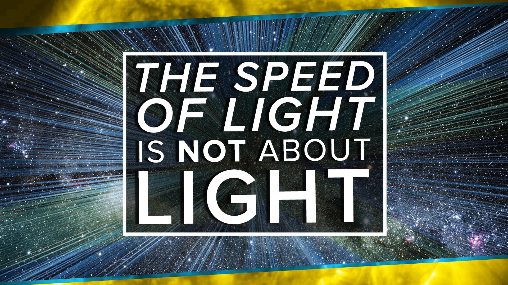

The Speed of Light is NOT About Light | Space Time | PBS Digital Studios

The Speed of Light is NOT About Light | Space Time | PBS Digital Studios
https://www.youtube.com/watch?v=msVuCEs8Ydo
[PBS Space Time](https://www.youtube.com/channel/UC7_gcs09iThXybpVgjHZ_7g)
1,878,185 views views
Published on Oct 7, 2015

|     |
| --- |
| [(L)](https://www.youtube.com/watch?v=msVuCEs8Ydo) |

Description

The Speed of Causality
Tweet at us! @pbsspacetime
Facebook: facebook.com/pbsspacetime
Email us! pbsspacetime [at] gmail [dot] com
Comment on Reddit: http://www.reddit.com/r/pbsspacetime
Support us on Patreon! http://www.patreon.com/pbsspacetime

Help translate our videos! [http://www.youtube.com/timedtext_cs_p...](http://www.youtube.com/timedtext_cs_panel?tab=2&c=UC7_gcs09iThXybpVgjHZ_7g)

The speed of light is often cited as the fastest anything can travel in our universe. While this might be true, the speed of light is the EFFECT and not the CAUSE of this phenomenon. So what's the cause? On this week's episode of Space Time, Matt helps explain what the speed of light REALLY is and why it’s the cosmic speed limit of our universe!

"The Real Meaning of E=mc²":

[https://www.youtube.com/watch?v=Xo232...](https://www.youtube.com/watch?v=Xo232kyTsO0)

"Are Space And Time An Illusion?":

[https://www.youtube.com/watch?v=YycAz...](https://www.youtube.com/watch?v=YycAzdtUIko)

----------------------------------------­­---------

SOURCES:

Einstein's derivation or the Lorentz transformation from the invariant speed of light:

Einstein, Albert (1916) "Relativity: The Special and General Theory"

[http://www.archive.org/stream/cu31924...](http://www.archive.org/stream/cu31924011804774#page/n159/mode/2up)

Lorentz Transformation without invariant speed of light, from relativity, isotropy, and consistency of frame transitions (closure group postulate):

von Ignatowsky, “Das Relativitatsprinzip,” Archiv der Mathematik und Physik 17, 1–24 (1911)

Berzi1 & Gorini, J. Math. Phys. 10, 1518 (1969)
http://dx.doi.org/10.1063/1.1665000

Pelissetto & Testa, American Journal of Physics, 83, 338, (2015) "Getting the Lorentz transformations without requiring an invariant speed"

http://arxiv.org/abs/1504.02423

[https://en.wikipedia.org/wiki/Derivat...](https://en.wikipedia.org/wiki/Derivations_of_the_Lorentz_transformations)

----------------------------------------­­---------

COMMENTS:

Denny Hiu

[https://www.youtube.com/watch?v=AwwIF...](https://www.youtube.com/watch?v=AwwIFcdUFrE&lc=z124w3dhotmtx34lk224wzxyhwqufdefe)

. (RadimaxRadimaX)

[https://www.youtube.com/watch?v=AwwIF...](https://www.youtube.com/watch?v=AwwIFcdUFrE&lc=z124xv145zzkzpiei233spnqjzraejjig04)

Epsilon Lazerface

[https://www.youtube.com/watch?v=AwwIF...](https://www.youtube.com/watch?v=AwwIFcdUFrE&lc=z12fv5ejyzyyc1dbv04cgzhyxknfzdnjcao)

LassieDog999

[https://www.youtube.com/watch?v=AwwIF...](https://www.youtube.com/watch?v=AwwIFcdUFrE&lc=z12zz13iezrqh142k23kitgxuqjqy35su)

Tenebrae

[https://www.youtube.com/watch?v=AwwIF...](https://www.youtube.com/watch?v=AwwIFcdUFrE&lc=z134yj2pcvrkhnu4u04ccdxhuufvuvkomd0)

----------------------------------------­­---------

REFERENCES:

Krauss & Scherrer 2007 http://arxiv.org/abs/0704.0221

Vardanyan, Trotta & Silk, 2011 http://arxiv.org/abs/1101.5476

----------------------------------------­­---------

Let us know what topics you want to learn more about:http://bit.ly/spacetimepoll

Top Comments

shysterrtube | 8 months ago
you lost me at monkey speed.

Jeremy R Hansen | 8 months ago (edited)
Can we start a go fund me page to get this poor man a new shirt?

phuturephunk | 9 months ago
"A teensy bit of algebra." Oh you!

LIGHTandSTR0NG | 8 months ago
who is Lorenz? what's his instagram?

TheMarcman123 | 10 months ago
Not going to lie, I wasn't prepared for this

Jetze Schaafsma | 9 months ago
You didn't really come out as brony just now, did you?

95TurboSol | 7 months ago
Bro don't freak out but.... Your face is naked!

Vic Demise | 9 months ago
Usually I'm good at this stuff, but frankly, I need this dumbed-down a little.

Illya Leonov AKA Morgan Freepony | 9 months ago
Lunaaaaa...

adankseason ADS | 1 year ago
What's up with the way your standing mate?