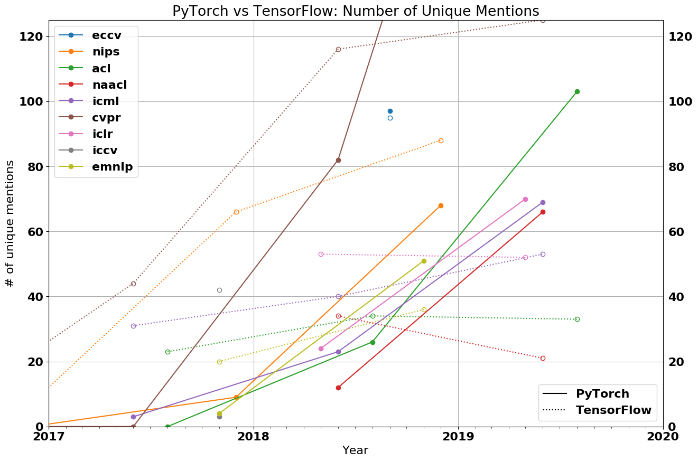
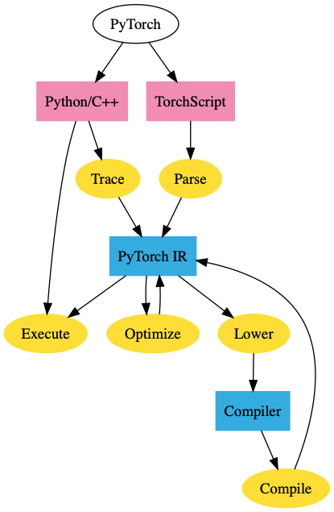
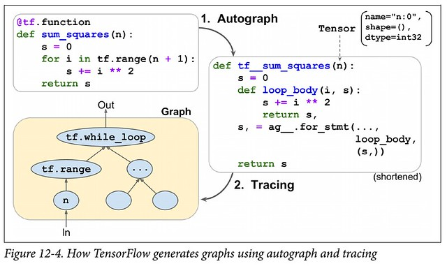

The State of Machine Learning Frameworks in 2019

 

- [Home](https://thegradient.pub/)

- [Editor's Note](https://thegradient.pub/editorsnote/)

- [Overviews](https://thegradient.pub/tag/overviews/)

- [Perspectives](https://thegradient.pub/tag/perspectives/)

- [About](https://thegradient.pub/about/)

- [Subscribe](https://thegradient.pub/subscribe/)

- 

# The State of Machine Learning Frameworks in 2019

 10.Oct.2019

Since deep learning regained prominence in 2012, many machine learning frameworks have clamored to become the new favorite among researchers and industry practitioners. From the early academic outputs Caffe and Theano to the massive industry-backed PyTorch and TensorFlow, this deluge of options makes it difficult to keep track of what the most popular frameworks actually are.

If you only browsed Reddit, you might assume that [everyone’s](https://www.reddit.com/r/MachineLearning/comments/b6wgmo/d_tensorflow_is_dead_long_live_tensorflow/)  [switching](https://www.reddit.com/r/MachineLearning/comments/7ziagd/d_discussion_on_pytorch_vs_tensorflow/)  [to](https://www.reddit.com/r/MachineLearning/comments/bo0nxh/d_what_are_you_using_tensorflow_vs_pytorch/)  [PyTorch](https://www.reddit.com/r/MachineLearning/comments/9kys38/r_frameworks_mentioned_iclr_20182019_tensorflow/). Judging instead by Francois Chollet’s Twitter, TensorFlow/Keras may appear as the dominant framework while PyTorch’s [momentum](https://twitter.com/fchollet/status/1047983588761788416)  [is](https://twitter.com/fchollet/status/1029844660733136896)  [stalling](https://twitter.com/fchollet/status/1047570406570307584).

In 2019, **the war for ML frameworks has two remaining main contenders: PyTorch and TensorFlow**. My analysis suggests that researchers are abandoning TensorFlow and flocking to PyTorch in droves. Meanwhile in industry, Tensorflow is currently the platform of choice, but that may not be true for long.

# PyTorch’s increasing dominance in research

Let’s examine the data. The graph below shows the ratio between PyTorch papers and papers that use either Tensorflow or PyTorch at each of the top research conferences over time. All the lines **slope upward**, and every major conference in 2019 has had a **majority of papers** implemented in PyTorch.

Conference legend
CVPR, ICCV, ECCV - computer vision conferences
NAACL, ACL, EMNLP - NLP conferences
ICML, ICLR, NeurIPS - general ML conferences

Details on the data collection process

This graph was generated by scraping every paper published in a major ML conference over the last few years. Papers were categorized based on whether they mention PyTorch or TensorFlow, excluding papers with authors affiliated with either Google or Facebook, as well as those that mention both Tensorflow and PyTorch. An ablation of these factors can be found in the [Appendix](https://thegradient.pub/p/cef6dd26-f952-4265-a2bc-f8bfb9eb1efb/)

* * *

Interactive versions of these figures can be found [here](https://chillee.github.io/pytorch-vs-tensorflow/).

If you need more evidence of how fast PyTorch has gained traction in the research community, here's a graph of the raw counts of PyTorch vs. TensorFlow.

| Conference | PT 2018 | PT 2019 | PT Growth | TF 2018 | TF 2019 | TF Growth |
| --- | --- | --- | --- | --- | --- | --- |
| CVPR | 82  | 280 | 240% | 116 | 125 | 7.7% |
| NAACL | 12  | 66  | 450% | 34  | 21  | -38.2% |
| ACL | 26  | 103 | 296% | 34  | 33  | -2.9% |
| ICLR | 24  | 70  | 192% | 54  | 53  | -1.9% |
| ICML | 23  | 69  | 200% | 40  | 53  | 32.5% |

**In 2018, PyTorch was a minority. Now, it is an overwhelming majority**, with 69% of CVPR using PyTorch, 75+% of both NAACL and ACL, and 50+% of ICLR and ICML. While PyTorch’s dominance is strongest at vision and language conferences (outnumbering TensorFlow by 2:1 and 3:1 respectively), PyTorch is also more popular than TensorFlow at general machine learning conferences like ICLR and ICML.

While some believe that PyTorch is still an upstart framework trying to carve out a niche in a TensorFlow-dominated world, the data tells a different story. At no conference except ICML has the growth of TensorFlow even *kept up* with the overall paper growth. At NAACL, ICLR, and ACL, TensorFlow actually has *less* papers this year than last year.

**It’s not PyTorch that needs to be afraid of its future, it’s TensorFlow.**

### Why do researchers love PyTorch?

- **Simplicity.** It’s similar to numpy, very pythonic, and integrates easily with the rest of the Python ecosystem. For example, you can simply throw in a pdb breakpoint anywhere into your PyTorch model and it’ll work. In TensorFlow, debugging the model requires an active session and ends up being much trickier.
- **Great API.** Most researchers prefer PyTorch’s API to TensorFlow’s API. This is partially because PyTorch is better designed and partially because TensorFlow has handicapped itself by switching APIs so many times (e.g. ‘layers’ -> ‘slim’ -> ‘estimators’ -> ‘tf.keras’).
- **Performance.** Despite the fact that PyTorch’s dynamic graphs give strictly less opportunity for optimization, there have been many anecdotal reports that PyTorch is as [fast](https://www.reddit.com/r/MachineLearning/comments/cvcbu6/d_why_is_pytorch_as_fast_as_and_sometimes_faster/) if not [faster](https://arxiv.org/abs/1608.07249) than TensorFlow. It's not clear if this is really true, but at the very least, TensorFlow hasn't gained a decisive advantage in this area.

### What does the future hold for TensorFlow in research?

Even if TensorFlow has reached parity with PyTorch functionality-wise, PyTorch has already reached a majority of the community. That means that PyTorch implementations will be easier to find, that authors will be more incentivized to publish code in PyTorch (so people will use it), and that your collaborators will be most likely prefer PyTorch. Thus, any migration back to TensorFlow 2.0 is likely to be slow, if it occurs at all.

TensorFlow will always have a captive audience within Google/DeepMind, but I wonder whether Google will eventually relax this. Even now, many of the researchers that Google wants to recruit will already prefer PyTorch at varying levels, and I’ve heard grumblings that many researchers inside Google would like to use a framework other than TensorFlow.

In addition, PyTorch’s dominance might start to cut off Google researchers from the rest of the research community. Not only will they have a harder time building on top of outside research, outside researchers will also be less likely to build on top of code published by Google.

It remains to be seen whether TensorFlow 2.0 will allow TensorFlow to recover some of its research audience. Although eager mode will certainly be appealing, the same can’t be said about the Keras API.

# PyTorch and TensorFlow for Production

Although PyTorch is now dominant in research, a quick glance at industry shows that TensorFlow is still the dominant framework. For example, based on data

from 2018 to 2019, TensorFlow had 1541 new job listings vs. 1437 job listings for PyTorch on public job boards, 3230 new TensorFlow Medium articles vs. 1200 PyTorch, 13.7k new GitHub stars for TensorFlow vs 7.2k for PyTorch, etc.

So, if PyTorch has become so popular for researchers, why hasn’t it seen the same success in industry? An obvious first answer is simply inertia. TensorFlow came out years before PyTorch, and industry is slower to adopt new technologies than researchers. The other reason is that TensorFlow has been better than PyTorch for production. But what does that mean?

To answer that, we need to know how the needs of researchers and industry differ.

Researchers care about how fast they can iterate on their research, which is typically on relatively small datasets (datasets that can fit on one machine) and run on <8 GPUs. This is not typically gated heavily by performance considerations, but by their ability to quickly implement new ideas. On the other hand, industry considers performance to be of the utmost priority. While 10% faster runtime means nothing to a researcher, that could directly translate to millions of savings for a company.

Another difference is deployment. Researchers will run experiments on their own machines or on a server cluster somewhere that’s dedicated for running research jobs. On the other hand, industry has a litany of restrictions/requirements.

- **No Python.** Some companies will run servers for which the overhead of the Python runtime is too much to take.
- **Mobile.** You can’t embed a Python interpreter in your mobile binary.
- **Serving.** A catch-all for features like no-downtime updates of models, switching between models seamlessly, batching at prediction time, and etc.

TensorFlow was built specifically around these requirements, and has solutions for all these issues: the graph format and execution engine natively has no need for Python, and TensorFlow Lite and TensorFlow Serving address mobile and serving considerations respectively.

Historically, PyTorch has fallen short in catering to these considerations, and as a result most companies are currently using TensorFlow in production.

## Framework “Convergence”

Near the end of 2018, two major events threw a wrench into the story:

1. PyTorch introduced the JIT compiler and “TorchScript,” thus introducing graph-based features.

2. TensorFlow announced they were moving to eager mode by default in 2.0.

Clearly, these were moves attempting to address their respective weaknesses. So what exactly are these features, and what do they have to offer?

### PyTorch TorchScript

The PyTorch JIT is an intermediate representation (IR) for PyTorch called TorchScript. TorchScript is the “graph” representation of PyTorch. You can turn a regular PyTorch model into TorchScript by using either tracing or script mode. Tracing takes a function and an input, records the operations that were executed with that input, and constructs the IR. Although straightforward, tracing has its downsides. For example, it can’t capture control flow that didn’t execute. For example, it can’t capture the false block of a conditional if it executed the true block.

Script mode takes a function/class, reinterprets the Python code and directly outputs the TorchScript IR. This allows it to support arbitrary code, however it essentially needs to reinterpret Python.

Once your PyTorch model is in this IR, we gain all the benefits of graph mode. We can [deploy PyTorch models in C++](https://pytorch.org/tutorials/advanced/cpp_export.html) without a Python dependency , or [optimize it](https://pytorch.org/blog/optimizing-cuda-rnn-with-torchscript/).

### Tensorflow Eager

At the API level, TensorFlow eager mode is essentially identical to PyTorch’s eager mode, originally made popular by Chainer. This gives TensorFlow most of the advantages of PyTorch’s eager mode (ease of use, debuggability, and etc.)

However, this also gives TensorFlow the same disadvantages. TensorFlow eager models can’t be exported to a non-Python environment, they can’t be optimized, they can’t run on mobile, etc.

This puts TensorFlow in the same position as PyTorch, and they resolve it in essentially the same way - you can trace your code (tf.function) or reinterpret the Python code (Autograph).

Thus, TensorFlow’s eager mode does not truly give you the “best of both worlds”. Although it’s true that you can turn your eager code into a static graph with tf.function annotations, this is never going to be a seamless process (PyTorch’s TorchScript has a similar issue). Tracing is fundamentally limited, and reinterpreting Python code essentially requires rewriting much of the Python compiler. Of course, the scope is massively simplified by restricting to the subset of Python that’s used in deep learning.

In enabling Eager mode by default, TensorFlow forces a choice onto their users - use eager execution for ease of use and require a rewrite for deployment, or don’t use eager execution at all. While this is the same situation that PyTorch is in, the opt-in nature of PyTorch’s TorchScript is likely to be more palatable than TensorFlow’s “Eager by default”.

## Current State of ML Frameworks

And thus we arrive at the current state of ML frameworks. PyTorch has the research market, and is trying to extend this success to industry. TensorFlow is trying to stem its losses in the research community without sacrificing too much of its production capabilities. It will certainly take a long time before PyTorch can make a meaningful impact in industry - TensorFlow is too entrenched and industry moves slowly. However, the transition from TensorFlow 1.0 to 2.0 will be difficult and provides a natural point for companies to evaluate PyTorch.

The future will come down to who can best answer the following questions.

- **How much will researcher preference affect industry?** As the current crop of PhD’s starts to graduate, they’ll bring PyTorch with them. Is this preference strong enough that companies will choose PyTorch for hiring purposes? Will graduates start startups that are built on top of PyTorch?
- **Can TensorFlow’s eager mode catch up to PyTorch in usability?** My impression from issue trackers and online communities is that TensorFlow Eager suffers heavily from [performance/memory](https://github.com/tensorflow/tensorflow/issues/30596)  [issues](https://www.youtube.com/watch?v=J6XcP4JOHmk&t=1h12m46s) and that Autograph has its own share of issues. Google will be spending a large amount of engineering effort, but TensorFlow is encumbered with historical baggage.
- **How fast can PyTorch get to a production state?** There are still many fundamental issues that PyTorch hasn’t addressed - no good quantization story, no mobile, serving, and etc. Until these are resolved, PyTorch won’t even be an option for many companies. Can PyTorch offer a compelling enough story for companies to make the switch? *Note: The day this article was released, PyTorch announced support for both quantization and [mobile](https://pytorch.org/mobile/home/). Both are still experimental, but represent significant progress on this front for PyTorch.*
- **Will Google’s isolation in industry hurt it?** One of the primary reasons Google pushes for TensorFlow is to help its burgeoning cloud service. Since Google is trying to own the entire ML vertical, this incentivizes the companies Google is competing with (Microsoft, Amazon, Nvidia) to support the only alternative machine learning framework.

# What’s next?

It is perhaps under appreciated how much machine learning frameworks shape ML research. They don’t just enable machine learning research, they *enable and restrict the ideas that researchers are able to easily explore*. How many nascent ideas are crushed simply because there is no easy way to express them in a framework? PyTorch may have reached the local minima for research, but it is worth examining what other frameworks offer, and what research opportunities they may expose.

### Higher Order Differentiation:

At their core, PyTorch and Tensorflow are auto-differentiation frameworks. That is, they allow one to take the derivative of some function. However, there are many ways to enable auto-differentiation, and the particular implementation that most modern ML frameworks choose is called “reverse-mode auto-differentiation”, more commonly known as “backpropagation”. This implementation turns out to be extremely efficient for taking the derivative of neural networks.

However, things change for computing higher order derivatives (Hessian/Hessian Vector Products). Computing these efficiently requires what’s known as “forward-mode auto-differentiation”. Without this capability, computing Hessian Vector Products can be orders of magnitude slower.

Enter Jax. Jax is built by the same people who built the original Autograd, and features both forward- and reverse-mode auto-differentiation. This allows computation of higher order derivatives orders of magnitude faster than what PyTorch/TensorFlow can offer.

Jax offers more than just higher order derivatives, however. The Jax developers view Jax as a framework for composing arbitrary functional transformations, including `vmap` (for automatic batching) or `pmap` (for automatic parallelization).

The original autograd had its devoted followers (11 papers at ICML used it despite having no GPU support), and it’s likely that Jax will soon pick up a similar devoted community, using it for all sorts of n-th order derivatives.

### Code Generation

When you run a PyTorch/TensorFlow model, most of the work isn’t actually being done in the framework itself, but rather by third party kernels. These kernels are often provided by the hardware vendor, and consist of operator libraries that higher-level frameworks can take advantage of. These are things like MKLDNN (for CPU) or cuDNN (for Nvidia GPUs). Higher-level frameworks break their computational graphs into chunks, which can then call these computational libraries. These libraries represent thousands of man hours of effort, and are often optimized for the architecture and application to yield the best performance.

However, recent interest in non-standard hardware, sparse/quantized tensors, and new operators have exposed a major flaw in relying on these operator libraries: they’re inflexible. What if you want to use a new operator in your research like capsule networks? What if you want to run your model on a new hardware accelerator that ML frameworks don’t have good support for? Existing solutions often fall short. As [this paper recently pointed out](https://dl.acm.org/citation.cfm?id=3321441), existing implementations of Capsule Networks on GPUs are 2 orders of magnitude slower than an optimal implementation.

Each new hardware architecture, category of tensor, or operator, greatly increases the difficulty of this problem. There have been a number of tools that tackle different aspects (Halide, TVM, PlaidML, Tensor Comprehensions, XLA, Taco, etc), but the correct approach still remains unclear.

Without more work put into solving this problem, we run the risk of overfitting our ML research to the tools we have.

# The future of ML frameworks

These are exciting times for the future of TensorFlow and PyTorch. Their designs have converged to such a point that neither framework will have a decisive win by virtue of its design. Each have their respective territories marked out -- one side owns research, the other side owns industry.

Personally, between PyTorch and TensorFlow, I’d give the edge to PyTorch. Machine learning is still a research driven field. Industry can’t afford to ignore research output, and as long as PyTorch dominates research, that will pressure companies to switch.

However, it isn't merely the frameworks that move fast. Machine learning research itself is also in a massive state of flux. Not only do the frameworks change - the models/hardware/paradigms used in 5 years may look drastically different than the ones we have today. Perhaps the battle between PyTorch and TensorFlow will become irrelevant as another computing model becomes dominant.

In the midst of all these conflicting interests, and all the money thrown around machine learning, it's nice to take a step back. Most of us don't work on machine learning software for the money or to assist in our company's strategic plans. **We work in machine learning because we care** - about advancing machine learning research, about democratizing AI, or maybe just about building cool stuff. Whether you prefer TensorFlow or PyTorch, we're all just trying to make machine learning software the best it can be.

* * *

*I'd like to thank Isay Katsman, Zaibo Wang, and Rishi Bommasani for their feedback on the data collection process. Also thanks to Adithya Ganesh, Hugh Zhang, Steven Ban, and Grace Lin for their editing advice. Finally, I'd like to thank both the PyTorch team and the TensorFlow team for doing so much to advance ML research.*

*To find an ablation of the data collection process/figures generated, check out the [Appendix](https://thegradient.pub/p/cef6dd26-f952-4265-a2bc-f8bfb9eb1efb/). I analyze factors that could influence the figures (e.g: not including Keras, accounting for affiliation, selection bias) and run an ablation study to determine their impact. To find the code used to generate the website/data, check out [Github](https://github.com/Chillee/pytorch-vs-tensorflow). To find interactive charts (that will be updated), check [this out](https://chillee.github.io/pytorch-vs-tensorflow/).*

* * *

*Horace He is a student at Cornell University, with research interests in the intersection of compilers and machine learning. He interned on the PyTorch JIT team this summer, but this article/data was written/collected independently of the PyTorch team. Follow him on [Twitter](https://twitter.com/cHHillee) for future updates on ML community data.*

* * *

If you enjoyed this piece and want more, [subscribe](https://thegradient.pub/subscribe/) to the Gradient and follow us on [Twitter](https://twitter.com/gradientpub)!

* * *

 [Perspectives](https://thegradient.pub/tag/perspectives/)[Deep Learning](https://thegradient.pub/tag/deep-learning/)

- 

- 

* * *

###   [Horace He](https://thegradient.pub/author/horace/)

### Recent Stories

 [*1. *      ### The #BenderRule: On Naming the Languages We Study and Why It Matters](https://thegradient.pub/the-benderrule-on-naming-the-languages-we-study-and-why-it-matters/)  [*2. *      ### NLP's Clever Hans Moment has Arrived](https://thegradient.pub/nlps-clever-hans-moment-has-arrived/)  [*3. *      ### Introducing Retrospectives: 'Real Talk' for your Past Papers](https://thegradient.pub/introducing-retrospectives/)  [*4. *      ### Leveraging Learning in Robotics: RSS 2019 Highlights](https://thegradient.pub/leveraging-learning-in-robotics-rss-2019-highlights/)  [*5. *      ### Is Deep Learning the Future of Medical Decision Making?](https://thegradient.pub/is-deep-learning-the-future-of-medical-decision-making/)

### Tags

 [Overviews](https://thegradient.pub/tag/overviews)  [Reinforcement Learning](https://thegradient.pub/tag/reinforcement-learning)  [Vision](https://thegradient.pub/tag/vision)  [Language](https://thegradient.pub/tag/language)  [Perspectives](https://thegradient.pub/tag/perspectives)  [Policy](https://thegradient.pub/tag/policy)  [Generative Models](https://thegradient.pub/tag/generative-models)  [Conference](https://thegradient.pub/tag/conference)  [Art](https://thegradient.pub/tag/art)  [Ethics](https://thegradient.pub/tag/ethics)  [Deep Learning](https://thegradient.pub/tag/deep-learning)  [Healthcare](https://thegradient.pub/tag/healthcare)  [Openness](https://thegradient.pub/tag/openness)  [Resources](https://thegradient.pub/tag/resources)  [NLP](https://thegradient.pub/tag/nlp)

### More in this category

 [(L)](https://thegradient.pub/the-benderrule-on-naming-the-languages-we-study-and-why-it-matters/)

 [Perspectives](https://thegradient.pub/tag/perspectives/)

   

##   [The #BenderRule: On Naming the Languages We Study and Why It Matters](https://thegradient.pub/the-benderrule-on-naming-the-languages-we-study-and-why-it-matters/)

 14.Sep.2019
/[Emily M. Bender](https://thegradient.pub/author/emily/)

 [(L)](https://thegradient.pub/nlps-clever-hans-moment-has-arrived/)

 [Perspectives](https://thegradient.pub/tag/perspectives/)

   

##   [NLP's Clever Hans Moment has Arrived](https://thegradient.pub/nlps-clever-hans-moment-has-arrived/)

 26.Aug.2019
/[Benjamin Heinzerling](https://thegradient.pub/author/benjamin/)

 [(L)](https://thegradient.pub/leveraging-learning-in-robotics-rss-2019-highlights/)

 [Conference](https://thegradient.pub/tag/conference/)

   

##   [Leveraging Learning in Robotics: RSS 2019 Highlights](https://thegradient.pub/leveraging-learning-in-robotics-rss-2019-highlights/)

 17.Aug.2019
/[Aseem Saxena](https://thegradient.pub/author/aseem/)

Tags

- [Overviews](https://thegradient.pub/tag/overviews)

- [Reinforcement Learning](https://thegradient.pub/tag/reinforcement-learning)

- [Vision](https://thegradient.pub/tag/vision)

- [Language](https://thegradient.pub/tag/language)

- [Perspectives](https://thegradient.pub/tag/perspectives)

- [Policy](https://thegradient.pub/tag/policy)

- [Generative Models](https://thegradient.pub/tag/generative-models)

- [Conference](https://thegradient.pub/tag/conference)

- [Art](https://thegradient.pub/tag/art)

- [Ethics](https://thegradient.pub/tag/ethics)

- [Deep Learning](https://thegradient.pub/tag/deep-learning)

- [Healthcare](https://thegradient.pub/tag/healthcare)

- [Openness](https://thegradient.pub/tag/openness)

- [Resources](https://thegradient.pub/tag/resources)

- [NLP](https://thegradient.pub/tag/nlp)

Navigation

- [Home](https://thegradient.pub/)

- [Editor's Note](https://thegradient.pub/editorsnote/)

- [Overviews](https://thegradient.pub/tag/overviews/)

- [Perspectives](https://thegradient.pub/tag/perspectives/)

- [About](https://thegradient.pub/about/)

- [Subscribe](https://thegradient.pub/subscribe/)

© 2019 The Gradient - Published with [Ghost](https://ghost.org/)

- 

- 

-