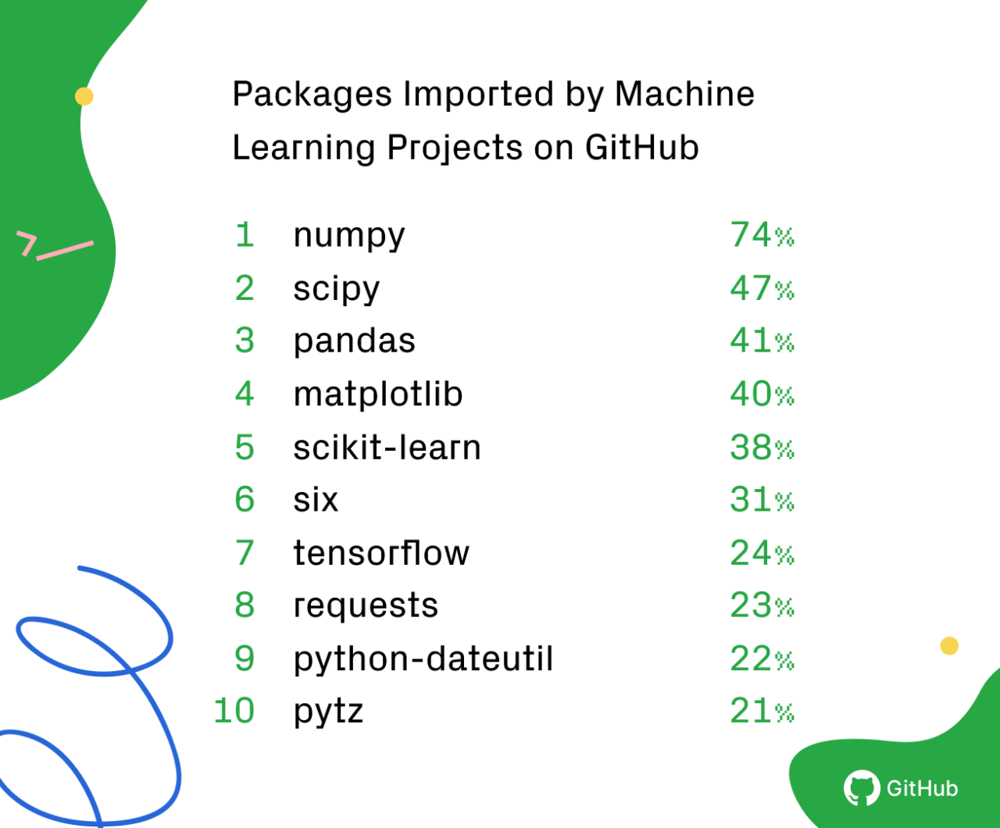
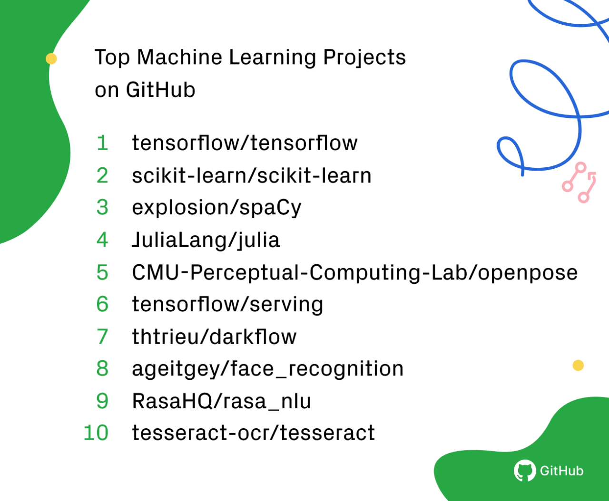

The State of the Octoverse: Machine Learning - The GitHub Blog

January 24, 2019

# The State of the Octoverse: Machine Learning

[  Thomas](https://github.blog/author/telliott27/)

In our 2018 Octoverse report, we noticed machine learning and data science were popular topics on GitHub. [tensorflow/tensorflow](https://github.com/tensorflow/tensorflow) was one of the most contributed to projects, [pytorch/pytorch](https://github.com/pytorch/pytorch) was one of the fastest growing projects, and Python was the third most popular language on GitHub. We decided to dig a little deeper into the state of machine learning and data science on GitHub.

We pulled data on contributions between January 1, 2018 and December 31, 2018. Contributions could include pushing code, opening an issue or pull request, commenting on an issue or pull request, or reviewing a pull request. For the most imported packages, we used data from the dependency graph, which includes all public repositories and any private repositories that have opted in to the dependency graph.

## Programming languages[#](https://github.blog/2019-01-24-the-state-of-the-octoverse-machine-learning/#programming-languages)

We looked at contributors to repositories tagged with the “machine-learning” topic, and ranked the most common primary languages of the repositories. Python is the most common language among machine learning repositories and is the third most common language on GitHub overall. However, not all machine learning happens in Python: some of the most common languages on GitHub are also common languages for machine learning projects. C++, JavaScript, Java, C#, Shell, and TypeScript are all in the top 10 languages on GitHub and the top 10 for machine learning projects. Julia, R, and Scala all appear in the top 10 for machine learning projects but not for GitHub overall. Julia and R are both languages commonly used by data scientists, and Scala is becoming increasingly common when interacting with big data systems like Apache Spark.

## Popular machine learning and data science packages[#](https://github.blog/2019-01-24-the-state-of-the-octoverse-machine-learning/#popular-machine-learning-and-data-science-packages)

We pulled data from the dependency graph to calculate the percentage of projects with machine learning or data science topics that import popular Python packages. The list above shows the top ten packages imported by these projects. Here’s what we found:

- [Numpy](https://github.com/numpy/numpy)—a package with support for mathematical operations on multidimensional data—was the most imported package, used in nearly three-quarters of machine learning and data science projects.
- [Scipy](https://github.com/scipy/scipy), a package for scientific computation, [pandas](https://github.com/pandas-dev/pandas), a package for managing datasets, and [matplotlib](https://github.com/matplotlib/matplotlib), a visualization library, are all used in over 40% of machine learning and data science projects.
- [Scikit-learn](https://github.com/scikit-learn/scikit-learn) is a popular machine learning package, containing implementations of a large number of machine learning algorithms—it’s used by nearly 40% of projects.
- [Tensorflow](https://github.com/tensorflow/tensorflow), a package for working with neural nets, is used in nearly a quarter of packages.

The rest of the top ten are utility packages: [six](https://github.com/benjaminp/six) is a Python 2 and 3 compatibility library, and [python-dateutil](https://github.com/dateutil/dateutil) and [pytz](https://launchpad.net/pytz) are packages for working with dates.

## Popular machine learning projects[#](https://github.blog/2019-01-24-the-state-of-the-octoverse-machine-learning/#popular-machine-learning-projects)

We also looked at which open source projects with the “machine-learning” label had the most contributors in 2018. [Tensorflow](https://github.com/tensorflow/tensorflow) was by far the most popular with more than five times the number of contributors of the second most popular project, [scikit-learn](https://github.com/scikit-learn/scikit-learn). Two projects, [explosion/spaCy](https://github.com/explosion/spaCy) and [RasaHQ/rasa_nlu](https://github.com/RasaHQ/rasa_nlu), are focused on natural language processing problems. Another four projects, [CMU-Perceptual-Computing-Lab/openpose](https://github.com/CMU-Perceptual-Computing-Lab/openpose), [thtrieu/darkflow](https://github.com/thtrieu/darkflow), [ageitgey/face_recognition](https://github.com/ageitgey/face_recognition), and [tesseract-ocr/tesseract](https://github.com/tesseract-ocr/tesseract), are focused on image processing. The Julia language [source code](https://github.com/JuliaLang/julia) was also one of the most contributed to projects in 2018.

We love seeing the amazing projects you’ve built using machine learning. If you want to explore more of these projects on GitHub, check out the [Explore page](https://github.com/topics/machine-learning).

**Share**

- [TwitterShare on Twitter](https://twitter.com/share?text=The%20State%20of%20the%20Octoverse:%20Machine%20Learning&url=https://github.blog/2019-01-24-the-state-of-the-octoverse-machine-learning/)
- [FacebookShare on Facebook](https://www.facebook.com/sharer/sharer.php?u=https://github.blog/2019-01-24-the-state-of-the-octoverse-machine-learning/&t=The%20State%20of%20the%20Octoverse%3A%20Machine%20Learning)