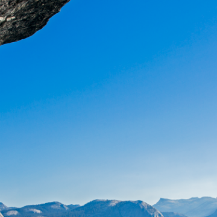

The Strange Brain of the World’s Greatest Solo Climber - Issue 61: Coordinates - Nautilus

The Strange Brain of the World’s Greatest Solo Climber - Issue 61: Coordinates - Nautilus

http://nautil.us/issue/61/coordinates/the-strange-brain-of-the-worlds-greatest-solo-climber-rp?utm_source=nextdraft&utm_medium=email

Alex Honnold has his own verb. “To honnold”—usually written as “honnolding”—is to stand in some high, precarious place&#8230;