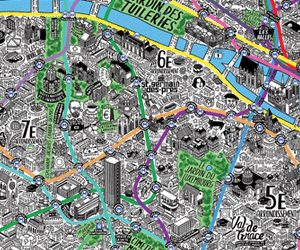

The Sunk Cost Fallacy Is Ruining Your Decisions. Here's How

1.   [ Health](https://time.com/section/health/)

2.   [ Mental Health/Psychology](https://time.com/tag/mental-healthpsychology/)

3.  The Sunk Cost Fallacy Is Ruining Your Decisions. Here's How

# The Sunk Cost Fallacy Is Ruining Your Decisions. Here's How

               

 [       Elizabeth Renstrom for TIME](https://timedotcom.files.wordpress.com/2015/01/money-dollar-bills-3.jpg)

By [Jamie Ducharme](https://time.com/author/jamie-ducharme/)    [![](data:image/svg+xml,%3csvg width='30' height='30' viewBox='0 0 30 30' xmlns='http://www.w3.org/2000/svg' role='img' aria-hidden='true' tabindex='-1' data-evernote-id='455' class='js-evernote-checked'%3e%3cg fill='none' fill-rule='evenodd' data-evernote-id='1043' class='js-evernote-checked'%3e%3cpath d='M15 29.997c8.284 0 15-6.715 15-14.999C30 6.715 23.284 0 15 0 6.716 0 0 6.715 0 14.998c0 8.284 6.716 14.999 15 14.999z' fill='%23E3E4E6' data-evernote-id='456' class='js-evernote-checked'%3e%3c/path%3e%3cpath d='M21.233 11.054a3.253 3.253 0 0 0 1.352-1.815 5.931 5.931 0 0 1-1.954.796A2.982 2.982 0 0 0 18.385 9c-1.7 0-3.076 1.47-3.076 3.281 0 .257.025.508.078.747-2.557-.137-4.824-1.442-6.343-3.428a3.44 3.44 0 0 0-.416 1.65c0 1.138.543 2.143 1.369 2.732a2.943 2.943 0 0 1-1.395-.41v.04c0 1.59 1.06 2.917 2.47 3.217-.259.077-.53.116-.812.116-.198 0-.392-.02-.578-.058.39 1.303 1.527 2.253 2.874 2.278A5.935 5.935 0 0 1 8 20.524a8.327 8.327 0 0 0 4.717 1.473c5.662 0 8.755-5 8.755-9.336 0-.142-.001-.284-.007-.424a6.478 6.478 0 0 0 1.535-1.7 5.85 5.85 0 0 1-1.767.517z' fill='%23FFF' data-evernote-id='457' class='js-evernote-checked'%3e%3c/path%3e%3c/g%3e%3c/svg%3e)](https://twitter.com/Jamie_Ducharme)

July 26, 2018

If you’ve ever let unworn clothes clutter your closet just because they were expensive, or followed through on plans you were dreading because you already bought tickets, you’re familiar with the sunk cost fallacy.

“The sunk cost effect is the general tendency for people to continue an endeavor, or continue consuming or pursuing an option, if they’ve invested time or money or some resource in it,” says Christopher Olivola, an assistant professor of marketing at Carnegie Mellon’s Tepper School of Business and the author of a new [paper](http://journals.sagepub.com/doi/full/10.1177/0956797617752641) on the topic published in the journal *Psychological Science*. “That effect becomes a fallacy if it’s pushing you to do things that are making you unhappy or worse off.”

This idea often applies to money, but invested time, energy or pain can also influence behavior. “Romantic relationships are a classic one,” Olivola says. “The longer you’ve been together, [the harder it is to break up](https://time.com/5086205/dr-ruth-breakup-advice/).”

This is the Meanest Reason to Break Up with Someone

Rejection hurts. But it stings even more when you're turned down for another person

You Might Like

A New Study Suggests Vegetarians and Vegans Are at Higher Risk of Stroke. But Don't Reach for That Steak Just Yet

A Teen Boy's Diet of Fries and Sausage Led to Blindness, According to a New Case Study

Humans get caught in this psychological trap for several possible reasons, Olivola says. Sticking with the plan, even when it no longer serves you, could be an attempt to correct cognitive dissonance: the mental disconnect between paying for something and not getting the expected return on investment. It could also be a knee-jerk reaction to regret. Or, Olivola says, it could be an attempt to convince others, and ourselves, that we’re not wasteful.

“All of these things are irrational, in the sense that you should realize the money is gone,” Olivola says. “But I do think people do these things because they want to convince themselves that they’ve managed to recapture the loss.”

You still feel the guilt of “wasting” money even when it’s not your own. Olivola’s recent paper found that we “feel that need to honor other people’s sunk cost in the same way that you feel the need to honor your own” — even if the person who paid the cost isn’t a close friend or family member. If you got sick on the day of a concert, Olivola’s research suggests you’d be just as likely to force yourself to go if a coworker gifted you pricey tickets as if you had bought them yourself.

To reach that finding, Olivola designed a series of experiments constructed to measure the extent to which the sunk cost effect would sway people to make hypothetical decisions. Nearly across the board, the results affirmed the existence and strength of the phenomenon, both as it applies to individuals and others.

In one scenario, people were asked to imagine that they were accidentally scheduled to take two trips — one to Montreal, and one to Cancun — during the same weekend, forcing them to choose one. When they were told one flight cost $200 and the other cost $800, people were significantly more likely to opt for the pricey trip — even if they would have preferred the cheaper destination. This effect held true whether people imagined that they had booked the flights, or that friends had given them the tickets as gifts.

Other experiments further illustrated how the sunk cost fallacy applies to others. Participants were asked to imagine that they felt full after eating a few bites of rich cake at a potluck party. Some were told the cake had been purchased from a local bakery on sale, while others were told the cake was expensive and had come from a shop almost an hour away. Depending on the scenario, participants were asked to imagine that they had bought the cake themselves, or that someone else had purchased it. They were then asked whether they’d finish the cake, [despite feeling full](https://time.com/4246736/protein-satiety-fullness/). Regardless of who had bought the cake — friends, strangers or the participants themselves — people were far more likely to say they’d keep eating the expensive cake, according to the study.

Olivola says it’s not totally clear why we feel so compelled to honor others’ investments about as much as we honor our own, even when they work against us. But people should try to overcome both versions of the sunk cost fallacy, he says.

“What’s done is done,” Olivola says. “There’s nothing you can do to regain money that’s lost — and pursuing something that makes you unhappy not only isn’t going to get your money back, but it’s also going to make you worse off. You’re just digging a deeper hole.”

**Write to **Jamie Ducharme at [jamie.ducharme@time.com](https://time.com/5347133/sunk-cost-fallacy-decisions/mailto:jamie.ducharme@time.com?subject=(READER%20FEEDBACK)%20The%20Sunk%20Cost%20Fallacy%20Is%20Ruining%20Your%20Decisions.%20Here%27s%20How).

Sponsored Stories

- [

 [eyJpdSI6IjZjY2QwODc5MDA0ZWUzZmM3Yjg1NzRhN2VjNDczYTRjYTlmNmM3OWY3YmQ1ODA2ZjliNjA2YmU5ZjkzOTk2MmQiLCJ3IjoxMDAsImgiOjEwMCwiZCI6MS41LCJjcyI6MCwiZiI6NH0.webp](../_resources/7c9f6853f57ad1937a4a499a6131d085.webp)    Les grandes erreurs de nos films préférés  Automoto, magazine auto et moto](https://actualites-decalees.auto-moto.com/20-erreurs-gacher-vos-films-preferes-201958.html?utm_source=Outbrain&utm_medium=Discovery&utm_campaign=DRP_erreurs_film_04-09-19&obOrigUrl=true)

- [       Travaux d'isolation à un euro : aubaine ou arnaque ?  Bon Plan Isolation](http://go.economies-astuces.fr/6a0ec227-4c20-4c1b-b8f9-71623edbaedc?ad=00400f5d9af8a1a69eba624a5f60af9624&title=Travaux+d%27isolation+%C3%A0+un+euro+%3A+aubaine+ou+arnaque+%3F&doc=L%27Etat+finance+l%27isolation+de+votre+garage%2Ccave+et+sous-sol+sans+condi&publisher=$publisher_name$&section=$section_name$&obOrigUrl=true)
- [

 [eyJpdSI6ImE1MzNkNmJjY2QzMGExMmNmYTAzMTIwNWI2M2FlNDk3YzgxMzcyNzQzMTRlODMxMGY1ZjA4Y2FlMjNjNmMxZGUiLCJ3IjoxMDAsImgiOjEwMCwiZCI6MS41LCJjcyI6MCwiZiI6NH0.webp](../_resources/9041f4c361a54ed15e6c9af058bbb89e.webp)    Vendée : ils tabassent leur voisin qu'ils croient pédophile parce qu'il écoute Pierre Perret  France Info - Faits Divers](http://secure-gl.imrworldwide.com/cgi-bin/b?ci=fr-ade&cg=13442&si=fr-Outbrain-FranceInfo&cc=1&tu=https://www.francetvinfo.fr/faits-divers/vendee-ils-tabassent-leur-voisin-qu-ils-croient-pedophile-parce-qu-il-ecoute-pierre-perret_3603363.html#xtor=SEC-69-[FRANCE_INFO_Desktop_||_0059001c0b775fd69c0af480fbe4efc4c3]-[$publisher_name$]-Content&obOrigUrl=true)

- [

 [f3fo](../_resources/f9f565d508fce53925f07cdb0a5bd3c4.webp)    Petit rouleur ? Découvrez l'assurance au km à partir de 16€/mois !  AXA](https://ad.doubleclick.net/ddm/clk/424060016;144975925;e?obOrigUrl=true)

- [

 [0](../_resources/4f7617a1e9948ed5a351a09573788d5d.webp)    Un traducteur instantané surprend tout le pays. L’idée est géniale  Instant Voice Translator](https://the.goodwaytrk.com/5968d78c-a44b-4fc8-8837-153f13a81d31?campid=0015375e8e54e49263366f97dd89277b65&creaid=00d4490fa8f464f1a4c95d34027477e19e&atitle=Un+traducteur+instantan%C3%A9+surprend+tout+le+pays.+L%E2%80%99id%C3%A9e+est+g%C3%A9niale&sectionid=$section_id$&pubidx=$publisher_id$&sectionname=$section_name$&outclickid=$ob_click_id$&obOrigUrl=true)

- [

 [eyJpdSI6ImE5MjI4ZGRmNjhiYmE4NDk4MGU3M2QyOTQ2MDBkMzYyZTczNTQ0YzM2Y2VjMDk3M2QyNThkMjViZGNkZTBkNzciLCJ3IjozMDAsImgiOjE2OSwiZCI6MS41LCJjcyI6MCwiZiI6NH0.webp](../_resources/e2ddd081a2cd5605cb4d314478dd717a.webp)    Problèmes intestinaux: «C’est ce qu'il y a de mieux pour votre intestin»  Nutrivia](http://trk.trkmm.com/58112416-56d6-46e3-9b85-80bdc9957713?utm_source=ob&utm_campaign=nouvellesimagestablet&utm_term=$section_name$&utm_content=00034f8548fbe7228db9befbd280941bed&t=$ob_click_id$&a=ob&obOrigUrl=true)

[Recommended by](https://www.outbrain.com/what-is/default/en)

### SPONSORED FINANCIAL CONTENT

 

 [(L)](https://www.dianomi.com/click.epl?pn=50939&offer=12776621&savid=131509&said=3365&adv=5363)

 [Pan Am Games Prove Peru’s Progress](https://www.dianomi.com/click.epl?pn=50939&offer=12776621&savid=131509&said=3365&adv=5363)

LatAM INVESTOR

 [(L)](https://www.dianomi.com/click.epl?pn=44456&offer=11502176&savid=117281&said=3365&adv=5363)

 [Growing popularity of Environmental, Social & Governance investing](https://www.dianomi.com/click.epl?pn=44456&offer=11502176&savid=117281&said=3365&adv=5363)

The AIC

 [(L)](https://www.dianomi.com/click.epl?pn=50642&offer=12718717&savid=130862&said=3365&adv=5363)

 [Trading on Flows](https://www.dianomi.com/click.epl?pn=50642&offer=12718717&savid=130862&said=3365&adv=5363)

ETF Global

 [(L)](https://www.dianomi.com/click.epl?pn=50180&offer=12637642&savid=129868&said=3365&adv=5363)

 [Interview with Francisco Ísmodes, Peru’s Minister of Energy and Mines](https://www.dianomi.com/click.epl?pn=50180&offer=12637642&savid=129868&said=3365&adv=5363)

LatAM INVESTOR

 [(L)](https://www.dianomi.com/click.epl?pn=51015&offer=12787065&savid=131623&said=3365&adv=5363)

 [ETF news from a volatile August](https://www.dianomi.com/click.epl?pn=51015&offer=12787065&savid=131623&said=3365&adv=5363)

ETF Global

 [(L)](https://www.dianomi.com/click.epl?pn=50437&offer=12678479&savid=130390&said=3365&adv=5363)

 [Stock Markets and Big Thinking](https://www.dianomi.com/click.epl?pn=50437&offer=12678479&savid=130390&said=3365&adv=5363)

ETF Global

## Read More From TIME

 

 [ Health](https://time.com/section/health)

###   [A New Study Suggests Vegetarians and Vegans Are at Higher Risk of Stroke. But Don't Reach for That Steak Just Yet](https://time.com/5669628/vegetarians-vegans-stroke-study/)

 [(L)](https://time.com/5668456/coffee-kids-health/)
 [ Health](https://time.com/section/health)

###   [Should Parents Worry About Kids Drinking Coffee?](https://time.com/5668456/coffee-kids-health/)

 [(L)](https://time.com/5669503/is-juice-bad-for-you/)
 [ Health](https://time.com/section/health)

###   [Should I Give My Child Juice? Here’s What Experts Say](https://time.com/5669503/is-juice-bad-for-you/)

 

 [ Health](https://time.com/section/health)

###   [Michigan Just Became the First State to Ban Flavored E-Cigarettes in an Effort to Keep Kids 'Safe'](https://time.com/5668720/michigan-flavored-vaping-products/)

 

 [ Health](https://time.com/section/health)

###   [A Teen Boy's Diet of Fries and Sausage Led to Blindness, According to a New Case Study](https://time.com/5667374/poor-diet-blindness-case-study/)

 [(L)](https://time.com/5664640/weight-loss-surgery-health-benefits/)
 [ Health](https://time.com/section/health)

###   [Weight-Loss Surgery Dramatically Lowers the Risk of Early Death, a New Study Finds](https://time.com/5664640/weight-loss-surgery-health-benefits/)

You May Like

- [

 [eyJpdSI6IjJlMTNiM2RkZTkxZDNkMmFjNWVmZjI5NWJmMzdkNWY4MzhjZTc4MWI3ZjBhNThjMGVhNzEzNWU0ZjY0NTE0NjkiLCJ3IjoxMDAsImgiOjEwMCwiZCI6MS41LCJjcyI6MCwiZiI6NH0.webp](../_resources/22995f1d0571cdf915278714566b1c30.webp)    Possédez-vous un Mac ordinateur? Protégez vos appareils…  by My Antivirus Review | Sponsored](http://click.clickntrax.com/c831d998-91b0-444e-8cdd-e8dcbc291815?source=$origsrcid$&ADID=Poss%C3%A9dez-vous+un+Mac+ordinateur%3F+Prot%C3%A9gez+vos+appareils+gratuitement+d&sectionid=$section_id$&sectionname=$section_name$&publisherid=$publisher_id$&publishername=$publisher_name$&adtitle=Poss%C3%A9dez-vous+un+Mac+ordinateur%3F+Prot%C3%A9gez+vos+appareils+gratuitement+d&obOrigUrl=true)

- [      Nouveau en 2019: Isolation à 1€ sans condition de salairebyHomestima| Sponsored](https://r1.zemanta.com/r/u1a6din7okcg/b1_outbrainrtb/649153/9692220/WDVCBEL2S3ODFUAN33DUVCWA2ZUF3PSGUCUEY3BZFM5W3UIMU7JOZZDTTQAZJENUZUQYLFCA7WA676HOOAA7ZXVRM2QW4W2XCXU5G6JPES3OUH4FEPKTKYLDVL2HRRGTB37WHIW2O76H3QEITY7G2Y3D4XR7PO5YSC7WMQPBDT4W3746DTLBKT73KM57GAWODMXBENVEBLL6R35MAXNYHSN27TVP3Y3Y4TW7QIPOD7H3B45ODKX42DAHSO63MBCOD3ACJAM45B6VO3M26PXSA6RD57WWMUTWSYUOEO7DBYKDHM4BIFGZ5CDQT3VHRBUWXXM4JLZXCBDX5JQADQZCK5SIGDEGETUXZWKD75BZEB7UGF3H7RAQ/?obOrigUrl=true)
- [       Rihanna May Be Trolling Her Superfans and This Is Proof  by TIME](https://time.com/5609978/rihanna-fenty-no-more-music-shirt/?obOrigUrl=true)
- [

 [eyJpdSI6ImNhNmExZWMyMmYyNDNiNTYxOWFhM2UwZGY5ZGI3ODNlYWNiNmE3MzY1YjVjZjBkZjZjOGU5ZjBjZDI2NGQ0ZjAiLCJ3IjoxMDAsImgiOjEwMCwiZCI6MS41LCJjcyI6MCwiZiI6NH0.webp](../_resources/7e6d8e5ad603e1572178d6993df32064.webp)    Tonight's Super Snow Moon Will Be the Biggest Supermoon of…  by TIME](http://time.com/5530480/super-snow-moon-2019/?obOrigUrl=true)

[by](https://www.outbrain.com/what-is/default/en)

 [eyJpdSI6IjliOGJlYWU0MmVkYzlmODY4OTQwZmZmZWEyZmFmNjE4MjU0YzQ5MjI0NzE3OWIyZjgzZjE0NGMyNDEyM2Y3MDIiLCJ3IjozMDAsImgiOjE2OSwiZCI6MS41LCJjcyI6MCwiZiI6NH0.webp](../_resources/6a43099d5c8fe991a7aa7ebaca53069d.gif)

 [eyJpdSI6IjI5ZGZiYzUxYzhjMzgxOTcxOTg5M2RhOWQyMDdhZTdmYjhhMDA2ZWQ5NTQ3Y2MxY2VjZmU1NzI1NmJkNjhlMTgiLCJ3IjozMDAsImgiOjE2OSwiZCI6MS41LCJjcyI6MCwiZiI6NH0.webp](../_resources/6a43099d5c8fe991a7aa7ebaca53069d.gif)

 [eyJpdSI6ImFkZmNlZGQxYTkyM2UwMGVlZGUzYTVlMTFmYmNhYjE0ODFlYjUzZTI1YmYyMzM3MjI3MGE0MGFkZTgzMDJiNzEiLCJ3IjoxMDAsImgiOjEwMCwiZCI6MS41LCJjcyI6MCwiZiI6NH0.webp](../_resources/9bb191c6827273aa978cab39a3587950.gif)

 [eyJpdSI6IjU4ZGRhMGE1MjQ1OWRkNTVhNTM2MzVlYTI5YTg5NGIxMzU5YzVkYzdlM2RlZDJlMDE1ZmVkN2IzNzM2ZjMxODkiLCJ3IjoxMDAsImgiOjEwMCwiZCI6MS41LCJjcyI6MCwiZiI6NH0.webp](../_resources/779cf1fa341f32838178128d8b58da34.gif)

 [eyJpdSI6Ijg0MTYyMGU3NWFlMDFkYzVkYTcyMzQzYjM5ZGE4ZDEyNmU0YzRhZDVhOGZjYTRlYWQ5OWNiMmUxMjQ4MWRlZDkiLCJ3IjozMDAsImgiOjE2OSwiZCI6MS41LCJjcyI6MCwiZiI6NH0.webp](../_resources/5ecfcd6d8fa19e88256687ff922f77d0.bin)  [eyJpdSI6ImM2Yzc1YTc3Y2NmNmYxMTFmZjU5MTNiYjI4NWRkMTNmNWI4MTc0ZjUwZjZiZDU1OWVlNWRkMjMxZmQ4NzkyNjciLCJ3IjoxMDAsImgiOjEwMCwiZCI6MS41LCJjcyI6MCwiZiI6NH0.webp](../_resources/6fa52c495c3f2773ecb1b5c90e207f8f.bin)

 add this widget to your site

**

**

**

  

Did You Know?

A kiss is healthier than a handshake, as more germs are transferred via the hand than the mouth. Cold and flu viruses actually spread quicker through ones' hands.

  

Did You Know?

Walking through doorways serves as event boundaries, which are memories stored in the back of your mind. Walk through a door - you might recall something.

  

Did You Know?

If your eyes are blue, you share a single, common ancestor with every blue-eyed person in the world.

  

Did You Know?

It is physically easier to be happy! Smiling only requires the use of 17 muscles, while frowning puts 43 muscles to work.

  

Did You Know?

One's skin is swarming with tiny spiders, lice and microbial colonies, more are found on each person than the number of humans in the world.

sponsored

Advertisement

sponsored

Advertisement

**

**

**

sponsored

Advertisement



## Related Stories

 [ Health](https://time.com/section/health)

##   [ A Third of Americans Avoid Certain Places Because They Fear...](https://time.com/5653218/mass-shootings-stress/)

 [            ](https://time.com/5653218/mass-shootings-stress/)

 [ Health](https://time.com/section/health)

##   [ Social Media Hurts Girls More Than Boys](https://time.com/5650266/social-media-girls-mental-health/)

 

 [ Health](https://time.com/section/health)

##   [ Politicians Keep Blaming Mass Shootings on Mental Health Issues...](https://time.com/5644147/mass-shootings-mental-health/)

 [            ](https://time.com/5644147/mass-shootings-mental-health/)

 [ Health](https://time.com/section/health)

##   [ Why We Love Advice Columns, According to Psychologists](https://time.com/5619100/why-we-love-advice-columns/)

 

You May Like

- [

 [eyJpdSI6ImFiM2U2ODBhNmI3ZmZiYTNlODI2ODc1YjUxOGE0MGZiZDc3MDQ4M2RkYzJlMWY4ZTUwY2Y1MTE5NmE2Y2ZhMjgiLCJ3IjozMDAsImgiOjE2OSwiZCI6MS41LCJjcyI6MCwiZiI6NH0.webp](../_resources/32018c8e17739a42ef23256ebe56b7d5.webp)    Les Z'Amours : la confidence très étrange d'une candidate choque…  by Les top vidéos du moment | Sponsored](https://www.gentside.com/les-z-amours/la-confidence-coquine-de-cette-candidate-des-z-amours-a-choque-tout-le-monde_art84476.html?utm_source=outbrain&utm_medium=native&utm_campaign=outbrainfr&obOrigUrl=true)

- [

 [eyJpdSI6ImU2YTc4YzcxYjcyYTE5NmU1NGExOTZiZDg2M2YwODNiM2Q5MDM5ODNmNGRmYWFkOGQ5NWJkOTQ4M2MyNmM2MDYiLCJ3IjozMDAsImgiOjE2OSwiZCI6MS41LCJjcyI6MCwiZiI6NH0.webp](../_resources/750afb9678d4b0053739b87eb22d5259.webp)    Les femmes qui ont fait craquer les XV de France  by Marie France | Sponsored](https://www.mariefrance.fr/culture/george-ryan-et-moi/femmes-joueurs-xv-de-france-455118.html?utm_medium=Discovery&utm_source=Outbrain&utm_campaign=MF_Femmes-Rugbyman_22-05-19&obOrigUrl=true)

- [       Smells 'Like a Thousand Rotting Corpses' — Florida Vacation Home…  by TIME](https://time.com/5654467/florida-home-vulture-invasion/?obOrigUrl=true)
- [     This Lithuanian City Played Host to HBO's 'Chernobyl.' It's Now…byTIME](https://time.com/5668326/vilnius-lithuania-chernobyl-nuclear-meltdown-drill/?obOrigUrl=true)

[by](https://www.outbrain.com/what-is/default/en)