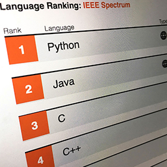

The Top Programming Languages 2019 - IEEE Spectrum

- Article
- [Computing](https://spectrum.ieee.org/computing)
- [Software](https://spectrum.ieee.org/computing/software)

06 Sep 2019 | 16:30 GMT

# The Top Programming Languages 2019

## Python remains the big kahuna, but specialist languages hold their own

By [Stephen Cass](https://spectrum.ieee.org/author/cass-stephen)

Advertisement
Editor's Picks

[ #### Software Engineering Grads Lack the Skills Startups Need](https://spectrum.ieee.org/the-institute/ieee-member-news/software-engineering-grads-lack-the-skills-startups-need)[ #### Software, the Invisible Technology](https://spectrum.ieee.org/computing/software/software-the-invisible-technology)[ #### How the Boeing 737 Max Disaster Looks to a Software Developer](https://spectrum.ieee.org/aerospace/aviation/how-the-boeing-737-max-disaster-looks-to-a-software-developer)

 [  **Explore the Interactive Rankings**](https://spectrum.ieee.org/static/interactive-the-top-programming-languages-2019)

Welcome to *IEEE Spectrum*’s sixth annual interactive ranking of the top programming languages. This year we’ve done a major overhaul, changing some of the underlying metrics and building a new streamlined interface. But our basic idea and methodology remains the same: combining data from multiple sources to rank the popularity of the programming languages that are used for the type of coding *you* are interested in.

We take this approach to get around the two fundamental obstacles to all attempts to determine the popularity of programming languages: (1) No one can actually look over the shoulder of every coder around the world as they tap away at the keyboard, and (2) a language that’s a cornerstone of one programming domain might be utterly irrelevant in another. *Spectrum* gets data for 11 metrics from 8 sources that we think are good proxies for popularity, and we combine the results in an app that lets you filter languages and adjust the weights given to each metric. The upshot is a ranking that’s right for you. (As part of our overhaul, we’ve retired two metrics that we used in previous years because we didn’t think they were yielding good quality data anymore, incorporated data from the [IEEE Job Site](https://jobs.ieee.org/), and added some new languages to the list, such as [Dart](https://dart.dev/).)

Of course, we’ve also got some preset weightings built in that are optimized for job seekers, for example, or folks interested in diving into an open-source side project. Our default weighting is optimized for the typical *Spectrum* reader, so let’s take a look at what it shows as the top 10 languages of 2019.

 

Although the changes in our underlying metrics mean that we have to be careful when directly comparing this year’s rankings to last year’s, the general outline of results remains similar, with [Python](https://www.python.org/) firmly on top. Python’s popularity is driven in no small part by the vast number of specialized libraries available for it, particularly in the domain of artificial intelligence, where the [Keras library](https://keras.io/) is a heavyweight among deep-learning developers: Keras provides an interface to the [TensorFlow](https://www.tensorflow.org/), [CNTK](https://docs.microsoft.com/en-us/cognitive-toolkit/), and [Theano](http://www.deeplearning.net/software/theano/) deep-learning frameworks and tool kits. Deep learning isn’t the only field where Python is having an impact that could not have been anticipated when the language was first released in 1991. The [dramatic increase in computing power](https://spectrum.ieee.org/geek-life/hands-on/machine-learning-thats-light-enough-for-an-arduino) found in microcontrollers means that embedded versions of Python, such as [CircuitPython](https://spectrum.ieee.org/at-work/tech-careers/scott-shawcroft-is-squeezing-python-into-microcontrollers) and [MicroPython](https://micropython.org/), are becoming increasingly popular among makers.

Next comes [Java](https://www.java.com/en/), [C](http://www.open-std.org/jtc1/sc22/wg14/), and [C++](https://isocpp.org/), a group whose members have long jostled with one another and with Python for the top spot, although with our adjusted metrics the distance between these contenders has widened, with C++ coming in with a score of 12.5 points below Python. (In any given ranking, the highest-ranked language is assigned a score of 100, and the scores of lower-ranked languages are scaled to that.) The number-crunching language R rounds out the top five. Despite being a much more specialized language than the others, it’s maintained its popularity in recent years due to the world being awash in an ever-growing pile of big data.

Moving further down the top 10, the presence of [Matlab](https://www.mathworks.com/products/matlab.html)—a proprietary language developed by MathWorks and intended for numerical computing—may be a surprise to some, but it simply reflects the language’s prominence in hardware engineering, especially for those interested in running simulations or creating control systems via MathWorks’ graphical Simulink package.

Below the top 10, some items of note include [Arduino](https://www.arduino.cc/reference/en/) at No. 11 and [HTML/CSS](https://html.spec.whatwg.org/multipage/) at No. 12. In previous years, some readers have complained that neither should appear on a list of programming languages. In the case of Arduino, the argument is that there is no such language, that “Arduino” is actually the name of the family of hardware platforms on which the language runs, and that this language should be called Wiring (or sometimes C or C++ for historical reasons). In this, we are led by simple pragmatism: When faced with a programming question, the overwhelming majority of Arduino developers search Google using terms like “Arduino Code for…,” rather than any alternative. By choosing the de facto name, we avoid deeply discounting the popularity of programs written for the Arduino and similar microcontrollers.

Pragmatism is also the name of the game when it comes to HTML, with the objection here that it is not a *real* programming language because it doesn’t have branching or loop constructs. But given the huge popularity of HTML and CSS among developers, and the fact that they are used to instruct billions of computers to do things daily, we feel any academic arguments about Turing completeness and so on are beside the point. A markup language is still a language.

Finally, some older languages are still alive and kicking. In particular, despite being over 60 years old, Fortran still comes in at No. 38, likely due to the enormous legacy power of being the original scientific computing language. The language is still under active development, with the most recent [Fortran standard](https://wg5-fortran.org/f2018.html) released at the end of 2018, incorporating improved interoperability with C and better support for massive parallel computations.

https://adclick.g.doubleclick.net/pcs/click?xai=AKAOjsvLncPr6drqKT1RvwxvXXOeHD3Synj8pibGaqYX9NxASRAdj5-5PTNKt9I4hovF9Rjx0Q2BL_bvKSC6sUynvEwn0pzUC0NdJ2kKRqNrnagusyiAgbCM0DSVOgGFf8asrLmzQUbTOjl3y1vlefNQlvibNpVH1Wthlj2kc0BIt6UJiWumdQnLr3-wFYWa_3VTL0arJJP8iJChqIEKxGMtuglClwmBDvL43tBZrBUjp-xnzxHnCCHjFGff9iWReh4Cd8gn6kNgDFBWlasADynMGXwn&sig=Cg0ArKJSzNKZ_pKJSEkZEAE&urlfix=1&adurl=

Advertisement