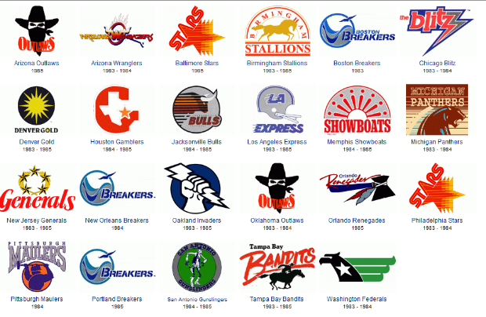
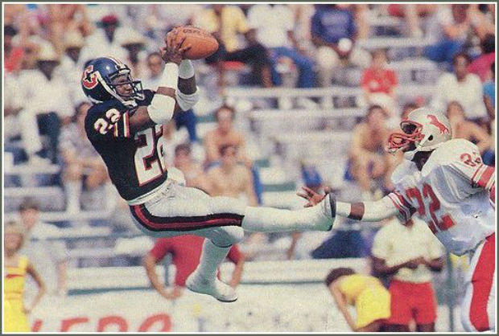

The True Identity of Jack the Ripper May Have Just Been Confirmed

There were supposed to be 44 players marching to the field when the visiting Los Angeles Express played their final regular season game against the Orlando Renegades in June 1985.

Thirty-six of them showed up. The team couldn’t afford more.

“We didn’t even have money for tape,” Express quarterback Steve Young [said](http://articles.orlandosentinel.com/1986-08-07/sports/0240260172_1_usfl-football-league-trump) in 1986. “Or ice.” The squad was so poor that Young played fullback during the game. They only had one, and he was injured.

Other teams had ridden [school buses](http://www.si.com/longform/2015/1985/usfl/) to practice, driven three hours for “home games,” or shared dressing room space with the local rodeo. In August 1986, the cash-strapped United States Football League called off the coming season. The league itself would soon vaporize entirely after gambling its future on an antitrust lawsuit against the National Football League. The USFL argued the NFL was monopolizing television time; the NFL countered that the USFL—once seen as a promising upstart—was being victimized by its own reckless expansion and the wild spending of team owners like Donald Trump.

They were both right.

 

Getty Images

**Spring football. That was David Dixon’s pitch.** The New Orleans businessman and football advocate—he helped get the Saints in his state—was a fan of college ball and noticed that spring scrimmages at [Tulane University](http://staugustine.com/stories/080106/sports_3990889.shtml#.V3MVEqL3j6h) led to a little more excitement in the air. With a fiscally responsible salary cap in place and a 12-team roster, he figured his idea could be profitable. Market research agreed: a hired broadcast research firm asserted [76 percent](https://news.google.com/newspapers?nid=2519&dat=19830122&id=zvhdAAAAIBAJ&sjid=pV8NAAAAIBAJ&pg=1433,2690126&hl=en) of fans would watch what Dixon had planned.

He had no intention of grappling with the NFL for viewers. That league’s season aired from September through January, leaving a football drought March through July. And in 1982, a players’ strike led to a [shortened](http://blogs.nfl.com/2013/01/17/a-brief-history-of-the-usfl/) NFL season, making the idea of an alternative even more appealing to networks. Along with investors for each team region, Dixon got ABC and the recently-formed ESPN signed to broadcast deals worth a combined [$35 million](https://news.google.com/newspapers?nid=2519&dat=19830122&id=zvhdAAAAIBAJ&sjid=pV8NAAAAIBAJ&pg=1433,2690126&hl=en) over two years.

When the Chicago Blitz faced the Washington Federals on the USFL’s opening day March 6, 1983, over 39,000 fans [braved rain](http://www.si.com/vault/1984/05/14/627343/it-was-up-up-and-no-way) at RFK Stadium in Washington to see it. The Federals lost 28-7, foreshadowing their overall performance as one of the league’s worst. Owner Berl Bernhard would later complain the team played like “untrained gerbils.”

Anything more coordinated might have been too expensive. The USFL had instituted a strict $1.8 million salary cap that first year to avoid franchise overspending, but there were allowances made so each team could grab one or two standout rookies. In 1983, the big acquisition was Heisman Trophy winner Herschel Walker, who opted out of his senior year at Georgia to turn pro. Walker [signed](http://www.nytimes.com/2016/02/20/sports/football/donald-trumps-less-than-artful-failure-in-pro-football.html) with the New Jersey Generals in a three-year, $5 million deal.

Jim Kelly and Steve Young followed. Stan White left the Detroit Lions. Marcus Dupree [left college](https://news.google.com/newspapers?nid=1320&dat=19840304&id=vjxWAAAAIBAJ&sjid=nukDAAAAIBAJ&pg=6848,1163507&hl=en). The rosters were built up from scratch using NFL cast-offs or prospects from nearby colleges, where teams had rights to “territorial” drafts.

To draw a line in the sand, the USFL had advertising play up the differences between the NFL’s product and their own. Their slogan, “When Football Was Fun,” was a swipe at the NFL’s increasingly draconian rules regarding players having any personality. They also advised teams to run a series of marketable halftime attractions. The Denver Gold once offered a [money-back guarantee](https://news.google.com/newspapers?nid=1310&dat=19850223&id=IfZVAAAAIBAJ&sjid=i-EDAAAAIBAJ&pg=6726,5024333&hl=en) for attendees who weren’t satisfied. During one Houston Gamblers game, boxer George Foreman [officiated a wedding](https://www.washingtonpost.com/lifestyle/style/and-then-there-was-the-time-donald-trump-bought-a-football-team-/2015/10/19/35ae71ca-6dd6-11e5-aa5b-f78a98956699_story.html). Cars were [given away](http://www.esquire.com/news-politics/a41135/donald-trump-usfl/) at Tampa Bay Bandits games. The NFL, the upstart argued, stood for the No Fun League.

For a while, it appeared to be working. The Panthers, which had invaded the city occupied by the Detroit Lions, averaged 60,000 fans per game, higher than their NFL counterparts. ABC was pleased with steady ratings. The league was still conservative in their spending.

That would change—many would argue for the worse—with the arrival of Donald Trump.

 

[(L)](http://www.sportslogos.net/teams/list_by_league/22/United_States_Football_League/N/logos/)

[SportsLogos](http://www.sportslogos.net/teams/list_by_league/22/United_States_Football_League/N/logos/)

**Despite Walker’s abilities on the field, his New Jersey Generals ended** the inaugural 1983 season at 6-12, one of the worst records in the league. The excitement having worn off, owner J. Walter Duncan decided to sell the team to real estate investor Trump for a reported $5-9 million.

A fixture of New York media who was putting the finishing touches on Trump Tower, Trump introduced two extremes to the USFL. His presence gave the league far more press attention than it had ever received, but his bombastic approach to business guaranteed he wouldn’t be satisfied with an informal salary cap. Trump spent and spent some more, recruiting players to improve the Generals. Another Heisman winner, quarterback Doug Flutie, was signed to a five-year, $7 million contract, the largest in pro football at the time. Trump even pursued Lawrence Taylor, then a player for the New York Giants, who signed a contract saying that, after his Giants contract expired, he’d join Trump’s team. The Giants wound up buying out the Taylor/Trump contract for $750,000 and quadrupled Taylor’s salary, and Trump wound up with pages of publicity.

Trump’s approach was effective: the Generals improved to 14-4 in their sophomore season. But it also had a domino effect. In order to compete with the elevated bar of talent, other team owners began spending more, too. In a race to defray costs, the USFL approved six expansion teams that paid a buy-in of $6 million each to the league.

It did little to patch the seams. Teams were so cash-strapped that simple amenities became luxuries. The Michigan Panthers dined on burnt spaghetti and took yellow school buses to training camp; players would race to cash checks knowing the last in line stood a chance of having one bounce. When losses became too great, teams began to merge with one another: The Washington Federals became the Orlando Renegades. By the 1985 season, the USFL was down to 14 teams. And because the ABC contract required the league to have teams in certain top TV markets, ABC started withholding checks.

Trump was unmoved. Since taking over the Generals, he had been petitioning behind the scenes for the other owners to pursue a shift to a fall season, where they would compete with the NFL head on. A few owners countered that fans had already voiced their preference for a spring schedule. Some thought it would be tantamount to league suicide.

Trump continued to push. By the end of the 1984 season, he had swayed opinion enough for the USFL to plan on one final spring block in 1985 before making the move to fall in 1986.

In order to make that transition, they would have to win a massive lawsuit against the NFL.

 

[(L)](http://www.usflsite.com/trial.php)
[USFLSite](http://www.usflsite.com/trial.php)

**In the mid-1980s, three major networks meant that three major broadcast contracts** would be up for grabs—and the NFL owned all three. To Trump and the USFL, this constituted a monopoly. They filed suit in October 1984. By the time it [went to trial](http://articles.latimes.com/1986-07-30/sports/sp-18643_1_jury-finds-nfl-guilty) in May 1986, the league had shrunk from 18 teams to 14, hadn’t hosted a game since July 1985, kept only threadbare rosters, and was losing what existing television deals it had by migrating to smaller markets (a major part of the NFL’s case was that the real reason for the lawsuit, and the moves to smaller markets, was to make the league an attractive takeover prospect for the NFL). The ruling—which could have forced the NFL to drop one of the three network deals—would effectively become the deciding factor of whether the USFL would continue operations.

They came close. A New York jury deliberated for 31 hours over five days. After the verdict, jurors told press that half believed the NFL was guilty of being a monopoly and were prepared to offer the USFL up to $300 million in damages; the other half thought the USFL had been crippled by its own irresponsible expansion efforts. Neither side would budge.

To avoid a hung jury, it was decided they would find in favor of the USFL but only award damages in the amount of $1. One juror told the* Los Angeles Times* that she thought it would be an indication for the judge to calculate proper damages.

He didn’t. The USFL was awarded treble damages for $3 in total, an amount that grew slightly with interest after time for appeal. The NFL sent them a payment of $3.76. (Less famously, the NFL was also ordered to pay $5.5 million in legal fees.)

Rudy Shiffer, vice-president of the Memphis Showboats, summed up the USFL's fate shortly after the ruling was handed down. “We’re dead,” he said.