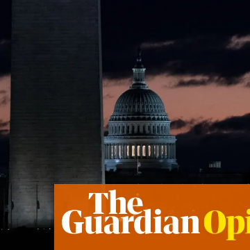

The US is on the edge of the economic precipice – and Trump may push it over | Robert Reich

The US is on the edge of the economic precipice – and Trump may push it over | Robert Reich

https://www.theguardian.com/commentisfree/2018/dec/23/us-economic-precipice-donald-trump-government-shutdown

Government shutdowns hurt millions. Great depressions hurt even more. History suggests real pain is round the corner