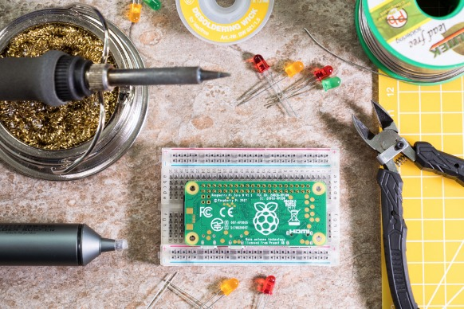
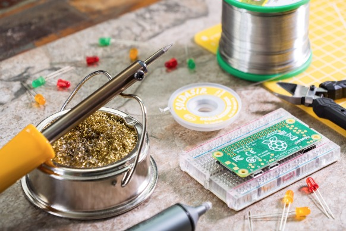
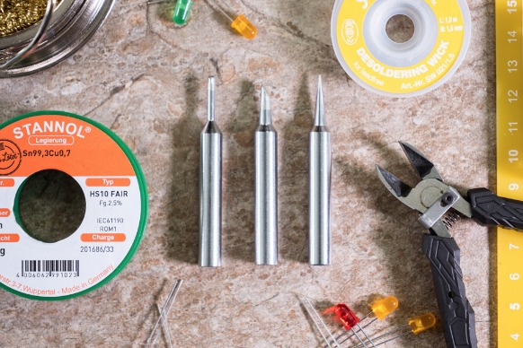
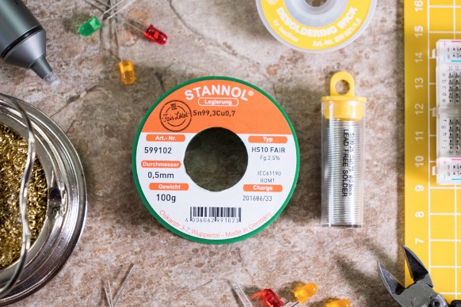
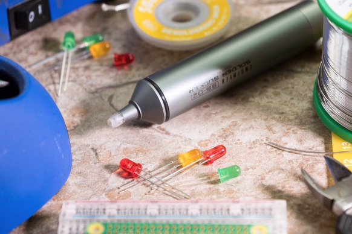
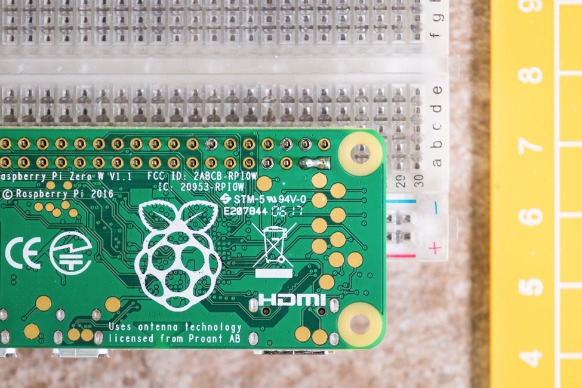
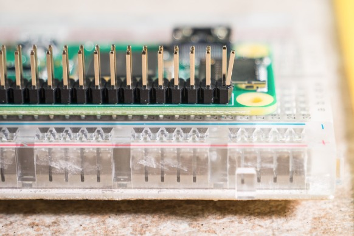
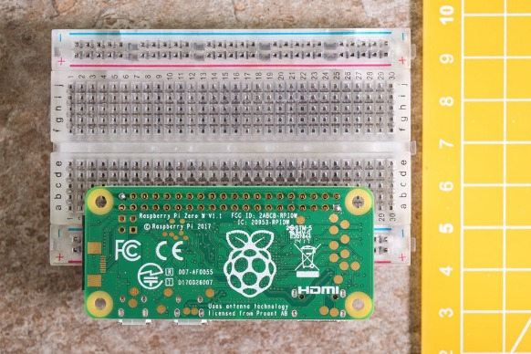
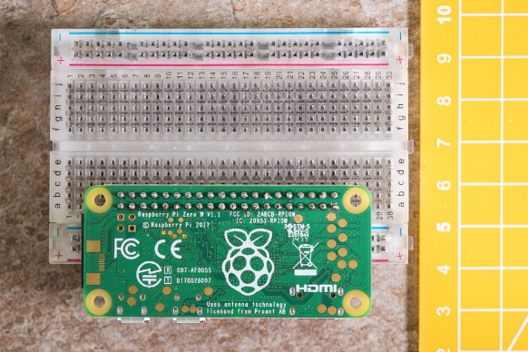

The Ultimate Guide to Soldering - Pimoroni Yarr-niversity

# The Ultimate Guide to Soldering

This guide will aim to cover everything you need to know, and probably a fair bit you don't need to know, about soldering. Soldering isn't an easy skill to learn, although it's easy to do it badly, but there are lots of tips that aren't immediately obvious that can help you out a bunch.

We'll cover:

- safety
- choosing the right equipment
- preparation
- perfect solder joints
- pitfalls
- repairs
- finishing touches
- specific examples

## Safety first!

Yes! Before we mention anything else, let's talk safety. Soldering has lots of risks involved, just like crossing the road or boiling an egg, but you can minimise those risks by observing the following points. Please read all of them; they're really important!

**Rule zero. Do not be on fire!** Always ensure that your soldering iron is safely stood on a heat-proof stand when warming up, in use, or cooling down. If you leave the room, or if you're working on something else, then switch off your soldering iron and/or unplug it. Never leave it unattended. You should always solder on a heat-proof surface; we like to use ceramic tiles, which you can pick up cheaply as samples in DIY, hardware stores, or on[eBay](https://www.ebay.co.uk/sch/i.html?_from=R40&_trksid=m570.l1313&_nkw=tile+sample&_sacat=0).

**Soldering irons are HOT!** Never touch any of the metal parts of your soldering iron, i.e. those parts below the plastic handle, unless you are certain that it has been switched off and cooled down to a safe temperature. Even if a soldering iron is switched off then it can retain heat for quite a while, so never assume that because a soldering is not plugged in it will be safe to touch.

**Solder can send sparks towards your eyes!** You should always wear eye protection when soldering. A pair of plastic safety specs is ideal to wear. Lead-free solder that contains a flux core is especially prone to sending tiny sparks of hot flux in all directions, and they could potentially lead to serious eye injury. Don't assume that a normal pair of spectacles will adequately protect your eyes; a pair of safety specs will wrap further around your eyes and prevent any stray sparks from sneaking underneath.

**All solder gives off fumes that aren't safe to breathe!** Even lead-free solder will give off fumes that you shouldn't breathe. The area in which you're working should be well-ventilated, so open a couple of windows. It's best to have a fan blowing fumes away from you or, better still, an extraction fan drawing fumes away from you.

Right, let's get started!

## Choosing a soldering iron

Like many such things in life, you get what you pay for when it comes to soldering irons. A cheap, USB-powered soldering iron bought on eBay may well function, but will just not perform as well as a decent one, and will cause you a lot of stress.

As an absolute minimum requirement, we'd recommend a soldering iron like the [Antex XS25](https://shop.pimoroni.com/products/antex-xs25-soldering-iron-uk-plug)that we sell for £30. If you're prepared to spend a bit, or a lot, more money, then you should invest in a temperature-controlled soldering iron. These let you control the temperature of the tip, which comes in handy in situations where you're soldering more delicate components and need a lower temperature, or you're soldering boards or components that soak up a lot of heat and require a higher temperature.

In our workshop, we use the Hakko FX-888D temperature-controlled soldering irons, and they're just fantastic. They heat up quickly, are incredibly solidly built, and have a built-in stand to stow your soldering iron safely in. If you're going to be doing a lot of soldering then they're a wise investment.

## Choosing the correct tip

There are a variety of different tip types that you can get. We sell a[mixed pack of spare tips](https://shop.pimoroni.com/products/antex-xs-replacement-bits), with a needle tip, a chisel tip, and a bevelled tip.

While part of which type of tip to use is down to personal preference, some tips will work better in particular situations. For example, a needle tip is perfect for fiddly, fine detail work, when you need to precisely solder in tight spaces.

A small chisel tip will work well for most soldering jobs. It requires less precision to work with than the needle tip, and will transfer more heat due to the larger contact area of the tip.

A bevelled tip has a larger contact area still, and will help in situations where you need to transfer a lot of heat, or solder larger components.

## Choosing solder

We recommend a good quality lead-free multi-core rosin solder like the[Antex one](https://shop.pimoroni.com/products/copper-solder)we sell in our shop. We also sell a[fair trade lead-free solder](https://shop.pimoroni.com/products/fair-loetet), for those who prefer a fair trade option.

In the past, all solder was leaded and was significantly easier to solder! Because lead is a heavy metal and thus toxic (by ingestion, inhalation, or potentially skin contact), it is not safe to use for soldering in most situations. An experienced solderer observing the proper precautions could safely use leaded solder, but we wouldn't recommend it.

Flux, present in the core of modern lead-free solders, or separately in pens or pots, helps the metal in the solder flow on and adhere to surfaces. If you're having trouble getting your solder to flow, then a dab of flux with a flux pen on both the component you're soldering and the surface to which you'd like it to stick can help immensely.

Low-temperature solder is much easier to use than rosin core solder, but requires fluxing before use, so you win some, you lose some! It's generally more expensive too.

## Optional extras

You can get by with just a soldering iron, solder, and some safety specs, but some of the optional extras below will make your life easier!

A [soldering tip cleaner](https://shop.pimoroni.com/products/soldering-tip-cleaner)with low-abrasive brass shavings will let you clean your soldering iron tip without significantly dropping its temperature and won't damage the tip. The one we sell also doubles as a handy stand to safely stow your soldering iron on. We also sell an Antex bench stand that is an alternative way to stow your iron.

[Desoldering braid](https://shop.pimoroni.com/products/desoldering-wick) is really handy for fixing wonky soldering joints. It's a fine woven metallic braid that wicks up solder and comes in various widths depending on the size of joint that you're desoldering. More on desoldering later!

An alternative, and more sustainable, way of desoldering is with a[solder sucker](https://shop.pimoroni.com/products/solder-sucker-with-silicone-nozzle). We sell a really great one from Engineer Tools that will last you a lifetime! They work by literally sucking the solder away from the joint that you're desoldering.

**A flux pen** will help your solder flow more easily, and is especially handy when soldering bare wires to pads, or tinning pieces of wire. We don't sell them, but you'll pick one up on Amazon fairly easily and cheaply.

A [Panavise](https://shop.pimoroni.com/products/panavise-junior) or[Third Hand](https://shop.pimoroni.com/products/third-hand) can help to hold the item that you're soldering securely still, although we'll offer some cheaper alternatives later! The advantages of the Panavises and Third Hands is that they can flex and rotate to any angle you wish and be bolted securely to your work surface.

Having a decent **work light** will help you to see what you're doing and is especially useful if you're doing fine work that you need to see clearly. An Anglepoise-type lamp is ideal, and IKEA sell some fairly cheap and effective ones. A magnifier can also help for fine detail work.

## Preparation

Before beginning to solder (and switching your soldering iron on), make sure that you're prepared.

You should have a heat-proof surface on which to work. As we said earlier, ceramic tile samples from a DIY store are ideal and will cost you not a great deal of money. A matte, or rough-textured one will help to grip things better.

Make sure that you have a fresh tip on your iron, if you need one, and that you're using the correct tip for the job (see the "Choosing the correct tip" section above).

Before switching on your soldering iron, make sure that it is stood safely on a stand, bench stand, or heat-proof surface. Remember not to touch it once you've plugged it in, and not to leave it unattended!

Put your safety specs on!

## Tinning your tip

You should always tin your soldering iron tip before starting to solder. Tinning is the process of coating the surface of your soldering iron tip in solder (which contains tin) to prevent oxidisation and to aid the solder in sticking to your tip and flowing to where it should.

Once hot, hold your soldering iron over your heat-proof surface or soldering tip cleaner, if you have one. Touch your solder to the tip, making sure to cover the bottom centimetre or so, all around. Clean the excess solder off the tip, and repeat the process of coating in solder and cleaning the excess off until the tip of your iron is shiny!

## Holding things still

We're almost ready to begin!

You'll want to hold the board that you're soldering still. As we mentioned earlier, a Panavise or Third Hand tool is a great way to do this, but there are a couple of cheaper alternatives.

If you're soldering a single or double strip of pin headers to a board, then you can push the top of the pins into a (suitably-sized) breadboard to hold them still and then sit your board on top of them. If there are pins on both edges of the board then put both sets in the breadboard before starting, to hold the whole board level. Otherwise, stick a small lump of Blu Tack underneath to hold it level.

Blu Tack is the solderer's best friend! If you don't have a breadboard, then you can stick a decent-sized lump of Blu Tack on your heat-proof surface and use it to hold your board still while you solder it.

## The perfect solder joint

The perfect solder joint happens when several things all come together and the planets align.

Your soldering iron tip needs to be at the correct temperature. If you're using a non-temperature-controlled soldering iron, then make sure that you've given it a decent amount of time to warm up. Make sure that your tip is clean and tinned.

If you're right-handed, then hold the soldering iron in your right hand and the solder in your left. If you're left-handed, then do the opposite. You should spool off 30 centimetres or so of solder from your spool, straighten the end of it out, and hold the solder at least 5 centimetres from the end.

The tip of your soldering iron should make contact with the copper surround of the hole that your component leg or pin is through, *and* with the pin or component leg, to heat *both* of them up.

Don't apply solder straight away. Touch your soldering iron to the copper surround and the component leg or pin for a second or two first. Now feed in the solder with your other hand. You're aiming to apply sufficient solder to form a neat dome shape over the top of the pin that also covers the whole of the copper surround. When feeding in the solder, you should feed it in at the point where your soldering iron touches both the pin and the copper surround.

When you've added sufficient solder, remove the solder, but *don't* remove the soldering iron yet. Hold it in position for an additional second or so, to let the solder flow right into the joint that you're making. If you don't do this, then your solder joint will be blobby and might not be making an effective electrical contact.

The whole process of pre-heating, applying solder, and letting the solder flow after should take no more than a couple of seconds. Any more than that can result in problems like plastic pin header surrounds melting (more on that below).

You've just achieved it the perfect solder joint! Haven't you? What?! You haven't? Maybe we'll need more practice!

## Pitfalls!

One of the most common problems is **blobby solder joints**. These happen when you haven't applied enough heat to the solder joint, either while you're adding the solder or after you've removed the solder. It can also happen when your soldering iron just isn't hot enough, as can be the case with cheaper soldering irons.

Blobby solder joints will often not make a proper electrical contact with the copper surround on the board, but can be fixed by holding your soldering iron against the blobby joint until the solder melts and flows down into the hole.**Don't add any more solder!**

Adding **too much solder** is another common problem. If your joint is blobby, or the solder isn't flowing right around the pins (both problems are caused by applying too little heat), then the temptation can be to add more solder. This won't fix the problem, and can result in solder bridges to nearby pins, meaning that you'll have to go through the stress of desoldering the joint/s. Again, the solution is to add more heat until the solder flows properly. A little dab of flux with a flux pen can often help too.

Sometimes **messy solder joints** and **solder bridges** can be the result of using a soldering iron tip that is too big or too wide for the job in hand. Try using a finer tip, like a needle tip or a small chisel tip. You might find that it suits you better than the one that you've been using.

**Too much heat** will also cause you strife. Just as too little heat will cause problems like blobby or poorly soldered joints, too much heat will cause its own set of problems. The most common issue is pin headers with plastic surrounds melting, resulting in pins being crooked or slipping too far through the board. This can happen when your soldering iron is too hot (turn the temperature down if it's a controllable one), or if you hold the soldering iron on the joint for too long.

**Ground pins** - that is pins that are connected to the ground plane of the board - will always be much harder to solder than regular pins. This is because the ground plane of a PCB will act as a heatsink and suck up the heat from your soldering iron and hence from your solder and the pin you're trying to solder. This means that you might need to spend a little longer soldering these pins, i.e. pre-heat the pin for a little longer and hold your iron for a little longer after to let the solder flow into the joint. The same goes for larger components like USB or micro-USB jacks.

Remember that most problems can be fixed, so don't fret! We'll cover some ways to fix problems below.

## Repair jobs

**Repairing a blobby solder joint** is a fairly easy fix. Simply touch the tip of your soldering iron against the blob, and hold it until the solder flows down into the joint.

A **solder bridge** between pins can often be fixed by simply holding your soldering iron against the middle of the bridge until the solder melts and drawing it through to break the bridge. If the bridge is too large, and this method doesn't fix it, then you'll need to desolder (and resolder) it with a solder sucker or some desoldering braid.

A **poor joint that isn't making proper electrical contact** can be fixed by first applying more heat with your soldering iron, and then adding *a little*more solder if necessary.

A **wonky pin caused by too much heat** can (sometimes) be fixed by holding the offending pin with a pair of needle-nose pliers and then applying some heat to the solder joint (you might need just enough heat to soften the plastic around the pin again). Gripping the pin with the pliers, move it back into the correct position, remove the soldering iron while still holding the pin, and let the solder and plastic harden again.

## Finishing touches

If you've soldered your joints and repaired any problems, then technically you're done, but there are a couple of finishing touch you might want to do to make the whole thing look really kosher!

**Clipping legs and rounding off joints** gives your solder joints a really professional look. Some components, like LEDs, resistors, etc, have long legs that need to be clipped after soldering. You should clip them with a pair of flush-cutting snips, like the Engineer Tools ones that we sell, as close as possible to the board. Once clipped, you can briefly touch your soldering iron against the clipped joint to round it off and make it look really neat.

**Removing flux residue** will improve the visual appearance of your board. Because lead-free solder contains flux, once soldered, it can leave residue around the solder joints. This can be removed using isopropyl alcohol (IPA) and a clean, lint-free cloth. Give part to be cleaned a quick spray with the IPA, and then rub it with the cloth to clean off the residue.

## Specific examples

We'll cover a couple of common soldering jobs now: soldering a[40-pin male header](https://shop.pimoroni.com/products/male-40-pin-2x20-hat-header)to a [Pi Zero or Zero W](https://shop.pimoroni.com/search?type=product&q=pi+zero), and soldering a through-hole component like an LED.

**40-pin headers**

The key to soldering 40-pin headers is to, i) anchor the corner pins and, ii) make sure that the header sits straight and not off at an angle.

Put the pins of your header through the holes in your Pi Zero; the shorter ends should go through the holes from the top of the board and protrude through the bottom side. Carefully flip the whole thing over and secure it either in a breadboard or with a lump of Blu Tack.

Make sure that Pi Zero and header are steady on your heat-proof surface or clamped in a Panavise. Once your soldering iron is heated up, tinned and ready to go, solder the top left hand corner pin (as you look at it from the bottom).

Before going any further, take a look at the header and make sure that it is flush to the PCB of your Pi Zero. If it isn't, then hold the Pi Zero with the side that you're soldering facing upwards, and support the header at the opposite end to the one you're soldering. Briefly melt the solder joint on the top corner pin that you just soldered and reposition the header so that it's flush with the PCB.

Next, we'll secure the opposite corner pin - the bottom right one. Again, once you've soldered it, check it to make sure that the header is still flush against the PCB, and fix it as described previously if it isn't.

Now, solder the 38 remaining pins, making sure that there's sufficient solder on all of the pins, that the copper surround of the pin is completely covered and that the solder forms a nice dome around the pin.

**Through-hole components**

Soldering through-hole components, like LEDs, requires a slightly different technique to soldering pin headers. In this example, we'll be soldering an LED into a board to illustrate how they should be soldered.

Pop the legs of your LED through the holes in your PCB, and bend them at about a 45 degree angle outwards, so that the legs naturally hold the LED in the board. A Panavise really helps to hold the PCB steady here or, again, you could use a big lump of Blu Tack.

Solder both of the legs, making sure the base of the LED is sitting flush to the PCB again after soldering the first leg, and adjusting if necessary by re-melting.

Clip the excess leg from each joint with a pair of flush-cutting snips, and then round off each joint, if you like, as described above.

The process described would be exactly the same for most other through-hole components like resistors, capacitors, and such.