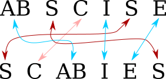
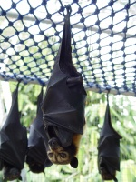

The Universe of Discourse : I found the best anagram in English

# [The Universe of Discourse](http://blog.plover.com/)

 [Mark Dominus](http://en.wikipedia.org/wiki/Mark_Dominus) ([陶敏修](http://en.wikipedia.org/wiki/Mark_Dominus))

 [mjd@plover.com](http://blog.plover.com/2017/02/21/?utm_content=buffer76a6b&utm_medium=social&utm_source=twitter.com&utm_campaign=buffer#anagram-scoringmailto:mjd@plover.com)

 

 [RSS](http://blog.plover.com/index.rss)  [Atom](http://blog.plover.com/index.atom)

[12 recent entries](http://blog.plover.com/)

|     |
| --- |
| [/dev/null Follies](http://blog.plover.com/Unix/dev-null.html) |
| [Solving twenty-four puzzles](http://blog.plover.com/math/24-puzzle.html) |
| [Miscellaneous notes on anagram scoring](http://blog.plover.com/lang/anagram-scoring-3.html) |
| [Moore's law beats a better algorithm](http://blog.plover.com/lang/anagram-scoring-2.html) |
| [I found the best anagram in English](http://blog.plover.com/lang/anagram-scoring.html) |
| [Automatically checking for syntax errors with Git's pre-commit hook](http://blog.plover.com/prog/git-pre-commit-hook.html) |
| [More thoughts on a line of code with three errors](http://blog.plover.com/prog/three-errors.html) |
| [How I got three errors into one line of code](http://blog.plover.com/oops/three-errors.html) |
| [How many 24 puzzles are there?](http://blog.plover.com/math/increasing-sequences.html) |
| [Strangest Asian knockoff yet](http://blog.plover.com/misc/liberty-place.html) |
| [Digit symbols in the Parshvanatha magic square](http://blog.plover.com/lang/magic-square-puzzle-2.html) |
| [Let's decipher a thousand-year-old magic square](http://blog.plover.com/math/magic-square-puzzle.html) |

Archive:

|     |     |
| --- | --- |
| [2017](http://blog.plover.com/2017/): | [J](http://blog.plover.com/2017/01/)[F](http://blog.plover.com/2017/02/)[M](http://blog.plover.com/2017/03/)[A](http://blog.plover.com/2017/04/) |
| [2016](http://blog.plover.com/2016/): | J[F](http://blog.plover.com/2016/02/)[M](http://blog.plover.com/2016/03/)[A](http://blog.plover.com/2016/04/)[M](http://blog.plover.com/2016/05/)[J](http://blog.plover.com/2016/06/) |
|     | [J](http://blog.plover.com/2016/07/)ASO[N](http://blog.plover.com/2016/11/)[D](http://blog.plover.com/2016/12/) |
| [2015](http://blog.plover.com/2015/): | JF[M](http://blog.plover.com/2015/03/)[A](http://blog.plover.com/2015/04/)[M](http://blog.plover.com/2015/05/)[J](http://blog.plover.com/2015/06/) |
|     | [J](http://blog.plover.com/2015/07/)[A](http://blog.plover.com/2015/08/)[S](http://blog.plover.com/2015/09/)[O](http://blog.plover.com/2015/10/)[N](http://blog.plover.com/2015/11/)[D](http://blog.plover.com/2015/12/) |
| [2014](http://blog.plover.com/2014/): | [J](http://blog.plover.com/2014/01/)[F](http://blog.plover.com/2014/02/)[M](http://blog.plover.com/2014/03/)[A](http://blog.plover.com/2014/04/)MJ |
|     | [J](http://blog.plover.com/2014/07/)ASO[N](http://blog.plover.com/2014/11/)[D](http://blog.plover.com/2014/12/) |
| [2013](http://blog.plover.com/2013/): | JFMAMJ |
|     | [J](http://blog.plover.com/2013/07/)A[S](http://blog.plover.com/2013/09/)[O](http://blog.plover.com/2013/10/)N[D](http://blog.plover.com/2013/12/) |
| [2012](http://blog.plover.com/2012/): | [J](http://blog.plover.com/2012/01/)[F](http://blog.plover.com/2012/02/)[M](http://blog.plover.com/2012/03/)AMJ |
|     | J[A](http://blog.plover.com/2010/08/)SON[D](http://blog.plover.com/2012/12/) |
| [2011](http://blog.plover.com/2011/): | JFMA[M](http://blog.plover.com/2011/05/)[J](http://blog.plover.com/2011/06/) |
|     | JASO[N](http://blog.plover.com/2011/11/)D |
| [2010](http://blog.plover.com/2010/): | [J](http://blog.plover.com/2010/01/)FMAMJ |
|     | J[A](http://blog.plover.com/2010/08/)[S](http://blog.plover.com/2010/09/)[O](http://blog.plover.com/2010/10/)[N](http://blog.plover.com/2010/11/)D |
| [2009](http://blog.plover.com/2009/): | [J](http://blog.plover.com/2009/01/)[F](http://blog.plover.com/2009/02/)[M](http://blog.plover.com/2009/03/)A[M](http://blog.plover.com/2009/05/)[J](http://blog.plover.com/2009/06/) |
|     | [J](http://blog.plover.com/2009/07/)A[S](http://blog.plover.com/2009/09/)ON[D](http://blog.plover.com/2009/12/) |
| [2008](http://blog.plover.com/2008/): | [J](http://blog.plover.com/2008/01/)[F](http://blog.plover.com/2008/02/)[M](http://blog.plover.com/2008/03/)[A](http://blog.plover.com/2008/04/)[M](http://blog.plover.com/2008/05/)[J](http://blog.plover.com/2008/06/) |
|     | [J](http://blog.plover.com/2008/07/)A[S](http://blog.plover.com/2008/09/)[O](http://blog.plover.com/2008/10/)[N](http://blog.plover.com/2008/11/)D |
| [2007](http://blog.plover.com/2007/): | [J](http://blog.plover.com/2007/01/)[F](http://blog.plover.com/2007/02/)[M](http://blog.plover.com/2007/03/)[A](http://blog.plover.com/2007/04/)[M](http://blog.plover.com/2007/05/)[J](http://blog.plover.com/2007/06/) |
|     | [J](http://blog.plover.com/2007/07/)[A](http://blog.plover.com/2007/08/)[S](http://blog.plover.com/2007/09/)[O](http://blog.plover.com/2007/10/)[N](http://blog.plover.com/2007/11/)[D](http://blog.plover.com/2007/12/) |
| [2006](http://blog.plover.com/2006/): | [J](http://blog.plover.com/2006/01/)[F](http://blog.plover.com/2006/02/)[M](http://blog.plover.com/2006/03/)[A](http://blog.plover.com/2006/04/)[M](http://blog.plover.com/2006/05/)[J](http://blog.plover.com/2006/06/) |
|     |  [J](http://blog.plover.com/2006/07/)A[S](http://blog.plover.com/2006/09/)[O](http://blog.plover.com/2006/10/)[N](http://blog.plover.com/2006/11/)[D](http://blog.plover.com/2006/12/) |
| [2005](http://blog.plover.com/2005/): | [O](http://blog.plover.com/2005/10/)[N](http://blog.plover.com/2005/11/)[D](http://blog.plover.com/2005/12/) |

* * *

Subtopics:

|     |     |
| --- | --- |
| [Mathematics](http://blog.plover.com/math/) | 125 |
| [Programming](http://blog.plover.com/prog/) | 55  |
| [Language](http://blog.plover.com/lang/) | 29  |
| [Cosmic Call](http://blog.plover.com/aliens/dd/) | 25  |
| [Book](http://blog.plover.com/book/) | 22  |
| [Physics](http://blog.plover.com/physics/) | 20  |
| [Misc](http://blog.plover.com/misc/) | 20  |
| [Oops](http://blog.plover.com/oops/) | 18  |
| [Unix](http://blog.plover.com/Unix/) | 18  |
| [Linogram](http://blog.plover.com/linogram/) | 14  |
| [Perl](http://blog.plover.com/prog/perl/) | 14  |
| [Tech](http://blog.plover.com/tech/) | 13  |
| [Biology](http://blog.plover.com/bio/) | 10  |
| [Calendar](http://blog.plover.com/calendar/) | 10  |
| [CS](http://blog.plover.com/CS/) | 9   |

     

Comments disabled

Tue, 21 Feb 2017

[I found the best anagram in English](http://blog.plover.com/lang/anagram-scoring.html)

I planned to publish this last week sometime but then [I wrote a line of code with three errors](http://blog.plover.com/oops/three-errors.html) and that took over the blog.

A few years ago I mentioned in passing that[in the 1990s I had constructed a listing of all the anagrams](http://blog.plover.com/lang/threnodials.html)in Webster's Second International dictionary. (The[Webster's headword list](http://pic.blog.plover.com/lang/anagram-scoring/Web2.txt.gz) was available online.)

This was easy to do, even at the time, when the word list itself, at 2.5 megabytes, was a file of significant size. Perl and its cousins were not yet common; in those days I used Awk. But the task is not very different in any reasonable language:

[object Object]

The key technique is to reduce each word to a *normal form* so that two words have the same normal form if and only if they are anagrams of one another. In this case we do this by sorting the letters into alphabetical order, so that both *megalodon* and *moonglade* become[object Object].

Then we insert the words into a (hash | associative array | dictionary), keyed by their normal forms, and two or more words are anagrams if they fall into the same hash bucket. (There is some discussion of this technique in [*Higher-Order Perl*](http://hop.perl.plover.com/) pages 218–219 and elsewhere.)

(The thing you do *not* want to do is to compute every permutation of the letters of each word, looking for permutations that appear in the word list. That is akin to sorting a list by computing every permutation of the list and looking for the one that is sorted. I wouldn't have mentioned this, but someone on StackExchange actually asked this question.)

Anyway, I digress. This article is about how I was unhappy with the results of the simple procedure above. From the Webster's Second list, which contains about 234,000 words, it finds about 14,000 anagram sets (some with more than two words), consisting of 46,351 pairs of anagrams. The list starts with

>
> aal ala
and ends with
>
> zolotink zolotnik

which exemplify the problems with this simple approach: many of the 46,351 anagrams are obvious, uninteresting or even trivial. There must be good ones in the list, but how to find them?

I looked in the list to find the longest anagrams, but they were also disappointing:

>
> cholecystoduodenostomy duodenocholecystostomy

(Webster's Second contains a large amount of scientific and medical jargon. A cholecystoduodenostomy is a surgical operation to create a channel between the gall bladder (*cholecysto-*) and the duodenum (*duodeno-*). A duodenocholecystostomy is the same thing.)

This example made clear at least one of the problems with boring anagrams: it's not that they are too short, it's that they are too simple. Cholecystoduodenostomy and duodenocholecystostomy are 22 letters long, but the anagrammatic relation between them is obvious: chop cholecystoduodenostomy into three parts:

>
> cholecysto duodeno stomy
and rearrange the first two:
>
> duodeno cholecysto stomy
and there you have it.

This gave me the idea to score a pair of anagrams according to how many chunks one had to be cut into in order to rearrange it to make the other one. On this plan, the “cholecystoduodenostomy / duodenocholecystostomy” pair would score 3, just barely above the minimum possible score of 2. Something even a tiny bit more interesting, say “abler / blare” would score higher, in this case 4. Even if this strategy didn't lead me directly to the most interesting anagrams, it would be a big step in the right direction, allowing me to eliminate the least interesting.

This rule would judge both “aal / ala” and “zolotink / zolotnik” as being uninteresting (scores 2 and 4 respectively), which is a good outcome. Note that some other boring-anagram problems can be seen as special cases of this one. For example, short anagrams never need to be cut into many parts: no four-letter anagrams can score higher than 4. The trivial anagramming of a word to itself always scores 1, and nontrivial anagrams always score more than this.

So what we need to do is: for each anagram pair, say[[object Object]](https://en.wikipedia.org/wiki/Acrididae) (grasshoppers) and [[object Object]](https://en.wikipedia.org/wiki/Cidaridae) (sea urchins), find the smallest number of chunks into which we can chop[object Object] so that the chunks can be rearranged into [object Object].

One could do this with a clever algorithm, if one were available.[There is a clever algorithm](http://cs.stackexchange.com/questions/2259/finding-interesting-anagrams), based on finding maximal independent sets in a certain graph. (More about this tomorrow.) I did not find this algorithm at the time; nor did I try. Instead, I used a brute-force search. Or rather, I used a very small amount of cleverness to reduce the search space, and then used brute-force search to search the reduced space.

Let's consider a example, scoring the anagram “abscise / scabies”. You do not have to consider every possible permutation of[object Object]. Rather, there are only two possible mappings from the letters of [object Object] to the letters of [object Object]. You know that the[object Object] must map to the [object Object], the [object Object] must map to the [object Object], and so forth. The only question is whether the first [object Object] of [object Object] maps to the first or to the second [object Object] of [object Object]. The first mapping gives us:

and the second gives us

because the [object Object] and the [object Object] no longer go to adjoining positions. So the minimum number of chunks is 5, and this anagram pair gets a score of 5.

To fully analyze [object Object] by this method required considering 7680 mappings. (120 ways to map the five [object Object]'s × 2 ways to map the two[object Object]'s × 2 ways to map the two [object Object]'s, etc.) In the 1990s this took a while, but not prohibitively long, and it worked well enough that I did not bother to try to find a better algorithm. In 2016 it would probably still run quicker than implementing the maximal independent set algorithm. Unfortunately I have lost the code that I wrote then so I can't compare.

Assigning scores in this way produced a scored anagram list which began
>
> 2 aal ala
and ended
>
> 4 zolotink zolotnik
and somewhere in the middle was
>
> 3 cholecystoduodenostomy duodenocholecystostomy

all poor scores. But sorted by score, there were treasures at the end, and the clear winner was

14 cinematographer megachiropteran

I declare this the single best anagram in English. It is 15 letters long, and the only letters that stay together are the [object Object] and the [object Object]. “Cinematographer” is as familiar as a 15-letter word can be, and “megachiropteran” means a giant bat. GIANT BAT! DEATH FROM ABOVE!!!

And there is no serious competition. There was another 14-pointer, but both its words are Webster's Second jargon that nobody knows:

>
> 14 rotundifoliate titanofluoride

There are no score 13 pairs, and the score 12 pairs are all obscure. So this is the winner, and a deserving winner it is.

I think there is something in the list to make everyone happy. If you are the type of person who enjoys anagrams, the list rewards casual browsing. A few examples:

>
> 7 admirer married
>  7 admires sidearm
>
> 8 negativism timesaving
>  8 peripatetic precipitate
>  8 scepters respects
>  8 shortened threnodes
>  8 soapstone teaspoons
>
> 9 earringed grenadier
>  9 excitation intoxicate
>  9 integrals triangles
>  9 ivoriness revisions
>  9 masculine calumnies
>
> 10 coprophagist topographics
>  10 chuprassie haruspices
>  10 citronella interlocal
>
> 11 clitoridean directional
>  11 dispensable piebaldness

“Clitoridean / directional” has been one of my favorites for years. But my favorite of all, although it scores only 6, is

>
> 6 yttrious touristy

I think I might love it just because the word *yttrious* is so delightful. (What a debt we owe to [Ytterby, Sweden](https://en.wikipedia.org/wiki/Ytterby)!)

I also rather like
>
> 5 notaries senorita

which shows that even some of the low-scorers can be worth looking at. Clearly my chunk score is not the end of the story, because “notaries / senorita” should score better than “abets / baste” (which is boring) or “Acephali / Phacelia” (whatever those are), also 5-pointers. The length of the words should be worth something, and the familiarity of the words should be worth even more.

Here are the results:

[38333 anagrams, scored](http://pic.blog.plover.com/lang/anagram-scoring/anagrams-scored.txt)

In former times there was a restaurant in Philadelphia named “Soupmaster”. My best *unassisted* anagram discovery was noticing that this is an anagram of “mousetraps”.

[ Addendum 20170222: [There is a followup article](http://blog.plover.com/lang/anagram-scoring-2.html)comparing the two algorithms I wrote for computing scores. ]

[ Addendum 20170222: An earlier version of this article mentioned the putative 11-pointer “endometritria / intermediator”. The word “endometritria” seemed pretty strange, and I did look into it before I published the article, but not carefully enough. When Philip Cohen wrote to me to question it, I investigated more carefully, and discovered that it had been an error in an early[WordNet](http://wordnet.princeton.edu/) release, corrected (to “endometria”) in version 1.6. I didn't remember that I had used WordNet's word lists, but I am not surprised to discover that I did. ]

[ Addendum 20170223: [More about this](http://blog.plover.com/lang/anagram-scoring-3.html) ]

*[[Other articles in category /lang](http://blog.plover.com/lang)] [permanent link](http://blog.plover.com/lang/anagram-scoring.html)*

[(L)](http://blog.plover.com/2017/02/21/?utm_content=buffer76a6b&utm_medium=social&utm_source=twitter.com&utm_campaign=buffer#)Window size:  x

Viewport size:  x
[4 min to Spreed]()