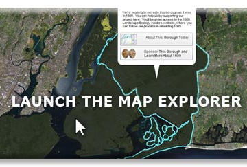

The Welikia Project » Welikia Map

The Welikia Project » Welikia Map

https://welikia.org/explore/mannahatta-map/

Welcome to New York City, 1609 Have you ever wondered what New York was like before it was a city? Find out here, by navigating through the map of the city in 1609. You can find your block, explore the native landscape of today’s famous landmarks, research the flora and fauna block by block, and help our team continue to rediscover 1609. Launch the application below. “The goal of the Mannahatta Project has never been to return Manhattan to its primeval state. The goal of the project is discover something new about a place we all know so well, whether we live in New York or see it on television, and, through that discovery, to alter our way of life. New York does not lack for dystopian visions of the future…. But what is the vision of the future that works? Might it lie in Mannahatta, the green heart of New York, and with a new start to history, a few hours before Hudson arrived that sunny afternoon four hundred years ago?”