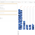

The What-If Tool: Code-Free Probing of Machine Learning Models

The What-If Tool: Code-Free Probing of Machine Learning Models

https://ai.googleblog.com/2018/09/the-what-if-tool-code-free-probing-of.html

Posted by James Wexler, Software Engineer, Google AI Building effective machine learning (ML) systems means asking a lot of questions. It'...