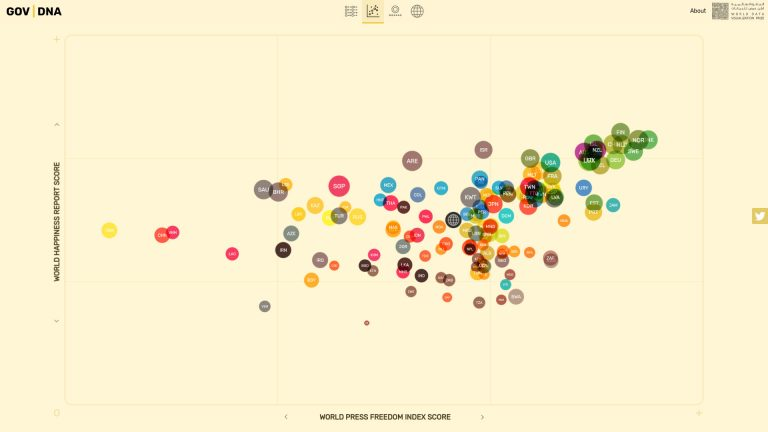
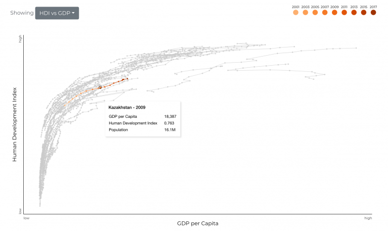
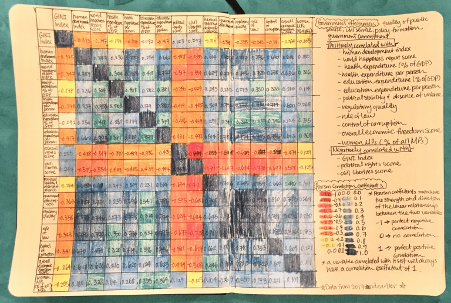
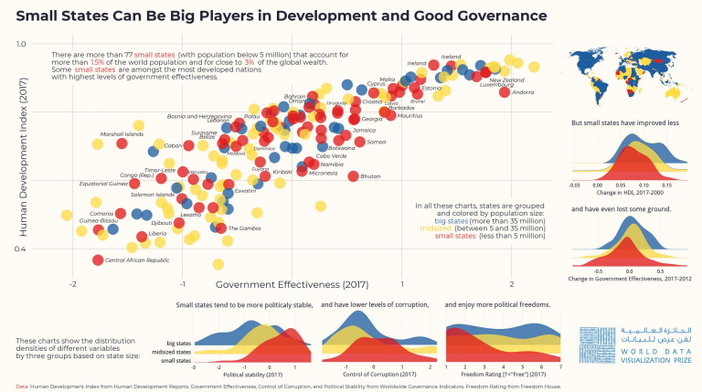
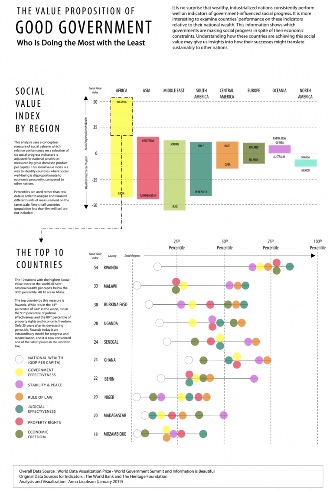
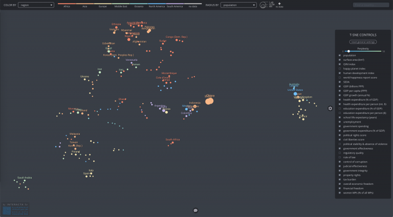

The Winners of the World Data Visualization Prize — Information is Beautiful

11 Feb 2019

# The Winners of the World Data Visualization Prize

The results are in. After combing through hundreds of impressive, insightful and creative entries, we’ve decided on the winners of the [World Data Visualization Prize 2019](https://wdvp.worldgovernmentsummit.org/).

Conducted in partnership with the [World Government Summit](https://www.worldgovernmentsummit.org/), the prize focuses on how governments are improving citizens’ lives. We asked entrants to use the power of data-visualization to illuminate data on the innovations and decisions – seen and unseen – that drive progress.

Scroll through the interactive, static and hand-drawn “napkin” category winners to see who took the grand prize of $25,000.

* * *

## **Interactive**

### Winner – $6,000

[**GOV | DNA**](https://govdna.frontwise.com/)

This beautiful interactive graphic shows the “DNA” of good government. You can compare multiple indicators to investigate their influence on countries, and share your findings with others.

By [Werner Helmich](http://www.wernerhelmich.nl/)

### Runner Up – $3,000

[**Mapamundi**](https://christian-parsons.com/mapamundi-wdvp/)

We had so many great interactive entries that we’ve chosen two runners-up. The first uses artificial intelligence techniques to cluster countries together based on different indicators, creating a new world map.

By [Christian Parsons](https://christian-parsons.com/)

### Runner Up – $3,000

[**Good Governments Help People Succeed **](http://vallandingham.me/world_gov_challenge/)

The second of our two runners-up in the interactive category takes a nuanced, analytical look at the quality of government, through the lens of social well-being and enablement of individual progress.

By [Jim Vallandingham](http://vallandingham.me/world_gov_challenge/)

* * *

## **Napkin**

### Winner – $1,500

**What Makes The Government Effective?**

This colourful chart shows the correlations between different development indices.

 *By Eileen Huang*

### Runner Up – $750

**Worst of the Best, and Best of the Worst

 **This graphic asks what the richest countries are bad at, and what the poorest countries are good at.

 *By *[*Rasagy Sharma*](https://twitter.com/rasagy)

* * *

## **Static**

### Winner – $3,000

**Small States can be Big Players in Development and Good Governance

 **Using our Small Countries are Beautiful dataset, this infographic shows how government effectiveness correlates with different development indices, as well as illustrating how small countries tend to be more politically stable and free, and less corrupt.

 *By [Dimiter Toshkov](http://dimiter.eu/)*

### Runner Up – $1,500

**The Value Proposition of Good Government

 **By normalising for national wealth, this graphic shows the countries in the world that are doing the most impressive work with the least resources.

 *By [Anna Jacobson](https://twitter.com/AnnaChingChing)*

* * *

## Grand Prize Winner – $25,000

[**An Alternative, Data-Driven, Country Map**](https://projects.interacta.io/country-tsne/)

This dazzling, winning entry from Nikita Rokotyan uses artificial intelligence and machine learning to find previously-unseen connections and harmonies between different countries. It uses an AI technique called [t-SNE](https://lvdmaaten.github.io/tsne/) to discover clusters of nations that are related by happiness score, health expenditure, investment in education and many other variables. It then presents these patterns visually, creating an interactiv e world map that we can explore, tweak and filter to find unexpected pairings and insights. It uses design, code and artificial intelligence to bring data and statistics to life.

 *By [Interacta](https://interacta.io/) – Nikita Rokotyan, Olya Stukova and Dasha Kolmakova*

* * *

A big thankyou to our judges, who agonised over the decision-making process – **[Stefanie Posavec](https://twitter.com/stefpos)** of [*Dear Data*](http://www.dear-data.com/) fame, [**Alberto Cairo**](https://twitter.com/albertocairo), author of [*The Truthful Art*](http://www.thefunctionalart.com/p/the-truthful-art-book.html) and [*The Functional Art*](http://www.thefunctionalart.com/p/about-book.html), **Patrick Burgoyne**, editor of design magazine [*Creative Review*](https://twitter.com/CreativeReview), [**Alexandra Mousavizadeh**](https://twitter.com/IndexAlexandra), director of the [Legatum Prosperity Index](https://www.prosperity.com/), and Information is Beautiful founder **[David McCandless](https://twitter.com/infobeautiful)**.

Thanks also to everyone who entered. We were seriously impressed by the diversity and incredible creativity shown by the entries. We’ll be showcasing a wider selection of entries in the coming week. Keep an eye out for future dataviz competitions that we run, and consider submitting your work to the [Information is Beautiful Awards 2019](https://www.informationisbeautifulawards.com/), which will launch later this year.

[← Previous Post](https://informationisbeautiful.net/2019/four-minute-brexit-visual-video-explainer/)

[Next Post →](https://informationisbeautiful.net/2019/how-truthful-is-the-bohemian-rhapsody-movie/)