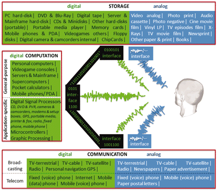
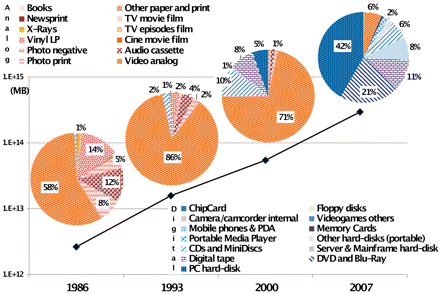
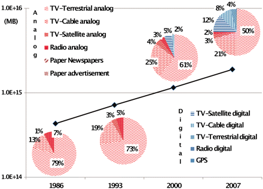
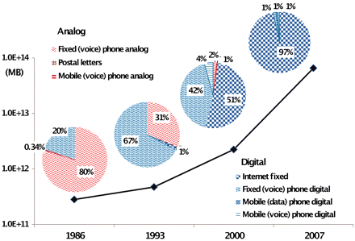
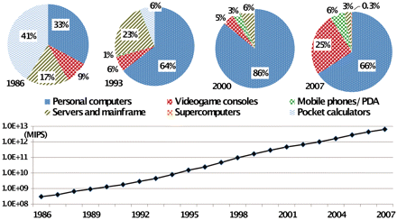
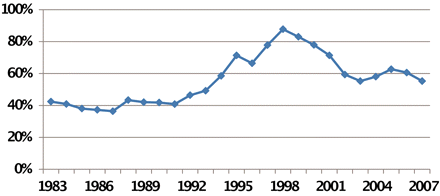

The World’s Technological Capacity to Store, Communicate, and Compute Information | Science

Research Article

#

The World’s Technological Capacity to Store, Communicate, and Compute Information

1. Martin Hilbert[1](http://science.sciencemag.org/content/332/6025/60.full#aff-1),[*](http://science.sciencemag.org/content/332/6025/60.full#corresp-1),

2. Priscila López[2](http://science.sciencemag.org/content/332/6025/60.full#aff-2)

 **+** See all authors and affiliations

 Science  01 Apr 2011:
Vol. 332, Issue 6025, pp. 60-65
DOI: 10.1126/science.1200970
.

- [Article](http://science.sciencemag.org/content/332/6025/60)
- [Figures & Data](http://science.sciencemag.org/content/332/6025/60/tab-figures-data)
- [Info & Metrics](http://science.sciencemag.org/content/332/6025/60/tab-article-info)
- [eLetters](http://science.sciencemag.org/content/332/6025/60/tab-e-letters)
- [** PDF](http://science.sciencemag.org/content/332/6025/60/tab-pdf)

## Abstract

We estimated the world’s technological capacity to store, communicate, and compute information, tracking 60 analog and digital technologies during the period from 1986 to 2007. In 2007, humankind was able to store 2.9 × 1020 optimally compressed bytes, communicate almost 2 × 1021 bytes, and carry out 6.4 × 1018 instructions per second on general-purpose computers. General-purpose computing capacity grew at an annual rate of 58%. The world’s capacity for bidirectional telecommunication grew at 28% per year, closely followed by the increase in globally stored information (23%). Humankind’s capacity for unidirectional information diffusion through broadcasting channels has experienced comparatively modest annual growth (6%). Telecommunication has been dominated by digital technologies since 1990 (99.9% in digital format in 2007), and the majority of our technological memory has been in digital format since the early 2000s (94% digital in 2007).

Leading social scientists have recognized that we are living through an age in which “the generation of wealth, the exercise of power, and the creation of cultural codes came to depend on the technological capacity of societies and individuals, with information technologies as the core of this capacity” ([*1*](http://science.sciencemag.org/content/332/6025/60.full#ref-1)). Despite this insight, most evaluations of society’s technological capacity to handle information are based on either qualitative assessments or indirect approximations, such as the stock of installed devices or the economic value of related products and services ([*2*](http://science.sciencemag.org/content/332/6025/60.full#ref-2)–[*9*](http://science.sciencemag.org/content/332/6025/60.full#ref-9)).

**Previous work.** Some pioneering studies have taken a more direct approach to quantify the amount of information that society processes with its information and communication technologies (ICTs). After pioneering work in Japan ([*10*](http://science.sciencemag.org/content/332/6025/60.full#ref-10)), Pool ([*11*](http://science.sciencemag.org/content/332/6025/60.full#ref-11)) estimated the growth trends of the “amount of words” transmitted by 17 major communications media in the United States from 1960 to 1977. This study was the first to show empirically the declining relevance of print media with respect to electronic media. In 1997, Lesk ([*12*](http://science.sciencemag.org/content/332/6025/60.full#ref-12)) asked, “How much information is there in the world?” and presented a brief outline on how to go about estimating the global information storage capacity. A group of researchers at the University of California at Berkeley took up the measurement challenge between 2000 and 2003 ([*13*](http://science.sciencemag.org/content/332/6025/60.full#ref-13)). Their focus on “uniquely created” information resulted in the conclusion that “most of the total volume of new information flows is derived from the volume of voice telephone traffic, most of which is unique content” (97%); because broadcasted television and most information storage mainly consists of duplicate information, these omnipresent categories contributed relatively little. A storage company hired a private sector research firm [International Data Corporation (IDC)] to estimate the global hardware capacity of digital ICT for the years 2007–2008 ([*14*](http://science.sciencemag.org/content/332/6025/60.full#ref-14)). For digital storage, IDC estimates that in 2007 “all the empty or usable space on hard drives, tapes, CDs, DVDs, and memory (volatile and nonvolatile) in the market equaled 264 exabytes” ([*14*](http://science.sciencemag.org/content/332/6025/60.full#ref-14)). During 2008, an industry and university collaboration explicitly focused on information consumption ([*15*](http://science.sciencemag.org/content/332/6025/60.full#ref-15)) measured in hardware capacity, words, and hours. The results are highly reliant on media time-budget studies, which estimate how many hours people interact with a media device. The result obtained with this methodology was that computer games and movies represent 99.2% of the total amount of data “consumed.”

**Scope of our exercise.** To reconcile these different results, we focused on the world’s technological capacity to handle information. We do not account for uniqueness of information because it is very difficult to differentiate between truly new and merely recombined, duplicate information. Instead, we assume that all information has some relevance for some individual. Aside from the traditional focus on the transmission through space (communication) and time (storage), we also considered the computation of information. We defined storage as the maintenance of information over a considerable amount of time for explicit later retrieval and estimated the installed (available) capacity. We did not consider volatile storage in the respective inventory (such as RAM) because the ultimate end of volatile memory is computation, not storage per se. Communication was defined as the amount of information that is effectively received or sent by the user while being transmitted over a considerable distance (outside the local area). This includes those transmissions whose main purpose consists in the overcoming of distances, not the local sharing of information (such as the distribution of copies at a meeting, or communication through private local area networks). We took inventory of the effective communication capacity (the actual amount of bits transmitted). We defined computation as the meaningful transformation of information and estimated the installed (available) capacity.

More precisely, as shown in [Fig. 1](http://science.sciencemag.org/content/332/6025/60.full#F1), we distinguished among storage of information in bits, unidirectional diffusion through broadcasting in bits per second, bidirectional telecommunication in bits per second, computation of information by general purpose computers in instructions per second [or MIPS, million (or mega) instructions per second], and the estimated computational capacity of a selected sample of application-specific devices (MIPS). Whereas previous studies tracked some two or three dozen categories of ICT over three consecutive years at most, our study encompasses worldwide estimates for 60 categories (21 analog and 39 digital) and spans over two decades (1986–2007).

- [**  Download high-res image](https://d2ufo47lrtsv5s.cloudfront.net/content/sci/332/6025/60/F1.large.jpg?download=true)
- [**  Open in new tab](https://d2ufo47lrtsv5s.cloudfront.net/content/sci/332/6025/60/F1.large.jpg)
- [**  Download Powerpoint](http://science.sciencemag.org/highwire/powerpoint/641683)

 Fig. 1
The three basic information operations and their most prominent technologies.

We obtained the technological capacity by multiplying the number of installed technological devices with their respective performances. All estimates are yearly averages, but we adjusted for the fact that the installed technological stock of a given year is the result of an accumulation process of previous years, whereas each year’s technologies contribute with different performance rates. We used 1120 sources and explain our assumptions in detail in ([*16*](http://science.sciencemag.org/content/332/6025/60.full#ref-16)). The statistics we rely on include databases from international organizations [such as ([*17*](http://science.sciencemag.org/content/332/6025/60.full#ref-17)–[*22*](http://science.sciencemag.org/content/332/6025/60.full#ref-22))], historical inventories from individuals for commercial or academic purposes [such as ([*23*](http://science.sciencemag.org/content/332/6025/60.full#ref-23)–[*26*](http://science.sciencemag.org/content/332/6025/60.full#ref-26))], publicly available statistics from private research firms [such as ([*27*](http://science.sciencemag.org/content/332/6025/60.full#ref-27), [*28*](http://science.sciencemag.org/content/332/6025/60.full#ref-28))], as well as a myriad of sales and product specifications from equipment producers. We filled in occasional blanks with either linear or exponential interpolations, depending on the nature of the process in question. Frequently, we compared diverse sources for the same phenomena and strove for reasonable middle grounds in case of contradictions. In cases in which specific country data were not available, we aimed for a globally balanced outlook by creating at least two international profiles, one for the “developed” member countries of the Organisation for Economic Co-operation and Development (OECD) and another one for the rest of the world.

**Information, not hardware with redundant data.** Although the estimation of the global hardware capacity for information storage and communication is of interest for the ICT industry ([*14*](http://science.sciencemag.org/content/332/6025/60.full#ref-14)), we are more interested in the amount of information that is handled by this hardware. Therefore, we converted the data contained in storage and communication hardware capacity into informational bits by normalizing on compression rates. This addresses the fact that information sources have different degrees of redundancy. The redundancy (or predictability) of the source is primarily determined by the content in question, such as text, images, audio, or video ([*29*](http://science.sciencemag.org/content/332/6025/60.full#ref-29), [*30*](http://science.sciencemag.org/content/332/6025/60.full#ref-30)). Considering the kind of content, we measured information as if all redundancy were removed with the most efficient compression algorithms available in 2007 (we call this level of compression “optimally compressed”). Shannon ([*29*](http://science.sciencemag.org/content/332/6025/60.full#ref-29)) showed that the uttermost compression of information approximates the entropy of the source, which unambiguously quantifies the amount of information contained in the message. In an information theoretic sense ([*30*](http://science.sciencemag.org/content/332/6025/60.full#ref-30)), information is defined as the opposite of uncertainty. Shannon ([*29*](http://science.sciencemag.org/content/332/6025/60.full#ref-29)) defined one bit as the amount of information that reduces uncertainty by half (regarding a given probability space, such as letters from an alphabet or pixels from a color scale). This definition is independent of the specific task or content. For example, after normalization on optimally compressed bits we can say things like “a 6-cm2 newspaper image is worth a 1000 words” because both require the same average number of binary yes/no decisions to resolve the same amount of uncertainty.

Normalization on compression rates is essential for comparing the informational performance of analog and digital technologies. It is also indispensable for obtaining meaningful time series of digital technologies because more efficient compression algorithms enable us to handle more information with the same amount of hardware. For example, we estimated that a hard disk with a hardware performance of 1 MB for video storage was holding the equivalent of 1 optimally compressed MB in 2007 (“optimally compressed” with MPEG-4) but only 0.45 optimally compressed MB in 2000 (compressed with MPEG-1), 0.33 in 1993 (compressed with cinepack), and merely 0.017 optimally compressed MB in 1986 (supposing that no compression algorithms were used). Given that statistics on the most commonly used compression algorithms are scarce, we limited our estimations of information storage and communication to the years 1986, 1993, 2000 and 2007 [([*16*](http://science.sciencemag.org/content/332/6025/60.full#ref-16)), section B, Compression].

Conventionally, bits are abbreviated with a small “b” (such as in kilobits per second: kbps) and bytes (equal to 8 bits) with a capital “B” (such as in megabyte: MB). Standard decimal prefixes are used: kilo- (103), mega- (106), giga- (109), tera- (1012), peta- (1015), exa- (1018), and zetta- (1021).

**Storage.** We estimated how much information could possibly have been stored by the 12 most widely used families of analog storage technologies and the 13 most prominent families of digital memory, from paper-based advertisement to the memory chips installed on a credit card ([Fig. 2](http://science.sciencemag.org/content/332/6025/60.full#F2)). The total amount of information grew from 2.6 optimally compressed exabytes in 1986 to 15.8 in 1993, over 54.5 in 2000, and to 295 optimally compressed exabytes in 2007. This is equivalent to less than one 730-MB CD-ROM per person in 1986 (539 MB per person), roughly 4 CD-ROM per person of 1993, 12 CD-ROM per person in the year 2000, and almost 61 CD-ROM per person in 2007. Piling up the imagined 404 billion CD-ROM from 2007 would create a stack from the earth to the moon and a quarter of this distance beyond (with 1.2 mm thickness per CD).

- [**  Download high-res image](https://d2ufo47lrtsv5s.cloudfront.net/content/sci/332/6025/60/F2.large.jpg?download=true)
- [**  Open in new tab](https://d2ufo47lrtsv5s.cloudfront.net/content/sci/332/6025/60/F2.large.jpg)
- [**  Download Powerpoint](http://science.sciencemag.org/highwire/powerpoint/641686)

 Fig. 2

World’s technological installed capacity to store information (table SA1) ([*16*](http://science.sciencemag.org/content/332/6025/60.full#ref-16)).

Our estimate is larger than the previously cited hardware estimate from IDC for the same year (IDC estimates 264 exabytes of digital hardware, not normalized for compression, whereas we counted 276 optimally compressed exabytes on digital devices, which occupy 363 exabytes of digital hardware) ([*14*](http://science.sciencemag.org/content/332/6025/60.full#ref-14)). Although our study is more comprehensive, we are not in a position to fully analyze all differences because IDC’s methodological assumptions and statistics are based on inaccessible and proprietary company sources.

Before the digital revolution, the amount of stored information was dominated by the bits stored in analog videotapes, such as VHS cassettes ([Fig. 2](http://science.sciencemag.org/content/332/6025/60.full#F2)). In 1986, vinyl long-play records still made up a considerable part (14%), as did analog audio cassettes (12%) and photography (5% and 8%). It was not until the year 2000 that digital storage made a notable contribution to our technological memory, contributing 25% of the total in 2000. Hard disks make up the lion share of storage in 2007 (52% in total), optical storage contributed more than a quarter (28%), and digital tape roughly 11%. Paper-based storage solutions captured a decreasing share of the total (0.33% in 1986 and 0.007% in 2007), even though their capacity was steadily increasing in absolute terms (from 8.7 to 19.4 optimally compressed petabytes).

**Communication.** We divided the world’s technological communication capacity into two broad groups: One includes technological systems that provide only unidirectional downstream capacity to diffuse information (referred to as broadcasting), and one provides bidirectional upstream and downstream channels (telecommunication). The ongoing technological convergence between broadcasting and telecommunication is blurring this distinction, as exemplified by the case of digital television, which we counted as broadcasting even though it incorporates a small but existent upstream channel (such as video-on-demand).

The inventories of [Figs. 3](http://science.sciencemag.org/content/332/6025/60.full#F3) and [4](http://science.sciencemag.org/content/332/6025/60.full#F4) account for only those bits that are actually communicated. In the case of telecommunication, the sum of the effective usages of all users is quite similar to the total installed capacity (any difference represents an over- or future investment). This is because most backbone networks are shared and only used sporadically by an individual user. If all users demanded their promised bandwidth simultaneously, the network would collapse. This is not the case for individual broadcast subscribers, who could continuously receive incoming information. To meaningfully compare the carrying capacities of each, we applied effective consumption rates to the installed capacity of broadcasting (calling it the effective capacity). This reduced the installed capacity by a stable factor (by 9 in 1986, 9.1 in 1993, 8.7 in 2000, and 8.4 in 2007), implying an average individual broadcast consumption of roughly 2 hours and 45 min per 24 hours. It did not notably change the relative distribution of the diverse technologies ([Fig. 3](http://science.sciencemag.org/content/332/6025/60.full#F3)).

- [**  Download high-res image](https://d2ufo47lrtsv5s.cloudfront.net/content/sci/332/6025/60/F3.large.jpg?download=true)
- [**  Open in new tab](https://d2ufo47lrtsv5s.cloudfront.net/content/sci/332/6025/60/F3.large.jpg)
- [**  Download Powerpoint](http://science.sciencemag.org/highwire/powerpoint/641688)

 Fig. 3

World’s technological effective capacity to broadcast information in optimally compressed megabytes MB per year, for 1986, 1993, 2000, and 2007; semi-logarithmic plot (table SA2) ([*16*](http://science.sciencemag.org/content/332/6025/60.full#ref-16)).

- [**  Download high-res image](https://d2ufo47lrtsv5s.cloudfront.net/content/sci/332/6025/60/F4.large.jpg?download=true)
- [**  Open in new tab](https://d2ufo47lrtsv5s.cloudfront.net/content/sci/332/6025/60/F4.large.jpg)
- [**  Download Powerpoint](http://science.sciencemag.org/highwire/powerpoint/641690)

 Fig. 4

World’s technological effective capacity to telecommunicate information (table SA2) ([*16*](http://science.sciencemag.org/content/332/6025/60.full#ref-16)).

[Figure 3](http://science.sciencemag.org/content/332/6025/60.full#F3) displays the capacity of six analog and five digital broadcast technologies, including newspapers and personal navigation devices [global postioning system (GPS)]. In 1986, the world’s technological receivers picked up around 432 exabytes of optimally compressed information, 715 optimally compressed exabytes in 1993, 1.2 optimally compressed zettabytes in 2000, and 1.9 optimally compressed zettabytes in 2007. Cable and satellite TV steadily gained importance, but analog, “over-the-air” terrestrial television still dominated the evolutionary trajectory. Digital satellite television led the pack into the digital age, receiving 50% of all digital broadcast signals in 2007. Only a quarter of all broadcasting information was in digital format in 2007. The share of radio declined gradually from 7.2% in 1986 to 2.2% in 2007.

[Figure 4](http://science.sciencemag.org/content/332/6025/60.full#F4) presents effective capacity of the three most common bidirectional analog telecommunication technologies and their four most prominent digital heirs. The 281 petabytes of optimally compressed information from 1986 were overwhelmingly dominated by fixed line telephony, whereas postal letters contributed only 0.34%. The year 1993 was characterized by the digitization of the fixed phone network (471 optimally compressed petabytes). We estimate the year 1990 to be the turning point from analog to digital supremacy. The Internet revolution began shortly after the year 2000. In only 7 years, the introduction of broadband Internet effectively multiplied the world’s telecommunication capacity by a factor of 29, from 2.2 optimally compressed exabytes in 2000 to 65 in 2007. The most widespread telecommunication technology was the mobile phone, with 3.4 billion devices in 2007 (versus 1.2 billion fixed-line phones and 0.6 billion Internet subscriptions). Nevertheless, the fixed-line phone is still the solution of choice for voice communication (1.5% of the total). The mobile phone network became increasingly dominated by data traffic in 2007 (1.1% for mobile data versus 0.8% for mobile voice).

When compared with broadcasting, telecommunications makes up a modest but rapidly growing part of the global communications landscape (3.3% of the sum in 2007, up from 0.07% in 1986). Although there are only 8% more broadcast devices in the world than telecommunication equipment (6.66 billion versus 6.15 billion in 2007), the average broadcasting device communicates 27 times more information per day than the average telecommunications gadget. This result might be unexpected, especially considering the omnipresence of the Internet, but can be understood when considering that an average Internet subscription effectively uses its full bandwidth for only around 9 min per day (during an average 1 hour and 36 min daily session).

**Computation.** From a theoretical standpoint, a “computation” is the repeated transmission of information through space (communication) and time (storage), guided by an algorithmic procedure ([*31*](http://science.sciencemag.org/content/332/6025/60.full#ref-31)). The problem is that the applied algorithmic procedure influences the overall performance of a computer, both in terms of hardware design and in terms of the contributions of software. As a result, the theoretical, methodological, and statistical bases for our estimates for computation are less solid than the ones for storage and communication. In contrast to Shannon’s bit ([*29*](http://science.sciencemag.org/content/332/6025/60.full#ref-29), [*30*](http://science.sciencemag.org/content/332/6025/60.full#ref-30)), there is no generally accepted theory that provides us with an ultimate performance measure for computers. There are several ways to measure computational hardware performance. We chose MIPS as our hardware performance metric, which was imposed on us by the reality of available statistics. Regarding the contributions of software, it would theoretically be possible to normalize the resulting hardware capacity for algorithmic efficiency (such as measured with O-notation) ([*32*](http://science.sciencemag.org/content/332/6025/60.full#ref-32)). This would recognize the constant progress of algorithms, which continuously make more efficient use of existing hardware. However, the weighted contribution of each algorithm would require statistics on respective execution intensities of diverse algorithms on different computational devices. We are not aware of such statistics. As a result of these limitations, our estimates refer to the installed hardware capacity of computers.

We distinguished between two broad groups of computers. The first group includes all computers whose functionality is directly guided by their human users. We call this group “general-purpose computers” and include six technological families ([Fig. 5](http://science.sciencemag.org/content/332/6025/60.full#F5)). The second group carries out automated computations that are incidental to the primary task, such as in electronic appliances or visual interfaces. The user may have a range of predefined choices regarding their functionality but cannot change the automated logic of these embedded systems. We call this group “application-specific computers.”

- [**  Download high-res image](https://d2ufo47lrtsv5s.cloudfront.net/content/sci/332/6025/60/F5.large.jpg?download=true)
- [**  Open in new tab](https://d2ufo47lrtsv5s.cloudfront.net/content/sci/332/6025/60/F5.large.jpg)
- [**  Download Powerpoint](http://science.sciencemag.org/highwire/powerpoint/641692)

 Fig. 5

World’s technological installed capacity to compute information on general-purpose computers, in MIPS (table SA3) ([*16*](http://science.sciencemag.org/content/332/6025/60.full#ref-16)).

Although general-purpose computers are also equipped with application-specific parts (for example, mobile phones come with digital signal processors, and PCs contain microcontroller units), we only include the capacity of humanly guidable microprocessors in the respective inventory. The calculator laid the cornerstone for modern microprocessors and was still the dominant way to compute information in 1986 (41% of 3.0 × 108 general-purpose MIPS). The landscape changed quickly during the early 1990s as personal computers and servers and mainframe computers pushed the evolutionary trajectory to 4.4 × 109 MIPS. The personal computer extended its dominance during the year 2000 (86% of a total of 2.9 1011 MIPS), to be rivaled in 2007 by videogame consoles (1.6 × 1012 MIPS, or 25% of the total of 6.4 × 1012 MIPS) and increasingly relevant mobile phones (3.7 × 1011 MIPS, or 6% of the 2007 total). Nowadays, clusters of videogame consoles are occasionally used as supercomputer substitutes for scientific purposes and other data-intensive computational tasks ([*33*](http://science.sciencemag.org/content/332/6025/60.full#ref-33)). The relatively small role of supercomputers (less than 0.5% throughout) and professional servers and mainframes might come as a surprise. It can partially be explained by the fact that the inventory of [Fig. 5](http://science.sciencemag.org/content/332/6025/60.full#F5) presents the installed capacity, independent of effective usage rates. We also carried out some estimations on the basis of the effective gross usage of the computers, which considers the time users interact with computers (not the net computational time). As a result, we get between 5.8 and 9.1% of the installed capacity (table SA4) ([*16*](http://science.sciencemag.org/content/332/6025/60.full#ref-16)). With this setup, the share of servers and mainframes grew to 89% in 1986 and 11% in 2007, and supercomputers contributed 4% to the effective capacity in 2007.

The data also allows us to look at respective growth rates. Until the early 1990s, the annual growth rate was quite stable at roughly 40% ([Fig. 6](http://science.sciencemag.org/content/332/6025/60.full#F6)). The 1990s show outstanding growth, reaching a peak of 88% in 1998. Since then, the technological progress has slowed. In recent times, every new year allows humankind to carry out roughly 60% of the computations that could have possibly been executed by all existing general-purpose computers before that year.

- [**  Download high-res image](https://d2ufo47lrtsv5s.cloudfront.net/content/sci/332/6025/60/F6.large.jpg?download=true)
- [**  Open in new tab](https://d2ufo47lrtsv5s.cloudfront.net/content/sci/332/6025/60/F6.large.jpg)
- [**  Download Powerpoint](http://science.sciencemag.org/highwire/powerpoint/641694)

 Fig. 6

Annual growth of installed general-purpose computational capacity as percentage of all previous computations since 1977 (year *t* / Σ[1977, year *t* – 1]) (table SA2) ([*16*](http://science.sciencemag.org/content/332/6025/60.full#ref-16)).

Our inventory of application-specific computations is the least complete one. The entire group of application-specific computers is very large and diverse (for example, dice cups and roulette wheels are application-specific, analog, random-number generators), and it is often not straightforward to translate their performance into MIPS. The main goal of our inventory of this group was to show that the computational hardware capacity of application-specific computers is larger than the computational capacity of general-purpose computers (table SA3) ([*16*](http://science.sciencemag.org/content/332/6025/60.full#ref-16)). To achieve this, we focused on a sample that includes three prominent groups: digital signal processors (DSPs), which translate between analog and digital signals (including CD, DVD, and PVR devices; cameras and camcorders; modems and setup boxes; GPS; portable media; printer and fax; radio; and fixed-line and mobile phones); microcontrollers (MCUs) (which regulate electronics and appliances); and graphic processing units (GPUs) (an increasingly powerful microprocessor for visual displays). Although microcontrollers dominated our sample of application-specific computing support in 1986 (90% of the 4.3 × 108 application-specific MIPS from our sample), graphic processing units clearly made up the lion’s share in 2007 (97% of 1.9 × 1014 MIPS).

**Comparisons and growth rates.** The world’s technological capacity to compute information has by far experienced the highest growth ([Table 1](http://science.sciencemag.org/content/332/6025/60.full#T1)). The per capita capacity of our sample of application-specific machine mediators grew with a compound annual growth rate (CAGR) of 83% between 1986 and 2007, and humanly guided general-purpose computers grew at 58% per year. The world’s technological capacity to telecommunicate only grew half as fast (CAGR of 28%). This might seem a little surprising because the advancement of telecommunications, and especially the Internet, is often celebrated as the epitome of the digital revolution. The results from [Table 1](http://science.sciencemag.org/content/332/6025/60.full#T1) challenge this idea and move the world’s ability to compute information into the spotlight. The storage of information in vast technological memories has experienced a growth rate almost similar to telecommunication (CAGR of 23% per capita over two decades). The lower growth rate results from the relatively high base level provided by prevalent analog storage devices. The main characteristic of the storage trajectory is the digitalization of previously analog information (from 0.8% digital in 1986 to 94% in 2007). The global capacity to broadcast information has experienced the least progress at 6% CAGR per capita. Broadcasting is also the only information operation that is still dominated by analog ICT. As a result, the capacity to store information has grown at a much faster rate than that of the combined growth rate of tele- and broadcast communication. In 1986, it would have been possible to fill the global storage capacity with the help of all effectively used communication technologies in roughly 2.2 days (539/241.16). In 1993, it would have taken almost 8 days; in the year 2000, it would take roughly 2.5 weeks; and in 2007, almost 8 weeks would be required.

Table 1

Evolution of the world’s capacity to store, communicate, and compute information, absolute per capita, CARG, and percentage in digital format (tables SA1 to SA3 and SA5) ([*16*](http://science.sciencemag.org/content/332/6025/60.full#ref-16)).

View this table:

- [View popup](http://science.sciencemag.org/highwire/markup/641696/expansion?width=1000&height=500&iframe=true&postprocessors=highwire_figures%2Chighwire_math%2Chighwire_embed)
- [View inline](http://science.sciencemag.org/content/332/6025/60.full)

The CAGRs represent the temporal average of periods that were experiencing different patterns of technological change. General-purpose computation had its peak growth around the turn of the millennia ([Fig. 6](http://science.sciencemag.org/content/332/6025/60.full#F6)). Storage capacity slowed down around the year 2000, but accelerated growth has been occurring in recent years (CAGR of 27% for 1986–1993, 18% for 1993–2000, and 26% for 2000–2007) ([Table 1](http://science.sciencemag.org/content/332/6025/60.full#T1)). The introduction of broadband has led to a continuous acceleration of telecommunication (CAGR of 6% for 1986–1993, 23% for 1993–2000, and 60% for 2000–2007) ([Table 1](http://science.sciencemag.org/content/332/6025/60.full#T1)), whereas broadcasting had a relatively stable rate of change (CAGRs of 5.7%, 5.6%, and 6.1% for 1986–1993, 1993–2000, and 2000–2007, respectively) ([Table 1](http://science.sciencemag.org/content/332/6025/60.full#T1)).

The growth rates also allow us to look at the application of Moore’s laws ([*34*](http://science.sciencemag.org/content/332/6025/60.full#ref-34)) for the technological information processing capacity of humankind. Machines’ application-specific capacity to compute information per capita has roughly doubled every 14 months over the past decades in our sample, whereas the per capita capacity of the world’s general-purpose computers has doubled every 18 months. The global telecommunication capacity per capita doubled every 34 months, whereas the world’s storage capacity per capita required roughly 40 months. Per capita broadcast information has doubled roughly every 12.3 years. Of course, such averages disguise the varying nature of technological innovation avenues ([*35*](http://science.sciencemag.org/content/332/6025/60.full#ref-35)).

**Perspectives.** To put our findings in perspective, the 6.4 × 1018 instructions per second that humankind can carry out on its general-purpose computers in 2007 are in the same ballpark area as the maximum number of nerve impulses executed by one human brain per second (1017) ([*36*](http://science.sciencemag.org/content/332/6025/60.full#ref-36)). The 2.4 × 1021 bits stored by humanity in all of its technological devices in 2007 is approaching an order of magnitude of the roughly 1023 bits stored in the DNA of a human adult ([*37*](http://science.sciencemag.org/content/332/6025/60.full#ref-37)), but it is still minuscule as compared with the 1090 bits stored in the observable universe ([*38*](http://science.sciencemag.org/content/332/6025/60.full#ref-38)). However, in contrast to natural information processing, the world’s technological information processing capacities are quickly growing at clearly exponential rates.

## Supporting Online Material

[www.sciencemag.org/cgi/content/full/science.1200970/DC1](http://www.sciencemag.org/cgi/content/full/science.1200970/DC1)

Materials and Methods
Figs. SA1 to SE12
Tables SA1 to SE24
References and Notes

## References and Notes

1. [↵](http://science.sciencemag.org/content/332/6025/60.full#xref-ref-1-1)

M. Castells, *End of Millennium, The Information Age: Economy, Society and Culture,* vol. III (Wiley-Blackwell, Malden, MA, 2000).

2. [↵](http://science.sciencemag.org/content/332/6025/60.full#xref-ref-2-1)

D. Bell, *The Coming of Post-Industrial Society: A Venture in Social Forecasting* (Basic Books, New York, NY, 1973).

3. M. U. Porat, “The Information Economy: Definition and Measurement” (1977); available at [www.eric.ed.gov/ERICWebPortal/contentdelivery/servlet/ERICServlet?accno=ED142205](http://www.eric.ed.gov/ERICWebPortal/contentdelivery/servlet/ERICServlet?accno=ED142205).

4. Y. Masuda, *The Information Society as Post-Industrial Society* (Transaction Publishers, Piscataway, NJ, 1980).

5.
    1.   C.  Perez

, Structural change and assimilation of new technologies in the economic and social systems. Futures  15, 357 (1983).

[CrossRef](http://science.sciencemag.org/lookup/external-ref?access_num=10.1016/0016-3287(83)90050-2&link_type=DOI)[Web of Science](http://science.sciencemag.org/lookup/external-ref?access_num=A1983RP74300004&link_type=ISI)[Google Scholar](http://science.sciencemag.org/lookup/google-scholar?link_type=googlescholar&gs_type=article&author[0]=C.+Perez&title=Structural+change+and+assimilation+of+new+technologies+in+the+economic+and+social+systems&publication_year=1983&journal=Futures&volume=15)

6. T. Forester, *The Information Technology Revolution* (MIT Press, Cambridge, MA, 1985).

7. C. Freeman, F. Louçã, *As Time Goes By: From the Industrial Revolutions to the Information Revolution* (Oxford Univ. Press, New York, 2002).

8. M. Castells, *The Rise of the Network Society: The Information Age: Economy, Society, and Culture*, vol. I (Wiley-Blackwell, Malden, MA, 2009).

9. [↵](http://science.sciencemag.org/content/332/6025/60.full#xref-ref-9-1)

E. Brynjolfsson, A. Saunders, *Wired for Innovation: How Information Technology is Reshaping the Economy* (MIT Press, Cambridge, MA, 2009).

10. [↵](http://science.sciencemag.org/content/332/6025/60.full#xref-ref-10-1)
    1.   Y.  Ito

, The Johoka Shakai approach to the study of communication in Japan. Mass Commun. Rev. Yearbook  2, 671 (1981).

[Google Scholar](http://science.sciencemag.org/lookup/google-scholar?link_type=googlescholar&gs_type=article&author[0]=Y.+Ito&title=The+Johoka+Shakai+approach+to+the+study+of+communication+in+Japan&publication_year=1981&journal=Mass+Commun.+Rev.+Yearbook&volume=2)

11. [↵](http://science.sciencemag.org/content/332/6025/60.full#xref-ref-11-1)
    1.   I. D. S.  Pool
, Tracking the flow of information. Science  221, 609 (1983).

[Abstract/FREE Full Text](http://science.sciencemag.org/lookup/ijlink?linkType=ABST&journalCode=sci&resid=221/4611/609&atom=%2Fsci%2F332%2F6025%2F60.atom)[Google Scholar](http://science.sciencemag.org/lookup/google-scholar?link_type=googlescholar&gs_type=article&author[0]=I.%20D.%20S.+Pool&title=Tracking+the+flow+of+information&publication_year=1983&journal=Science&volume=221)

12. [↵](http://science.sciencemag.org/content/332/6025/60.full#xref-ref-12-1)

M. Lesk, “How Much Information Is There In the World?” (1997); available at [www.lesk.com/mlesk/ksg97/ksg.html](http://www.lesk.com/mlesk/ksg97/ksg.html).

13. [↵](http://science.sciencemag.org/content/332/6025/60.full#xref-ref-13-1)

P. Lyman *et al*., “How Much Information? 2003” (Univ. California at Berkeley, Berkeley, CA, 2003); available at [www2.sims.berkeley.edu/research/projects/how-much-info-2003/](http://www2.sims.berkeley.edu/research/projects/how-much-info-2003/).

14. [↵](http://science.sciencemag.org/content/332/6025/60.full#xref-ref-14-1)

J. Gantz *et al*., “The Diverse and Exploding Digital Universe: An Updated Forecast of Worldwide Information Growth Through 2011” (IDC sponsored by EMC, Framingham, 2008); available at [www.emc.com/leadership/digital-universe/expanding-digital-universe.htm](http://www.emc.com/leadership/digital-universe/expanding-digital-universe.htm).

15. [↵](http://science.sciencemag.org/content/332/6025/60.full#xref-ref-15-1)

R. Bohn, J. Short, “How Much Information? 2009 Report on American Consumers” (Global Information Industry Center of University of California, San Diego, San Diego, CA, 2009); available at http://hmi.ucsd.edu/howmuchinfo.php.

16. [↵](http://science.sciencemag.org/content/332/6025/60.full#xref-ref-16-1)Materials and methods are available as supporting material on *Science* Online.

17. [↵](http://science.sciencemag.org/content/332/6025/60.full#xref-ref-17-1)

International Telecommunications Union (ITU), “World Telecommunication/ICT Indicators Database” (ITU, Geneva, 2010); available at [www.itu.int/ITU-D/ict/statistics/](http://www.itu.int/ITU-D/ict/statistics/).

18. Faostat, *ForesSTAT* (Food and Agriculture Organization of the United Nations, 2010); available at http://faostat.fao.org/.

19. Universal Postal Union (UPU), *Postal Statistics* (UPU, Berne, Switzerland, 2007); available at [www.upu.int/en/resources/postal-statistics/](http://www.upu.int/en/resources/postal-statistics/).

20. International Federation of the Phonographic Industry (IFPI), “The Recording Industry World Sales 1995–2004”; available at [www.ifpi.org/content/section_statistics/index.html](http://www.ifpi.org/content/section_statistics/index.html).

21. Japanese Recording-Media Industries Association, “Press Releases” (2007); available at [www.jria.org/english.html.](http://www.jria.org/english.html)

22. [↵](http://science.sciencemag.org/content/332/6025/60.full#xref-ref-22-1)

TOP500, “TOP500 List Releases” (TOP500 Supercomputer sites, 2009); available at [www.top500.org/lists](http://www.top500.org/lists).

23. [↵](http://science.sciencemag.org/content/332/6025/60.full#xref-ref-23-1)

J. Porter, “Disk/Trend Reports 1977–1999” (California, 2005); available at [www.disktrend.com/](http://www.disktrend.com/).

24. R. Longbottom, “Computer Speed Claims 1980 to 1996” (Roy Longbottom’s PC Benchmark collection, 2006); available at [www.roylongbottom.org.uk/mips.htm](http://www.roylongbottom.org.uk/mips.htm).

25. J. McCallum, in “The Computer Engineering Handbook,” V. G. Oklobdzija, Ed. (CRC, Boca Raton, FL, 2002), pp. 136–153.

26. [↵](http://science.sciencemag.org/content/332/6025/60.full#xref-ref-26-1)

T. Coughlin, “Digital Storage Technology Newsletters” (Coughlin Associates, Atascadero, CA, 2007); available at [www.tomcoughlin.com/](http://www.tomcoughlin.com/).

27. [↵](http://science.sciencemag.org/content/332/6025/60.full#xref-ref-27-1)

Global Technology Team, “Technology Q1 2006 Global Technology Data Book” (Morgan Stanley, New York, 2006); available at [www.morganstanley.com/institutional/techresearch/pdfs/global_techdatabook0306.pdf](http://www.morganstanley.com/institutional/techresearch/pdfs/global_techdatabook0306.pdf).

28. [↵](http://science.sciencemag.org/content/332/6025/60.full#xref-ref-28-1)

International Data Corporation (IDC), IDC Media Center (2008); available at [www.idc.com/about/press.jsp](http://www.idc.com/about/press.jsp).

29. [↵](http://science.sciencemag.org/content/332/6025/60.full#xref-ref-29-1)

C. Shannon, A mathematical theory of communication. *Bell Syst. Tech. J.*  **27**, 379–423 and 623–656 (1948).

30. [↵](http://science.sciencemag.org/content/332/6025/60.full#xref-ref-30-1)

T. M. Cover, J. A. Thomas, *Elements of Information Theory* (Wiley-Interscience, Hoboken, NJ, 2006).

31. [↵](http://science.sciencemag.org/content/332/6025/60.full#xref-ref-31-1)

A. M. Turing, On computable numbers, with an application to the entscheidungsproblem. *Proc. London Math. Soc.*  **s2**, 230 (1937).

32. [↵](http://science.sciencemag.org/content/332/6025/60.full#xref-ref-32-1)

T. Cormen, C. Leiserson, R. Rivest, C. Stein, *Introduction to Algorithms* (McGraw-Hill, Boston, 2003).

33. [↵](http://science.sciencemag.org/content/332/6025/60.full#xref-ref-33-1)

B. Gardiner, *Wired Mag.* “Astrophysicist Replaces Supercomputer with Eight Playstation 3s” available at http://www.wired.com/techbiz/it/news/2007/10/ps3_supercomputer (2007).

34. [↵](http://science.sciencemag.org/content/332/6025/60.full#xref-ref-34-1)Moore’s law measures technological progress of computer performance by counting the numbers of transistors on an integrated circuit, which has approximately doubled every 2 years since the 1960s ([*39*](http://science.sciencemag.org/content/332/6025/60.full#ref-39)).

35. [↵](http://science.sciencemag.org/content/332/6025/60.full#xref-ref-35-1)
    1.   D.  Sahal
, Technological guideposts and innovation avenues. Res. Policy  14, 61 (1985).

[CrossRef](http://science.sciencemag.org/lookup/external-ref?access_num=10.1016/0048-7333(85)90015-0&link_type=DOI)[Web of Science](http://science.sciencemag.org/lookup/external-ref?access_num=A1985ANG7800001&link_type=ISI)[Google Scholar](http://science.sciencemag.org/lookup/google-scholar?link_type=googlescholar&gs_type=article&author[0]=D.+Sahal&title=Technological+guideposts+and+innovation+avenues&publication_year=1985&journal=Res.+Policy&volume=14)

36. [↵](http://science.sciencemag.org/content/332/6025/60.full#xref-ref-36-1)This is assuming 100 billion neurons × 1000 connections per neuron × maximum 1000 nerve impulses per second.

37. [↵](http://science.sciencemag.org/content/332/6025/60.full#xref-ref-37-1)This is considering a quaternary DNA alphabet, in which each base pair can store 4 bits × 3 billion DNA base pairs per human cell × 60 trillion cells per adult human. Because base pair couples are determined, the 4 bits can be compressed to 2 bits, which can optimally be compressed to 1.73 inside one cell ([*40*](http://science.sciencemag.org/content/332/6025/60.full#ref-40)).

38. [↵](http://science.sciencemag.org/content/332/6025/60.full#xref-ref-38-1)
    1.   S.  Lloyd
, Computational capacity of the universe. Phys. Rev. Lett.  88, 237901 (2002).

[CrossRef](http://science.sciencemag.org/lookup/external-ref?access_num=10.1103/PhysRevLett.88.237901&link_type=DOI)[PubMed](http://science.sciencemag.org/lookup/external-ref?access_num=12059399&link_type=MED&atom=%2Fsci%2F332%2F6025%2F60.atom)[Google Scholar](http://science.sciencemag.org/lookup/google-scholar?link_type=googlescholar&gs_type=article&author[0]=S.+Lloyd&title=Computational+capacity+of+the+universe&publication_year=2002&journal=Phys.+Rev.+Lett.&volume=88)

39. [↵](http://science.sciencemag.org/content/332/6025/60.full#xref-ref-39-1)
    1.   G. E.  Moore
, Lithography and the future of Moore’s law. Proc. SPIE  2439, 2 (1995).

[CrossRef](http://science.sciencemag.org/lookup/external-ref?access_num=10.1117/12.209195&link_type=DOI)[Google Scholar](http://science.sciencemag.org/lookup/google-scholar?link_type=googlescholar&gs_type=article&author[0]=G.%20E.+Moore&title=Lithography+and+the+future+of+Moore%E2%80%99s+law&publication_year=1995&journal=Proc.+SPIE&volume=2439)

40. [↵](http://science.sciencemag.org/content/332/6025/60.full#xref-ref-40-1)
    1.   X.  Chen,
    2.   M.  Li,
    3.   B.  Ma,
    4.   J.  Tromp

, DNACompress: Fast and effective DNA sequence compression. Bioinformatics  18, 1696 (2002).

[Abstract/FREE Full Text](http://science.sciencemag.org/lookup/ijlink?linkType=ABST&journalCode=bioinfo&resid=18/12/1696&atom=%2Fsci%2F332%2F6025%2F60.atom)[Google Scholar](http://science.sciencemag.org/lookup/google-scholar?link_type=googlescholar&gs_type=article&author[0]=X.+Chen&author[1]=M.+Li&author[2]=B.+Ma&author[3]=J.+Tromp&title=DNACompress:+Fast+and+effective+DNA+sequence+compression&publication_year=2002&journal=Bioinformatics&volume=18)

41. We thank the Information Society Program of United Nations ECLAC (in Chile) for its support; T. Coughlin, J. McCallum, D. Franz, M. Gonzalez, C. Vasquez, L. Adleman, M. Castells, and the statisticians from UPU (Universal Post Union) and ITU (International Telecommunications Union); as well as numerous colleagues who motivated us by doubting the feasibility of this undertaking.

[View Abstract](http://science.sciencemag.org/content/332/6025/60.abstract)

.