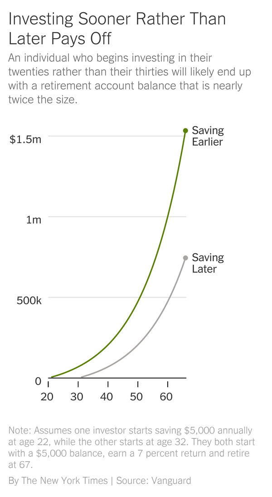

The Young Person’s Guide to Investing - The New York Times

# The Young Person’s Guide to InvestingThe Young Person’s Guide to Investing

Narrowing down all the options and figuring out where to turn can be paralyzing. We’ve got you covered.

Credit...Jocelyn Tsaih

By [Tara Siegel Bernard](https://www.nytimes.com/by/tara-siegel-bernard)

- Published Feb. 10, 2020Updated Feb. 13, 2020

-

    - 
    - 
    - [](https://www.nytimes.com/2020/02/10/smarter-living/the-young-persons-guide-to-investing.htmlmailto:?subject=NYTimes.com%3A%20The%20Young%20Person%E2%80%99s%20Guide%20to%20Investing&body=From%20The%20New%20York%20Times%3A%0A%0AThe%20Young%20Person%E2%80%99s%20Guide%20to%20Investing%0A%0ANarrowing%20down%20all%20the%20options%20and%20figuring%20out%20where%20to%20turn%20can%20be%20paralyzing.%20We%E2%80%99ve%20got%20you%20covered.%0A%0Ahttps%3A%2F%2Fwww.nytimes.com%2F2020%2F02%2F10%2Fsmarter-living%2Fthe-young-persons-guide-to-investing.html)

    -
    -
Investing doesn’t have to be that complicated.

But when you’re just starting out, it can be hard to knock it off your to-do list because you have so many competing demands — a budding career, rent and student debt, to name just a few. You also need at least some basic knowledge, which probably wasn’t covered in any of your classes in high school or college.

The good news: There are more attractive options for entry-level investors than ever before. Many mutual funds cost just fractions of pennies for every dollar you invest, and some firms are dangling them for free. Even getting advice from professionals is easier than it was for previous generations. And after you go through the motions once, you can set your plan on autopilot for a while.

But narrowing down all the alternatives and figuring out where to turn? That can be paralyzing.

This guide can help — consider it your road map to investing.

##   Before investing

There are a couple of items you want to deal with first: preparing for a [financial emergency](https://www.nytimes.com/2019/10/25/your-money/emergency-savings.html) and creating a plan to attack any high-cost debt you might have.

Building a financial cushion will help soften the blow should your money situation change, whether that’s because of the loss of a job or because of a giant unexpected expense. Most financial planners suggest keeping at least three to six months of living expenses in cash — to cover the basics like rent, food, utilities, loan payments, student loans, etc. — in a traditional bank account that’s backed by the Federal Deposit Insurance Corporation. That means your savings are insured by the federal government, up to [certain limits](https://www.fdic.gov/deposit/deposits/brochures/deposit-insurance-at-a-glance-english.html), if the bank fails.

You can find the best interest rates at [online banks](https://www.bankrate.com/banking/savings/rates/), and the easiest way to get started is to set up regular, automatic transfers from your checking account. (Capital One 360, for example, lets you set up different savings accounts, which you can label for different purposes — emergency fund, annual vacation and so on).

If you have really high-cost debt — like credit card debt — you want to deal with that before investing significant amounts of money. If you’re earning 7 or 8 percent over the long term in the stock market but paying 15 percent on a card, you’re better off tackling the debt first.

That logic doesn’t necessarily apply to your student loans. Depending on the type of person you are — maybe you detest debt or like to tackle one big task at a time — it might *feel* better to pay down your loans first. But there’s a strong case to be made to both [invest and pay down your loans simultaneously](https://www.nytimes.com/2014/06/14/your-money/student-loans/paying-off-student-loans-can-cost-you-in-retirement.html), if you can. (People with piles of high-cost student debt [should seek help](https://www.nytimes.com/2019/10/13/your-money/student-loans-income-repayment.html).)

## Editors’ Picks

[### Never Mind the Internet. Here’s What’s Killing Malls.](https://www.nytimes.com/2020/02/13/business/not-internet-really-killing-malls.html?algo=bandit-story_desk_filter&fellback=false&imp_id=855463177&imp_id=533263764)

[### An Army Doctor’s First Loss of the Vietnam War: The Woman He Loved](https://www.nytimes.com/2020/02/13/magazine/army-doctor-vietnam-war.html?algo=bandit-story_desk_filter&fellback=false&imp_id=201696514&imp_id=631978101)

[### What I Spent to Adopt My Child](https://www.nytimes.com/2020/02/11/parenting/adoption-costs.html?algo=bandit-story_desk_filter&fellback=false&imp_id=918378027&imp_id=213925495)

[Continue reading the main story](https://www.nytimes.com/2020/02/10/smarter-living/the-young-persons-guide-to-investing.html?action=click&module=editorContent&pgtype=Article&region=CompanionColumn&contentCollection=Trending#after-pp_edpick)

 [ PAID POST: The Macallan](https://adclick.g.doubleclick.net/pcs/click?xai=AKAOjsuZyIdRgPOt83Bb7Uk0_yG-9kYp9hvcIm6ZPYzVsf00JYGJGXBok87OagRpJMYj9mJWXc5vsDK5ek69tqNb8crXWugWpayimCF-R0gsvalv5lL7_VUiGtqMocMK8nhC9mKpUz3OlvDR54Y51VAoQetu3oAWkDsKcCZWTVbw1wdo6YMq2Je9MJA6RjpQ194j_CWkQ-_6C3wzi3kNQzPr51-9EgvF62yUxKcvGd-c4y7pOaNk_q4ZQuYzCkNwOeKuuRzOUwKC0VMP&sig=Cg0ArKJSzIB-7LvSmzRNEAE&urlfix=1&adurl=https://www.nytimes.com/paidpost/the-macallan/a-recipe-for-bold-decision-making.html%3Fcpv_ap_id%3D50031612%26sr_source%3Dlift_ed%26tbs_nyt%3D2020-Feb-nytnative_ed)[ Discover the Decisions that Changed Chef Judy Joo’s Life](https://adclick.g.doubleclick.net/pcs/click?xai=AKAOjsuZyIdRgPOt83Bb7Uk0_yG-9kYp9hvcIm6ZPYzVsf00JYGJGXBok87OagRpJMYj9mJWXc5vsDK5ek69tqNb8crXWugWpayimCF-R0gsvalv5lL7_VUiGtqMocMK8nhC9mKpUz3OlvDR54Y51VAoQetu3oAWkDsKcCZWTVbw1wdo6YMq2Je9MJA6RjpQ194j_CWkQ-_6C3wzi3kNQzPr51-9EgvF62yUxKcvGd-c4y7pOaNk_q4ZQuYzCkNwOeKuuRzOUwKC0VMP&sig=Cg0ArKJSzIB-7LvSmzRNEAE&urlfix=1&adurl=https://www.nytimes.com/paidpost/the-macallan/a-recipe-for-bold-decision-making.html%3Fcpv_ap_id%3D50031612%26sr_source%3Dlift_ed%26tbs_nyt%3D2020-Feb-nytnative_ed)

Investing early and often puts you at a huge advantage, thanks to the magic of compounding numbers, which is illustrated below. Need we say more?

Image

##   How much to save and invest, and where?

So you have some money to invest or are working and want to set up a plan for your long-term goals. Many financial experts recommend saving at least 12 to 15 percent of your salary to achieve a secure retirement, and others suggest even more.

But even 10 percent might seem like a laughable notion at this stage. There are ways to inch closer to that goal, however, without doing all of the savings on your own.

Much of how you get there will depend on whether you have access to a retirement plan through your employer, typically a 401(k) at for-profit organizations and often 403(b) plans at nonprofits.

If you do, then much of the hard work is done for you. Employers must vet and assemble the plan’s menu of investment options. On top of that, you contribute money that hasn’t yet been taxed, so it lowers your tax bill. The money then grows tax-free over time, and you pay tax on the money when it’s withdrawn in retirement.

The best part? Some employers will also provide a matching contribution for your savings. They might match every dollar you contribute, say, up to 4 percent of your salary. That matching money is a guaranteed return, regardless of what the stock market is doing. Save as much as you can to grab all of that free money.

*[Like what you’re reading? *[*Sign up here*](https://www.nytimes.com/newsletters/smarter-living?module=inline)* for the Smarter Living newsletter to get stories like this (and much more!) delivered straight to your inbox every Monday morning.]*

Then, each subsequent year, you might crank up your savings by one percentage point (some plans have tools that can automate this), so within a few years you will be closer to that respectable goal of 10 percent of your salary (which includes what your employer kicks in).

Just remember: Not all [employer-provided plans](https://www.nytimes.com/guides/business/saving-money-for-retirement) are good ones. Some are downright awful, [stuffed with high-cost, low-quality investments](https://www.nytimes.com/2016/11/06/your-money/403b-retirement-plans.html). How do you know whether your plan is a winner? The costs you pay for the plan are typically a telltale sign — and paying too much can cost you tens of thousands of dollars, if not more, over the course of your career.

“If you see a bunch of funds that are charging more than 1 percent a year, that is a red flag,” said Christine Benz, director of personal finance at the investment research firm [Morningstar](https://www.morningstar.com/), referring to investments that charge more than 1 percent of your total money invested. You can also ask human resources (or the person coordinating the plan) to see a copy of the summary plan description, which should list any other administrative fees that aren’t immediately obvious. ([BrightScope](https://www.brightscope.com/ratings/) also has a tool that ranks thousands of plans.)

If you’re in a high-cost plan, save enough to get any company match, but consider investing anything extra into another type of account.

For younger people, [Roth I.R.A.](https://www.irs.gov/retirement-plans/roth-iras)s are often the preferable choice. That’s because you deposit money that has already been taxed, and you’re probably in a lower tax bracket now than you will be later in life when you’re earning more. In contrast, with a [traditional I.R.A](https://humbledollar.com/money-guide/tax-deductible-vs-roth-accounts/)., investors get a tax deduction now, but pay taxes when the money is withdrawn. Your Roth I.R.A. balance is what you will actually have to spend; in a traditional I.R.A., it will be reduced by the amount of tax you will owe later.

Another upside to a Roth: In an emergency, you can withdraw contributions — but not any investment earnings — without penalty. (Not that you want to do that!) However, there are [income ceilings](https://www.irs.gov/retirement-plans/amount-of-roth-ira-contributions-that-you-can-make-for-2019) that determine who can contribute, as well as other rules around withdrawals.

For a more comprehensive look at the various other types of plans, including traditional I.R.A.s, read our [retirement guide here](https://www.nytimes.com/guides/business/saving-money-for-retirement).

##   Why you should use index funds

Resist the temptation to use the latest slick app promoting its ability to invest in single stocks or cryptocurrencies. You want to do the opposite: Own a collection of cheap and boring mutual funds that invest in different kinds of stocks from all over the world, with a helping of safe [bond funds](https://www.investopedia.com/terms/b/bondfund.asp) to cushion the inevitable swings of the stock market. That way, if anything goes wrong with a particular stock or sector of the market — say, technology or [emerging markets](https://www.nytimes.com/2018/05/23/business/emerging-markets-investors.html) — you’ve hedged your bets.

Some mutual funds are run by professional stock pickers [who try to beat](https://www.nytimes.com/2014/07/20/your-money/who-routinely-trounces-the-stock-market-try-2-out-of-2862-funds.html) the broader market’s performance, but [very few succeed](https://www.nytimes.com/2015/03/15/your-money/how-many-mutual-funds-routinely-rout-the-market-zero.html)consistently [over long periods](https://www.nytimes.com/2015/04/05/your-money/measure-for-measure-index-funds-rule.html) of time.

That’s why you’re better off in what’s called an index fund, whose investments simply mirror big sections of the stock market — the S&P 500 Index, for example, tracks the 500 largest publicly traded companies in the United States.

Another reason index funds often do better? They’re incredibly cheap.

Personal Finance Week

Welcome to **Personal Finance Week** at Smarter Living! Catch up on our previous stories in this series.

[ 3 Simple Things You Can Do Today to Improve Your Finances Feb. 9, 2020  ](https://www.nytimes.com/2020/02/09/smarter-living/tips-to-save-more-money.html?action=click&module=RelatedLinks&pgtype=Article)

[ The Best Way to Use a Credit Card? Treat It Like Cash. Feb. 11, 2020  ](https://www.nytimes.com/2020/02/11/smarter-living/how-to-use-credit-cards.html?action=click&module=RelatedLinks&pgtype=Article)

[ 3 Ways to Retrain Your Mind to Get Out of Credit Card Debt Feb. 12, 2020  ](https://www.nytimes.com/2020/02/12/smarter-living/how-to-get-out-of-credit-card-debt.html?action=click&module=RelatedLinks&pgtype=Article)

[ Dear Mom and Dad: Are Your Finances Ready for Retirement? Feb. 13, 2020  ](https://www.nytimes.com/2020/02/13/smarter-living/parents-retirement-planning.html?action=click&module=RelatedLinks&pgtype=Article)

Investors paid an average cost — known as the [expense ratio](https://investor.vanguard.com/expense-ratio/) — of 0.48 percent of their assets, meaning 48 cents for every $100 invested, for mutual funds and exchange-traded funds in 2018, according to a [Morningstar study](https://www.morningstar.com/blog/2019/04/30/us-fund-fee-study.html). That’s down from 0.51 percent in 2017. (Exchange-traded funds, or E.T.F.s, are similar to index funds, but trade on an exchange like stocks. For most investors, the difference between a mutual fund and an E.T.F. is negligible. Since many providers have [waived trading commissions](https://www.nytimes.com/2019/10/01/your-money/charles-schwab-free-trades.html) on E.T.F.s, the ultimate decision on which to invest in might come down to whichever has the lowest expense ratio. But if you’re investing in a regular taxable brokerage account, E.T.F.’s might be preferable because they are more tax efficient, experts said.)

Funds that are actively managed by human pros often cost 1 percent of your assets annually or more — that’s $1 or more for every $100 invested.

That might not seem like a lot, but consider that index [funds](https://fundresearch.fidelity.com/mutual-funds/summary/315911693)  [that track](https://www.schwab.com/public/schwab/investing/investment_help/investment_research/mutual_fund_research/mutual_funds.html?&&path=%2Fprospect%2Fresearch%2Fmutualfunds%2Fsummary.asp%3Fsymbol%3Dswtsx) the [entire stock](https://investor.vanguard.com/mutual-funds/profile/VTSAX) market can be had for mere pennies for every $100 invested. Fidelity has gone even further — it [offers](https://fundresearch.fidelity.com/mutual-funds/summary/31635T708)  [four](https://fundresearch.fidelity.com/mutual-funds/summary/31635T609)[index](https://fundresearch.fidelity.com/mutual-funds/summary/315911636)  [funds](https://fundresearch.fidelity.com/mutual-funds/summary/315911628) that are free and do not require any minimum investment (More on [that here.](https://www.nytimes.com/2018/08/10/business/fidelity-mutual-funds-fees.html))

Advertisement

[Continue reading the main story](https://www.nytimes.com/2020/02/10/smarter-living/the-young-persons-guide-to-investing.html#after-story-ad-5)

Paying rock-bottom prices can add many tens of thousand of dollars, or more, to your balance over the course of your career.

##   Picking the right mix of investments

One of the more important decisions you will make — besides how much you pay for investments — is how you decide to [divvy up your investments](https://momanddadmoney.com/asset-allocation/) among stock, bond and other funds, something known as your asset allocation.

Younger people can generally afford to take more risks and invest more heavily in stocks — which have the potential to generate more growth over time — because they have many working years ahead of them. If the market tanks, their portfolio has time to recover.

But how much you ultimately decide to dedicate to stocks overall should also depend on the strength of your stomach to tolerate market swings.

One way to figure this out is to ask yourself a question: The stock market tumbled nearly 50 percent during the Great Recession. If you had most of your money in stocks at that point, how would you have reacted?

If the answer is, “I probably would’ve sold more stocks,” well, that means you probably had too much to begin with. Then you’ll need to figure out when to get back into the market — and you will most likely be wrong. You want an allocation that will allow you to stay the course, even if it’s a bumpy ride. But if you’re too conservative, you’ll have to save more because your portfolio probably won’t grow as fast.

Also consider the following: An investment portfolio evenly divided between stocks and bonds would have lost nearly 29 percent of its value in the Great Recession, but it would have taken only about a year to recover, according to an analysis by Vanguard. A portfolio that was 100 percent stocks — and lost about 55 percent — would have taken about three years to recoup its losses.

Advertisement

[Continue reading the main story](https://www.nytimes.com/2020/02/10/smarter-living/the-young-persons-guide-to-investing.html#after-story-ad-6)

So how do you figure out what stock-bond mixture will work for your situation? One type of mutual fund, known as a target-date fund, does that job for you.

You pick a fund based on the year you hope to retire — so if you’re 40 years from retirement, you’d chose the 2060 retirement fund. As that date draws closer, its mix of investments slowly becomes more conservative.

A couple of 2060 funds — including [Fidelity](https://nb.fidelity.com/public/workplacefunds/view-all/2776)’s and [Vanguard](https://investor.vanguard.com/mutual-funds/profile/VTTSX)’s — now allocate about 90 percent of their portfolios to stock index funds (with roughly 55 percent in United States stocks and 35 in international) and the remainder in bonds. [Schwab’s](https://www.schwabfunds.com/public/csim/home/products/mutual_funds/summary.html?symbol=SWYNX) version is a bit more aggressive: it has 95 percent of assets in stock funds. Be sure to look under the hood so you know what’s inside: When markets plummeted in 2008 to 2009, many target-date funds with the same [target date had returns that varied widely](https://www.nytimes.com/2009/06/29/your-money/mutual-funds-and-etfs/29target.html).

Another benefit of target-date funds: If you put all of your retirement money into one fund, you won’t have to worry about routine portfolio maintenance known as [rebalancing](https://www.nytimes.com/2012/03/24/your-money/its-time-to-rebalance-the-investment-portfolio-your-money.html). That’s when investors sell investments that have ballooned beyond their initial target (of, say, 90 percent in stocks) and reinvest the proceeds into the side of the portfolio that has shrunk, relatively speaking.

Other services, known as roboadvisers, can also do much of this work for you. More on those in a minute.

##   Saving for goals besides retirement

Shorter-term goals — buying a condo or a car or saving for a wedding — generally require a [less risky approach](https://momanddadmoney.com/how-to-invest-differently-for-short-medium-and-long-term-goals/).

If you’ll need to use the money in three years or less — say, for an emergency fund or a vacation — the answer is easy: Shuttle your savings into a high-yield savings account each month, one with a competitive interest rate, said [Matt Becker](https://momanddadmoney.com/about/), a certified financial planner in Florida. With such a short time frame, the amount of money you save is more important than any return you may earn — and you don’t want to risk losing anything.

Advertisement

[Continue reading the main story](https://www.nytimes.com/2020/02/10/smarter-living/the-young-persons-guide-to-investing.html#after-story-ad-7)

If your goal is anywhere from three to 10 years away, you might take more of a hybrid strategy. If you want to buy a home in five years but can be a little flexible on timing, you might invest one half in a savings account and the remainder in a fund balanced between stocks and bonds.

“A good rule of thumb is to expect that in any given year you could lose half of whatever money you have in the stock market,” Mr. Becker said. “Of course, you would also expect to [recover that over time](http://jlcollinsnh.com/2012/04/19/stocks-part-ii-the-market-always-goes-up/), but over shorter time periods that may be harder to do.”

If you want to buy a home in five years from now or longer and know you’ll need at least $60,000, he said you might put half of your monthly savings into a savings account or a [certificate of deposit](https://www.investopedia.com/terms/c/certificateofdeposit.asp), while the other half goes into a taxable brokerage account that holds something like [Vanguard’s LifeStrategy Moderate Growth Fund](https://investor.vanguard.com/mutual-funds/lifestrategy/#/mini/overview/0914), which is 60 percent stocks and 40 percent bonds. That means you’d have about 30 percent of your money in stocks — in other words, 15 percent of your savings could vaporize in a down market. For absolutely certainty your money will be there by a certain date, use a high-yield savings account.

##   Where should I go to get started?

Outside of a solid employer-sponsored retirement plan, the best place to get started is at one of the brokerages where you can gain access to index funds with ease — [Fidelity](https://www.nytimes.com/2018/08/10/business/fidelity-mutual-funds-fees.html), [Schwab](https://www.nytimes.com/2019/11/29/your-money/free-stock-trading.html)and Vanguard all provide solid options for entry-level investors, for example, depending on your personal preferences.

You might also consider a [so-called roboadviser](https://www.nytimes.com/2018/09/07/business/roboadvisers-financial-planning-betterment.html), which will ask you a series of questions before formulating an [automated investment plan for a specific goal.](https://www.nytimes.com/2018/09/07/your-money/online-financial-advice.html) Several of them also offer help from human advisers for an extra fee.

The Robo Report, which tracks and analyzes roboadvisers, ranked [Betterment](https://www.betterment.com/) as its top pick for entry-level investors.

“Their platform is intuitive and simple, has a $0 minimum balance and has a high-interest savings account for cash reserves,” said Ken Schapiro, president at Backend Benchmarking, which publishes The [Robo Report](https://www.backendbenchmarking.com/robo-ranking/). “They have strong online features, and a client can easily graduate from their digital-only service to their service with live advisers as their needs grow.”

Advertisement

[Continue reading the main story](https://www.nytimes.com/2020/02/10/smarter-living/the-young-persons-guide-to-investing.html#after-story-ad-8)

Many discount brokerages now also offer robo-type services of their own, but they have [different strategies](https://www.nytimes.com/2015/03/06/business/schwabs-service-for-investors-seeking-thrifty-advice-raises-eyebrows.html); it pays to compare them before you decide on [any one](https://www.nytimes.com/2019/11/29/your-money/free-stock-trading.html).

Professional help can also be found for less money these days, though it will obviously cost more than a robot adviser.

A warm-blooded professional may be worth it, particularly if you’re having trouble getting your debt under control or need more hand-holding with a specific issue.

But you’ll need to find someone who is truly working in your best interest and not lining their pockets at your expense.

To increase your chances of finding someone like that, ask if they are [acting as a fiduciary](https://www.nytimes.com/2019/06/06/your-money/sec-broker-rules.html). The pros most likely to be fiduciaries are “certified financial planners” who are also “registered investment advisers.” Then, you probably want to find one of these individuals who charge you an hourly rate for their time or another type of flat fee; you want to avoid financial advisers who only earn money when they sell you a product.

Here’s where to find them: [XY Planning Network](https://www.xyplanningnetwork.com/); [Garrett Planning Network](https://garrettplanningnetwork.com/); [The National Association of Personal Financial Advisors](https://www.napfa.org/).

But most younger investors really don’t need all that much help. If your situation is relatively simple and you’re just looking to become more knowledgeable about money and investing, there are [plenty of materials](https://www.morningstar.com/start-investing) that can provide a solid foundation: “[I Will Teach You to Be Rich, Second Edition](https://www.iwillteachyoutoberich.com/),” by Ramit Sethi; “[If You Can](https://www.nytimes.com/2014/05/04/your-money/a-path-to-retirement-for-those-far-from-it.html),” by William Bernstein; “[Broke Millennial Takes On Investing](https://brokemillennial.com/),” by Erin Lowry; and anything by [John Bogle](https://www.amazon.com/Little-Book-Common-Sense-Investing/dp/0470102101) or [Helaine](http://helaineolen.com/books/pound-foolish/)  [Olen](https://www.indiebound.org/book/9781591846796).

Advertisement

[Continue reading the main story](https://www.nytimes.com/2020/02/10/smarter-living/the-young-persons-guide-to-investing.html#after-bottom)