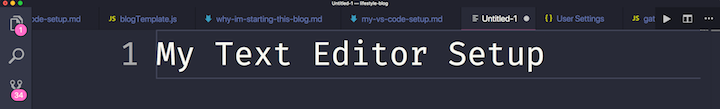
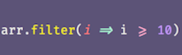

The Zen of Programming

# My Visual Studio Code Setup

#### 2018-07-17

I *love* the text editor setup I've been using for the past year and a half, so I want to show off my setup! Visual Studio Code has far surpassed my experiences with Atom, Spyder, Sublime Text, Emacs, and Idle (the built-in Python editor) which I used for the years before it. I thought I would do a quick write up on my setup and the extensions I love!

## Theme

Since I teach people how to code professionally and give a lot of talks on programming, having a readable theme is super important to me. I also love to have a theme that I enjoy aesthetically, so usually something with a lot of girly colors.

Those criteria being set, my two absolute favorite themes are [Fairy Floss](https://marketplace.visualstudio.com/items?itemName=nopjmp.fairyfloss) and [Dracula](https://draculatheme.com/visual-studio-code/).

#### Fairy Floss

#### Dracula

## Font

I am a long-term FiraCode loyalist (pre-dating VS Code!); I like the ligatures that make my code more readable at a glance. [It's pretty easy to set up too, which is really nice!](https://github.com/tonsky/FiraCode/wiki/VS-Code-Instructions)

## Save Configuration

Another key piece of my setup is my save configuration. The first thing that I love is autosave, which you can turn on via the `file` drop-down. I have it further configured so that whenever I pause when writing code, my code is saved automatically without me doing anything. I cannot explain how helpful this is for live coding and for beginners.

	// in settings.json
	"files.autoSave": "afterDelay",
	"files.autoSaveDelay": 100,

In the same vein, I have [Prettier](https://github.com/prettier/prettier-vscode) set up to format my code on `cmd + s`. Ideally, this would run automatically as well, but it is close enough for now. I used [StandardJS](https://github.com/standard/vscode-standardjs) to do the same for a while, before moving over to a pro-semi-colon client.

	// in settings.json
	"editor.formatOnSave": true,

I use two spaces for most language indentation, the only exception is Python, where I use four spaces by default.

	// in settings.json
	"[python]": {
	    "editor.insertSpaces": true,
	    "editor.tabSize": 4
	},

## Emmet

I am incredibly reliant on [Emmet](https://emmet.io/), so I love that it is built in for VS Code. I also have it set up to work in more than just my html files:

	// in settings.json
	"emmet.includeLanguages": {
	  "html": "html",
	  "erb": "erb",
	  "javascript": "javascriptreact",
	  "vue": "html",
	  "ejs": "html"
	},

## Integrated Terminal

I will write a longer post on my terminal set up at some point, but I use ITerm with ZShell on my Mac, and so I have VS Code's integrated terminal set up to use that setup.

	// in settings.json
	"terminal.external.osxExec": "iTerm.app",
	"terminal.integrated.shell.osx": "zsh",

## Extensions

I have a lot of language and framework-specific extensions built-in, which are boring and very dependent on the developer, so I will skip over those in order to discuss some of my favorite all-purpose extensions.

1. [VS Live Share](https://marketplace.visualstudio.com/items?itemName=MS-vsliveshare.vsliveshare) - this extension is straight up magical, and I truly believe it will change code education and pair programming in the near future. It allows developers to Google Doc-style collaborate on the same file on different computers. You can even open up access to your localhost ports across machines and share terminal sessions. There are some bugs, especially on Windows machines, but it's so cool that it doesn't even matter!

2. [Code Spell Checker](https://marketplace.visualstudio.com/items?itemName=streetsidesoftware.code-spell-checker) - I write a lot of Markdown and page content directly in my text editor, and I definitely have some spelling issues. I love this extension for underlining my mistakes and offering suggestions, even when I'm offline.

3. [Import Cost](https://marketplace.visualstudio.com/items?itemName=wix.vscode-import-cost) - this one is more a "nice to have" rather than a necessary, but it shows the size of the npm packages I am importing in my projects.

4. [HTMLHint](https://marketplace.visualstudio.com/items?itemName=mkaufman.HTMLHint) - I use this for live HTML validation directly in my editor. No more having to run the W3C validator on every change!

5. [GitLens](https://marketplace.visualstudio.com/items?itemName=eamodio.gitlens) - GitLens shows Git blame annotations and author highlighting within documents. Its really helpful for working on multi-author projects!

6. [CodeRunner](https://marketplace.visualstudio.com/items?itemName=formulahendry.code-runner) - this extension allows you to press a play button to run your code directly within VSCode with no terminal interaction needed! Especially helpful for new programmers.

7. [EmojiSense](https://marketplace.visualstudio.com/items?itemName=bierner.emojisense) - I love Slack's emoji-autofill post `:` feature, and this extension allows you to do the same in VSCode!

## Conclusion

I am really happy with my setup -- I have no complaints! Feel free to [tweet](https://twitter.com/aspittel) me any questions about my setup, and also send me your favorite tips and tricks!

## Share

Facebook

![](data:image/svg+xml,%3csvg aria-hidden='true' data-prefix='fab' data-icon='twitter' class='svg-inline--fa fa-twitter fa-w-16 js-evernote-checked' role='img' xmlns='http://www.w3.org/2000/svg' viewBox='0 0 512 512' data-reactid='52' data-evernote-id='1'%3e%3cpath fill='currentColor' d='M459.37 151.716c.325 4.548.325 9.097.325 13.645 0 138.72-105.583 298.558-298.558 298.558-59.452 0-114.68-17.219-161.137-47.106 8.447.974 16.568 1.299 25.34 1.299 49.055 0 94.213-16.568 130.274-44.832-46.132-.975-84.792-31.188-98.112-72.772 6.498.974 12.995 1.624 19.818 1.624 9.421 0 18.843-1.3 27.614-3.573-48.081-9.747-84.143-51.98-84.143-102.985v-1.299c13.969 7.797 30.214 12.67 47.431 13.319-28.264-18.843-46.781-51.005-46.781-87.391 0-19.492 5.197-37.36 14.294-52.954 51.655 63.675 129.3 105.258 216.365 109.807-1.624-7.797-2.599-15.918-2.599-24.04 0-57.828 46.782-104.934 104.934-104.934 30.213 0 57.502 12.67 76.67 33.137 23.715-4.548 46.456-13.32 66.599-25.34-7.798 24.366-24.366 44.833-46.132 57.827 21.117-2.273 41.584-8.122 60.426-16.243-14.292 20.791-32.161 39.308-52.628 54.253z' data-reactid='53'%3e%3c/path%3e%3c/svg%3e)Twitter

Pinterest

LinkedIn

![](data:image/svg+xml,%3csvg aria-hidden='true' data-prefix='fab' data-icon='reddit-alien' class='svg-inline--fa fa-reddit-alien fa-w-16 js-evernote-checked' role='img' xmlns='http://www.w3.org/2000/svg' viewBox='0 0 512 512' data-reactid='67' data-evernote-id='4'%3e%3cpath fill='currentColor' d='M440.3 203.5c-15 0-28.2 6.2-37.9 15.9-35.7-24.7-83.8-40.6-137.1-42.3L293 52.3l88.2 19.8c0 21.6 17.6 39.2 39.2 39.2 22 0 39.7-18.1 39.7-39.7s-17.6-39.7-39.7-39.7c-15.4 0-28.7 9.3-35.3 22l-97.4-21.6c-4.9-1.3-9.7 2.2-11 7.1L246.3 177c-52.9 2.2-100.5 18.1-136.3 42.8-9.7-10.1-23.4-16.3-38.4-16.3-55.6 0-73.8 74.6-22.9 100.1-1.8 7.9-2.6 16.3-2.6 24.7 0 83.8 94.4 151.7 210.3 151.7 116.4 0 210.8-67.9 210.8-151.7 0-8.4-.9-17.2-3.1-25.1 49.9-25.6 31.5-99.7-23.8-99.7zM129.4 308.9c0-22 17.6-39.7 39.7-39.7 21.6 0 39.2 17.6 39.2 39.7 0 21.6-17.6 39.2-39.2 39.2-22 .1-39.7-17.6-39.7-39.2zm214.3 93.5c-36.4 36.4-139.1 36.4-175.5 0-4-3.5-4-9.7 0-13.7 3.5-3.5 9.7-3.5 13.2 0 27.8 28.5 120 29 149 0 3.5-3.5 9.7-3.5 13.2 0 4.1 4 4.1 10.2.1 13.7zm-.8-54.2c-21.6 0-39.2-17.6-39.2-39.2 0-22 17.6-39.7 39.2-39.7 22 0 39.7 17.6 39.7 39.7-.1 21.5-17.7 39.2-39.7 39.2z' data-reactid='68'%3e%3c/path%3e%3c/svg%3e)Reddit