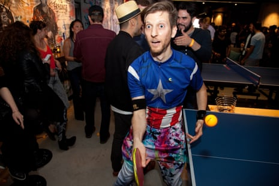
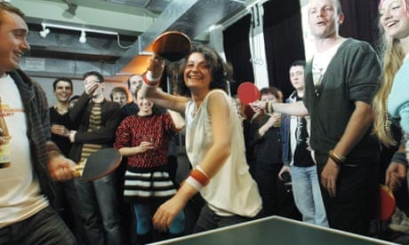
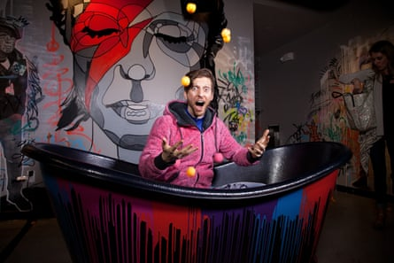

The 'extreme extrovert' on a mission to make you love ping pong

# The 'extreme extrovert' on a mission to make you love ping pong

[Sport](https://www.theguardian.com/uk/sport)

Adam Bobrow, perhaps the world’s only full-time table tennis commentator, calls himself ‘the most extreme extrovert I know’

Shelby Pope
Thu 25 Apr 2019 06.00 BSTLast modified on Thu 25 Apr 2019 15.04 BST

- 
- 
- 

Shares

66

Adam Bobrow plays at the Spin San Francisco Grand Opening in 2016. Photograph: Kelly Sullivan/WireImage

Adam Bobrow knows the stakes are high. This table tennis match in Qatar marks Ma Long’s return to the sport after a months-long break following an injury. Long, a Chinese champion regarded as one of the best players of all time, is up against Timo Boll, a German player who has been ranked best in the world four times over. Can “the Dictator”, Long’s nickname, make a comeback?

With Long up two points, the two begin a rapid-fire rally, their shoes squeaking as they dart around the table. Boll returns the ball from far behind the left of the table and sprints to the other side to [meet it again](https://youtu.be/tO9Qo5kAQbs?t=423). To reach it, he switches the paddle to his right, non-dominant hand, allowing him to make a powerful shot that Long can’t touch. And the crowd goes wild.

Bobrow, a lanky Californian, throws his hands in the air, partially knocking off his microphone. “Oh! The hand-switch counter! Timo! I lost my headset on this!” Bobrow yells. Boll puffs out his cheeks, slightly sheepish, and raises one finger, as per the sport’s etiquette when a player has made a lucky point.

“Look at this! He wasn’t even looking!” Bobrow bellows during the instant replay. “He wasn’t even looking! Yeah, just one? You say that, but it keeps happening, Timo!”

Over the years, Bobrow has parlayed both his lifelong obsession with [table tennis](https://www.theguardian.com/lifeandstyle/2011/nov/17/ping-pong-sociable-table-tennis) and endless, unabashed exuberance into viral fame, receiving millions of views on YouTube for goofy videos like “[Enter the Snake: Twist of Fury](https://www.youtube.com/watch?v=4MAtwZle-xo&t=50s)” and “[Excessive Ping Pong Celebration](https://www.youtube.com/watch?v=HBXQlGNAx_Q)”. He’s also made a career out of it. As the official commentator for the International Table Tennis Federation (ITTF), the sport’s main governing body, Bobrow is known as the “voice of table tennis” to fans across the world. He travels with the ITTF’s annual world tour all year long, from Budapest to Japan to Australia, living out of a suitcase [painted with illustrations of famous players](https://www.instagram.com/p/BfwOaT8h-HG/). As far as he knows, he’s the world’s only full-time table tennis commentator.

[  Facebook](https://www.facebook.com/dialog/share?app_id=180444840287&href=http%3A%2F%2Fwww.youtube.com%2Fwatch%3Fv%3Df4KV7APYUO0&picture=)[  Twitter](https://twitter.com/intent/tweet?text=&url=http%3A%2F%2Fwww.youtube.com%2Fwatch%3Fv%3Df4KV7APYUO0)[  Pinterest](http://www.pinterest.com/pin/create/button/?description=&url=http%3A%2F%2Fwww.youtube.com%2Fwatch%3Fv%3Df4KV7APYUO0&media=)

Advertisement

Most table tennis commentary is staid and even keeled, delivered in the genteel tones of golf or tennis commentary. But Bobrow’s voice constantly rises and falls with a fan’s excitement. It can be hard to find expert level commentators for table tennis, and some games have commentators who aren’t familiar with high-level play and speak in generalities. Not Bobrow, who can easily identify a strawberry or a Chiquita (two different backhand shots for countering serves), who can spot the difference between a reverse pendulum serve and a tomahawk serve. He doesn’t linger on a player’s mistakes, instead emphasizing their achievements: “Who does that? Nobody does that! Calderano, this is a mashup of sports!” he yelled after a point by the Brazilian player Hugo Calderano in the 2018 Grand Finals in South Korea. He let out a disbelieving shriek after Japanese player Koki Niwa made an effortless seeming point at the 2017 Swedish Open: “He could be drinking a cup of tea right now!”

 

##   [Ping pong: the rise of sociable table tennis]()

   

Read more

 [(L)](https://www.theguardian.com/lifeandstyle/2011/nov/17/ping-pong-sociable-table-tennis)

He loves table tennis – he watches it almost every day, obsesses over the players, speaks rapturously about Jan-Ove Waldner, his favorite player. He lives in a small apartment in Taipei dotted by Post-Its with Mandarin vocabulary words. China is home to the world’s largest audience for the sport.

At matches, fueled by hard-boiled eggs and room temperature water, he provides a constant stream of mini lessons to his audience, explaining the tactics, history and rivalries behind the match, based on his study of the sport and conversations with players. He favors loud clothing, such as sweatpants with neon flames, a shirt [mimicking a sculpted torso](https://www.instagram.com/p/BuUx1liHEKR/), anything that can spark conversation – the eternal goal for Bobrow, who describes himself as “the most extreme extrovert I know”.

[  Facebook](https://www.facebook.com/dialog/share?app_id=180444840287&href=https%3A%2F%2Fwww.theguardian.com%2Fsport%2F2019%2Fapr%2F24%2Fping-pong-announcer-adam-bobrow-table-tennis%3FCMP%3Dshare_btn_fb%26page%3Dwith%3Aimg-2%23img-2&picture=https%3A%2F%2Fmedia.guim.co.uk%2F27974bf0e2d067a560444f48310c89f65204770d%2F0_0_3000_2000%2F3000.jpg)[  Twitter](https://twitter.com/intent/tweet?text=The%20%27extreme%20extrovert%27%20on%20a%20mission%20to%20make%20you%20love%20ping%20pong&url=https%3A%2F%2Fwww.theguardian.com%2Fsport%2F2019%2Fapr%2F24%2Fping-pong-announcer-adam-bobrow-table-tennis%3FCMP%3Dshare_btn_tw%26page%3Dwith%3Aimg-2%23img-2)[  Pinterest](http://www.pinterest.com/pin/create/button/?description=The%20%27extreme%20extrovert%27%20on%20a%20mission%20to%20make%20you%20love%20ping%20pong&url=https%3A%2F%2Fwww.theguardian.com%2Fsport%2F2019%2Fapr%2F24%2Fping-pong-announcer-adam-bobrow-table-tennis%3Fpage%3Dwith%3Aimg-2%23img-2&media=https%3A%2F%2Fmedia.guim.co.uk%2F27974bf0e2d067a560444f48310c89f65204770d%2F0_0_3000_2000%2F3000.jpg)

   Bobrow hopes contagious enthusiasm will bring in new fans. Photograph: Kelly Sullivan/WireImage

Advertisement

“A lot of people say don’t combine work with pleasure because you don’t want to make your favorite thing in life your job, and then end up hating it,” Bobrow says. “I think there’s a flip side to that coin that has been much more true for me, which is if your work is something that you love, that doesn’t feel like work.”

Kanak Jha, the 18-year-old currently ranked 38 in the world by the ITTF, making him the highest-ranked American, describes the atmosphere at international tournaments as focused and serious. But when Bobrow comes, “he brings a lot of smiles to the players,” Jha says. “He brings a lot of fun, I think, to the sport for everyone.”

Bobrow’s passion for table tennis is rare for an American. While there are plenty of recreational players, there hasn’t been an American table tennis champion at the highest levels in decades, and America has never won an Olympic medal for the sport. The US doesn’t have a league system that produces champion players, or superstars to rally around. New players like Kanak Jha, who came on the scene around 2012, are starting to change things. China has the world’s largest table tennis audience (it is the national sport), so he’s learned enough Mandarin to get by. But for now, Bobrow is usually the only American – commentator or player – on the world tour. “I actually really thrive on that. I love being the only anything,” Bobrow says.

He grew up outside Los Angeles, playing table tennis with his father, fascinated by how his dad made the ball spin. He played through college and didn’t stop afterwards, alternating acting auditions with teaching table tennis lessons, including at the Los Angeles location of Spin, the chain of table tennis clubs [Susan Sarandon co-founded](https://www.latimes.com/entertainment/la-xpm-2012-dec-14-la-et-night-spin-20121214-story.html). At the time, the ITTF was searching for a commentator with a deep knowledge of table tennis. Lots of people had that. But not everyone had the charm that could attract new viewers. In 2014, Bobrow applied for the job. After taping himself commentating [a sample game](https://www.youtube.com/watch?v=ZJyfEZju3eM), he and the other finalists for the job traveled to that year’s World Championships in Tokyo for a final test. He got the job, and in 2017, he renewed his contract until the end of 2020.

“We’re not quite at the level of basketball or NFL or these big sports – just to kind of rest on our laurels and have an ex-pro, or someone who’s maybe not as an engaging or as fun, to be promoting the sport,” said Matthew Pound, marketing director for the ITTF. “We do take this very seriously and we’re quite lucky and happy to have Adam on.”

TV is still the biggest outlet for the ITTF, but social media is vital for reaching fans in places that don’t broadcast table tennis, and Bobrow is good at that. He has an eye for what works well on the internet, from 30-second-clips to showing the more human side of players in his video series “Ask A Pro anything”. For the series’ inaugural video, Bobrow got the Dictator [to croon Timbaland’s hit Apologize](https://www.youtube.com/watch?v=Zzv511EdABI). “It’s hard to give an exact figure,” Pound says, “but I think for sure, he’s brought us more fans and brought us more views.”

Of course, not everyone is a fan. There are online complaints, including from Reddit users who grumble that his commentating style focuses on excitement over analysis. But often those irritated Reddit threads are also filled with comments in defense of Bobrow from fans who understand that his goal is introducing more people to the sport. “If you listen to anyone else that has announced in the past decade, it feels like you are watching a fucking golf match even though the content warrants a spectacular response,” one user [wrote](https://www.reddit.com/r/tabletennis/comments/98tahx/adam_bobrow_needs_to_go_to_announcer_school/e4jhzpr/). “His main job is to not only make it entertaining for the people who play, but also for the common folk who don’t know the game so they start watching. He’s doing a great job too because he clearly is growing it.”

Bobrow believes contagious enthusiasm is what will bring in new fans. He wants more people to realize what he already knows – that table tennis can be as thrilling and tactical and dramatic as any other sport.

“Whenever someone tells me, ‘My girlfriend didn’t pay attention to table tennis at all, but now she enjoys watching because she loves listening to what you have to say, and learning about the players and the game,’ that, for me, is hashtag mission accomplished,” he says.

Topics

- [Sport/](https://www.theguardian.com/uk/sport)
- [US sports/](https://www.theguardian.com/sport/us-sport)
- [features/](https://www.theguardian.com/tone/features)
- 
- 
- 
- [Share on LinkedIn](http://www.linkedin.com/shareArticle?mini=true&title=The%20%27extreme%20extrovert%27%20on%20a%20mission%20to%20make%20you%20love%20ping%20pong&url=https%3A%2F%2Fwww.theguardian.com%2Fsport%2F2019%2Fapr%2F24%2Fping-pong-announcer-adam-bobrow-table-tennis)
- [Share on Pinterest](http://www.pinterest.com/pin/find/?url=https%3A%2F%2Fwww.theguardian.com%2Fsport%2F2019%2Fapr%2F24%2Fping-pong-announcer-adam-bobrow-table-tennis)
- [Reuse this content](https://syndication.theguardian.com/automation/?url=https%3A%2F%2Fwww.theguardian.com%2Fsport%2F2019%2Fapr%2F24%2Fping-pong-announcer-adam-bobrow-table-tennis&type=article&internalpagecode=6054636)