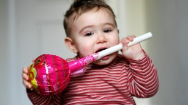
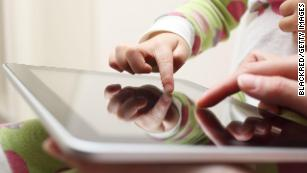
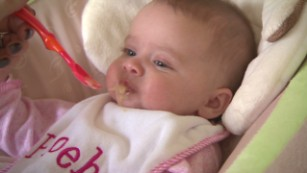

The best country in the world to raise a child? It's not America, survey finds - CNN

(CNN) — What's the best country in the world to raise a child? If a well developed public education system tops your list, you'd likely consider the United States -- it took the top spot in education in this year's [Best Countries Report,](https://www.usnews.com/news/best-countries?src=usn_pr) done annually since 2016 by U.S. News & World Report and the Wharton School of the University of Pennsylvania.

But if you factor in such qualities as safety, gender equality, green living, family friendly laws and human rights, you'd look elsewhere. The US came in at number 18 for best country to raise a child, beaten by many countries in Europe, Canada and Australia. Child raising is just one of several categories listed in the survey**. **

[Related Article: Nearly all toddlers, and the majority of babies, eat too much added sugar in the US, study says](https://edition.cnn.com/2019/11/14/health/infant-toddler-added-sugar-wellness/index.html)

Top marks went to Denmark, Sweden and Norway, a typical trend.

"These countries tend to have generous paternal leave and maternal leave, offer free preschool and have good overall public education systems," said Deidre McPhillips, senior data editor at U.S. News & World Report.

"One area where the US falls behind quite a bit is in the safety metric," she said. "In that attribute, the US actually ranks 32, pretty far down the list. So that really impacts its ratings for raising kids, of course."

Canada came in fourth for raising kids, followed by the Netherlands, Finland, Switzerland, New Zealand, Australia and Austria. The UK came in at number 11.

### A huge, international survey

The Best Countries report evaluated 73 nations across 65 different metrics. To do so it surveyed more than 20,000 people in the Americas, Asia, Europe, the Middle East and Africa. Respondents are rather evenly split between leaders in business; college-educated citizens who consider themselves middle class or higher and who read or watch the news at least four days a week; and the general public, defined as over age 18 who's age and gender were nationally representative of their countries' demographic.

[Related Article: Explosive growth in screen use by toddlers, studies say](https://edition.cnn.com/2019/11/25/health/baby-toddler-screen-time-wellness/index.html)

Switzerland took the blue ribbon as Best Country for the fourth year in a row. Canada moved up to number two overall, followed by Japan, Germany, Australia and the UK. The US came in seventh overall, better than last year but still behind its original number four ranking on all attributes in the inaugural 2016 report.

The US scored first in influence and power, but slipped dismally in a key area: Just as the 2020 presidential election cycle heats up, the world's most powerful country hit a record low of 16 out of a 100-point scale in "trust."

"United States is no longer trustworthy. It's 50% less less trustworthy than it was when we first started a survey back in 2016," said McPhillips.

[Related Article: 95% of tested baby foods in the US contain toxic metals, report says](https://edition.cnn.com/2019/10/17/health/baby-foods-arsenic-lead-toxic-metals-wellness/index.html)

The UK saw the second largest drop, possibly due to Brexit worries, she said.

The US also came in at number 15 in citizenship, quality of life and best place to visit. It ranked 17th in greenest countries, 18th in most transparent countries, and 26th in best places to travel alone -- another safety issue.

And on a key attribute, gender equality, the US came in at number 15, way behind the Scandinavian countries, Canada, Australia and New Zealand.

"Gender equality tends to have a strong correlation with many of the positive attributes that country can have," McPhillips said. "We would consider this a driver of what makes a best country overall because so many of the top countries rank highly in this attribute."