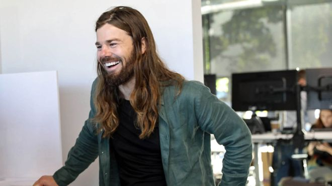
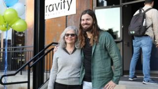
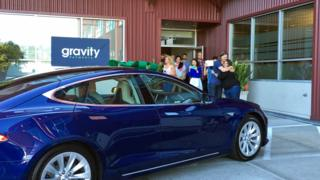

The boss who put everyone on 70K - BBC News

# The boss who put everyone on 70K

 By Stephanie Hegarty  Population Correspondent

- 9 hours ago

- [      Share this with Facebook](https://www.bbc.co.uk/news/stories-51332811#)

- [      Share this with Messenger](https://www.bbc.co.uk/news/stories-51332811#)

- [  ![](data:image/svg+xml,%3csvg xmlns='http://www.w3.org/2000/svg' class='extracted-svg ex-twitter js-evernote-checked' viewBox='-13 -15 44 44' enable-background='new 0 0 44 44' width='44px' height='44px' aria-hidden='true' focusable='false' data-evernote-id='1123'%3e %3cg%3e%3cpath d='M5.80573373%2c15 C12.7721527%2c15 16.581877%2c9.22887915 16.581877%2c4.22385671 C16.581877%2c4.06002242 16.581877%2c3.89618812 16.5714931%2c3.73466135 C17.3122088%2c3.19816171 17.9525471%2c2.53359441 18.4602026%2c1.77326482 C17.7690988%2c2.08016568 17.0364595%2c2.28092039 16.28536%2c2.36976011 C17.0756874%2c1.89671742 17.6675677%2c1.15138674 17.9502395%2c0.274527115 C17.2072164%2c0.715264453 16.3938137%2c1.02678037 15.5457981%2c1.19407596 C14.1105174%2c-0.331198284 11.7118448%2c-0.405039095 10.1865706%2c1.0290879 C9.20241101%2c1.95440555 8.78590269%2c3.33315194 9.09049603%2c4.64844138 C6.04571636%2c4.4961447 3.20861397%2c3.05740266 1.28529161%2c0.691035437 C0.280364327%2c2.42167943 0.793788713%2c4.63574999 2.45751448%2c5.74682343 C1.85525036%2c5.72951699 1.26567764%2c5.56683646 0.738408105%2c5.27262698 L0.738408105%2c5.32108501 C0.739561868%2c7.12441605 2.00985456%2c8.67622684 3.77741896%2c9.03389326 C3.2201516%2c9.18618993 2.63519393%2c9.20811142 2.06754269%2c9.09850397 C2.56366064%2c10.6410847 3.98509624%2c11.6979313 5.60613279%2c11.7290828 C4.26430681%2c12.7824682 2.60750362%2c13.3547344 0.902242404%2c13.3535807 C0.601110348%2c13.3524269 0.299978293%2c13.3339667 7.10542736e-15%2c13.2982001 C1.73295152%2c14.4104273 3.74742113%2c15 5.80573373%2c14.9965387'%3e%3c/path%3e%3c/g%3e %3c/svg%3e)    Share this with Twitter](https://www.bbc.co.uk/news/stories-51332811#)

- [      Share this with Email](https://www.bbc.co.uk/news/stories-51332811mailto:?subject=Shared%20from%20BBC%20News&body=https%3A%2F%2Fwww.bbc.co.uk%2Fnews%2Fstories-51332811)

- [Share](https://www.bbc.co.uk/news/stories-51332811#share-tools)

     Image copyright  Gravity

In 2015, the boss of a card payments company in Seattle introduced a $70,000 minimum salary for all of his 120 staff - and personally took a pay cut of $1m. Five years later he's still on the minimum salary, and says the gamble has paid off.

Dan Price was hiking with his friend Valerie in the Cascade mountains that loom majestically over Seattle, when he had an uncomfortable revelation.

As they walked, she told him that her life was in chaos, that her landlord had put her monthly rent up by $200 and she was struggling to pay her bills.

It made Price angry. Valerie, who he had once dated, had served for 11 years in the military, doing two tours in Iraq, and was now working 50 hours a week in two jobs to make ends meet.

"She is somebody for whom service, honour and hard work just defines who she is as a person," he says.

Even though she was earning around $40,000 a year, in Seattle that wasn't enough to afford a decent home. He was angry that the world had become such an unequal place. And suddenly it struck him that he was part of the problem.

At 31, Price was a millionaire. His company, Gravity Payments, which he set up in his teens, had about 2,000 customers and an estimated worth of millions of dollars. Though he was earning $1.1m a year, Valerie brought home to him that a lot of his staff must be struggling - and he decided to change that.

   

Raised in deeply Christian, rural Idaho, Dan Price is upbeat and positive, generous in his praise of others and impeccably polite, but he has become a crusader against inequality in the US.

"People are starving or being laid off or being taken advantage of, so that somebody can have a penthouse at the top of a tower in New York with gold chairs.

"We're glorifying greed all the time as a society, in our culture. And, you know, the Forbes list is the worst example - 'Bill Gates has passed Jeff Bezos as the richest man.' Who cares!?"

     Image copyright  Gravity

Before 1995 the poorest half of the population of the United States earned a greater share of national wealth than the richest 1%, he points out. But that year the tables turned - the top 1% earned more than the bottom 50%. And the gap is continuing to rise.

In 1965, CEOs in the US earned 20 times more than the average worker but by 2015 it had risen to 300 times (in the UK, the bosses of FTSE 100 companies now earn [117 times](https://www.cipd.co.uk/about/media/press/high-pay-day-2020) the salary of their average worker).

Breathing in the crisp mountain air as he hiked with Valerie, Price had an idea. He had read a study by the Nobel prize-winning economists Daniel Kahneman and Angus Deaton, looking at how much money an American needs to be happy. He immediately promised Valerie he would significantly raise the minimum salary at Gravity.

After crunching the numbers, he arrived at the figure of $70,000. He realised that he would not only have to slash his salary, but also mortgage his two houses and give up his stocks and savings. He gathered his staff together and gave them the news.

He'd expected scenes of celebration, but at first the announcement floated down upon the room in something of an anti-climax, Price says. He had to repeat himself before the enormity of what was happening landed.

Five years later, Dan laughs about the fact that he missed a key point in the Princeton professors' research. The amount they estimated people need to be happy was $75,000.

Still, a third of those working at the company would have their salaries doubled immediately.

   

Since then, Gravity has transformed.

The headcount has doubled and the value of payments that the company processes has gone from $3.8bn a year to $10.2bn.

But there are other metrics that Price is more proud of.

"Before the $70,000 minimum wage, we were having between zero and two babies born per year amongst the team," he says.

"And since the announcement - and it's been only about four-and-a-half years - we've had more than 40 babies."

     Image copyright  Gravity

 Image caption   Dan Price with his mother

More than 10% of the company have been able to buy their own home, in one of the US's most expensive cities for renters. Before the figure was less than 1%.

"There was a little bit of concern amongst pontificators out there that people would squander any gains that they would have. And we've really seen the opposite," Price says.

The amount of money that employees are voluntarily putting into their own pension funds has more than doubled and 70% of employees say they've paid off debt.

But Price did get a lot of flak. Along with hundreds of letters of support, and magazine covers labelling him "America's best boss", many of Gravity's own customers wrote handwritten letters objecting to what they saw as a political statement.

At the time, Seattle was debating an increase to the minimum wage to $15, making it the highest in the US at the time. Small business owners were fighting it, claiming they would go out of business.

The right-wing radio pundit, Rush Limbaugh, whom Price had listened to every day in his childhood, called him a communist.

"I hope this company is a case study in MBA programmes on how socialism does not work, because it's going to fail," he said.

Two senior Gravity employees also resigned in protest. They weren't happy that the salaries of junior staff had jumped overnight, and argued that it would make them lazy, and the company uncompetitive.

This hasn't happened.

     Image copyright  Gravity

 Image caption   Rosita Barlow

Rosita Barlow, director of sales at Gravity, says that since salaries were raised junior colleagues have been pulling more weight.

"When money is not at the forefront of your mind when you're doing your job, it allows you to be more passionate about what motivates you," she says.

Senior staff have found their workload reduced. They're under less pressure and can do things like take all of the holiday leave to which they are entitled.

Price tells the story about one staff member who works in Gravity's call centre.

"He was commuting over an hour and a half a day," he says. "He was worried that during his commute he was going to blow out a tyre and not have enough money to fix that tyre. He was stressing about it every day."

When his salary was raised to $70,000 this man moved closer to the office, now he spends more money on his health, he exercises every day and eats more healthily.

"We had another gentleman on a similar team and he literally lost more than 50lb (22kg)," he says. Others report spending more time with their families or helping their parents pay off debt.

"We saw, every day, the effects of giving somebody freedom," Price says.
He thinks it is why Gravity is making more money than ever.

Raising salaries didn't change people's motivation - he says staff were already motivated to work hard - but it increased what he calls their capability.

"You're not thinking I have to go to work because I have to make money," Rosita Barlow agrees. "Now it's become focused on 'How do I good work?'"

   

Barlow has been with Gravity since the early days and knows that Price wasn't always so generous.

He acknowledges himself that there was a time in the wake of the 2008 financial crisis when he was obsessed with saving money.

The downturn in the US economy decimated Gravity's customer base and it's income fell by 20%. Business logic would have dictated letting go about 12 of the company's 35 staff, but instead Price focused on cutting costs.

After five tense months, the company started turning a profit again, but Price was profoundly spooked, and kept salaries low.

   

At this time Rosita Barlow was experiencing her own financial problems, and secretly working at McDonald's outside work hours. When McDonald's offered her a promotion, she accidentally left a training manual on her desk at Gravity, and someone spotted it.

Her bosses called her in for a meeting.

"They sat me down and my immediate reaction was to cry," Barlow says. She thought she was being fired.

Instead they told her to figure out how much money she'd need to stay on at the company and they raised her salary to $40,000.

"I was very impressed and proud of her and mad at myself," Price says.
It took him a few more years to grasp the scale of the problem among his staff.

"Most were too intimidated to come to me and tell me how a lack of pay was hurting them," he says.

Before 2015, he had already begun giving employees 20% annual pay rises. But it was his conversation with Valerie that convinced him to go further.

   

Price had hoped that Gravity's example would lead to far-reaching changes in US business. He's deeply disappointed and sad that this hasn't happened.

Some did follow suit, PharmaLogics in Boston raised their minimum salary to $50,000, and Rented.com in Atlanta raised theirs too. He believes that, by means of online lobbying, he also influenced Amazon's decisions to raise their minimum wage.

But he had hoped for widespread, structural change.

"Boy, was I wrong," he says. "I've really failed in that regard. And it's changed my perspective on things because I really believed that through the actions that I did and that other people could do, that we could turn the tide on runaway income inequality."

The change has had a profound effect on Price and his lifestyle.

Before taking a pay cut, Price was the cliché of a young white tech millionaire. He lived in a beautiful house overlooking Seattle's Puget Sound, he drank champagne in expensive restaurants.

Afterwards, he rented his house out on Airbnb to help stay afloat.

A group of employees became sick of watching him turn up at work in a 12-year-old Audi and secretly clubbed together to buy him a Tesla.

     Image copyright  YouTube

 Image caption   Dan Price with Alyssa O'Neal, accepting his Tesla

A film the company posted on YouTube follows one of the group, Alyssa O'Neal, as she schemes with her colleagues to surprise him with the car.

"I feel like this is the ultimate way to say thank you for all the sacrifices he's made and any of the negative stuff he's had to deal with," she says.

Price then walks out of the office into the car park, sees the car, and starts crying.

Five years later, Price is still on Gravity's minimum salary. He says he's more fulfilled than he ever was when he was earning millions though it's not all easy.

"There's tests every day," he says.

"I'm the same age as Mark Zuckerberg and I have dark moments where I think, 'I want to be just as rich as Mark Zuckerberg and I want to compete with him to be on the Forbes list. And I want to be on the cover of Time magazine, making lots of money.' All these greedy things are tempting."

"It's not like it's easy to just turn down. But my life is so much better."