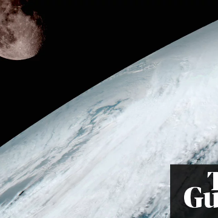

The days are getting longer – but very, very slowly

The days are getting longer – but very, very slowly

https://www.theguardian.com/science/2018/jun/04/the-days-are-getting-longer-but-very-very-slowly

As the moon pulls away from the Earth, our planet’s rotation is slowing, making our days 1/75,000 second longer each year