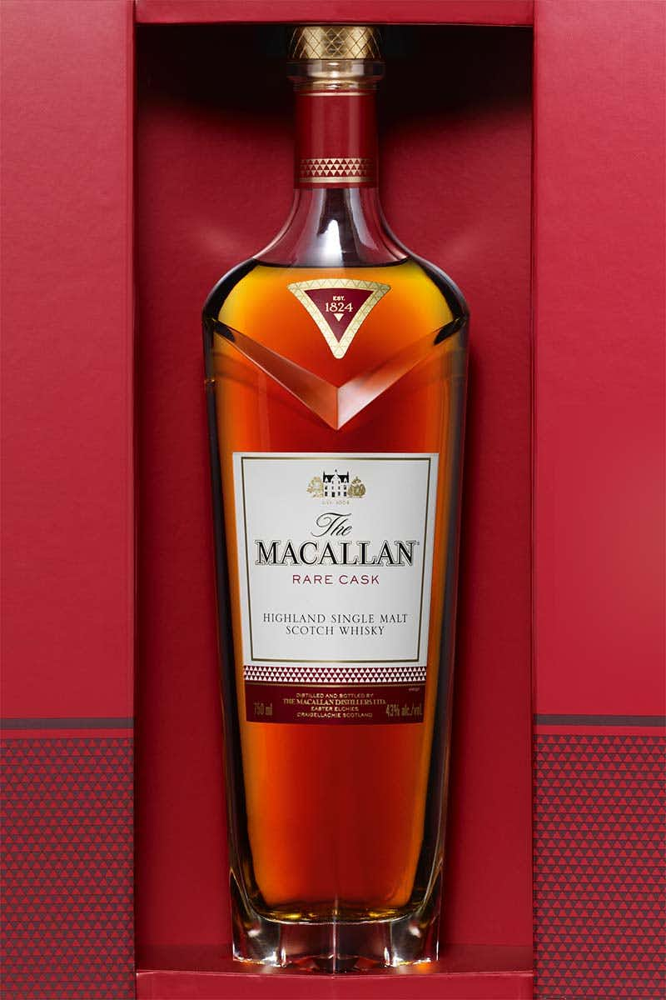
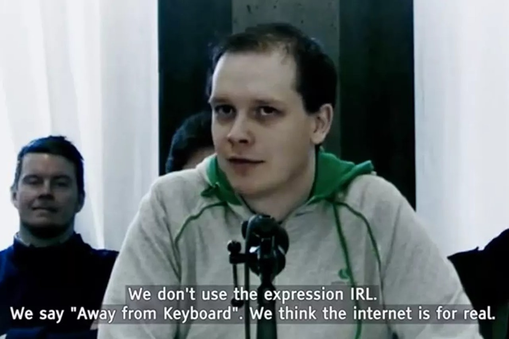

The death of the internet | The Outline

When I was very young, before I was on the internet — even before the internet was really a thing you could “go on” — I would dial into BBSs (bulletin board systems). BBSs were kind of like [private](https://spectrum.ieee.org/tech-history/cyberspace/social-medias-dialup-ancestor-the-bulletin-board-system), micro-internets that people set up in their houses. You had to use a dial-up modem to connect to them, and the people who were in charge of these networks (usually just some random technology enthusiast) could shut them off or boot you at any time. I got booted a lot when I was kid, because I was curious and annoying and all the things I am today but way less savvy about it. Once a guy who ran a BBS called my house to complain to my mother that her son had been snooping around in places he wasn’t supposed to go — I don’t remember what I was after, but I’m sure he had a very good reason to be angry.

Here’s why I mention this: What I was doing online, in a virtual space, had real-world repercussions. It was real. What I was doing was real. That guy who complained about me was real. And I realize now that I never treated or experienced the internet like some other thing — as if the physical world were “real” and what happened on the internet was something less. That was where my real life was. That’s where I was, as a person.

The internet was the most real thing to me that I’d ever had in my life, before my wife and my daughter; my job, my house, my things. Its existence helped to form the basis of my worldview, my politics, my obsessions. It gave me tools to talk and create in ways that would have been impossible in another age. But it was never not reality. I wish the rest of the world had always seen it this way.

Advertisement
Macallan Rare Cask

Peter Sunde of The Pirate Bay answering questions about the internet.

I have loved the internet, but Donald Trump and the opportunistic trolls he has created or emboldened have ruined the internet for me. A place that I used to go for joy, for connection, for information, has been perverted, abused, and reduced. I can’t blame Trump alone; Facebook and its ilk have sought to whittle down and define the internet in a manner that has not only diminished its power, but provided thugs and thieves with tools to abuse humanity in ways that have previously only been possible inside of a video game. The Masters of the Cloud, like Mark Zuckerberg and Jack Dorsey, have made the whole of the internet into a violent game. Facebook, Twitter, and social networks in general are powered by a logic of rewards, and any system in which points can be scored can be gamed. And it has been gamed, it has been tightened up and used as a cudgel, and it’s beat down a populace in ways that are both easily describable and frighteningly spectral.

> The *> Masters of the Cloud*>  have made the whole of the internet into a *> violent game*> .

What I want everyone to see is that there is no *here* and *there*. There is one world, whether it pulses on a screen in front of you, or is flesh right next to you. How we talk to one another, use one another, attack or embrace one another is real life. Emotional and psychological wounds don’t cut less deeply because they have been delivered at a remove. What you do on the internet is what you’re doing in real life.

I now see forces colliding and colluding — corporate, political, and cultural — that are poised to destroy the ultimate promise of the internet and leave a husk in its place. We’ve gotten a whiff of it over the last two years. Trump’s [repeated](https://www.washingtonpost.com/news/post-politics/wp/2017/11/27/trump-attacks-media-in-his-first-post-thanksgiving-tweet/?utm_term=.051380f5e40d) attacks on the media, Ajit Pai’s [corrupt view](https://gizmodo.com/heres-the-fccs-plan-to-kill-net-neutrality-1820683360) of net neutrality and who should control the pipelines we all use to communicate, the [Nazi-right’s](https://www.theatlantic.com/magazine/archive/2017/12/the-making-of-an-american-nazi/544119/) blunt and constant abuse of the social networks ostensibly (and falsely) created to “connect the world,” the commerce-driven design of those networks — it is not an accident these things are meeting. It is not an accident they are chipping away [at the bedrock](https://staltz.com/the-web-began-dying-in-2014-heres-how.html) of the internet and its promise to level out access and information. The men in charge [are robber barons](https://theoutline.com/post/351/valley-of-the-dolts), and this is their biggest heist yet.

In a world where a [devastating tax bill](https://www.nytimes.com/2017/12/02/opinion/editorials/a-historic-tax-heist.html) can be passed in the middle of the night with no oversight, what chance does the internet have?

Trump is directly responsible for some of the most outrageous abuses on the internet and is now in control of the systems and leaders who will decide the fate of how we all get our information. The man for whom the term “fake news” was practically invented has managed to turn the phrase around to attack what is absolutely “real” news. Usually about him. He seems, from day to day, unhinged or violent or both. His most fervent followers — an ugly mutation of Gamergate trolls and ignorant racists — launch full scale assaults on individuals and businesses on a daily basis. And yet their attacks and Trump’s — on people, religions, democracy — go largely unchecked. This probably shouldn't be a surprise, but it is.

> Jack do you think the reason is because you desperately need Trump to keep using Twitter so he gets to do whatever he wants?

> — Joshua Topolsky (@joshuatopolsky) > [> December 1, 2017](https://twitter.com/joshuatopolsky/status/936683360633737216?ref_src=twsrc%5Etfw)

> No, I don’t

> — jack (@jack) > [> December 1, 2017](https://twitter.com/jack/status/936683496520679424?ref_src=twsrc%5Etfw)

The game is being played at every level to take away something *you* own — a place to speak, share, create — and replace it with something *they* own. To other you at every turn. To deny you. It’s only through totalitarianism that Trump’s outmoded and ugly ideas can survive, and it’s only through a kind of corporate totalitarianism that interests like Facebook, Comcast, or Verizon can continue to bend the world towards profit. And the two are uniquely aligned in this moment — if you can alter the *view* of the world, then changing the *shape* of the world is actually not that difficult. If “real life” is here (spoiler alert: it is), then “real life” is being actively manipulated.

> If “real life” is *> here*>  (spoiler alert: it is), then “real life” is being *> actively manipulated*> .

The end of the internet may come in a form that looks and feels like fascism, but let’s not forget that most of these destructive actors are motivated by money. Twitter may defend its actions (or inactions) around harassment as an act of free speech, but it’s really an act of commerce. As long as that tap keeps producing, no one will move quickly to shut it off no matter what poison it delivers.

For a long time I’ve [dreaded](https://www.theverge.com/2014/3/25/5547946/welcome-to-planet-facebook) the coming of “Facebook’s Internet” — now we are literally at the precipice of such a thing existing. In other countries where Facebook operates with more autonomy and less oversight, this is [already happening](https://qz.com/333313/milliions-of-facebook-users-have-no-idea-theyre-using-the-internet/). One can easily envision a day when an internet provider like Comcast offers a tier of access wherein your ability to view and interact with content online will be channeled only through Facebook’s pages and services. This would be a virtuous circle for the two companies. There won’t be an internet where you can watch shows on Hulu then jump over to Gmail — you’ll watch Facebook TV and send Facebook Messages. Services that look and act like something distinct but are sadly part of a homogenized whole will also be available; Instagram and WhatsApp do this already. There you will be delivered ads according to your interests, interests predicated on the content you view, content promoted by bots and agents of a corrupt government and its many corporate and civilian allies. It will be a win-win for everyone but you. This is not science fiction. This is the reality we are hurtling towards now. A closed system where all information gathers that can be endlessly gamed. A fascist’s wet dream.

I have loved the internet — its promise, beauty, and potential — as I’ve loved the world. But the internet today is a place I do not recognize. Trump, Facebook, Twitter, and the serial abusers they all rely on have destroyed what it was, and now they’re working hard to kill it entirely. And when it dies, something bigger than a network dies — the “real world” goes with it. It’s half gone already.

Every day I try and look for the systems that will save us. The safeguards that will stop the flood. And every day I find myself asking if they exist at all.

More and more, I think the answer is no.
Let’s fight while we still can.

[Like us on Facebook](https://www.facebook.com/outline/)[Follow us on Twitter](https://twitter.com/outline)