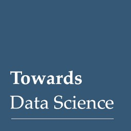

The fall of RNN / LSTM – Towards Data Science

The fall of RNN / LSTM – Towards Data Science

https://towardsdatascience.com/the-fall-of-rnn-lstm-2d1594c74ce0?mkt_tok=eyJpIjoiWlRjMlpXTTFOemhoTURFMCIsInQiOiJWOGFnaDFYMjQ0SFY2TjBxT1luWmIrbm5NQThWVzZldGZDR3FRUnpJUlAwOUNONnJNM2tIZkRBSEl5TGJwS1VTQ1wvRlI4OUVKNU9kYkRXWHBxUnJwQlI1T3FvQmFKc2FiMVhIbzk2SXF0azFDeFlVelBBR3RwODR1VnNwTnRKYXYifQ%3D%3D

We fell for Recurrent neural networks (RNN), Long-short term memory (LSTM), and all their variants. Now it is time to drop them!