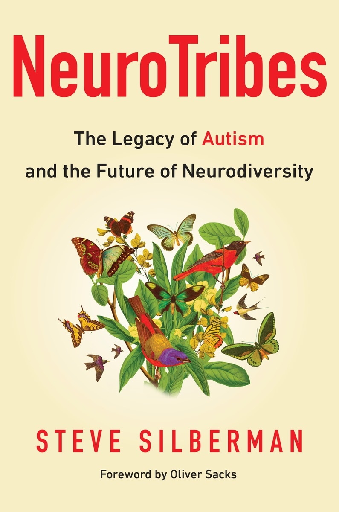

The forgotten history of autism

Decades ago, few pediatricians had heard of autism. In 1975, 1 in 5,000 kids was estimated to have it. Today, 1 in 68 is on the autism spectrum. What caused this steep rise? Steve Silberman points to “a perfect storm of autism awareness” — a pair of psychologists with an accepting view, an unexpected pop culture moment and a new clinical test. But to really understand, we have to go back further to an Austrian doctor by the name of Hans Asperger, who published a pioneering paper in 1944. Because it was buried in time, autism has been shrouded in misunderstanding ever since. (This talk was part of a TED2015 session curated by Pop-Up Magazine: popupmagazine.com or @popupmag on Twitter.)

This talk was presented at an official TED conference, and was featured by our editors on the home page.

About the speaker
[(L)](https://www.ted.com/speakers/steve_silberman?language=en)

[Steve Silberman](https://www.ted.com/speakers/steve_silberman?language=en)Writer and editor

Steve Silberman is a writer and contributing editor for Wired who covers science and society. His newest book explores neurodiversity and the link between autism and genius.

More Resources
book

[NeuroTribes: The Legacy of Autism and the Future of Neurodiversity](http://www.penguin.com/book/neurotribes-by-steve-silberman/9781583334676)

Steve Silberman, foreword by Oliver Sacks
Avery (2015)

[Buy from Amazon →](http://www.penguin.com/book/neurotribes-by-steve-silberman/9781583334676)

