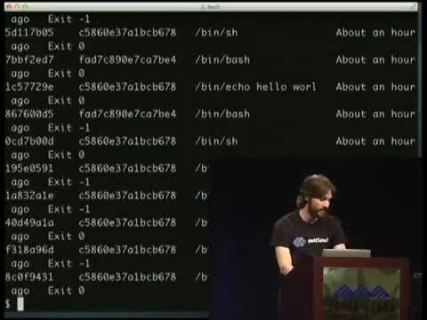

The future of Linux Containers

The future of Linux Containers
https://www.youtube.com/watch?v=wW9CAH9nSLs
[dotcloudtv](https://www.youtube.com/channel/UCiKMxlXOGO3prH21ZE-ufww)
67,721 views views
Published on Mar 21, 2013

|     |
| --- |
| [(L)](https://www.youtube.com/watch?v=wW9CAH9nSLs) |

Description

At PyCon Solomon Hykes shows docker to the public for the first time.