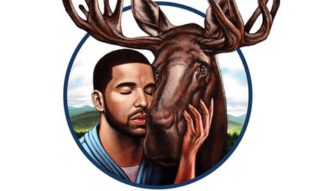
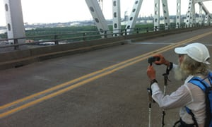
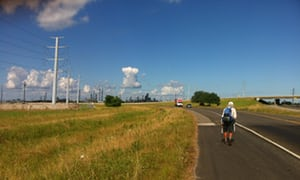
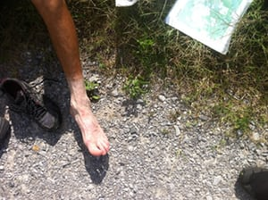

The man who went on a hike – and never stopped walking

In his 61st year on this earth, the man who calls himself Nimblewill Nomad left home and walked a very long way through the mountains – about 10 million steps, he estimates, or 4,400 miles. Then, he took another, even longer walk. And then another one. And then another. Soon, he had given away almost all of his money and taken to walking almost year-round, roaming the post-industrial wilderness of North America in what he called “a desperate search for peace”.

His fellow long-distance hikers speak of him in mythical terms. They told me that, in order to avoid foot infections, he had chosen to have all 10 of his toenails surgically removed. He was said to never carry more than 10lbs on his back, and to have invented a tiny stove that ran on twigs and grass, so he wouldn’t have to carry fuel.

 

#   ['Places you'll only visit due to random misfortune': an alt guide to Canada's cities]()

Read more

 [(L)](https://www.theguardian.com/cities/2017/jun/30/canada-day-2017-150th-birthday-alternative-cities-guide-toronto-vancouver)

Over 15 years, he had hiked 34,000 miles. First he completed the so-called Triple Crown of long-distance trails: the Appalachian trail (2,200 miles), the Pacific Crest trail (2,650 miles), and the Continental Divide trail (3,100 miles). Then he went on to complete all 11 national scenic trails in 2013. Triumphant, fulfilled, and nearing his 75th birthday, he vowed to hang up his hiking boots.

Then, the next spring, he was back. He announced he would complete a grueling road-walk from New Mexico to Florida, in order to complete a route he had named the Great American Loop, which connected the four farthest corners of the continental US. This, he claimed, would be his last long hike.

I wrote to him to ask if I could join him for a few days. After some delicate negotiation – he harbored a deep if not altogether ill-founded suspicion of journalists – he agreed to let me walk with him. He told me that he would be hiking east on highway TX-73 somewhere outside of Winnie, Texas, on a certain day in early June. If I could find him, I was welcome to tag along. But he wasn’t slowing down for anybody.

  MJ Eberhart on his hike in west Texas. Photograph: Robert Moor

On the appointed day, my sister and I drove south-east from Houston, eyes peeled for a walker by the side of the road. As we passed a place on the map called Alligator Hole Marsh, we spotted him: a white apparition on the far side of the highway, walking upstream against the traffic.

Advertisement

We circled around and parked on the shoulder about 50 yards up the road. He waved as he drew near. He carried a blue backpack no larger than a preschooler’s knapsack. A single plastic water bottle was tied to his belt with a piece of frayed blue string. His trekking poles were folded in the crook of his arm. In his hand, he carried a chipped styrofoam coffee cup.

When he reached the car, I shook his hand, and he smiled. He had a wild head of white hair streaked with yellow, and a white beard threaded with black. He took his sunglasses off, and his eyes, arced against the sun, were fixed with deep, leathered creases, pale in their depths. His hands too were deeply tanned, but only up to around the base of his thumb; the rest of each hand, shaded by the his cuffs of his shirt, was pink.

His real name was MJ Eberhart. He said I could call him “Eb”.

“Welcome to my backyard,” Eberhart said, waving at the vastness with his cup of ice. The land was flat (elevation: 11ft), but the clouds above it were colossal – a white mountain range, severed and levitated.

As we walked, Eberhart recounted his travels thus far. He had begun 46 days earlier at the southern terminus of the Continental Divide trail. From there, he headed east, through the blackened badlands of New Mexico, through the gateway city of El Paso, and on to an endless spread of dry dun plains. The traffic consisted almost entirely of semi-trailer trucks surging past every 10 seconds at speeds of a 100 miles per hour. He had learned to take shallow breaths through his nose, so as to not inhale their fumes. The sound was meteoric.

In west Texas, the highway stretched in a straight line to a vanishing point on the horizon. Space and time started to play tricks on him. He walked for hours each day and never seemed to progress, the distant mountains retreating faster than he could catch them. The highway was lined with mileage markers, and he checked each one to convince himself that the numbers were changing.

His plan was to walk from gas station to gas station, but buildings of any kind were sometimes dozens of miles apart. If people hadn’t stopped to give him water, he may well have died. When he emerged from the desert, vultures were circling ominously over his head.

Other than the vultures, almost all of the wildlife he had seen was dead (most of it roadkill), including a crushed coral snake, two mule deer, a raccoon, an armadillo, numerous birds, and a group of dead coyotes wired, inexplicably, to a fence.

  Nimblewill Nomad hiking in Texas. Photograph: Rober Moor

Step by step, I learned the full story of how this man became Nimblewill Nomad.

Advertisement

He was born Meredith Eberhart – which, he stressed, back then was “a *boy’s* name” – in a “sleepy” town in the Ozarks with a population of 336. He likened his childhood to that of Huck Finn: he spent his summers running barefoot, fishing, and riding horses. In the fall, he hunted quail with his father, a country doctor.

Eberhart later attended optometry school, got married, and helped raise two boys of his own. They lived in Titusville, Florida (“Space City, USA”), where he was soon making a six-figure salary performing pre-and post-operative work on cataract patients, many of them Nasa scientists. He enjoyed helping people restore their sight and he prided himself on being able to provide for his family, but his work still felt oddly hollow.

He retired in 1993 and began spending more time living alone on a plot of land he was developing beside Nimblewill creek in Georgia. He and his wife started to drift apart. There followed a dark period of about five years, about which he said he didn’t remember much. When I later called up his sons – neither of whom had spoken with him in years – they recalled him as a caring father and a dutiful provider, but also someone who was easily frustrated, prone to bouts of drunken brooding, and, occasionally, loud (but never violent) outbursts of rage.

His new house sat near the base of Springer Mountain, which he would regularly climb. His hikes gradually grew longer; he began systematically hiking the Appalachian trail section by section, eventually reaching as far as Pennsylvania. Then, in 1998, at the age of 60, he decided to set out on his first “odyssey”, a 4,400 walk from Florida to Cap Gaspé in Quebec, along a sketchy agglomeration of trails, roads, and a few pathless wilderness areas.

Not long before, he had been diagnosed with a heart block, but he declined the doctor’s admonitions to have a pacemaker installed. His sons assumed he would not make it home alive.

On the trail, Eberhart renamed himself after his adopted home, Nimblewill creek. He began in the swamps of Florida and hiked north on flooded trails, where the dark, reptilian waters sometimes reached to his waist. When he emerged from the swamps, all 10 of his toenails fell off. By the time he reached Quebec, it was already late October.

Over the past nine months, he had experienced a slow religious awakening, but his faith was shaken as he passed through those grim, freezing mountains. “Dear Lord, why have you forsaken me?” he asked, upon seeing the weather darken one day at the base of Mont Jacques Cartier. However, a lucky break in the storm allowed him to reach the snowy mountaintop, where he sat in the sun, feeling “the warm presence of a forgiving God”. After reaching the trail’s end, he returned to the south (on the back of a friend’s motorcycle) and, in a blissful denouement, walked another 178 miles from a town near Miami down to the Florida Keys, where he settled into “a mood of total and absolute, perfect contentment, most near nirvana”.

 

#   [10 of the best US hiking trails: readers’ travel tips]()

Read more

 [(L)](https://www.theguardian.com/travel/2017/may/11/10-best-us-hiking-trails-appalachians-california-readers-travel-tips)

He returned home a different man. He stopped showering. He kept his hair long. He began ruthlessly shedding his possessions; over the course of three days, he burned most of the books he had collected over his lifetime, one by one, in a barrel in his front yard.

In 2003, he and his wife divorced. He ceded the house and most of his assets to his ex-wife, and signed over his other real estate holdings, including the land at Nimblewill creek, to his two sons in an irrevocable trust. Since then, he has lived solely off his social security checks. If those funds ran out by the end of the month, he went hungry. But what he had gained was the freedom to walk full time, which felt to him like freedom itself. “As if with each step,” he wrote, “these burdens were slowly but surely being drained from my body, down to the treadway beneath my feet and onto the path behind me.”

Advertisement

Three days I walked with Eberhart, through swampland and farmland and urban wasteland. To pass the hours, we talked; sometimes we argued. I discovered he held a fierce belief in an almighty God, and could not bring himself to believe in the science of Darwinian evolution or anthropogenic climate change. He also held a dogged belief in personal freedom, including the freedom to pollute the atmosphere with fossil fuels. “If I want to buy an airplane and fill it full of a thousand gallons of fifty-dollar-a-gallon fuel, and I got the money to do it, goddamn it, leave me alone!” he exclaimed at one point, in exasperation.

We walked through the very land this philosophy had wrought. We drank tap water that stank of kerosene. We breathed car exhaust. We dined on frozen burritos and fried things from gas stations and diners. (Sometimes we ate the leftover food from neighboring tables.) One night we slept in a grassy ditch in the town of Port Arthur, beside an oil refinery; I strung up my hammock between an electrical pole and a chain link fence bearing a sign that read: “Warning: light hydrocarbon pipeline.”

The next night, we slept in a copse of gnarled oaks beside a graveyard, a shady grove carpeted with slender, rippling leaves. It was strangely lovely. Eberhart found them everywhere, these forgotten little shards of wilderness. The problem, he said, was that hikers tended to divide their lives into compartments: wilderness over here, civilization over there. “The walls that exist between each of these compartments are not there naturally,” he said. “We create them. The guy that has to stand there and look at Mount Olympus to find peace and quiet and solitude and meaning – life has escaped him totally!”’

Eberhart’s posture was hunched, and he had a slight hitch in his right step, but his stride, from the outset, was remarkably steady: three miles an hour, on the tick.

Throughout the day, to ease his pains, he swallowed handfuls of aspirin and joint supplements. Each year, Eberhart’s hikes got a little shorter, and the winters he spent living out of his pickup truck – camped in Walmart parking lots and national parks – grew longer. At his age, after all he had experienced, it amazed me that he could hike at all.

On his journeys, he had broken four ribs, his shinbone, and his ankle. He had suffered from excruciating bouts with shingles and an abscessed tooth. He had visited unspeakable horrors upon his feet. Once, up in [Canada](https://www.theguardian.com/world/canada), he had been struck by lightning.

At one point on our final day together, Eberhart paused at the intersection of a gravel road to show me the contents of his pack. He spread out his things in the dust. There was a tarp tent, a sleeping bag, a sleeping pad, the small bag of electronics, a hint of a medical kit, a plastic poncho, his maps, a pair of ultralight wind pants, and the pile of metal junk. All of the fabrics had the wispiness of gossamer; a strong wind could had taken most of his earthly possessions away.

Advertisement

Besides his truck and a few mementos he kept at his sister’s house, he didn’t own much more than this.

“I tell my friends: every year I’ve got less and less, and every year I’m a happier man. I just wonder what it’s going to be like when I don’t have anything. That’s the way we come, and that’s the way we go. I’m just preparing for that a little in advance, I guess.”

Instead of a toothbrush, he carried a wooden toothpick. He did not carry a stove. He did not carry a spare change of socks, a spare set of shoes, nor any other spare clothes. He did not carry reading material, nor even a notebook. He did not carry toilet paper. His med-kit contained little more than a few bandaids, a pile of aspirin, and a sliver of a surgical blade.

Shaving down one’s pack weight, he said, was a process of sloughing off one’s fears.

Each object a person carries represents a particular fear: of injury, of discomfort, of boredom, of attack. The “last vestige” of fear that even the most minimalist hikers have trouble shedding, he said, was starvation. As a result, most people ended up carrying “way the hell too much food”. He did not even carry so much as an emergency candy bar.

Earlier, I had asked him if he was afraid to die. He shook his head. “Nah, I don’t think so,” he said. He told me his grandfather had died in the woods (of a heart attack while hunting), his father had died in the woods (of a chainsaw accident while gathering firewood), and he was “working on it”.

As I picked over his gear, one question kept nagging at me. Feeling sheepish, I asked if the rumor I’d heard was true: did he have all of his toenails surgically removed?

He smiled. “Oh, sure,” he said.

  Nimblewill Nomad’s foot after hiking. He had his nails surgically removed. Photograph: Robert Moor

He sat down and pulled off his tattered sneakers, and then peeled off his socks. His ankles were a shocked shade of pale below the sockline. His pink toes, rimmed with yellow calluses, were long and knobby. When I looked closer, I saw that it was true: they had no nails, except for a few whiskery fibers that were trying to grow back.

He said that whenever people questioned his dedication to the life he had chosen, or tried to downplay his journeys as a mere lark, he would pull off his shoes, and show them his feet.

*Extracted from [On Trails: An Exploration](https://www.quartoknows.com/books/9781781317044/On-Trails.html) by Robert Moor. He lives in Halfmoon Bay, British Columbia.*