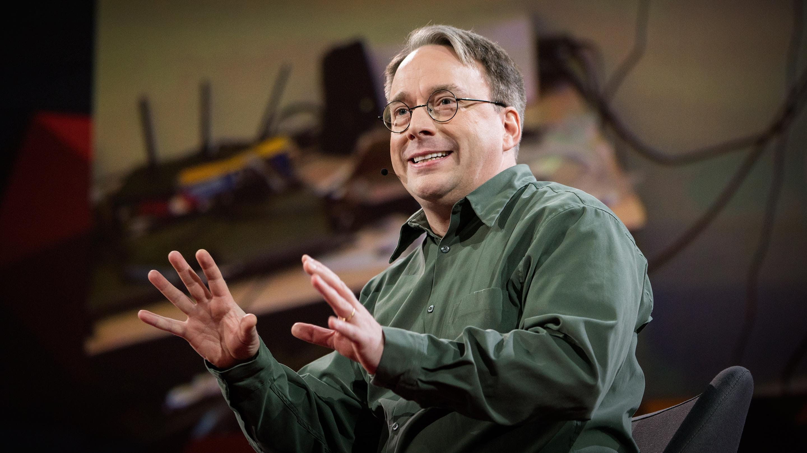

The mind behind Linux | Linus Torvalds

The mind behind Linux | Linus Torvalds
https://www.youtube.com/watch?v=o8NPllzkFhE
[TED](https://www.youtube.com/channel/UCAuUUnT6oDeKwE6v1NGQxug)
562,958 views views
Published on May 3, 2016

|     |
| --- |
| [(L)](https://www.youtube.com/watch?v=o8NPllzkFhE) |

Description

Linus Torvalds transformed technology twice — first with the Linux kernel, which helps power the Internet, and again with Git, the source code management system used by developers worldwide. In a rare interview with TED Curator Chris Anderson, Torvalds discusses with remarkable openness the personality traits that prompted his unique philosophy of work, engineering and life. "I am not a visionary, I'm an engineer," Torvalds says. "I'm perfectly happy with all the people who are walking around and just staring at the clouds ... but I'm looking at the ground, and I want to fix the pothole that's right in front of me before I fall in."

TEDTalks is a daily video podcast of the best talks and performances from the TED Conference, where the world's leading thinkers and doers give the talk of their lives in 18 minutes (or less). Look for talks on Technology, Entertainment and Design -- plus science, business, global issues, the arts and much more.

Find closed captions and translated subtitles in many languages at http://www.ted.com/translate

Follow TED news on Twitter: http://www.twitter.com/tednews
Like TED on Facebook: https://www.facebook.com/TED

Subscribe to our channel: [http://www.youtube.com/user/TEDtalksD...](http://www.youtube.com/user/TEDtalksDirector)