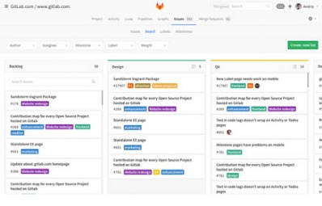
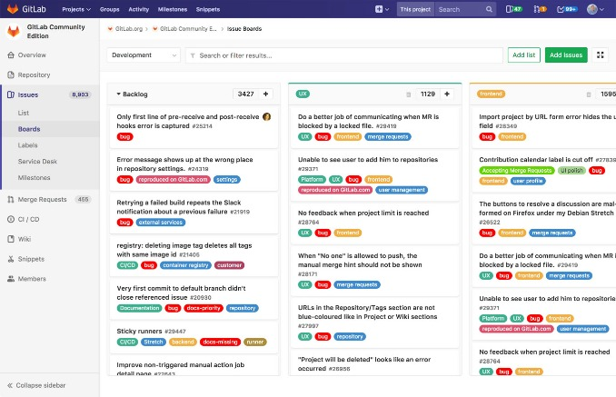
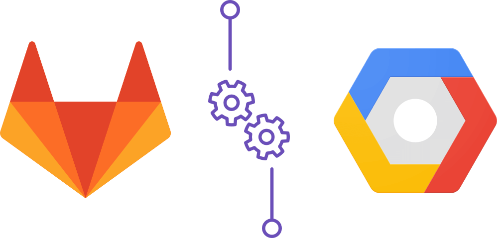
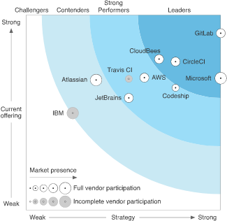

The only single product for the complete DevOps lifecycle - GitLab

 

Deploy to Google Cloud Platform using GitLab. Set up scalable deploy environments with a few clicks and unlock auto-configured DevOps pipelines. [Check it out and get a $500 GCP credit.](https://about.gitlab.com/google-cloud-platform/)

   [(L)](https://about.gitlab.com/)

 **

#  Concurrent DevOps

##  A single application for the complete DevOps lifecycle

 [Try GitLab for Free](https://about.gitlab.com/products/)

- Visible
- Efficient
- Governed

###  Real time view across the entire lifecycle

- See everything that matters

- Stay in your flow

- Don’t wait on syncing

- Manage projects, not tools

- Improve cycle time

 

## With GitLab, You Can:

- Plan
- Create
- Verify
- Package
- Release
- Configure
- Monitor

###  Get your best ideas into development.

Whether you use Waterfall, Agile, or Conversational Development, GitLab streamlines your collaborative workflows. Visualize, prioritize, coordinate, and track your progress your way with GitLab’s flexible project management tools.

 [Learn More →](https://about.gitlab.com/features/#plan)

 

## Integrated teams working together

GitLab is the first single application built from the ground up for all stages of the DevOps lifecycle for Product, Development, QA, Security, and Operations teams to work concurrently on the same project. GitLab enables teams to collaborate and work from a single conversation, instead of managing multiple threads across disparate tools. GitLab provides teams a single data store, one user interface, and one permission model across the DevOps lifecycle allowing teams to collaborate, significantly reducing cycle time and focus exclusively on building great software quickly.

## GitLab + Google Cloud Platform = simplified, scalable deployment

GitLab’s native Google Kubernetes Engine integration increases developer productivity. With Auto DevOps, GitLab automatically configures CI/CD pipelines to build, test, verify, and deploy applications to Google Cloud Platform.

 [Learn more](https://about.gitlab.com/google-cloud-platform)

 

## Work Concurrently, No More Handoffs

 

Dev, QA, Security and Operations are part of a single conversation throughout the lifecycle. Detect problems earlier by ‘shifting them to the left’ and solving them with out delays.

 

Teams work at the same time instead of waiting for Security, QA, and Operations handoffs because teams are backlogged.

###  Try GitLab Ultimate free for 30 days.

Evaluate self-hosted GitLab for 30 days and receive all the features of Ultimate, our top-tier subscription plan, for free. **No credit card required.**

 [Start your free trial](https://about.gitlab.com/free-trial/)  [Join a live demo](https://about.gitlab.com/webcast/gitlab-enterprise-demo/)

>
>

>  “We decided to use an Open Source based platform so we can participate in the development and contribute to the features and concepts we need such as file size statistics, OpenID Connect, GPG, and Docker Registry. GitLab's built-in Continuous Integration and independent CI Runners allows our developers to integrate very specific environments, boosting productivity and increasing developer satisfaction.”

>
>
>
>   >
>   >  Roger Meier > Social Coding Platform, Siemens>   >
>
>   > [> View more customers](https://about.gitlab.com/customers/)>
>

 

 10.6

## New features every month

In this month’s release of GitLab 10.6, we've added CI/CD for GitHub, improved Kubernetes integration, and much more.

 [See what’s new](https://about.gitlab.com/2018/03/22/gitlab-10-6-released/)

 

 among the  *top*  **30**  highest velocity  open source  projects

With major product releases every 22nd of the month, GitLab’s high-velocity pace of innovation is possible because of the collaboration of **1900+ contributing members** of the GitLab community, delivering the leading modern software development product, built for today’s modern software developer.

 [Read more](https://about.gitlab.com/2017/07/06/gitlab-top-30-highest-velocity-open-source/)

 

 

“GitLab supports development teams with a well-documented installation and configuration processes, an easy-to-follow UI, and a flexible per-seat pricing model that supports self service. GitLab’s vision is to serve enterprise-scale, integrated software development teams that want to spend more time writing code and less time maintaining their tool chain.”

 [Read more](https://about.gitlab.com/2017/09/27/gitlab-leader-continuous-integration-forrester-wave/)

 

## Join GitLab.com

Complete the online application to begin hosting and exploring projects.
 [Sign up→](https://gitlab.com/users/sign_in)

 

## GitLab Blog

GitLab + Google Cloud Platform = simplified, scalable deployment
 [Read more→](https://about.gitlab.com/2018/04/05/gke-gitlab-integration/)

 

## IBM Think

Where thinkers like you gather to make the world of business work smarter.
 [Join Us→](https://about.gitlab.com/events/)

 

## Live Demo

Join a live demo of GitLab Enterprise Edition.

 [Reserve Your Place→](https://about.gitlab.com/webcast/gitlab-enterprise-demo/)

- [**  Twitter](https://twitter.com/gitlab)

- [**  Facebook](https://www.facebook.com/gitlab)

- [**  YouTube](https://www.youtube.com/channel/UCnMGQ8QHMAnVIsI3xJrihhg)

- [**  LinkedIn](https://www.linkedin.com/company/gitlab-com)

### Products

- [Features](https://about.gitlab.com/features)

- [Installation](https://about.gitlab.com/installation)

- [GitLab.com](https://about.gitlab.com/pricing#gitlab-com)

- [Pricing](https://about.gitlab.com/pricing)

- [Releases](https://about.gitlab.com/releases)

### Services

- [Resellers](https://about.gitlab.com/resellers/)

- [Services](https://about.gitlab.com/services/)

### Community

- [Events](https://about.gitlab.com/events/)

- [Core Team](https://about.gitlab.com/core-team/)

- [Contributors](http://contributors.gitlab.com/)

- [Find a Speaker](https://about.gitlab.com/find-a-speaker/)

- [Documentation](https://docs.gitlab.com/)

- [Getting Help](https://about.gitlab.com/getting-help/)

- [Contributing](https://about.gitlab.com/contributing/)

- [Applications](https://about.gitlab.com/applications/)

- [Hall of Fame](https://about.gitlab.com/mvp/)

### Company

- [Source Code](https://gitlab.com/groups/gitlab-org)

- [Blog](https://about.gitlab.com/blog/)

- [Customers](https://about.gitlab.com/customers/)

- [Press and Logos](https://about.gitlab.com/press/)

- [Shop](https://shop.gitlab.com/)

- [About Us](https://about.gitlab.com/about/)

- [Team](https://about.gitlab.com/team/)

- [Direction](https://about.gitlab.com/direction/)

- [Handbook](https://about.gitlab.com/handbook/)

- [Jobs](https://about.gitlab.com/jobs/)

- [Terms](https://about.gitlab.com/terms/)

- [Contact Us](https://about.gitlab.com/contact/)

Edit [this page](https://gitlab.com/gitlab-com/www-gitlab-com/blob/master/source/index.html.haml) — please [contribute](https://gitlab.com/gitlab-com/www-gitlab-com/blob/master/CONTRIBUTING.md). 