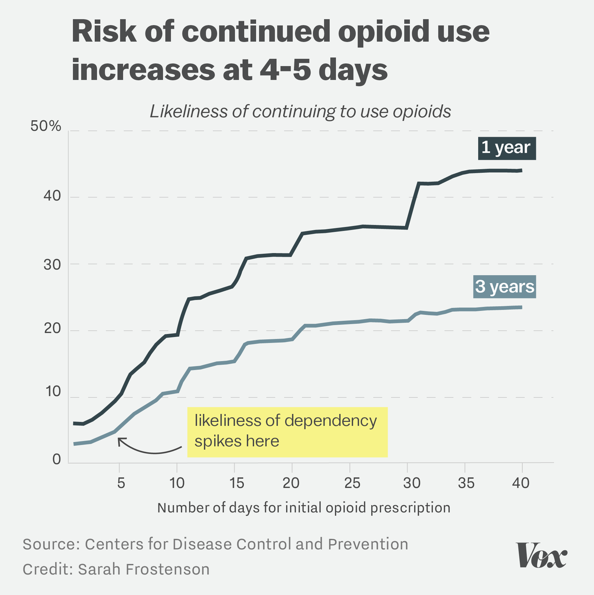
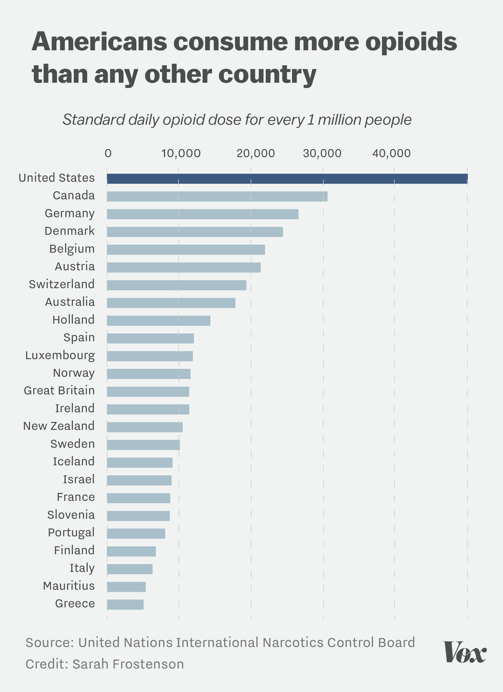
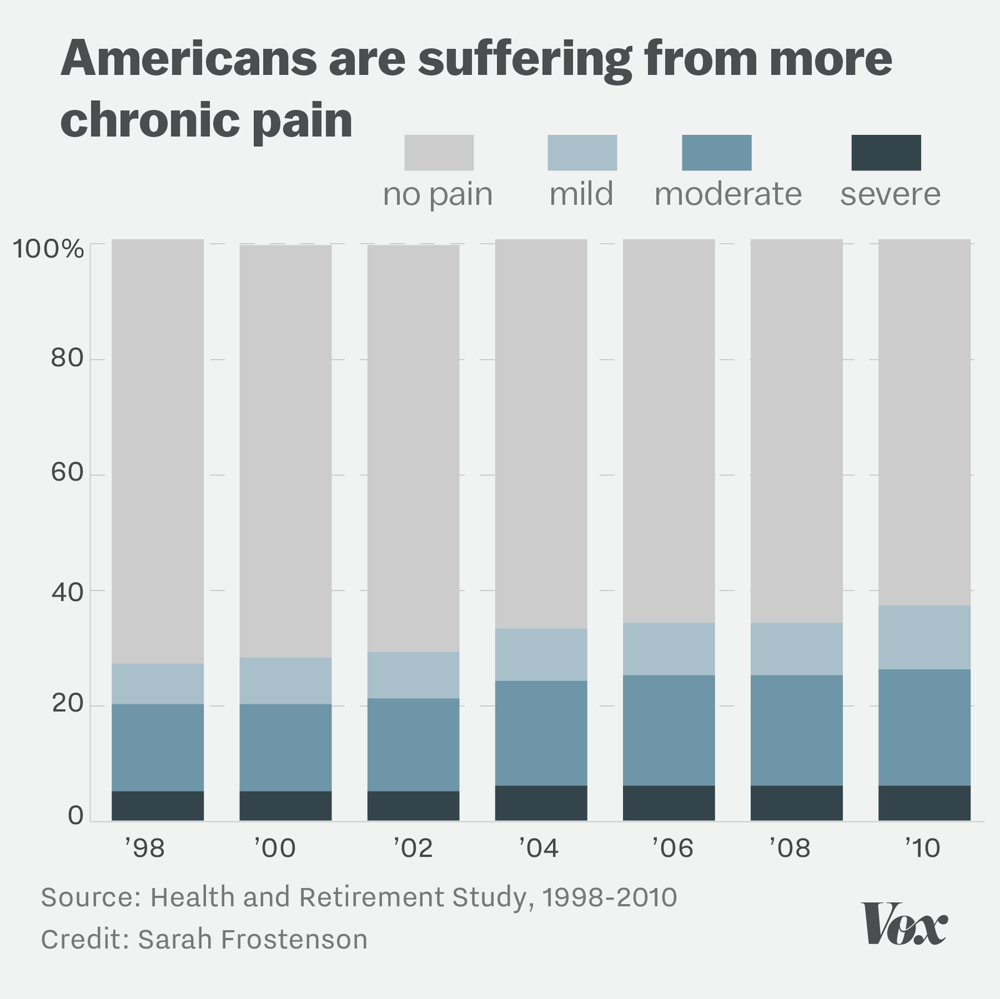
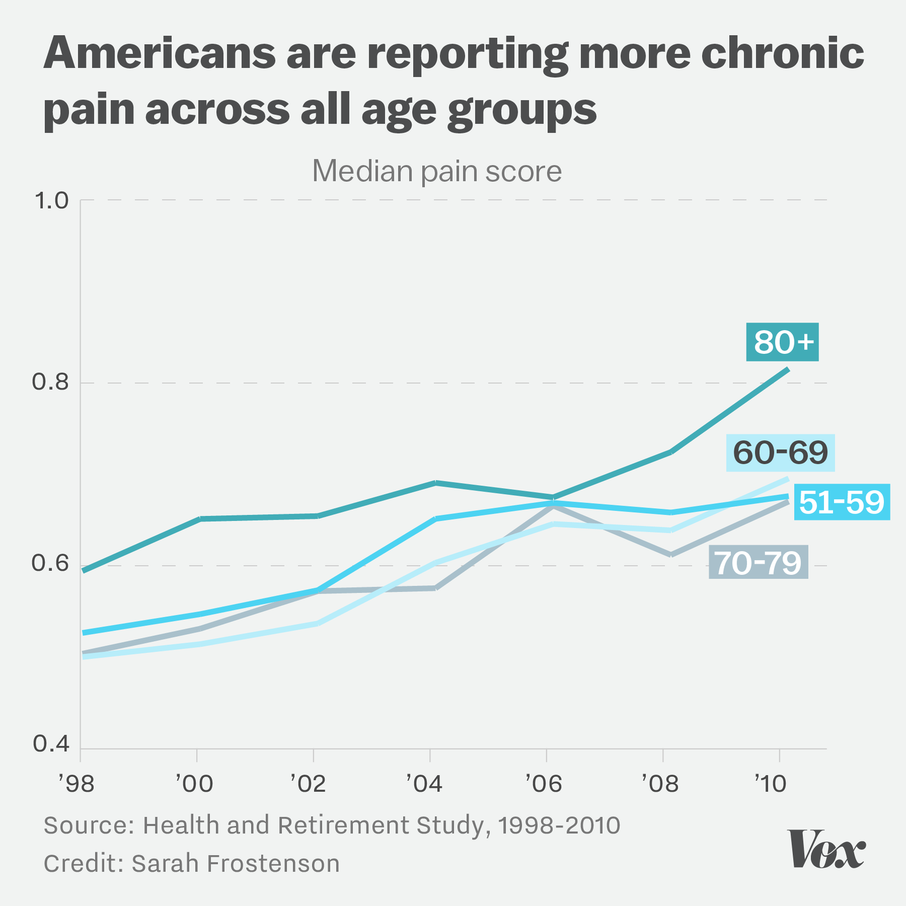
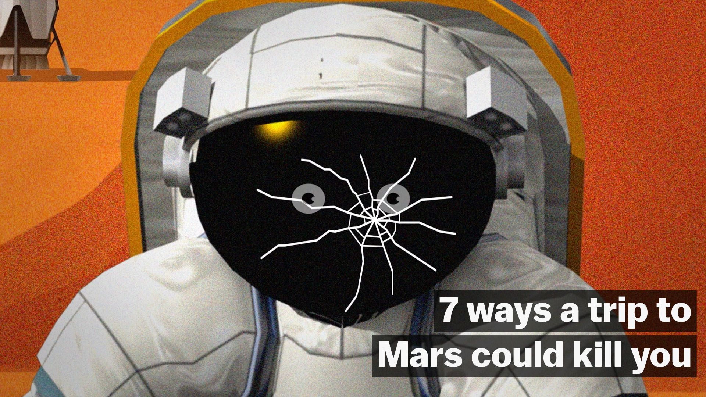

The risk of a single 5-day opioid prescription, in one chart

# The risk of a single 5-day opioid prescription, in one chart

## Limiting the length of opioid prescriptions isn’t inhumane. It could save lives.

Updated by   [Sarah Frostenson](http://www.vox.com/authors/sarah-frostenson)[@sfrostenson](http://www.twitter.com/sfrostenson)[sarah.frostenson@vox.com](http://www.vox.com/2017/3/18/14954626/one-simple-way-to-curb-opioid-overuse-prescribe-them-for-3-days-or-lessmailto:sarah.frostenson@vox.com)     Mar 18, 2017, 7:30am EDT

- [  tweet](https://twitter.com/intent/tweet?counturl=http%3A%2F%2Fwww.vox.com%2F2017%2F3%2F18%2F14954626%2Fone-simple-way-to-curb-opioid-overuse-prescribe-them-for-3-days-or-less&text=The+risk+of+a+single+5-day+opioid+prescription%2C+in+one+chart&url=http%3A%2F%2Fwww.vox.com%2F2017%2F3%2F18%2F14954626%2Fone-simple-way-to-curb-opioid-overuse-prescribe-them-for-3-days-or-less&via=voxdotcom)

- [  share](https://www.facebook.com/sharer/sharer.php?text=The+risk+of+a+single+5-day+opioid+prescription%2C+in+one+chart&u=http%3A%2F%2Fwww.vox.com%2F2017%2F3%2F18%2F14954626%2Fone-simple-way-to-curb-opioid-overuse-prescribe-them-for-3-days-or-less)

Now that it’s clear opioid painkillers have helped cause [the worst drug epidemic in history](http://www.vox.com/2015/10/1/9433099/opioid-painkiller-heroin-epidemic), health experts are scrambling to figure out when dependency on these powerful prescription drugs starts — and how to prevent it.

A new [study](https://www.cdc.gov/mmwr/volumes/66/wr/mm6610a1.htm) from the Centers for Disease Control and Prevention looked at the relationship between the number of days of someone’s first opioid prescription and their long-term use. It found that that number has a huge impact: Patients face an increased risk of opioid dependency in as few as four days of taking the drugs.

As you can see in the chart below, opioid prescriptions longer than five days in length significantly increased the likelihood of continued opioid use both one and three years later.

   

"There’s nothing magical about five days versus six days, but with each day your risk of dependency increases fairly dramatically," said Bradley Martin of the CDC, one of the study authors.

The study, which analyzed 1.3 million non-cancer patients, also found that only 6 percent of patients prescribed a one-day supply of opioids were still taking the drugs a year later, but that number doubled to 12 percent if patients were prescribed a six-day supply and quadrupled to 24 percent if patients were given a 12-day supply.

### Dependency on opioids can develop quickly, and it isn’t clear if they are even effective in treating chronic pain

Some in the medical community have pushed back against [CDC guidelines](http://www.cdc.gov/drugoverdose/pdf/guidelines_at-a-glance-a.pdf) released last spring that advise initial opioid prescriptions be limited to seven days or less, arguing that short prescriptions puts patients at risk of ["inhumane treatment."](https://www.statnews.com/2017/02/24/opioids-prescribing-limits-pain-patients/)

According to Martin, this argument doesn’t hold up well since, for one, we don’t have good data on the [effectiveness of opioids](https://www.ncbi.nlm.nih.gov/pmc/articles/PMC1459894/) to treat long-term pain.

What’s more, Martin is concerned that doctors still don’t appreciate just how quickly people can get hooked on these drugs. "[For people who] take an opioid for 10 days, almost one in five will still be taking opioids one year later," said Martin.

To be clear, the researchers are not equating long-term opioid use with addiction in their study. But given that opioid addiction rates and overdose deaths are high, they’re hoping physicians will make more careful opioid prescribing decisions to reduce the risk of patients developing long-term issues with the drugs.

There’s no question that America’s use [of opioids](https://www.washingtonpost.com/news/wonk/wp/2017/03/15/americans-use-far-more-opioids-than-anyone-else-in-the-world/?utm_term=.c5611edfd553) is excessive — we consume far more daily doses per capita than any other country, according to United Nations [data](https://www.incb.org/incb/en/narcotic-drugs/Technical_Reports/narcotic_drugs_reports.html) of the top 25 countries that use opioids.

   

### Limiting the length of opioid prescriptions saves lives, but a growing number of people are living in pain

Unfortunately, chronic pain isn’t easy to diagnose, measure, or treat. More than a third of Americans now experience chronic pain — more than those who have cancer, heart disease, and diabetes combined. What’s more, the [severity of pain](http://www.vox.com/science-and-health/2017/3/15/14903130/more-americans-pain-opioids-disturbing-medical-mystery) Americans report is increasing each year.

   

The CDC authors found in their study that patients who continued to use opioids for more than a year were more likely to be older, to be female and to have a preexisting pain diagnosis. This confirms much of what [Hanna Grol-Prokopczyk](http://sociology.buffalo.edu/faculty-staff/grol-prokopczyk/), a medical sociologist at the University at Buffalo, has found in her [research](http://www.buffalo.edu/news/releases/2017/02/009.html) on pain.

In a 2016 [paper](http://www.buffalo.edu/news/releases/2017/02/009.html), Grol-Prokopczyk uncovered huge disparities in how Americans experience pain. Examining 12 years of data from the biennial [Health and Retirement Study](http://hrsonline.isr.umich.edu/), she found that women were more likely to experience severe pain than men, and that pain doesn’t decrease as we age. In fact, it goes up with age, and those over the age of 80 reported experiencing the most pain.

   

Grol-Prokopczyk cautioned me that as we move forward in rethinking our approach to prescribing opioids and how we treat chronic pain, we can’t forget there is a sizable minority of Americans living in pain.

"Let’s recognize that we need to invest in either figuring out how to prevent chronic pain or treat[ing] it in a way that doesn’t have all the deleterious effects of opioids," she said. "Unfortunately, I don’t have a great answer for what the alternative is, but I want to make sure that we don’t just think, ‘Okay, let’s limit opioid prescriptions, and we’re all done.’"

#### Was this article helpful?

###   Next Up In  [**Science & Health](http://www.vox.com/science-and-health)

- [5 ways to think about the remarkable slowdown in global CO2 emissions](http://www.vox.com/energy-and-environment/2017/3/21/14998536/slowdown-co2-emissions)

- [“If it wasn’t for insurance, I wouldn’t be here”: how Obamacare’s end would worsen the opioid crisis](http://www.vox.com/science-and-health/2017/3/21/14944758/obamacare-repeal-opioid-heroin-epidemic)

- [7 psychological concepts that explain the Trump era of politics](http://www.vox.com/science-and-health/2017/3/20/14915076/7-psychological-concepts-explain-trump-politics)

- [Gwyneth Paltrow is now in the poorly regulated, often scammy online vitamin business. What could go wrong?](http://www.vox.com/2017/3/20/14982616/gwyneth-paltrow-vitamins-goop)

- [Physicist Lawrence Krauss on the greatest scientific story ever told](http://www.vox.com/conversations/2017/3/20/14947086/lawrence-krauss-donald-trump-science-religion-facts-god-education)

- [The case against empathy](http://www.vox.com/conversations/2017/1/19/14266230/empathy-morality-ethics-psychology-science-compassion-paul-bloom)

Play Video

###   Vox Sentences

The news, only shorter, delivered straight to your inbox.

By signing up you agree to our [terms of use](http://www.voxmedia.com/terms-of-use). For more newsletters, check out our [newsletters page](http://www.vox.com/newsletters).

This Article has a component height of 27. The sidebar size is long.

Recommended

- [       Gigantic Movies That Are All Coming Out In 2017  Sponsored | DailyForest](http://www.dailyforest.com/entertainment/movies-see-2017?utm_medium=outbrain&utm_source=outbrainjk&utm_campaign=movies-see-2017&)
- [       Where the World's Billionaires Live  Sponsored | Mansion Global by Dow Jones](http://www.mansionglobal.com/?mod=mansiongl_homepage_outbrain_Oct1)
- [             Katie Hopkins tears apart 'London boy' over nonsensical Brexit remark in savage LBC rant  Sponsored | The Express](http://www.express.co.uk/news/uk/754451/Katie-Hopkins-tears-apart-London-boy-nonsensical-Brexit-remark-LBC-rant?utm_source=externaloutbrain&utm_medium=recommendations&utm_term=paid&utm_content=news&utm_campaign=2016&utm_term=00e57831f8cad5704046ba5cb8efd42bf9)
- [             'Rejoice!' Diane Abbott is laughing stock once again as Andrew Neil ridicules her on BBC  Sponsored | The Express](http://www.express.co.uk/news/uk/765546/Diane-Abbott-Labour-BBC-Brexit?utm_source=externaloutbrain&utm_medium=recommendations&utm_term=paid&utm_content=news&utm_campaign=2016&utm_term=00e57831f8cad5704046ba5cb8efd42bf9)
- [       The Most Daring Oscar Dresses Of All Time  Sponsored | Livingly](http://www.livingly.com/The+Most+Daring+Oscar+Dresses?utm_source=outb&utm_medium=cpc&utm_campaign=Outb-LV-Specials-X1-Desktop-Daring-Oscar-Dresses)
- [       Awesomely Aggressive Windshield Notes You Should Totally Steal  Sponsored | Gloriousa](http://www.gloriousa.com/entertainment/15-hilarious-windshield-notes-see?utm_medium=outbrain&utm_source=outbrainjk&utm_campaign=15-hilarious-windshield-notes-see&)

[Recommended by](http://www.outbrain.com/what-is/default/en)

##   The Latest

 

## [Marijuana legalization opponents warned teen pot use would go up. So far, it hasn’t.](http://www.vox.com/policy-and-politics/2017/3/21/15009424/marijuana-legalization-washington-teens)

by   [German Lopez](http://www.vox.com/authors/german-lopez)

 [(L)](http://www.vox.com/2017/3/21/15004126/oscars-graphic-design)

## [Bad typography has ruined more than just the Oscars](http://www.vox.com/2017/3/21/15004126/oscars-graphic-design)

by   [Christophe Haubursin](http://www.vox.com/authors/christophe-haubursin)

 [(L)](http://www.vox.com/identities/2017/3/21/15009154/neil-gorsuch-hearings-maternity-leave-pregnancy-discrimination)

## [Neil Gorsuch is denying former students' claims that he made sexist remarks in class](http://www.vox.com/identities/2017/3/21/15009154/neil-gorsuch-hearings-maternity-leave-pregnancy-discrimination)

by   [Emily Crockett](http://www.vox.com/authors/emily-crockett)

 [(L)](http://www.vox.com/2017/3/20/14988750/ahca-medicaid-obamacare-work-requirements-block-grant-ryan-trump)

## [Republicans are making the American Health Care Act even crueler to Medicaid recipients](http://www.vox.com/2017/3/20/14988750/ahca-medicaid-obamacare-work-requirements-block-grant-ryan-trump)

by   [Dylan Matthews](http://www.vox.com/authors/dylan)

 [(L)](http://www.vox.com/culture/2017/3/21/14980506/mass-effect-andromeda-scifi-small-talk)

## [Mass Effect is a science fiction game franchise about the joys of small talk](http://www.vox.com/culture/2017/3/21/14980506/mass-effect-andromeda-scifi-small-talk)

by   [Peter Suderman](http://www.vox.com/authors/peter-suderman)

 [(L)](http://www.vox.com/policy-and-politics/2017/3/21/15002622/freedom-caucus-votes-block-health-bill)

## [Freedom Caucus chair: Paul Ryan does not have the votes to pass the health bill](http://www.vox.com/policy-and-politics/2017/3/21/15002622/freedom-caucus-votes-block-health-bill)

by   [Tara Golshan](http://www.vox.com/authors/tara-golshan)