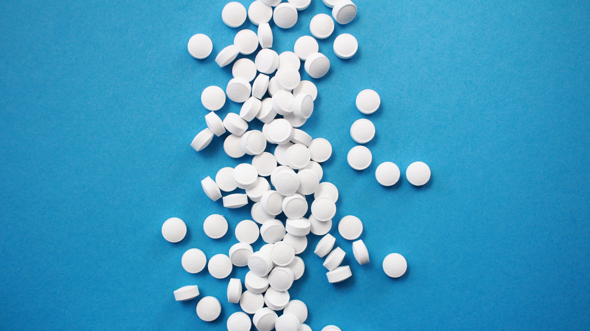

The science behind the 15 most common smart drugs

# The science behind the 15 most common smart drugs

A smart habit?

*More photos from this reportage are featured in Quartz’s new book *[The Objects that Power the Global Economy](https://store.qz.com/). *You may not have seen these objects before, but they’ve already changed the way you live. Each chapter examines an object that is driving radical change in the global economy. This is from the chapter on the drug modafinil, which explores modifying the mind for a more productive life. *

Not all drug users are searching for a chemical escape hatch. A newer and increasingly normalized drug culture is all about heightening one’s current relationship to reality—whether at work or school—by boosting the brain’s ability to think under stress, stay alert and productive for long hours, and keep track of large amounts of information. In the name of becoming sharper traders, medical interns, or coders, people are taking pills typically prescribed for conditions including ADHD, narcolepsy, and Alzheimer’s. Others down “stacks” of special “nootropic” supplements.

For obvious reasons, it’s difficult for researchers to know just how common the “smart drug” or “neuro-enhancing” lifestyle is. However, a few recent studies suggest cognition hacking is appealing to a growing number of people. A survey conducted in 2016 found that [15% of University of Oxford students](http://cherwell.org/2016/05/13/revealed-oxfords-addiction-to-study-drugs/) were popping pills to stay competitive, a rate that mirrored findings from other national surveys of UK university students. In the US, [a 2014 study](https://www.eurekalert.org/pub_releases/2014-05/aaop-mil042514.php) found that 18% of sophomores, juniors, and seniors at Ivy League colleges had knowingly used a stimulant at least once during their academic career, and among those who had ever used uppers, 24% said they had popped a little helper on eight or more occasions. Anecdotal evidence suggests that pharmacological enhancement is also on the rise within the workplace, [where modafinil,](https://www.theatlantic.com/health/archive/2015/08/the-rise-of-work-doping/402373/) which treats sleep disorders, has become particularly popular.

(Mathery)

In Silicon Valley, where [the Nootropic market is most developed,](https://www.washingtonpost.com/national/health-science/tweaking-brains-with-smart-drugs-to-get-ahead-in-silicon-valley/2017/06/09/5bc9c064-0b35-11e7-93dc-00f9bdd74ed1_story.html?utm_term=.662e7d00ba10) devotees typically take a cocktail of pills, often mixing natural supplements that are readily available and legal, with lab-designed drugs that may be unregulated in the US, but still easily purchased online and shipped in from other countries.

But do these brain-hacking drugs actually make you smarter? The answers are murky at best.

Here’s a cheat sheet of 15 of the most commonly touted cognitive-boosting pills that have also been studied in clinical trials.

## Amphetamine and dextroamphetamine (Adderall)

**Why brain hackers use it:**

The US Food and Drug Administration (FDA) has approved Adderall for only one purpose: to treat [Attention Deficit Hyperactivity Disorder.](https://qz.com/914046/proof-that-adhd-is-a-brain-disorder-the-brains-of-those-with-adhd-are-smaller-than-the-rest-of-the-population/)However, it’s commonly used off-label as a study aid, and to stay alert and focused in high-pressure jobs.

**The evidence says:**

A large review [published in 2011](https://www.ncbi.nlm.nih.gov/pmc/articles/PMC3591814/) found that the drug aids with the type of memory that allows us to explicitly remember past events (called long-term conscious memory), as opposed to the type that helps us remember how to do things like riding a bicycle without thinking about it (known as procedural or implicit memory.) The evidence is mixed on its effect on other types of executive function, such as planning or ability on fluency tests, which measure a person’s ability to generate sets of data—for example, words that begin with the same letter.

**You should know: **Can become addictive with overuse. Some common side effects include anxiety, weight loss, sweating, sleeplessness, lack of interest in sex, and nausea. Adderall has also been associated with a higher risk of [psychosis,](https://www.ncbi.nlm.nih.gov/pmc/articles/PMC3489818/)[heart attacks](https://www.ncbi.nlm.nih.gov/pmc/articles/PMC3489818/)[, and even sudden death.](https://www.ncbi.nlm.nih.gov/pmc/articles/PMC3489818/)

## **Aniracetam**

**Why brain hackers use it: **This member of [the “racetam” class](http://nootropicgeek.com/what-are-racetams-and-how-do-they-work/) of nootropic drugs is thought to reduce anxiety and foster creativity.

**The evidence? **A 2012 study in Greece found it can [boost cognitive function](https://www.ncbi.nlm.nih.gov/pubmed/22070796) in adults with mild cognitive impairment (MCI), a type of disorder marked by forgetfulness and problems with language, judgement, or planning that are more severe than average “senior moments,” but are not serious enough to be diagnosed as dementia. In some people, MCI will progress into dementia.

**You should know: **It’s not FDA approved. Independent bloggers have self-reported side effects such as nausea, anxiety, jaw tension, and vertigo.

## **Ashwagandha (Withania somnifera)**

**Why brain hackers use it: **This herbal supplement is used to calm anxiety and increase focus.

**The evidence? **[Several small human studies](https://www.psychologytoday.com/blog/inner-source/201401/ashwaganda-anxiety) have found it can effectively reduce anxiety, although study size and controls varied.

**You should know: **Headaches are the [most commonly reported side effect,](http://www.webmd.com/vitamins-supplements/ingredientmono-953-ashwagandha.aspx?activeingredientid=953) according to WebMD, though the herb can also cause reduced blood pressure, irritate stomach ulcers, and affect thyroid disorders.

## **Bacopa monnieri**

**Why brain hackers use it: **This supplement is thought to enhance thinking, learning, and memory.

**The evidence?** A 2014 [meta-analysis of double-blind, controlled trials](https://www.ncbi.nlm.nih.gov/pubmed/24252493) found a “potential to improve cognition, particularly speed of attention” in healthy patients and people with dementia.

**You should know: **Can cause [frequent bowel movements](http://www.webmd.com/vitamins-supplements/ingredientmono-761-bacopa.aspx?activeingredientid=761&activeingredientname=bacopa), cramps, nausea, dry mouth, and fatigue. Can also slow your heart rate, making it a concern for anyone who already has bradycardia (a slow heart rate.) It may also worsen lung conditions, ulcers, urinary tract and gastrointestinal obstructions, and thyroid disorders.

## **

Carnitine / Acetyl-L-Carnitine**

**Why brain hackers use it:**  [Acetyl is advertised](https://nootriment.com/acetyl-l-carnitine/) as supportive of “memory, learning, computation, analysis” and “perception” in the brain-hacking community.

**The evidence? **Studies [have not shown](https://ods.od.nih.gov/factsheets/Carnitine-HealthProfessional/) that the supplement has any cognitive effect in healthy people. It may improve brain health in people with liver disease, and in people with dementia.

**You should know: **It can lead to gastrointestinal distress, including vomiting and diarrhea. [May cause “fishy” body odor.](http://www.webmd.com/vitamins-supplements/ingredientmono-1026-l-carnitine.aspx?activeingredientid=1026)

## **

Creatine**

**Why brain hackers use it: **Said to enhance mental function in sleep-deprived adults and generally improve performance on difficult cognitive tasks.

**The evidence?** It has shown promise to help [treat cognitive decline,](https://www.ncbi.nlm.nih.gov/pubmed/22465051) in combination with other therapies, in people with Huntington’s Disease and Parkinson’s.

**You should know: **Can cause gastrointestinal issues, weight gain, and anxiety when used in excess.

## **Donepezil (Aricept)**

**What brain hackers believe it’s good for: **The drug is said to improve memory and ability to complete complex tasks.

**The evidence?** Donepezil is FDA-approved to treat symptoms of Alzheimer’s. In one small, [well-known trial,](https://www.ncbi.nlm.nih.gov/pmc/articles/PMC4063424/) it improved procedural memory—the type that allows us to remember how to do things like walk or ride a bicycle—in healthy pilots.

**You should know: **Taking it can lead to sleep problems, appetite loss, vomiting, and other more serious side effects.

## **

Huperzine A**

**Why brain hackers use it: **This supplement is thought to improve short-term memory and long-term cognition by protecting [acetylcholine](https://www.ncbi.nlm.nih.gov/pubmed/18425924)—a neurotransmitter—[from degradation](https://www.ncbi.nlm.nih.gov/pubmed/18425924).

**The evidence? **A 2013 meta-analysis of clinical studies suggests it [may improve memory](https://www.ncbi.nlm.nih.gov/pubmed/24086396) and mental function in adults with dementia, though the authors of the review appended a warning that “the findings should be interpreted with caution due to the poor methodological quality of the included trials.”

**You should know: **May [worsen many health conditions](http://www.webmd.com/vitamins-supplements/ingredientmono-764-huperzine%20a.aspx?activeingredientid=764&activeingredientname=huperzine%20a), such as heart disease, epilepsy, peptic ulcers, asthma, and emphysema.

## **

L-Deprenyl (Selegiline hydrochloride)**

**Why brain hackers use it: **This monoamine oxidase inhibitor (MAOI) is considered a mood booster and believed to help with attention and planning.

**The evidence? **Used to treat symptoms in early Parkinson’s and is in a family of drugs (MAOIs) that includes a number of last-resort antidepressants. Small studies show it can improve [cognitive functioning in stroke patients,](https://www.ncbi.nlm.nih.gov/pubmed/25592412) and [enhance cognitive skills in rats](https://www.ncbi.nlm.nih.gov/pubmed/11031090) with traumatic brain injury.

**You should know: **[Might trigger sudden high blood pressure](https://www.drugs.com/monograph/selegiline-hydrochloride.html) when taken in high doses or in combination with certain foods, like cheese. Can also be dangerous in combination with other drugs.

## **

Methylphenidate (Ritalin)**

**Why brain hackers use it: **Ritalin is a popular study drug taken to stay awake and improve focus and memory.

**The evidence?** Ritalin is FDA-approved to treat ADHD. It has also been shown to help patients with traumatic brain injury concentrate for longer periods, but does not improve memory in those patients, according to [a 2016 meta-analysis](https://www.ncbi.nlm.nih.gov/pubmed/26951094) of several trials. A [study published in 2012](https://kclpure.kcl.ac.uk/portal/en/publications/comparative-psychopharmacology-of-methylphenidate-and-related-drugs-in-human-volunteers-patients-with-adhd-and-experimental-animals(d93dba48-8987-4482-b053-c5a649555048).html) found that low doses of methylphenidate improved cognitive performance, including working memory, in healthy adult volunteers, but high doses impaired cognitive performance and a person’s ability to focus. (Since the brains of teens have been found to be [more sensitive to the drug’s effect,](http://journal.frontiersin.org/article/10.3389/fnsys.2014.00038/full) it’s possible that methylphenidate in lower doses could have adverse effects on working memory and cognitive functions.)

**You should know: **Animal studies show long-term use of the drug [may reduce plasticity and weaken memory function](http://io9.gizmodo.com/smart-drugs-could-be-impairing-the-brains-of-young-peop-1576908559) in young brains. In both adolescents and adults it can cause nervousness, sweating, blurred vision, reduced appetite, weight loss, and nausea.

## **

Modafinil (Provigil)**

**Why brain hackers use it: **The FDA has approved modafinil for the treatment of narcolepsy, but people without the condition take it to feel more alert, improve motivation and reaction time, and enhance mental function.

**The evidence? **[In small studies](http://www.sciencedirect.com/science/article/pii/S0028390812003449), healthy people taking modafinil showed improved planning and working memory, and [better reaction time, spatial planning,](https://link.springer.com/article/10.1007%2Fs00213-002-1250-8?LI=true) and visual pattern recognition. A [2015 meta-analysis](http://www.europeanneuropsychopharmacology.com/article/S0924-977X(15)00249-7/abstract) claimed that “when more complex assessments are used, modafinil appears to consistently engender enhancement of attention, executive functions, and learning” without affecting a user’s mood. In [a study from earlier this year involving 39 male chess players,](https://www.sciencedaily.com/releases/2017/03/170306091726.htm) subjects taking modafinil were found to perform better in chess games played against a computer.

**You should know: **Long-term use of modafinil may reduce plasticity and harm memory in young brains—a side effect shared with Ritalin.

## **

Noopept**

**Why brain hackers use it: **Nootropic proponents claim that noopept enhances memory retention and learning skills, and increases focus

**The evidence?** A [2007 study](https://www.ncbi.nlm.nih.gov/pubmed/?term=noopept+AND+cognitive+enhancement) with mice showed that it may enhance cognitive function (and especially spatial reasoning) connected to neurodegenerative diseases, such as Alzheimer’s.

**You should know:** The drug was developed in Russia to treat age-related cognitive decline, but it is unregulated in the US, UK, and elsewhere.

## **Omega-3 EPA and DHA**

**Why brain hackers use it: **Omega 3 supplements—most of which are made from fish oils and contain both EPA and DHA fatty acids—are believed to reduce stress, improve concentration, and speed up reaction time.

**The evidence?** Although everyone can benefit from dietary sources of essential fatty acids, supplementation is especially recommended for people with heart disease. A [small study published in 2013](https://www.ncbi.nlm.nih.gov/pubmed/23515006) found that DHA may enhance memory and reaction time in healthy young adults. However, [a more recent review](https://www.ncbi.nlm.nih.gov/pubmed/26040902) suggested that there is not enough evidence of any effect from omega 3 supplementation in the general population.

**You should know:**  [WebMD reports that](http://www.webmd.com/vitamins-supplements/ingredientmono-864-Omega+3+DHA+DOCOSAHEXAENOIC+ACID.aspx?activeIngredientId=864&activeIngredientName=Omega+3+(DHA+(DOCOSAHEXAENOIC+ACID))&source=2) “fish oils containing DHA can cause fishy taste, belching, nosebleeds, and loose stools.”

## **

Piracetam**

**Why brain hackers use it: **Another member of [the “racetam” class](http://nootropicgeek.com/what-are-racetams-and-how-do-they-work/) of nootropic drugs**, **piracetam is thought to enhance learning, memory, and concentration by improving blood flow to the brain.

**The evidence?** Found helpful in reducing bodily twitching in myoclonus epilepsy, a rare disorder, but [otherwise little studied](http://www.newyorker.com/magazine/2009/04/27/brain-gain). Mixed evidence from a study published in 1991 suggests it may improve memory in subjects with [cognitive impairment](https://www.ncbi.nlm.nih.gov/pubmed/1794001). A [meta-analysis published in 2010](https://www.ncbi.nlm.nih.gov/pubmed/20166767) that reviewed studies of piracetam and other racetam drugs found that piracetam was somewhat helpful in improving cognition in people who had suffered a stroke or brain injury; the drugs’ effectiveness in treating depression and reducing anxiety was more significant.

**You should know:** Piracetam is generally well-tolerated, though it can cause an allergic reaction, nervousness, anxiety, balance and coordination problems, and [other side effects](https://www.drugs.com/uk/piracetam-800mg-tablets-leaflet.html).

## **Tyrosine**

**Why brain-hackers use it:** To enhance memory, alertness, focus, and ability to solve problems creatively.

**The evidence? **Military studies suggest this supplement may aid memory, focus, and alertness in healthy patients[under the extreme stress](https://www.ncbi.nlm.nih.gov/pubmed/2736402) of military setting. And although working memory is normally hampered in cold environments, taking a tyrosine supplement buffers that effect, according to [another small study.](https://www.ncbi.nlm.nih.gov/pubmed/17585971)

**You should know:**  [Side effects](http://www.webmd.com/vitamins-supplements/ingredientmono-1037-TYROSINE.aspx?activeIngredientId=1037&activeIngredientName=TYROSINE&source=2) include nausea, headache, fatigue, heartburn, and joint pain.

*Check out Quartz’s new book*  [The Objects that Power the Global Economy.](https://store.qz.com/)

*This article is for informational purposes only and does not constitute medical advice. Quartz does not recommend or endorse any specific products, studies, opinions, or other information mentioned in this article. This article is not intended to be used for, or as a substitute for, professional medical advice, diagnosis, or treatment. Always seek the advice of a physician or other qualified health provider with any questions you may have before starting any new treatment or discontinuing any existing treatment.Reliance on any information provided in this article or by Quartz is solely at your own risk.*

#### Most Popular

### [For the first time in 152 years, a supermoon, blue moon, and total lunar eclipse will coincide](https://qz.com/1189777/a-supermoon-and-total-lunar-eclipse-will-coincide-for-the-first-time-in-152-years/)