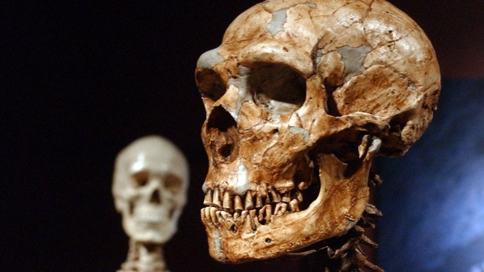
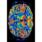

The shape, not size, of our ancestors' brains may have helped them outlast Neanderthals

Advertisement

- [Science Now](http://www.latimes.com/science/sciencenow/#nt=taxonomy-article)

- [Science](http://www.latimes.com/science/#nt=taxonomy-article)

- [LA Times](http://www.latimes.com/#nt=taxonomy-article)

# The shape, not size, of our ancestors' brains may have helped them outlast Neanderthals

 

 By [Deborah Netburn](http://www.latimes.com/la-bio-deborah-netburn-staff.html#nt=byline)

  Apr 27, 2018   |   3:00 AM

   [**](http://www.latimes.com/science/sciencenow/la-sci-sn-neanderthal-human-brains-20180427-story.htmlmailto:?subject=The%20shape%2C%20not%20size%2C%20of%20our%20ancestors%27%20brains%20may%20have%20helped%20them%20outlast%20Neanderthals&body=http%3A%2F%2Fwww.latimes.com%2Fscience%2Fsciencenow%2Fla-sci-sn-neanderthal-human-brains-20180427-story.html)

 

A reconstructed Neanderthal skeleton, foreground, and a modern human version on display at the American Museum of Natural History in New York. (Frank Franklin II / Associated Press)

For more than 200,000 years, Neanderthals successfully occupied the cold, dark forests and shores of Europe.

Then early humans came along.

 **

Advertisement

 **

Archaeological evidence suggests that human migrants from Africa arrived on the European continent around 40,000 years ago. About that same time, the Neanderthals all died off.

 **

For decades, anthropologists have puzzled over what factors contributed to this rapid and total replacement of Neanderthals by their modern human cousins.

 **

 **

Now, a multi-disciplinary team including mechanical engineers, neuroscientists and physical anthropologists have provided a new clue to this mystery by creating the first digital reconstruction of four Neanderthal brains.

 **

By comparing these brains with an average human brain, the authors suggest that different ways of processing information may have helped humans outcompete their hominid cousins.

The work was published Thursday in [Scientific Reports](http://nature.com/articles/doi:10.1038/s41598-018-24331-0).

To reconstruct a Neanderthal brain, the authors started by measuring the overall shape of the inside of four Neanderthal skulls.

 **

 **

Next, they created an "average" digital modern human brain and skull by combining MRI data of more than 1,000 modern humans.

 **

Once they had these two measurements, they were able to use a computer program to warp the size and shape of the human brain to match the shape of the interior of the Neanderthals' skulls in a process called deformation.

This method is not entirely untested. The authors report that the same process has been shown to effectively re-create the structure of a bonobo brain by morphing a chimpanzee brain, and vice versa.

Using this technique, the researchers discovered that while the two types of brains were about the same size, there was a clear difference in shape.

In particular, the authors found that the cerebellum, a region of the brain that lies toward the lower back of our heads, was significantly larger in humans than in Neanderthals.

This part of the brain is associated with speech comprehension and production, working memory and cognitive flexibility, said [Naomichi Ogihara](http://www.ogihara.mech.keio.ac.jp/ogihara_English.html), a mechanical engineer at Keio University in Yokohama, Japan, who worked on the study.

And in this region of the brain, size does matter.

The researchers demonstrated this by looking at data on brain size and abilities from 1,095 people that showed a clear relationship between the size of the cerebellum and language comprehension and cognitive flexibility.

 **

Advertisement

 **

The authors propose that because of their relatively small cerebellums, Neanderthals may have been less able to adapt to changes in the environment compared with the early human invaders, giving the humans a tremendous advantage.

 **

However, the team's reconstructions also suggested Neanderthals did have at least one advantage over early humans. The visual processing center of their brains, known as the occipital lobe, was larger than their human counterparts.

Ogihara said the Neanderthals may have developed this adaptation in response to the low light levels in Europe compared with Africa, but it could have hindered them from expanding the cerebellum.

If that is indeed the case, this volumetric trade-off worked for a very long time — until it didn't.

Oh, and one more thing: Readers should remember, however, that this attempt to reconstruct the brain inside a fossil skull is new to the field, and perhaps could be improved upon in the future, Ogihara said.

"We would like to further elaborate our methodology by exchanging thoughts and ideas with researchers in the related fields working on human brain evolution," he said.

He'd also like to use this method to reconstruct the brains of other hominins in the future.

********[**deborah.netburn@latimes.com**](http://www.latimes.com/science/sciencenow/la-sci-sn-neanderthal-human-brains-20180427-story.htmlmailto:deborah.netburn@latimes.com)********

****Do you love science? I do! Follow me [@DeborahNetburn](https://twitter.com/DeborahNetburn)  ****and "like" Los Angeles Times Science & Health on [Facebook](https://www.facebook.com/latimesscience).****

****MORE IN SCIENCE ****

**[Here's why the apparent increase in autism spectrum disorders may be good for U.S. children](http://www.latimes.com/science/sciencenow/la-sci-sn-autism-american-children-20180426-story.html#nt=oft-Single%20Chain~Feed-Driven%20Flex%20Feature~~sub-topic-feed-0~311~1~yes-art~automated~automatedpage)**

**[A pileup of 14 distant galaxies is set to become the most massive structure in the universe](http://www.latimes.com/science/sciencenow/la-sci-sn-galaxy-mega-merger-20180425-story.html#nt=oft-Single%20Chain~Feed-Driven%20Flex%20Feature~~sub-topic-feed-3~811~1~yes-art~automated~automatedpage)**

**[Scientists have a promising new approach for treating drug-resistant tuberculosis](http://www.latimes.com/science/sciencenow/la-sci-sn-new-tb-treatment-20180425-story.html#nt=oft-Single%20Chain~Feed-Driven%20Flex%20Feature~~sub-topic-feed-2~811~1~yes-art~automated~automatedpage)**

 

###### Health and Science Newsletter

Weekly

* * *

The latest health and science updates, breakthroughs, research, and the best in investigative and informative journalism.

 [(L)](http://www.latimes.com/la-bio-deborah-netburn-staff.html)

 [ ###### Deborah Netburn](http://www.latimes.com/la-bio-deborah-netburn-staff.html)

 Contact    [**](https://twitter.com/@deborahnetburn)  [**](https://www.facebook.com/latimesscience/)  [**](http://www.latimes.com/science/sciencenow/la-sci-sn-neanderthal-human-brains-20180427-story.htmlmailto:deborah.netburn@latimes.com?subject=The%20shape%2C%20not%20size%2C%20of%20our%20ancestors%27%20brains%20may%20have%20helped%20them%20outlast%20Neanderthals&body=http%3A%2F%2Fwww.latimes.com%2Fscience%2Fsciencenow%2Fla-sci-sn-neanderthal-human-brains-20180427-story.html)

* * *

Deborah Netburn is a science reporter for the Los Angeles Times. She began her journalism career at the New York Observer in 1999, and has covered residential real estate, rich kids in Manhattan, entertainment, home and garden, national news, and technology. She has worked at the Los Angeles Times since 2006.

Advertisement

Latest News

-

    - [Column](http://www.latimes.com/science/sciencenow/la-sci-sn-neanderthal-human-brains-20180427-story.html#nt=taxonomy-article)

 [ ######  With new ideas to boost welfare grants, California lawmakers now must take on Gov. Jerry Brown](http://www.latimes.com/politics/la-pol-ca-road-map-california-budget-calworks-democrats-20180429-story.html#nt=latestnews)

  29m

 [(L)](http://www.latimes.com/politics/la-pol-ca-road-map-california-budget-calworks-democrats-20180429-story.html#nt=latestnews)

-

    - [Politics](http://www.latimes.com/politics/#nt=taxonomy-article)

 [ ######  Gavin Newsom leads fundraising in the California governor's race, but Antonio Villaraigosa gets a boost from allies](http://www.latimes.com/politics/la-pol-ca-california-governors-race-money-20180429-story.html#nt=latestnews)

  29m

 [(L)](http://www.latimes.com/politics/la-pol-ca-california-governors-race-money-20180429-story.html#nt=latestnews)

-

    - [Local](http://www.latimes.com/local/#nt=taxonomy-article)

 [ ######  Teen girl fatally shot near South L.A. hamburger stand](http://www.latimes.com/local/la-me-ln-girl-shot-20180428-story.html#nt=latestnews)

  1h

 [(L)](http://www.latimes.com/local/la-me-ln-girl-shot-20180428-story.html#nt=latestnews)

Advertisement

Latest Science Now

-

    - [Science Now](http://www.latimes.com/science/sciencenow/#nt=taxonomy-article)

 [Brainstorming the ethics of neuroscience research in the age of organoids](http://www.latimes.com/science/sciencenow/la-sci-sn-brain-organoid-ethics-20180427-story.html#nt=related-content)

  Apr 27, 2018

 

-

    - [Science Now](http://www.latimes.com/science/sciencenow/#nt=taxonomy-article)

 [The shape, not size, of our ancestors' brains may have helped them outlast Neanderthals](http://www.latimes.com/science/sciencenow/la-sci-sn-neanderthal-human-brains-20180427-story.html#nt=related-content)

  Apr 27, 2018

 

-

    - [Science Now](http://www.latimes.com/science/sciencenow/#nt=taxonomy-article)

 [Here's why the apparent increase in autism spectrum disorders may be good for U.S. children](http://www.latimes.com/science/sciencenow/la-sci-sn-autism-american-children-20180426-story.html#nt=related-content)

  Apr 26, 2018

 

-

    - [Science Now](http://www.latimes.com/science/sciencenow/#nt=taxonomy-article)

 [For firefighters who worked in World Trade Center rubble, the future includes a heightened risk of cancer](http://www.latimes.com/science/sciencenow/la-sci-sn-cancer-firefighters-wtc-20180426-story.html#nt=related-content)

  Apr 26, 2018

 

-

    - [Science Now](http://www.latimes.com/science/sciencenow/#nt=taxonomy-article)

 [Scientists have a promising new approach for treating drug-resistant tuberculosis](http://www.latimes.com/science/sciencenow/la-sci-sn-new-tb-treatment-20180425-story.html#nt=related-content)

  Apr 25, 2018

 

Advertisement

Advertisement

Advertisement

Advertisement

[  ](http://popup.taboola.com/en/?template=colorbox&utm_source=latimes&utm_medium=referral&utm_content=thumbs-1r:below-article-thumbs_ARC:)

[by Taboola ](http://popup.taboola.com/en/?template=colorbox&utm_source=latimes&utm_medium=referral&utm_content=thumbs-1r:below-article-thumbs_ARC:)

[Sponsored Links ](http://popup.taboola.com/en/?template=colorbox&utm_source=latimes&utm_medium=referral&utm_content=thumbs-1r:below-article-thumbs_ARC:)

FROM AROUND THE WEB

[(L)](http://digitalcrab.co.uk/?c=3730&a=929&s5=520aee&s4=i__do0127atmstreet__i.jpg&s1=TB_PPI_TE_GENERIC_DESKTOP%20&s2=latimes&s3=CjBhMzQ0NTNlZS0yMjlhLTQwNjEtOTlmNy0xOGM1MmYwMzA5MzgtdHVjdDE3NDY0NzISHGRpZ2l0YWxveXN0ZXItZ2VuZXJpY3BwaTItc2M)[Brilliant Way To Check If You Had PPIMoney Tips Online](http://digitalcrab.co.uk/?c=3730&a=929&s5=520aee&s4=i__do0127atmstreet__i.jpg&s1=TB_PPI_TE_GENERIC_DESKTOP%20&s2=latimes&s3=CjBhMzQ0NTNlZS0yMjlhLTQwNjEtOTlmNy0xOGM1MmYwMzA5MzgtdHVjdDE3NDY0NzISHGRpZ2l0YWxveXN0ZXItZ2VuZXJpY3BwaTItc2M)

Undo

[(L)](http://digitalcrab.co.uk/?c=4600&a=929&s5=51e60b&s4=i__do0039banksmirkfk__i.jpg&s1=TB_PPI_ALLAY_DESK4&s2=latimes&s3=Banks+Don%27t+Want+You+To+Know+About+This+Brilliant+PPI+Check)[Banks Don't Want You To Know About This Brilliant PPI CheckMoney Advice & Tips](http://digitalcrab.co.uk/?c=4600&a=929&s5=51e60b&s4=i__do0039banksmirkfk__i.jpg&s1=TB_PPI_ALLAY_DESK4&s2=latimes&s3=Banks+Don%27t+Want+You+To+Know+About+This+Brilliant+PPI+Check)

Undo

[(L)](https://ad.doubleclick.net/ddm/trackclk/N572608.1006845TABOOLA.COM/B20881573.217207832;dc_trk_aid=416099136;dc_trk_cid=99425200;dc_lat=;dc_rdid=;tag_for_child_directed_treatment=?utm_source=taboola&utm_medium=referral)[Microsoft® Outlook 2016 Access AnywhereMicrosoft](https://ad.doubleclick.net/ddm/trackclk/N572608.1006845TABOOLA.COM/B20881573.217207832;dc_trk_aid=416099136;dc_trk_cid=99425200;dc_lat=;dc_rdid=;tag_for_child_directed_treatment=?utm_source=taboola&utm_medium=referral)

Undo

[(L)](https://www.mylotto24.co.uk/play?target=ticket&iel_subscription=false&iel_jackpotHunter=false&iel_numberOfBlocks=4&iel_numberOfTickets=1&iel_duration=1&vaid=TAB_IL_441&campaignId=TAB_IL_441&funnelId=3&partnerId=1UKNATTABO&advertisementId=0011801152502220601&wt_mc=1UKNAT.TABO.0011801152502.220601&utm_source=1UKNAT&utm_medium=TABO&utm_campaign=0011801152502&utm_content=22&utm_term=0601&marketingId=1120279_80610462_latimes)[Irish Lotto - Get 4 Rows for the Price of 1MyLotto24](https://www.mylotto24.co.uk/play?target=ticket&iel_subscription=false&iel_jackpotHunter=false&iel_numberOfBlocks=4&iel_numberOfTickets=1&iel_duration=1&vaid=TAB_IL_441&campaignId=TAB_IL_441&funnelId=3&partnerId=1UKNATTABO&advertisementId=0011801152502220601&wt_mc=1UKNAT.TABO.0011801152502.220601&utm_source=1UKNAT&utm_medium=TABO&utm_campaign=0011801152502&utm_content=22&utm_term=0601&marketingId=1120279_80610462_latimes)

Undo

[(L)](https://plarium.com/play/en/throne/002_pastoral_am_g?publisherID=79860703&placement=latimes&plid=106787&pxl=taboola_fr)[Play this for 1 minute and see why everyone is addictedThrone: Free Online Game](https://plarium.com/play/en/throne/002_pastoral_am_g?publisherID=79860703&placement=latimes&plid=106787&pxl=taboola_fr)

Undo

[(L)](https://www.bnt.org.uk/dop?sku=22136/002&wk=1732613&campaign=Dis/taboola/sk&utm_source=taboola&utm_medium=display&utm_campaign=sk)[Stunning Tribute to 100 Years of RAF Takes Coin Collectors in Camden by StormBNT Coins](https://www.bnt.org.uk/dop?sku=22136/002&wk=1732613&campaign=Dis/taboola/sk&utm_source=taboola&utm_medium=display&utm_campaign=sk)

Undo