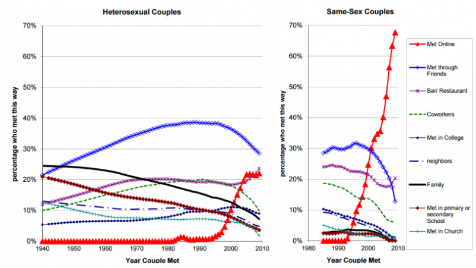

The way strangers meet via dating websites is changing society in unexpected ways, say researchers

### [Connectivity](https://www.technologyreview.com/topic/connectivity/)

# First Evidence That Online Dating Is Changing the Nature of Society

## Dating websites have changed the way couples meet. Now evidence is emerging that this change is influencing levels of interracial marriage and even the stability of marriage itself.

- by[Emerging Technology from the arXiv](https://www.technologyreview.com/profile/emerging-technology-from-the-arxiv/)
- October 10, 2017

- [**](https://www.technologyreview.com/s/609091/first-evidence-that-online-dating-is-changing-the-nature-of-society/#)
- [**](https://www.technologyreview.com/s/609091/first-evidence-that-online-dating-is-changing-the-nature-of-society/#)
- [**](https://www.technologyreview.com/s/609091/first-evidence-that-online-dating-is-changing-the-nature-of-society/#)
- [**](https://www.technologyreview.com/s/609091/first-evidence-that-online-dating-is-changing-the-nature-of-society/#)

Not so long ago, nobody met a partner online. Then, in the 1990s, came the first dating websites.

##### Recommended for You

1. [Charging Infrastructure Is a $2.7 Trillion Barrier to Electric Cars](https://www.technologyreview.com/the-download/609101/charging-infrastructure-is-a-27-trillion-barrier-to-electric-cars/)

2. [Israeli Spies Spied Russian Spies Spying on American Spy Plans via Kaspersky Software](https://www.technologyreview.com/the-download/609100/israeli-spies-spied-russian-spies-spying-on-american-spy-plans-via-kaspersky/)

3. [The Seven Deadly Sins of AI Predictions](https://www.technologyreview.com/s/609048/the-seven-deadly-sins-of-ai-predictions/)

4. [China’s AI Awakening 中国 人工智能 的崛起](https://www.technologyreview.com/s/609038/chinas-ai-awakening/)

5. [Forget Killer Robots—Bias Is the Real AI Danger](https://www.technologyreview.com/s/608986/forget-killer-robotsbias-is-the-real-ai-danger/)

Match.com went live in 1995. A new wave of dating websites, such as OKCupid, emerged in the early 2000s. And the 2012 arrival of Tinder changed dating even further. Today, more than one-third of marriages start online.

Clearly, these sites have had a huge impact on dating behavior. But now the first evidence is emerging that their effect is much more profound.

The way people meet their partners has changed dramatically in recent years

For more than 50 years, researchers have studied the nature of the networks that link people to each other. These social networks turn out to have a peculiar property.

One obvious type of network links each node with its nearest neighbors, in a pattern like a chess board or chicken wire. Another obvious kind of network links nodes at random. But real social networks are not like either of these. Instead, people are strongly connected to a relatively small group of neighbors and loosely connected to much more distant people.

These loose connections turn out to be extremely important. “Those weak ties serve as bridges between our group of close friends and other clustered groups, allowing us to connect to the global community,” say Josue Ortega at the University of Essex in the U.K. and Philipp Hergovich at the University of Vienna in Austria.

Loose ties have traditionally played a key role in meeting partners. While most people were unlikely to date one of their best friends, they were highly likely to date people who were linked with their group of friends; a friend of a friend, for example. In the language of network theory, dating partners were embedded in each other’s networks.

Indeed, this has long been reflected in surveys of the way people meet their partners: through mutual friends, in bars, at work, in educational institutions, at church, through their families, and so on.

Online dating has changed that. Today, online dating is the second most common way for heterosexual couples to meet. For homosexual couples, it is far and away the most popular.

That has significant implications. “People who meet online tend to be complete strangers,” say Ortega and Hergovich. And when people meet in this way, it sets up social links that were previously nonexistent.

The question that Ortega and Hergovich investigate is how this changes the racial diversity of society. “Understanding the evolution of interracial marriage is an important problem, for intermarriage is widely considered a measure of social distance in our societies,” they say.

The researchers start by simulating what happens when extra links are introduced into a social network. Their network consists of men and women from different races who are randomly distributed. In this model, everyone wants to marry a person of the opposite sex but can only marry someone with whom a connection exists. This leads to a society with a relatively low level of interracial marriage.

But if the researchers add random links between people from different ethnic groups, the level of interracial marriage changes dramatically. “Our model predicts nearly complete racial integration upon the emergence of online dating, even if the number of partners that individuals meet from newly formed ties is small,” say Ortega and Hergovich.

And there is another surprising effect. The team measure the strength of marriages by measuring the average distance between partners before and after the introduction of online dating. “Our model also predicts that marriages created in a society with online dating tend to be stronger,” they say.

Next, the researchers compare the results of their models to the observed rates of interracial marriage in the U.S. This has been on the increase for some time, but the rates are still low, not least because interracial marriage was banned in some parts of the country until 1967.

But the rate of increase changed at about the time that online dating become popular. “It is intriguing that shortly after the introduction of the first dating websites in 1995, like Match.com, the percentage of new marriages created by interracial couples increased rapidly,” say the researchers.

The increase became steeper in the 2000s, when online dating became even more popular.  Then, in 2014, the proportion of interracial marriages jumped again. “It is interesting that this increase occurs shortly after the creation of Tinder, considered the most popular online dating app,” they say.

Tinder has some 50 million users and produces more than 12 million matches a day.

Of course, this data doesn’t prove that online dating caused the rise in interracial marriages. But it is consistent with the hypothesis that it does.

Meanwhile, research into the strength of marriage has found some evidence that married couples who meet online have lower rates of marital breakup than those who meet traditionally. That has the potential to significantly benefit society. And it’s exactly what Ortega and Hergovich’s model predicts.

Of course, there are other factors that could contribute to the increase in interracial marriage. One is that the trend is the result of a reduction in the percentage of Americans who are white. If marriages were random, this should increase the number of interracial marriages, but not by the observed amount. “The change in the population composition in the U.S. cannot explain the huge increase in intermarriage that we observe,” say Ortega and Hergovich.

That leaves online dating as the main driver of this change. And if that’s the case, the model implies that this change is ongoing.

That’s a profound revelation. These changes are set to continue, and to benefit society as result.

Ref: [arxiv.org/abs/1709.10478](https://arxiv.org/abs/1709.10478) : The Strength of Absent Ties: Social Integration via Online Dating

Tech Obsessive?
Become an Insider to get the story behind the story — and before anyone else.

[Subscribe today](https://ssl.drgnetwork.com/ecom/MTR/app/live/subscriptions?org=MTR&publ=TR&key_code=PRSPRIS&type=S)

The way people meet their partners has changed dramatically in recent years

From Our Advertisers

- [In partnership with**Hewlett Packard Enterprise**  A Field Guide to Digital Transformation](https://www.technologyreview.com/s/603990/a-field-guide-to-digital-transformation/)
- [In partnership with**Hewlett Packard Enterprise**  A Fireside Chat: Unlocking the Power of Hybrid, Flexible IT](https://www.technologyreview.com/s/604216/a-fireside-chat-unlocking-the-power-of-hybrid-flexible-it/)
- [In partnership with**Samsung**  Fight Scale with Scale](https://www.technologyreview.com/s/608038/fight-scale-with-scale/)
- [Presented in partnership with**VMware**  The Bridge to Digital Transformation: The Move to a Software-Based Network Strategy](https://www.technologyreview.com/hub/the-bridge-to-digital-transformation/?utm_medium=sponsored-content-widget&utm_source=trsite&utm_campaign=vmware&utm_content=content-hub)

- [**](https://www.technologyreview.com/s/609091/first-evidence-that-online-dating-is-changing-the-nature-of-society/#)
- [**](https://www.technologyreview.com/s/609091/first-evidence-that-online-dating-is-changing-the-nature-of-society/#)
- [**](https://www.technologyreview.com/s/609091/first-evidence-that-online-dating-is-changing-the-nature-of-society/#)
- [**](https://www.technologyreview.com/s/609091/first-evidence-that-online-dating-is-changing-the-nature-of-society/#)

### Tagged

[online dating](https://www.technologyreview.com/g/online-dating/)

[Emerging Technology from the arXiv](https://www.technologyreview.com/profile/emerging-technology-from-the-arxiv/)

Emerging Technology from the arXiv covers the latest ideas and technologies that appear on the Physics arXiv preprint server. It is part of the Physics arXiv Blog.

Email:… [More](https://www.technologyreview.com/s/609091/first-evidence-that-online-dating-is-changing-the-nature-of-society/#)  [KentuckyFC@arxivblog.com](https://www.technologyreview.com/s/609091/first-evidence-that-online-dating-is-changing-the-nature-of-society/mailto:KentuckyFC@arxivblog.com)

[Subscribe to the Physics arXiv Blog RSS Feed](https://www.technologyreview.com/contributor/emerging-technology-from-the-arxiv/rss/).