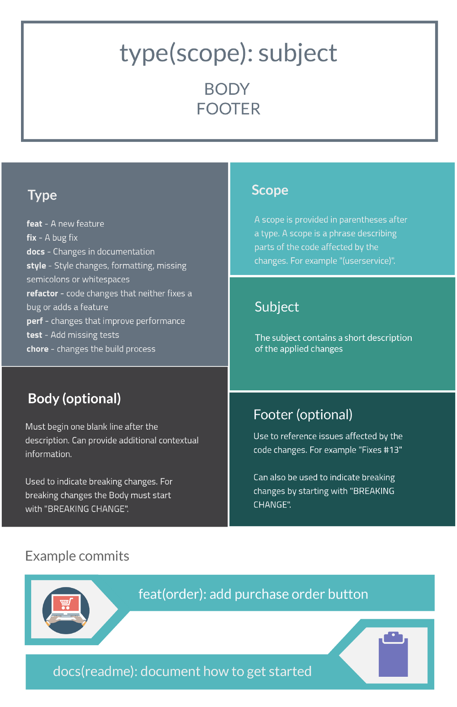
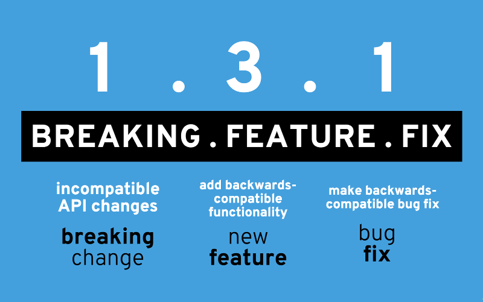
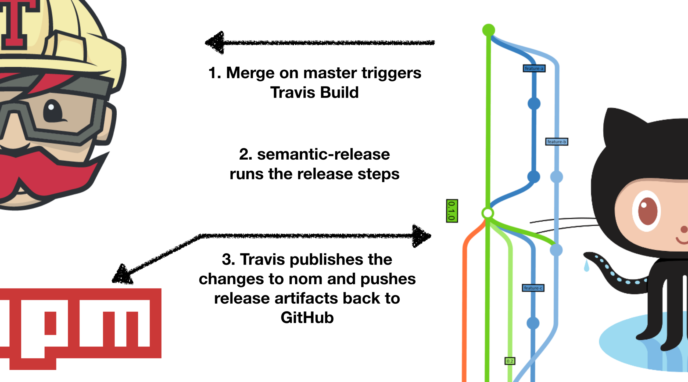
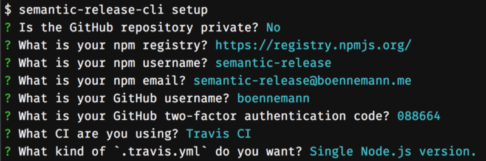
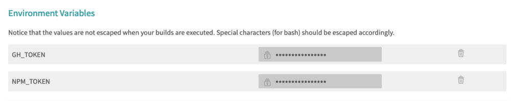
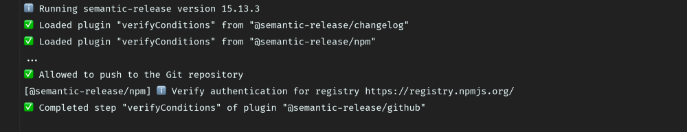
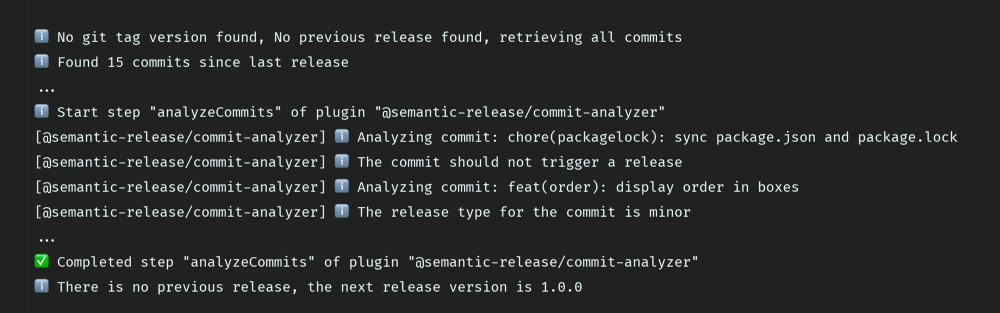
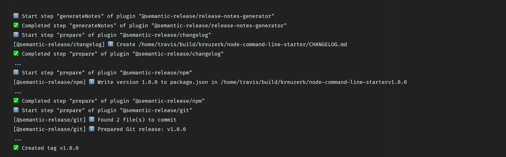
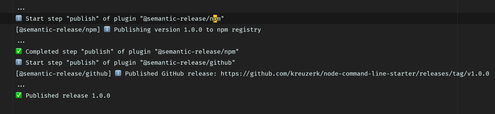
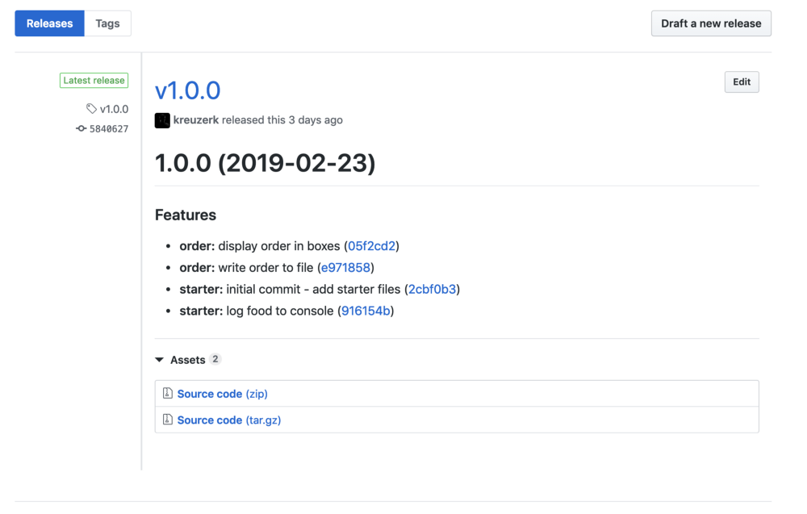

The way to fully automated releases in open source projects

# The way to fully automated releases in open source projects

## How to use conventional-commits and semantic-release in combination with GitHub and Travis.

[Kevin Kreuzer](https://medium.com/@kevinkreuzer)
Mar 4·10 min read

Developing and testing is only one part of the art of creating software. Another part is shipping the artifact.

Delivering software requires some steps; we need to run tests, build our artifact and publish or deploy it somewhere. Most often, those steps are executed in a pipeline.

A pipeline is a way to automate all the required steps. Therefore tooling and CI servers with the necessary configuration are needed.

A lot of companies have a complicated setup and need whole teams to maintain such a platform.

Wow! That sounds complicated. “Maybe it’s better to forgo about CI and pipelines. I do everything manually” is probably what you think right now.

**But no! Thanks to the great landscape of existing tools out there it is not that complicated!**

### Benefits of automatic releasing

Before we have a look at how to set up our pipeline with automatic releasing, let’s first clarify why it’s important.

Usually, a release, if it is done properly, causes a bunch of things.

- •We generate a `CHANGELOG.md` for people to see the changes made between releases.
- •We generate a release in our project. This release contains the release notes and the artifact.
- •We tag our master branch. Tags allow us to hop back to the released version easily.
- •We bump the version in our `package.json` so that it matches the released version.
- •We publish the artifact to `npm`. Before a publish we build and test the artifact.

Summarized, there are a lot of manual steps needed. Humans should devote their time for more important things than executing the same mundane task over and over again. All of the steps above can be automated!

Another advantage of automizing the steps above is that it gets much more comfortable to continuously deliver software once the number of contributors to your project grows.

You don’t have to worry about the release process. All you need to do is to check and merge pull requests!

### Conventional commits

With a growing number of contributors, we need to make use of some standards that every developer follows. Standards help in easier automatization and keeping the commit history clean and descriptive.

Using meaningful and well-structured commit messages in a consistent way are crucial to all software projects. They make your project clearer and more accessible to new contributors and ease the forensic process of understanding what changed.

Conventional commits introduce a standard on how your commit messages should be structured.

> The conventional commits specification is a common standard for adding human and machine readable meaning to commit messages

A conventional commit contains the following format.

Cool, but how do conventional commit messages help us in automatization?

Tools can interpret conventional commit messages and automatically perform all the release related tasks we mentioned in the beginning.

Sounds reasonable, doesn’t it? But how to get started?

> [> Follow me on Twitter](https://twitter.com/KevinKreuzer90)>  or medium to get notified about my newest blog posts!

### Enforce conventional commits

Once we decided to take advantage of conventional commits, it’s a good idea to vet the format of our commit messages.

To check the commit message we need a git hook.`husky` is a perfect tool that facilitates working with git hooks. So let’s install `husky`

npm i -D husky
Great, we got our Husky.

Next up we install a tool called `commitlint`. `commitlint` allows us to lint commit messages based on the rules provided by the `config-conventional` library.

npm i -D [@commitlint](http://twitter.com/commitlint)/{config-conventional,cli}

We need to combine `husky` and `commitlint`. Therefore we configure `husky` with the following line in our `package.json`.

{
"husky": {
"hooks": {
"commit-msg": "commitlint -E HUSKY_GIT_PARAMS"
}
}
}
We run `commitlint` in `husky's`  `commit-msg` hook.

Our commit messages are now checked and rejected if they are not properly formatted.

### I can’t remember the types and the format of conventional commits

If you are new to conventional commits and not used to it, it may be in the beginning be hard to remember the types and the format of the commit messages.

But no worries. There’s a tool called `commitizen` that supports you in the beginning.

npm i -D commitizen
To run it we simply add a script to our `package.json`.
”commit”: “npm run git-cz”,

To make `commitlint` work with `commitizen` we need to install another tool called`@commitlint/prompt`.

npm i -D @commitlint/prompt

So now we are ready to use `commitizen`! Let’s open a terminal and run `npm run commit`. We just need to follow the instructions displayed in the terminal.

### Semantic release

Semantic versioning is an indispensable standard when it comes to dependency management. It is used by library authors and consumers to avoid something we call ‘*dependency hell*’.

Source: https://digitalcommunications.wp.st-andrews.ac.uk/2017/03/17/what-our-version-numbers-mean/

With the help of conventional commits, we are able to automatically bump the version according to the `semver` specification.

There are different libraries that help us to achieve the automatic version bump like `standard-version` or `semantic-release`.

#### Standard-version vs semantic-release

Both tools are awesome as they do a lot of work for us. They both bump the version based on the commit logs, generate a `CHANGELOG`, create a Tag and commit the changes. Still, their scope differs.

Standard-version mainly focuses on manually creating a release locally and publish as soon as you push git tags.

Semantic-release, on the other hand, focuses on fully automated version management and package publishing. Means no manual step required.

Actually not fully true — you still need to merge the pull requests.

So which one to choose? In an open source project with multiple contributors, I prefer to have fully automated package publishing.

So let’s set it up!

#### Setup fully automated releasing and package publishing

First up we need to choose our continuous integration platform. We are going to use `Travis CI`.

`Travis CI` is free for Open Source projects, is well documented and has an awesome `GitHub` integration.

So let’s first sign up for `Travis`.

1. 1 "."Go to [travis-ci.com](https://travis-ci.org/) and [*Sign up with GitHub*](https://travis-ci.com/signin).

2. 2 "."Accept the Authorization of Travis CI. You’ll be redirected to GitHub.

3. 3 "."Click the green *Activate* button, and select the repositories you want to use with Travis CI.

Okay, now that we signed up for `Travis` and activated it for our repository let’s illustrate the overall concept.

As soon as we merge our feature branch into master `Travis` runs a build. `semantic-release` then runs the release steps.

To publish the artifact and keep the repository in sync `Travis` needs to commit back the adjusted files and the tags. Therefore we need to authorize `Travis` and give him the necessary rights for `npm` and `GitHub`.

#### Getting started — semantic-release CLI

Semantic-release gives us a CLI that supports us with the `Travis` configuration. The `semantic-release` CLI creates a `GitHub` and an `npm` token and adds those tokens to `Travis` as secrets.

To use the CLI to set up a semantic release just run the following command inside your projects directory:

`npx semantic-release-cli setup`

Source: https://github.com/semantic-release/semantic-release/blob/master/docs/usage/getting-started.md#getting-started

In `Travis` we then see the added secrets under our build settings.

The setup command also adds the `semantic-release` package as a `dev-dependency` to our `package.json`. This `dev-dependency` does not come alone. Besides the core library, it also brings some plugins with it.

- •@semantic-release/commit-analyzer
- •@semantic-release/release-notes-generator
- •@semantic-release/npm
- •@semantic-release/github

The `git` plugin is the one which is needed to commit release assets back to the project repository.

The changelog plugin is the plugin that actually generates one of those release assets. It creates or updates a `CHANGELOG` based on the commit messages.

We need to configure in which order the plugins will be executed. Furthermore, we need to tell `semantic-release` which release assets we want to commit back and which specific commit message we desire.

In addition to the plugins, we already installed we need two more plugins.
npm i -D @semantic-release/{changelog,git}

We can write a `.releaserc` file to specify in which order we want to execute the plugins. This file can either be written as a`.yaml`/`.yml`/`.json`/`.js` file.

|     |     |
| --- | --- |
| 1   | {   |
| 2   | "plugins": [ |
| 3   | "@semantic-release/commit-analyzer", |
| 4   | "@semantic-release/release-notes-generator", |
| 5   | "@semantic-release/changelog", |
| 6   | "@semantic-release/npm", |
| 7   | ["@semantic-release/git", { |
| 8   | "assets": ["package.json", "CHANGELOG.md"], |
| 9   | "message": "chore(release): ${nextRelease.version} [skip ci]\n\n${nextRelease.notes}" |
| 10  | }], |
| 11  | "@semantic-release/github" |
| 12  | ]   |
| 13  | }   |

 [view raw](https://gist.github.com/kreuzerk/6b630ebe8469d33686f2802cc7c05d2b/raw/24613789238e5db182372ade6da786f8a847ab73/.releaserc)  [.releaserc](https://gist.github.com/kreuzerk/6b630ebe8469d33686f2802cc7c05d2b#file-releaserc) hosted with ❤ by [GitHub](https://github.com/)

Let’s quickly go through the order.

First, we analyze the commit message to decide if a new breaking change, feature or fix was included. If not, no release is needed.

Next up we generate the `CHANGELOG`. The `CHANGELOG` content is generated by the `release-notes-generator` plugin and written by the `changelog` plugin.

We then bump the version in our `package.json` and publish the package.

The `git` plugin specifies which files we want to commit back to our repository. In our case, we want to update the `CHANGELOG.md` and the `package.json`.

> We use a special commit message when we commit those files back to our GitHub repository. The important part of the commit message is `*[skip ci]*`> . `*Travis*`>  interprets this message and will not trigger a new build.

Last but not least we use the `GitHub` plugin to comment on released PullRequests/Issues.

Great! We configured our release but we actually do not use it yet.

#### Setup Travis with .travis.yml

Let’s update our `.travis.yml` to make use of the `semantic-release` package.

Our `.travis.yml` defines three different stages. An install stage, a test stage, and a release stage. The install stage is quite self-explaining, it installs the `node_modules`. The test stage runs all tests preferably with coverage.

The deploy step is actually the step we are most interested in. In this step, we simply start semantic-release by executing `npx semantic-release`.

Let’s have a look a simplified output from the`semantic-release` command in our build. Oh no — log files in a Blogpost Come on we are developers

#### Semantic-release build

So let’s look at each simplified and shortened piece of the log.

So first semantic release starts, downloads all the plugins and verifies the conditions for the plugins.

The next step is very interesting! `semantic-release` starts to analyze our commits.

as you can see `semantic-release` package analyzes our commits and tells us if a release is needed.

Notice the last line. Normally a version bump happens in correlation to the previous version. By the time this build ran there wasn’t yet a version deployed. So we start with `1.0.0`.

Ok — we now know the version. Let’s use it to generate the release assets.

We generate a `CHANGELOG`, bump the version, write it to `package.json` and create a Git tag.

So last but not least we commit back the changes and publish the artifact.

Great! The build does what we want it to do! Let’s also quickly check how the release affected our `GitHub` repository.

We can see that our release got automatically generated, the release notes are updated and also written to the `CHANGELOG`. The created artifact is also nicely added to our release.

### Starter project

Check out the `node-command-line-starter` I created. I used this project for the screenshots in this blog post.

It uses the setup described in this post and provides you with the project structure and a helpful setup to create your own node command line util.

[**kreuzerk/node-command-line-starter** *Contribute to kreuzerk/node-command-line-starter development by creating an account on GitHub.*github.com](https://github.com/kreuzerk/node-command-line-starter)[(L)](https://github.com/kreuzerk/node-command-line-starter)

### Conclusion ‍

Conventional commits offer us an awesome specification for the creation of meaningful and well-structured commit messages in a consistent way. This keeps the history of your project more understandable and clear. Using a standard makes your project more accessible to new contributors.

Releases, if done right, require a lot of steps. Doing them manually is really repetitive, annoying and error prune. Having them in automated is the way to go.

There’s a great landscape of tools that support us in automating our releases. Some of them automate some parts but still require some manual steps. Others like `semantic-release` fully automate the whole process.

Often the setup and configuration can be complicated. Therefore we can use the `semantic-release-cli` to automatically configure our CI server.

I would recommend you to use `Travis` as a CI server. It’s just awesome!

###  Please give some claps by clicking on the clap button below if you enjoyed this post.‍‍

#### Claps help other people finding it and encourage me to write more posts

Feel free to check out some of my other articles about Front End development.

[**Debug Angular apps in production without revealing source maps** *Alternate approaches to handle source maps*blog.angularindepth.com](https://blog.angularindepth.com/debug-angular-apps-in-production-without-revealing-source-maps-ab4a235edd85)[(L)](https://blog.angularindepth.com/debug-angular-apps-in-production-without-revealing-source-maps-ab4a235edd85)

[**Angular: Refetch data on same URL navigation** *Different approaches with their pros and cons*medium.com](https://medium.com/@kevinkreuzer/refresh-current-route-in-angular-512a19d58f6e)[(L)](https://medium.com/@kevinkreuzer/refresh-current-route-in-angular-512a19d58f6e)

[**Typescript method overloading** *Method overloading is a familiar concept from traditional programming languages like Java or C#. It allows a class to…*medium.com](https://medium.com/@kevinkreuzer/typescript-method-overloading-c256dd63245a)[(L)](https://medium.com/@kevinkreuzer/typescript-method-overloading-c256dd63245a)