The why and how of nonnegative matrix factorization

# The why and how of nonnegative matrix factorization

February 18, 2019

tags: [Data Science](https://blog.acolyer.org/tag/data-science/), [Machine Learning](https://blog.acolyer.org/tag/machine-learning/)

.

[The why and how of nonnegative matrix factorization](https://arxiv.org/abs/1401.5226) Gillis, *arXiv 2014* from: ‘[Regularization, Optimization, Kernels, and Support Vector Machines](https://www.crcpress.com/Regularization-Optimization-Kernels-and-Support-Vector-Machines/Suykens-Signoretto-Argyriou/p/book/9781482241396).’

Last week we looked at the paper ‘[Beyond news content](https://blog.acolyer.org/2019/02/13/beyond-news-contents-the-role-of-social-context-for-fake-news-detection/),’ which made heavy use of nonnegative matrix factorisation. Today we’ll be looking at that technique in a little more detail. As the name suggests, ‘The *Why* and *How* of Nonnegative matrix factorisation’ describes both why NMF is interesting (the intuition for how it works), and how to compute an NMF. I’m mostly interested in the intuition (and also out of my depth for some of the how!), but I’ll give you a sketch of the implementation approaches.

*> “*

>  Nonnegative matrix factorization (NMF) has become a widely used tool for the analysis of high dimensional data as it automatically extracts sparse and meaningful features from a set of nonnegative data vectors.

NMF was first introduced by Paatero andTapper in 1994, and popularised in a article by [Lee and Seung](http://www.columbia.edu/~jwp2128/Teaching/E4903/papers/nmf_nature.pdf) in 1999. Since then, the number of publications referencing the technique has grown rapidly:

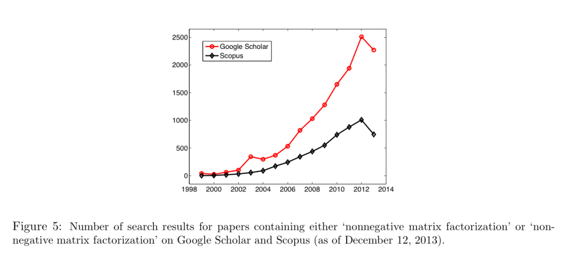

### What is NMF?

NMF approximates a matrix  with a low-rank matrix approximation such that .

For the discussion in this paper, we’ll assume that  is set up so that there are 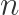 data points each with 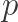 dimensions, and every *column* of  is a data point, i.e. 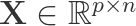.

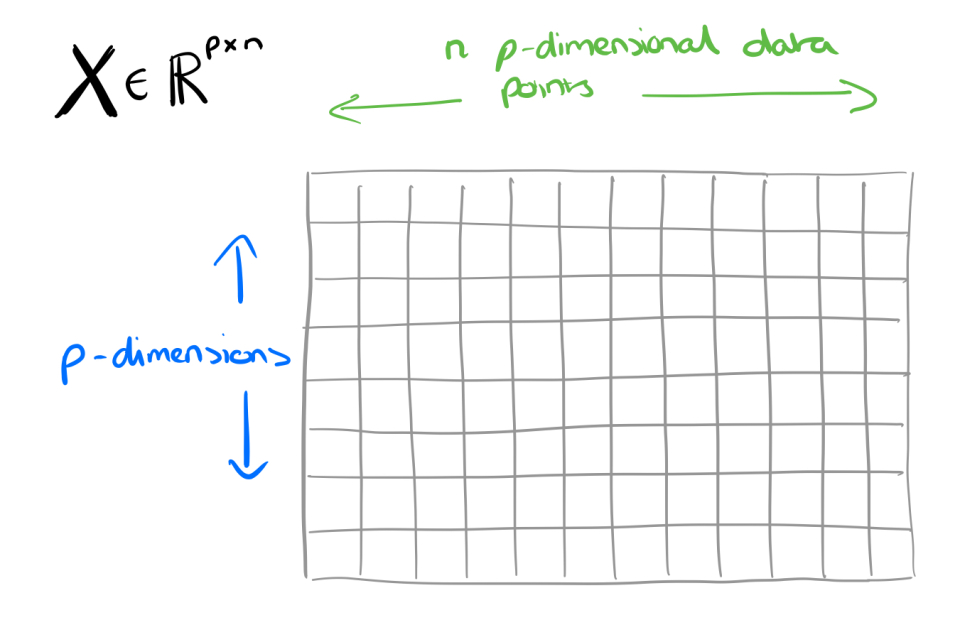

We want to reduce the  original dimensions to 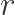 (aka, create a rank  approximation). So we’ll have 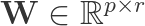 and 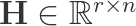.

The interpretation of  is that each column is a *basis element*. By basis element we mean some component that crops up again and again in all of the  original data points. These are the fundamental building blocks from which we can reconstruct approximations to all of the original data points.

The interpretation of  is that each column gives the ‘coordinates of a data point’ in the basis . In other words, it tells you how to reconstruct an approximation to the original data point from a linear combination of the building blocks in

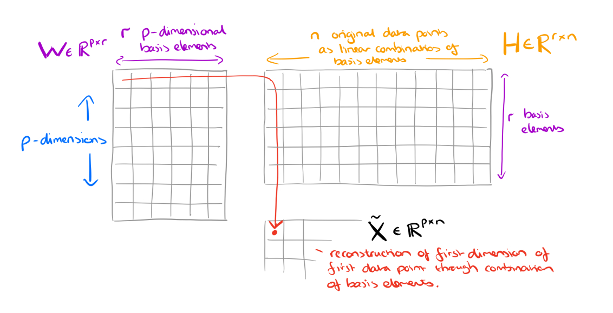

A popular way of measuring how good the approximation  actually is, is the *Frobenius norm* (denoted by the F subscript you may have noticed). The Frobenius norm is:

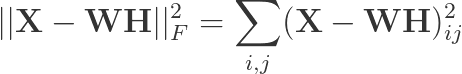.

An optimal approximation to the Frobenius norm can be computed through truncated Singular Value Decomposition (SVD).

### Why does it work? The intuition.

*> “*

>  The reason why NMF has become so popular is because of its ability to automatically extract sparse and easily interpretable factors.

The authors give three examples of NMF at work: in image processing, text mining, and hyperspectral imaging.

#### Image processing

Say we take a gray-level image of a face containing *p* pixels, and squash the data into a single vector such that the *ith* entry represents the value of the *ith* pixel. Let the rows of  represent the *p* pixels, and the *n* columns each represent one image.

NMF will produce two matrices W and H. The columns of W can be interpreted as images (the basis images), and H tells us how to sum up the basis images in order to reconstruct an approximation to a given face.

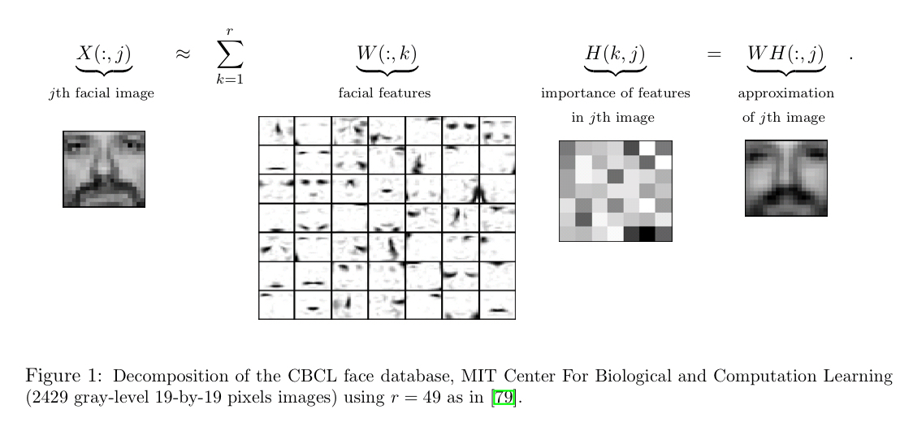
*> “*

>  In the case of facial images, the basis images are features such as eyes, noses, moustaches, and lips, while the columns of H indicate which feature is present in which image.

#### Text mining

In text mining consider the bag-of-words matrix representation where each row corresponds to a word, and each column to a document (for the attentive reader, that’s the transpose of the bag-of-words matrix we looked at in ‘[Beyond news content](https://blog.acolyer.org/2019/02/13/beyond-news-contents-the-role-of-social-context-for-fake-news-detection/)’9).

NMF will produce two matrices W and H. The columns of W can be interpreted as basis documents (bags of words). What interpretation can we give to such a basis document in this case? They represent *topics*! Sets of words found simultaneously in different documents. H tells us how to sum contributions from different topics to reconstruct the word mix of a given original document.

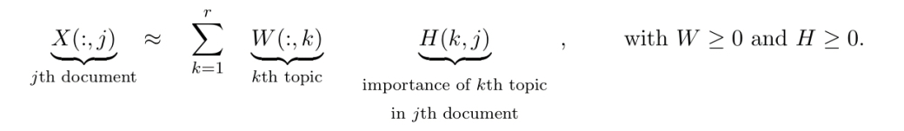
*> “*

>  Therefore, given a set of documents, NMF identifies topics and simultaneously classifies the documents among these different topics.

#### Hyperspectral unmixing

A hyperspectral image typically has 100 to 200 wavelength-indexed bands showing the fraction of incident light being reflected by the pixel at each of those wavelengths. Given such an image we want to identify the different materials present in it (e.g. grass, roads, metallic surfaces) – these are called the *endmembers*. Then we want to know which endmembers are present in each pixel, and in what proportion. For example, a pixel might be reflecting 0.3 x the spectral signal of grass, and 0.7 x the spectral signal of a road surface.

NMF will produce two matrices W and H. The columns of W can be interpreted as basis endmembers. H tells us how to sum contributions from different endmembers to reconstruct the spectral signal observed at a pixel.

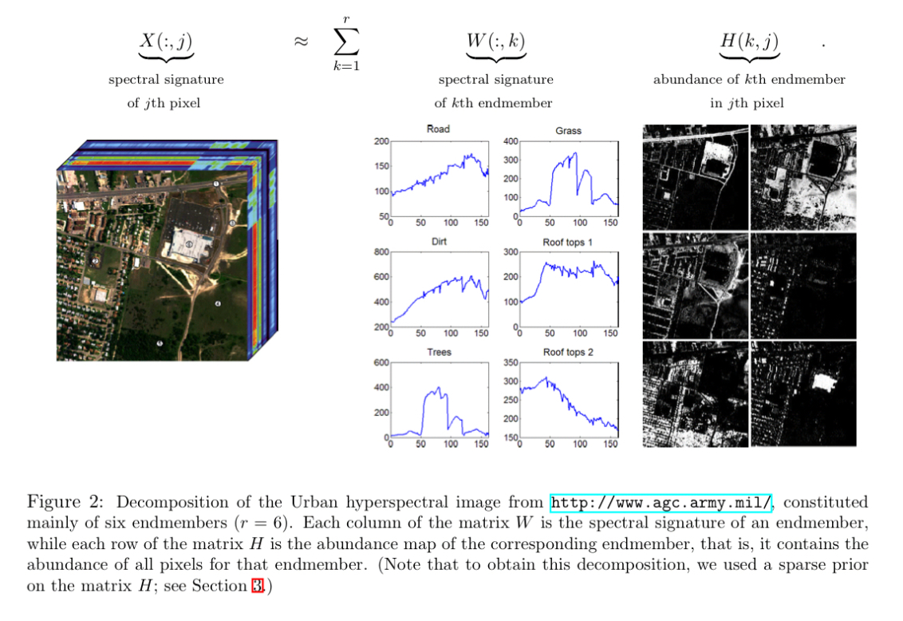
*> “*

>  …given a hyperspectral image, NMF is able to compute the spectral signatures of the endmembers, and simultaneously the abundance of each endmember in each pixel.

### Implementing NMF

For a rank *r* factorisation, we have the following optimisation problem:
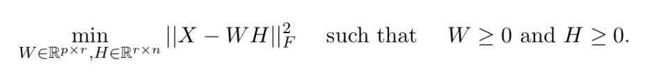

Though note that the Frobenius norm show here assumes Gaussian noise, and other norms may be used in practice depending on the distribution (e.g., Kullback-Leibler divergence for text-mining, the Itakura-Saito distance for music analysis, or the  norm to improve robustness against outliers).

So far everything to do with NMF sounds pretty good, until you reach the key moment in section 3:

*> “*

>  There are many issues when using NMF in practice. In particular, NMF is NP-hard. Unfortunately, as opposed to the unconstrained problem which can be solved efficiently using the SVD, NMF is NP-hard in general.

Fortunately there are heuristic approximations which have been proven to work well in many applications.

Another issue with NMF is that there is not guaranteed to be a single unique decomposition (in general, there might be many schemes for defining sets of basis elements). For example, in text mining you would end up with different topics and classifications. “*In practice, this issue is tackled using other priors on the factors W and H and adding proper regularization terms in the objective function*.”

Finally, it’s hard to know how to choose the factorisation rank, r. Some approaches include trial and error, estimation using SVD based of the decay of the singular values, and insights from experts (e.g., there are roughly so many endmembers you might expect to find in a hyperspectral image).

*> “*

>  Almost all NMF algorithms use a two-block coordinate descent scheme (exact or inexact), that is, they optimize alternatively over one of the two factors, W or H, while keeping the other fixed. The reason is that the subproblem in one factor is convex. More precisely, it is a nonnegative least squares problem (NNLS). Many algorithms exist to solve the NNLS problem; and NMF algorithms based on two-block coordinate descent differ by which NNLS algorithm is used.

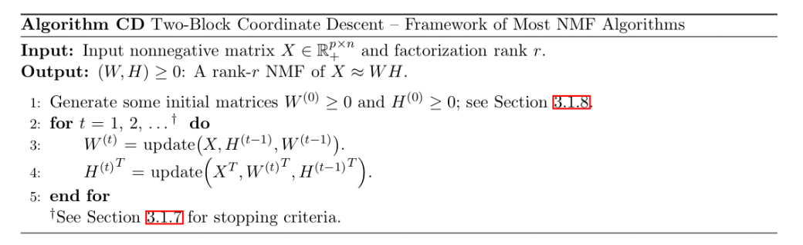

Some NNLS algorithms that can be plugged in include multiplicative updates, alternating least squares, alternating nonnegative least squares, and hierarchical alternating least squares.

The following charts show the performance of these algorithms on a dense data set (left), and a sparse data set (right).

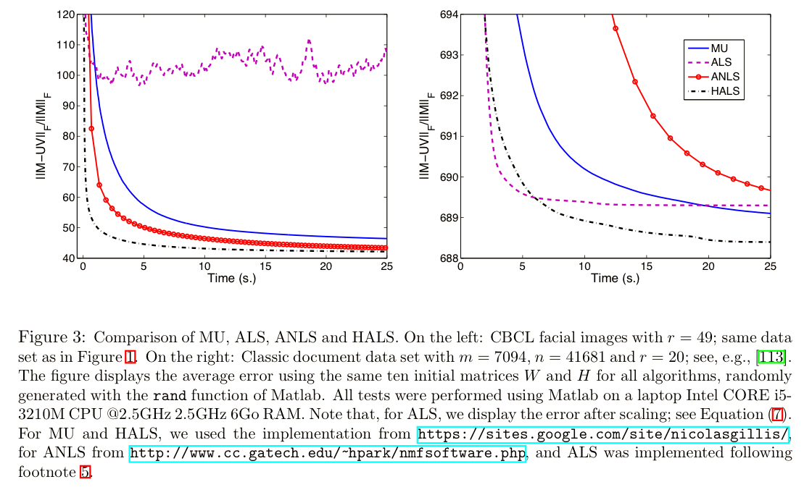

You can initialise W and H randomly, but there are also alternate strategies designed to give better initial estimates in the hope of converging more rapidly to a good solution:

- Use some clustering method, and make the cluster means of the top *r* clusters as the columns of W, and H as a scaling of the cluster indicator matrix (which elements belong to which cluster).
- Finding the best rank-r approximation of X using SVD and using this to initialise W and H (see section 3.1.8)
- Picking *r* columns of X and just using those as the initial values for W.

Section 3.2 in the paper discusses an emerging class of polynomial time algorithms for NMF in the special case where the matrix X is r-separable. That is, there exist a subset of *r* columns such that all other columns of X can be reconstructed from them. In the text mining example for instance this would mean that each topic has at least one document focused solely on that topic.

*> “*
>  … we believe NMF has a bright future…

### Share this:

- [Twitter](https://blog.acolyer.org/2019/02/18/the-why-and-how-of-nonnegative-matrix-factorization/?share=twitter&nb=1)
- [LinkedIn](https://blog.acolyer.org/2019/02/18/the-why-and-how-of-nonnegative-matrix-factorization/?share=linkedin&nb=1)
- [Email](https://blog.acolyer.org/2019/02/18/the-why-and-how-of-nonnegative-matrix-factorization/?share=email&nb=1)
- [Print](https://blog.acolyer.org/2019/02/18/the-why-and-how-of-nonnegative-matrix-factorization/#print)

-

[Like](https://widgets.wp.com/likes/index.html?ver=20180319#)

- 
- 
- 
- 
- 

[5 bloggers](https://widgets.wp.com/likes/index.html?ver=20180319#) like this.

### *Related*

[Beyond news contents: the role of social context for fake news detection](https://blog.acolyer.org/2019/02/13/beyond-news-contents-the-role-of-social-context-for-fake-news-detection/)In "Social Networks"

[GloVe: Global Vectors for Word Representation](https://blog.acolyer.org/2016/04/22/glove-global-vectors-for-word-representation/)In "Machine Learning"

[The amazing power of word vectors](https://blog.acolyer.org/2016/04/21/the-amazing-power-of-word-vectors/)In "Machine Learning"

.
from → [Uncategorized](https://blog.acolyer.org/category/uncategorized/)