The world beyond batch: Streaming 102

# The world beyond batch: Streaming 102

The what, where, when, and how of unbounded data processing.

By
 January 20, 2016

"Boatmen on the Missouri" by George Caleb Bingham (source: [Wikimedia Commons](https://commons.wikimedia.org/wiki/File:George_Caleb_Bingham_-_Boatmen_on_the_Missouri_-_Google_Art_Project.jpg))

Editor's note: This is the second post in a two-part series about the evolution of data processing, with a focus on streaming systems, unbounded data sets, and the future of big data. [See part one](https://www.oreilly.com/ideas/the-world-beyond-batch-streaming-101).

## Introduction

Welcome back! If you missed my previous post, [The world beyond batch: Streaming 101](https://www.oreilly.com/ideas/the-world-beyond-batch-streaming-101), I strongly recommend you take the time to read that one first. It lays the necessary foundation for the topics I’ll be covering in this post, and I’ll be assuming you’re already familiar with the terminology and notions introduced there. Caveat lector and all that.

Also, note that this post contains a number of animations, so those of you who try printing it will be missing out on some of the best parts. Caveat printor and all that.

Disclaimers out of the way, let’s get this party started. To briefly recap, last time around I focused on three main areas: **terminology**, defining precisely what I mean when I use overloaded terms like “streaming”; **batch versus streaming**, comparing the theoretical capabilities of the two types of systems, and postulating that only two things are necessary to take streaming systems beyond their batch counterparts: correctness and tools for reasoning about time; and **data processing patterns**, looking at the basic approaches taken with both batch and streaming systems when processing bounded and unbounded data.

#### Strata Data Conference

 

## [Strata Data Conference in London, May 21-24, 2018](https://conferences.oreilly.com/strata/strata-eu?intcmp=il-data-confreg-lp-steu18_20180109_new_site_strata_london_right_rail_widget_reg_link)

 [Early price ends April 6.](https://conferences.oreilly.com/strata/strata-eu?intcmp=il-data-confreg-lp-steu18_20180109_new_site_strata_london_right_rail_widget_reg_link)

In this post, I want to focus further on the data-processing patterns from last time, but in more detail, and within the context of concrete examples. The arc of this post will traverse two major sections:

- **Streaming 101 Redux:** A brief stroll back through the concepts introduced in Streaming 101, with the addition of a running example to highlight the points being made.
- **Streaming 102:** The companion piece to Streaming 101, detailing additional concepts that are important when dealing with unbounded data, with continued use of the concrete example as a vehicle for explaining them.

By the time we’re finished, we’ll have covered what I consider to be the core set of principles and concepts required for robust out-of-order data processing; these are the tools for reasoning about time that truly get you beyond classic batch processing.

To give you a sense of what they look like in action, I’ll use snippets of [Dataflow SDK](https://github.com/GoogleCloudPlatform/DataflowJavaSDK) code (i.e., the API for [Google Cloud Dataflow](https://cloud.google.com/dataflow/)), coupled with animations to provide a visual representation of the concepts. The reason I use the Dataflow SDK and not something folks are perhaps more familiar with, like Spark Streaming or Storm, is that there is literally no other system at this point that provides the amount of expressiveness necessary for all the examples I want to cover. The good news is that other projects are beginning to move in this direction. The even better news is that we (Google) have today [submitted a proposal](http://googlecloudplatform.blogspot.com/2016/01/Dataflow-and-open-source-proposal-to-join-the-Apache-Incubator.html) to the Apache Software Foundation to create an Apache Dataflow incubator project (in conjunction with data Artisans, Cloudera, Talend, and a few other companies), in the hopes of building an open community and ecosystem around the robust out-of-order processing semantics afforded by the [Dataflow Model](http://www.vldb.org/pvldb/vol8/p1792-Akidau.pdf). This should make for a very interesting 2016. But I digress.

Missing from this post is the comparison section I promised last time; sorry. I misunderestimated[[1]](https://www.oreilly.com/ideas/the-world-beyond-batch-streaming-102#_ftn1) how much content I would want to pack into this post, and how long it would take me to do so. At this point, I just can’t see delaying and extending things further to fit in that section as well. If it’s any consolation, I ended up giving a talk at Strata + Hadoop World Singapore 2015, entitled [The evolution of massive-scale data processing](http://conferences.oreilly.com/strata/big-data-conference-sg-2015/public/schedule/detail/44947) (and will be giving an updated version of it [at Strata + Hadoop World London 2016 in June](http://conferences.oreilly.com/strata/hadoop-big-data-eu?intcmp=il-data-confreg-lp-stuk16_20160119_radar_tyler_akidau_streaming_102_post_strata_london_link)), which covered a lot of the material I wanted to address in such a comparison section; the slides are very pretty and [available here](http://goo.gl/5k0xaL) for your perusing pleasure. Not quite the same, to be sure, but it’s something.

Now, on to streaming!

## Recap and roadmap

In Streaming 101, I first clarified some terminology. I began by distinguishing **bounded versus unbounded data**. Bounded data sources have a finite size, and are oftentimes referred to as “batch” data. Unbounded sources may have an infinite size, and are oftentimes referred to as “streaming” data. I try to avoid using the terms batch and streaming to refer to data sources because those names carry with them certain implications that are misleading and oftentimes limiting.

I then went on to define the **differences between batch and streaming engines:** batch engines are those which are designed with only bounded data in mind, whereas streaming engines are designed with unbounded data in mind. My goal is to only use the terms batch and streaming when referring to execution engines.

Get O'Reilly's weekly data newsletter

 [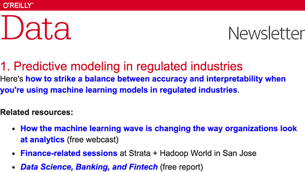](https://www.oreilly.com/ideas/the-world-beyond-batch-streaming-102)

After terminology, I covered two of the important, basic concepts relevant to dealing with unbounded data. I first established the **critical distinction between event time** (the time that events happen) **and processing time** (the time they are observed during processing). This provides the foundation for one of the main theses put forth in Streaming 101: if you care about both correctness and the context within which events actually occurred, you must analyze data relative to their inherent event times, not the processing time at which they are encountered during the analysis itself.

I then introduced the concept of **windowing** (i.e., partitioning a data set along temporal boundaries), which is a common approach used to cope with the fact that unbounded data sources technically may never end. Some simpler examples of windowing strategies are fixed and sliding windows, but more sophisticated types of windowing, such as sessions (where the windows are defined by features of the data themselves, e.g., capturing a session of activity per user followed by a gap of inactivity) also see broad usage.

In addition to these two concepts, we’re now going to look closely at three more:

- **Watermarks:** A watermark is a notion of input completeness with respect to event times. A watermark with a value of time X makes the statement: “all input data with event times less than X have been observed.” As such, watermarks act as a metric of progress when observing an unbounded data source with no known end.
- **Triggers:** A trigger is a mechanism for declaring when the output for a window should be materialized relative to some external signal. Triggers provide flexibility in choosing when outputs should be emitted. They also make it possible to observe the output for a window multiple times as it evolves. This in turn opens up the door to refining results over time, which allows for providing speculative results as data arrive as well as dealing with changes in upstream data (revisions) over time or data which arrive late relative to the watermark (e.g., mobile scenarios, where someone’s phone records various actions and their event times while the person is offline, then proceeds to upload those events for processing upon regaining connectivity).
- **Accumulation:** An accumulation mode specifies the relationship between multiple results that are observed for the same window. Those results might be completely disjointed, i.e., representing independent deltas over time, or there may be overlap between them. Different accumulation modes have different semantics and costs associated with them, and thus find applicability across a variety of use cases.

Lastly, because I think it makes it easier to understand the relationships between all of these concepts, we’ll revisit the old and explore the new within the structure of answering four questions, all of which I propose are critical to every unbounded data processing problem:

- ***What* results are calculated?** This question is answered by the types of *transformations* within the pipeline. This includes things like computing sums, building histograms, training machine learning models, etc. It’s also essentially the question answered by classic batch processing.
- ***Where* in event time are results calculated?** This question is answered by the use of *event-time windowing* within the pipeline. This includes the common examples of windowing from Streaming 101 (fixed, sliding, and sessions), use cases that seem to have no notion of windowing (e.g., time-agnostic processing as described in Streaming 101; classic batch processing also generally falls into this category), and other, more complex types of windowing, such as time-limited auctions. Also note that it can include processing-time windowing as well, if one assigns ingress times as event times for records as they arrive at the system.
- ***When* in processing time are results materialized?** This question is answered by the use of watermarks and triggers. There are infinite variations on this theme, but the most common pattern uses the watermark to delineate when input for a given window is complete, with triggers allowing the specification of early results (for speculative, partial results emitted before the window is complete) and late results (for cases where the watermark is only an *estimate* of completeness, and more input data may arrive after the watermark claims the input for a given window is complete).
- ***How* do refinements of results relate?** This question is answered by the type of *accumulation* used: discarding (where results are all independent and distinct), accumulating (where later results build upon prior ones), or accumulating and retracting (where both the accumulating value plus a retraction for the previously triggered value(s) are emitted).

We'll look at each of these questions in much more detail over the rest of the post. And yes, I’m going to run this color scheme thing into the ground in an attempt to make it abundantly clear which concepts relate to which question in the ***What***/***Where***/***When***/***How*** idiom. You’re welcome <winky-smiley/>[[2]](https://www.oreilly.com/ideas/the-world-beyond-batch-streaming-102#_ftn2).

#### Safari

 

## [Learn faster. Dig deeper. See farther.](https://www.safaribooksonline.com/home/?utm_source=newsite&utm_medium=content&utm_campaign=lgen&utm_content=data-post-safari-right-rail-cta)

Join Safari. Get a free trial today and find answers on the fly, or master something new and useful.

 [Learn more](https://www.safaribooksonline.com/home/?utm_source=newsite&utm_medium=content&utm_campaign=lgen&utm_content=data-post-safari-right-rail-cta)

## Streaming 101 redux

To begin with, let’s stroll back through some of the concepts presented in Streaming 101, but this time alongside some detailed examples that will help make those concepts a bit more concrete.

### ***What*: transformations**

The transformations applied in classic batch processing answer the question: “***What* results are calculated?**” Even though many of you are likely already familiar with classic batch processing, we’re going to start there anyway since it’s the foundation on top of which we’ll add all of the other concepts.

For this section, we’ll look at a single example: computing keyed integer sums over a simple data set consisting of 10 values. If you want a slightly more pragmatic take on it, you can think of it as calculating an overall score for a team of individuals playing some sort of mobile game by combining together their independent scores. You can imagine it applying similarly well to billing and usage monitoring use cases.

For each example, I’ll include a short snippet of Dataflow Java SDK pseudo-code to make the definition of the pipeline more concrete. It will be pseudo-code in the sense that I’ll sometimes bend the rules to make the examples clearer, elide details (like the use of concrete I/O sources), or simplify names (the current trigger names in Java are painfully verbose; I will use simpler names for clarity). Beyond minor things like those (most of which I enumerate explicitly in the [Postscript](https://www.oreilly.com/ideas/the-world-beyond-batch-streaming-102#PS)), it’s basically real-world Dataflow SDK code. I’ll also provide a link to an actual code walkthrough later on for those who are interested in similar examples they can compile and run themselves.

If you’re at least familiar with something like Spark Streaming or Flink, you should have a relatively easy time grokking what the Dataflow code is doing. To give you a crash course in things, there are two basic primitives in Dataflow:

- **`PCollections`**, which represent data sets (possibly massive ones), across which parallel transformations may be performed (hence the “P” at the beginning of the name).
- **`PTransforms`**, which are applied to `PCollections` to create new `PCollections`. `PTransforms` may perform element-wise transformations, they may aggregate multiple elements together, or they may be a composite combination of other `PTransforms`.

Figure 1. **Types of transformations.** Image credit: Frances Perry, used with permission.

If you find yourself getting confused, or just want a reference to consult, you might give the [Dataflow Java SDK docs](https://cloud.google.com/dataflow/model/programming-model) a look.

For the purposes of our examples, we’ll assume we start out with a `PCollection<KV<String, Integer>>` named “input” (that is, a `PCollection` composed of key/value pairs of Strings and Integers, where the Strings are something like team names, and the Integers are scores from any individual on the corresponding team). In a real-world pipeline, we would’ve acquired input by reading in a `PCollection` of raw data (e.g., log records) from an I/O source, and then transforming it into the `PCollection<KV<String, Integer>>` by parsing the log records into appropriate key/value pairs. For the sake of clarity in this first example, I’ll include pseudo-code for all of those steps, but in subsequent examples, I elide the I/O and parsing portions.

Thus, for a pipeline that simply reads in data from an I/O source, parses out team/score pairs, and calculates per-team sums of scores, we’d have something like this (note that you can scroll the code snippets horizontally if your browser isn’t large enough to display them entirely, e.g., on mobile):

PCollection<String> raw = IO.read(...);
PCollection<KV<String, Integer>> input = raw.apply(ParDo.of(new ParseFn());
PCollection<KV<String, Integer>> scores = input
  .apply(Sum.integersPerKey());

Listing 1. **Summation pipeline**. Key/value data are read from an I/O source, with `String` (e.g., team name) as the key and `Integer` (e.g., individual team member scores) as the values. The values for each key are then summed together to generate per-key sums (e.g., total team score) in the output collection.

For all the examples to come, after seeing a code snippet describing the pipeline we’ll be analyzing, we’ll then look at an animated rendering of execution of that pipeline over a concrete data set. More specifically, we’ll see what it would look like to execute the pipeline over 10 input data for a single key; in a real pipeline, you can imagine that similar operations would be happening in parallel across multiple machines, but for the sake of our examples, it’ll be clearer to keep things simple.

Each animation plots the inputs and outputs across two dimensions: event time (on the X axis) and processing time (on the Y axis). Thus, real time as observed by the pipeline progresses from bottom to top, as indicated by the thick ascending white line. Inputs are circles, with the number inside the circle representing the value of that specific record. They start out grey and change color as the pipeline observes them.

As the pipeline observes values, it accumulates them in its state and eventually materializes the aggregate results as output. State and output are represented by rectangles, with the aggregate value near the top, and with the area covered by the rectangle representing the portions of event time and processing time accumulated into the result. For the pipeline in Listing 1, it would look something like this when executed on a classic batch engine (note that you'll need to click/tap on the image below to start the animation, which will then loop forever until clicked/tapped again):

Figure 2. **Classic batch processing.** Credit: Tyler Akidau.

Since this is a batch pipeline, it accumulates state until it’s seen all of the inputs (represented by the dashed green line at the top), at which point, it produces its single output of 51. In this example, we’re calculating a sum over all of event time since we haven’t applied any specific windowing transformations; hence, the rectangles for state and output cover the entirety of the X axis. If we want to process an unbounded data source, however, classic batch processing won’t be sufficient; we can’t wait for the input to end since it effectively never will. One of the concepts we’ll want is windowing, which we introduced in Streaming 101. Thus, within the context of our second question: “***Where* in event-time are results calculated?**”, we’ll now briefly revisit windowing.

### ***Where*****: windowing**

As discussed last time, windowing is the process of slicing up a data source along temporal boundaries. Common windowing strategies include fixed windows, sliding windows, and sessions windows:.

Figure 3. **Example windowing strategies**. Each example is shown for three different keys, highlighting the difference between aligned windows (which apply across all the data) and unaligned windows (which apply across a subset of the data). Credit: Tyler Akidau, inspired by an illustration from Robert Bradshaw.

To get a better sense of what windowing looks like in practice, let’s take our integer summation pipeline and window it into fixed, two-minute windows. With the Dataflow SDK, the change is a simple addition of a `Window.into` transform (highlighted in blue text):

PCollection<KV<String, Integer>> scores = input
  .apply(Window.into(FixedWindows.of(Duration.standardMinutes(2))))
  .apply(Sum.integersPerKey());
Listing 2. **Windowed summation code.**

Recall that Dataflow provides a unified model that works in both batch and streaming, since semantically batch is really just a subset of streaming. As such, let’s first execute this pipeline on a batch engine; the mechanics are more straightforward, and it will give us something to directly compare against when we switch to a streaming engine.

Figure 4. **Windowed summation on a batch engine.** Credit: Tyler Akidau.

As before, inputs are accumulated in state until they are entirely consumed, after which output is produced. In this case, however, instead of one output we get four: a single output for each of the four relevant two-minute event-time windows.

At this point, we’ve revisited the two main concepts introduced in Streaming 101: the relationship between the event-time and processing-time domains, and windowing. If we want to go any further, we’ll need to start adding the new concepts mentioned at the beginning of this section: watermarks, triggers, and accumulation. Thus begins Streaming 102.

## Streaming 102

We just observed the execution of a windowed pipeline on a batch engine. But ideally, we’d like to have lower latency for our results, and we’d also like to natively handle unbounded data sources. Switching to a streaming engine is a step in the right direction, but whereas the batch engine had a known point at which the input for each window was complete (i.e., once all of the data in the bounded input source had been consumed), we currently lack a practical way of determining completeness with an unbounded data source. Enter watermarks.

### ***When*: watermarks**

Watermarks are the first half of the answer to the question: “***When* in processing time are results materialized?**” Watermarks are temporal notions of input completeness in the event-time domain. Worded differently, they are the way the system measures progress and completeness relative to the event times of the records being processed in a stream of events (either bounded or unbounded, though their usefulness is more apparent in the unbounded case).

Recall this diagram from Streaming 101, slightly modified here, where I described the skew between event time and processing time as an ever-changing function of time for most real-world distributed data processing systems.

Figure 5. **Event time progress, skew, and watermarks.** Credit: Tyler Akidau.

That meandering red line that I claimed represented reality is essentially the watermark; it captures the progress of event time completeness as processing time progresses. Conceptually, you can think of the watermark as a function, F(P) -> E, which takes a point in processing time and returns a point in event time. (More accurately, the input to the function is really the current state of everything upstream of the point in the pipeline where the watermark is being observed: the input source, buffered data, data actively being processed, etc.; but conceptually, it’s simpler to think of it as a mapping from processing time to event time.) That point in event time, E, is the point up to which the system believes all inputs with event times less than E have been observed. In other words, it’s an assertion that no more data with event times less than E will ever be seen again. Depending upon the type of watermark, perfect or heuristic, that assertion may be a strict guarantee or an educated guess, respectively:

- **Perfect watermarks:** In the case where we have perfect knowledge of all of the input data, it’s possible to construct a perfect watermark; in such a case, there is no such thing as late data; all data are early or on time.
- **Heuristic watermarks:** For many distributed input sources, perfect knowledge of the input data is impractical, in which case the next best option is to provide a heuristic watermark. Heuristic watermarks use whatever information is available about the inputs (partitions, ordering within partitions if any, growth rates of files, etc.) to provide an estimate of progress that is as accurate as possible. In many cases, such watermarks can be remarkably accurate in their predictions. Even so, the use of a heuristic watermark means it may sometimes be wrong, which will lead to late data. We’ll learn about ways to deal with late data in the triggers section below.

Watermarks are a fascinating and complex topic, with far more to talk about than I can reasonably fit here or in the margin, so a further deep dive on them will have to wait for a future post. For now, to get a better sense of the role that watermarks play as well as some of their shortcomings, let’s look at two examples of a streaming engine using watermarks alone to determine when to materialize output while executing the windowed pipeline from [Listing 2](https://www.oreilly.com/ideas/the-world-beyond-batch-streaming-102#L2). The example on the left uses a perfect watermark; the one on the right uses a heuristic watermark.

[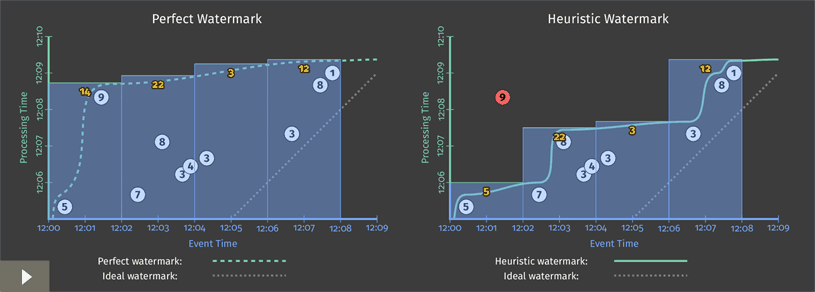](https://www.oreilly.com/ideas/the-world-beyond-batch-streaming-102#)

Figure 6. **Windowed summation on a streaming engine with perfect (left) and heuristic (right) watermarks.** Credit: Tyler Akidau.

In both cases, windows are materialized as the watermark passes the end of the window. The primary difference between the two executions is that the heuristic algorithm used in watermark calculation on the right fails to take the value of 9 into account, which drastically changes the shape of the watermark[[3]](https://www.oreilly.com/ideas/the-world-beyond-batch-streaming-102#_ftn3). These examples highlight two shortcomings of watermarks (and any other notion of completeness), specifically that they can be:

- **Too slow**: When a watermark of any type is correctly delayed due to known unprocessed data (e.g., slowly growing input logs due to network bandwidth constraints), that translates directly into delays in output if advancement of the watermark is the only thing you depend on for stimulating results.

This is most obvious in the left diagram, where the late arriving 9 holds back the watermark for all the subsequent windows, even though the input data for those windows become complete earlier. This is particularly apparent for the second window, [12:02, 12:04), where it takes nearly seven minutes from the time the first value in the window occurs until we see any results for the window whatsoever. The heuristic watermark in this example doesn’t suffer the same issue quite so badly (five minutes until output), but don’t take that to mean heuristic watermarks never suffer from watermark lag; that’s really just a consequence of the record I chose to omit from the heuristic watermark in this specific example.

The important point here is the following: while watermarks provide a very useful notion of completeness, depending upon completeness for producing output is often not ideal from a latency perspective. Imagine a dashboard that contains valuable metrics, windowed by hour or day. It’s unlikely you’d want to wait a full hour or day to begin seeing results for the current window; that’s one of the pain points of using classic batch systems to power such systems. Instead, it’d be much nicer to see the results for those windows refine over time as the inputs evolve and eventually become complete.

- **Too fast**: When a heuristic watermark is incorrectly advanced earlier than it should be, it’s possible for data with event times before the watermark to arrive some time later, creating late data. This is what happened in the example on the right: the watermark advanced past the end of the first window before all the input data for that window had been observed, resulting in an incorrect output value of 5 instead of 14. This shortcoming is strictly a problem with heuristic watermarks; their heuristic nature implies they will sometimes be wrong. As a result, relying on them alone for determining when to materialize output is insufficient if you care about correctness.

In Streaming 101, I made some rather emphatic statements about notions of completeness being insufficient for robust out-of-order processing of unbounded data streams. These two shortcomings, watermarks being too slow or too fast, are the foundations for those arguments. You simply cannot get both low latency *and* correctness out of a system that relies solely on notions of completeness. Addressing these shortcomings is where triggers come into play.

### ***When*: The wonderful thing about triggers, is triggers are wonderful things!**

Triggers are the second half of the answer to the question: “***When* in processing time are results materialized?**” Triggers declare when output for a window should happen in processing time (though the triggers themselves may make those decisions based off of things that happen in other time domains, such as watermarks progressing in the event time domain). Each specific output for a window is referred to as a *pane* of the window.

Examples of signals used for triggering include:

- **Watermark progress (i.e., event time progress)**, an implicit version of which we already saw in [Figure 6](https://www.oreilly.com/ideas/the-world-beyond-batch-streaming-102#FIG6), where outputs were materialized when the watermark passed the end of the window[[4]](https://www.oreilly.com/ideas/the-world-beyond-batch-streaming-102#_ftn4). Another use case is triggering garbage collection when the lifetime of a window exceeds some useful horizon, an example of which we’ll see a little later on.
- **Processing time progress**, which is useful for providing regular, periodic updates since processing time (unlike event time) always progresses more or less uniformly and without delay.
- **Element counts**, which are useful for triggering after some finite number of elements have been observed in a window.
- **Punctuations**, or other data-dependent triggers, where some record or feature of a record (e.g., an EOF element or a flush event) indicates that output should be generated.

In addition to simple triggers that fire based off of concrete signals, there are also composite triggers that allow for the creation of more sophisticated triggering logic. Example composite triggers include:

- **Repetitions**, which are particularly useful in conjunction with processing time triggers for providing regular, periodic updates.
- **Conjunctions** (logical AND), which fire only once *all* child triggers have fired (e.g., after the watermark passes the end of the window AND we observe a terminating punctuation record).
- **Disjunctions** (logical OR), which fire after *any* child triggers fire (e.g., after the watermark passes the end of the window OR we observe a terminating punctuation record).
- **Sequences**, which fire a progression of child triggers in a predefined order.

To make the notion of triggers a bit more concrete (and give us something to build upon), let’s go ahead and make explicit the implicit default trigger used in [Figure 6](https://www.oreilly.com/ideas/the-world-beyond-batch-streaming-102#FIG6) by adding it to the code from [Listing 2](https://www.oreilly.com/ideas/the-world-beyond-batch-streaming-102#L2):

PCollection<KV<String, Integer>> scores = input
  .apply(Window.into(FixedWindows.of(Duration.standardMinutes(2)))
               .triggering(AtWatermark()))
  .apply(Sum.integersPerKey());
Listing 3. **Explicit default trigger.**

With that in mind, and a basic understanding of what triggers have to offer, we can look at tackling the problems of watermarks being too slow or too fast. In both cases, we essentially want to provide some sort of regular, materialized updates for a given window, either before or after the watermark advances past the end of the window (in addition to the update we’ll receive at the threshold of the watermark passing the end of the window). So, we’ll want some sort of repetition trigger. The question then becomes: what are we repeating?

In the **too slow** case (i.e., providing early, speculative results), we probably should assume that there may be a steady amount of incoming data for any given window since we know (by definition of being in the early stage for the window) that the input we’ve observed for the window is thus far incomplete. As such, triggering periodically when processing time advances (e.g., once per minute) is probably wise because the number of trigger firings won’t be dependent upon the amount of data actually observed for the window; at worst, we’ll just get a steady flow of periodic trigger firings.

In the **too fast** case (i.e., providing updated results in response to late data due to a heuristic watermark), let’s assume our watermark is based on a relatively accurate heuristic (often a reasonably safe assumption). In that case, we don’t expect to see late data very often, but when we do, it’d be nice to amend our results quickly. Triggering after observing an element count of 1 will give us quick updates to our results (i.e., immediately any time we see late data), but is not likely to overwhelm the system given the expected infrequency of late data.

Note that these are just examples: we’re free to choose different triggers (or to choose not to trigger at all for one or both of them) if appropriate for the use case at hand.

Lastly, we need to orchestrate the timing of these various triggers: early, on-time, and late. We can do this with a `Sequence` trigger and a special `OrFinally` trigger, which installs a child trigger that terminates the parent trigger when the child fires.

PCollection<KV<String, Integer>> scores = input
  .apply(Window.into(FixedWindows.of(Duration.standardMinutes(2)))
               .triggering(Sequence(
                 Repeat(AtPeriod(Duration.standardMinutes(1)))
                   .OrFinally(AtWatermark()),
                 Repeat(AtCount(1))))
  .apply(Sum.integersPerKey());
Listing 4. **Manually specified early and late firings.**

However, that’s pretty wordy. And given that the pattern of repeated-early | on-time | repeated-late firings is so common, we provide a custom (but semantically equivalent) API in Dataflow to make specifying such triggers simpler and clearer:

PCollection<KV<String, Integer>> scores = input
  .apply(Window.into(FixedWindows.of(Duration.standardMinutes(2)))
               .triggering(
                 AtWatermark()
                   .withEarlyFirings(AtPeriod(Duration.standardMinutes(1)))
                   .withLateFirings(AtCount(1))))
  .apply(Sum.integersPerKey());
Listing 5. **Early and late firings via the early/late API.**

Executing either Listing 4 or 5 on a streaming engine (with both perfect and heuristic watermarks, as before) then yields results that look like this:

[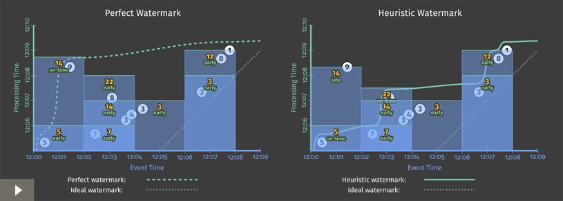](https://www.oreilly.com/ideas/the-world-beyond-batch-streaming-102#)

Figure 7. **Windowed summation on a streaming engine with early and late firings.** Credit: Tyler Akidau.

This version has two clear improvements over [Figure 6](https://www.oreilly.com/ideas/the-world-beyond-batch-streaming-102#FIG6):

- For the “**watermarks too slow**” case in the second window, [12:02, 12:04): we now provide periodic early updates once per minute. The difference is most stark in the perfect watermark case, where time-to-first-output is reduced from almost seven minutes down to three and a half; but it’s also clearly improved in the heuristic case as well. Both versions now provide steady refinements over time (panes with values 7, 14, then 22), with relatively minimal latency between the input becoming complete and materialization of the final output pane for the window.
- For the “**heuristic watermarks too fast**” case in the first window, [12:00, 12:02): when the value of 9 shows up late, we immediately incorporate it into a new, corrected pane with value of 14.

One interesting side effect of these new triggers is that they effectively normalize the output pattern between the perfect and heuristic watermark versions. Whereas the two versions in [Figure 6](https://www.oreilly.com/ideas/the-world-beyond-batch-streaming-102#FIG6) were starkly different, the two versions here look quite similar.

The biggest remaining difference at this point is window lifetime bounds. In the perfect watermark case, we know we’ll never see any more data for a window once the watermark has passed the end of it, hence we can drop all of our state for the window at that time. In the heuristic watermark case, we still need to hold on to the state for a window for some amount of time to account for late data. But as of yet, our system doesn’t have any good way of knowing just how long state needs to be kept around for each window. That’s where allowed lateness comes in.

### ***When*: allowed lateness (i.e., garbage collection)**

Before moving on to our last question (“***How* do refinements of results relate?**”), I’d like to touch on a practical necessity within long-lived, out-of-order stream processing systems: garbage collection. In the heuristic watermarks example in [Figure 7](https://www.oreilly.com/ideas/the-world-beyond-batch-streaming-102#FIG7), the persistent state for each window lingers around for the entire lifetime of the example; this is necessary to allow us to appropriately deal with late data when/if they arrive. But while it’d be great to be able to keep around all of our persistent state until the end of time, in reality, when dealing with an unbounded data source, it’s often not practical to keep state (including metadata) for a given window indefinitely; we’ll eventually run out of disk space.

As a result, any real-world, out-of-order processing system needs to provide some way to bound the lifetimes of the windows it’s processing. A clean and concise way of doing this is by defining a horizon on the allowed lateness within the system—i.e., placing a bound on how late any given *record* may be (relative to the watermark) for the system to bother processing it; any data that arrive after this horizon are simply dropped. Once you’ve bounded how late individual data may be, you’ve also established precisely how long the state for windows must be kept around: until the watermark exceeds the lateness horizon for the end of the window[[5]](https://www.oreilly.com/ideas/the-world-beyond-batch-streaming-102#_ftn5). But in addition, you’ve also given the system the liberty to immediately drop any data later than the horizon as soon as they’re observed, which means the system doesn’t waste resources processing data that no one cares about.

Since the interaction between allowed lateness and the watermark is a little subtle, it’s worth looking at an example. Let’s take the heuristic watermark pipeline from [Listing 5](https://www.oreilly.com/ideas/the-world-beyond-batch-streaming-102#L5)/[Figure 7](https://www.oreilly.com/ideas/the-world-beyond-batch-streaming-102#FIG7) and add a lateness horizon of one minute (note that this particular horizon has been chosen strictly because it fits nicely into the diagram; for real-world use cases, a larger horizon would likely be much more practical):

PCollection<KV<String, Integer>> scores = input
  .apply(Window.into(FixedWindows.of(Duration.standardMinutes(2)))
               .triggering(
                 AtWatermark()
                   .withEarlyFirings(AtPeriod(Duration.standardMinutes(1)))
                   .withLateFirings(AtCount(1)))
               .withAllowedLateness(Duration.standardMinutes(1)))
  .apply(Sum.integersPerKey());
Listing 6. **Early and late firings with allowed lateness.**

The execution of this pipeline would look something like Figure 8 below, where I’ve added the following features to highlight the effects of allowed lateness:

- The thick white line denoting the current position in processing time is now annotated with ticks indicating the lateness horizon (in event time) for all active windows.
- Once the watermark passes the lateness horizon for a window, that window is closed, which means all state for the window is discarded. I leave around a dotted rectangle showing the extent of time (in both domains) that the window covered when it was closed, with a little tail extending to the right to denote the lateness horizon for the window (for contrasting against the watermark).
- For this diagram only, I’ve added an additional late datum for the first window with value 6. The 6 is late, but still within the allowed lateness horizon, so it gets incorporated into an updated result with value 11. The 9, however, arrives beyond the lateness horizon, so it is simply dropped.

Figure 8. **Windowed summation on a streaming engine with early and late firings and allowed lateness.** Credit: Tyler Akidau.

Two final side notes about lateness horizons:

- To be absolutely clear, if you happen to be consuming data from sources for which perfect watermarks are available, then there’s no need to deal with late data, and an allowed lateness horizon of zero seconds will be optimal. This is what we saw in the perfect watermark portion of [Figure 7](https://www.oreilly.com/ideas/the-world-beyond-batch-streaming-102#FIG7).
- One noteworthy exception to the rule of needing to specify lateness horizons, even when heuristic watermarks are in use, would be something like computing global aggregates over all time for a tractably finite number of keys (e.g., computing the total number of visits to your site over all time, grouped by Web browser family). In this case, the number of active windows in the system is bounded by the limited keyspace in use. As long as the number of keys remains manageably low, there’s no need to worry about limiting the lifetime of windows via allowed lateness.

Practicality sated, let’s move on to our fourth and final question.

### ***How*: accumulation**

When triggers are used to produce multiple panes for a single window over time, we find ourselves confronted with the last question: “***How* do refinements of results relate?**” In the examples we’ve seen so far, each successive pane built upon the one immediately preceding it. However, there are actually three different modes of accumulation[[6]](https://www.oreilly.com/ideas/the-world-beyond-batch-streaming-102#_ftn6):

- **Discarding:** Every time a pane is materialized, any stored state is discarded. This means each successive pane is independent from any that came before. Discarding mode is useful when the downstream consumer is performing some sort of accumulation itself—e.g., when sending integers into a system that expects to receive deltas that it will sum together to produce a final count.
- **Accumulating:** As in [Figure 7](https://www.oreilly.com/ideas/the-world-beyond-batch-streaming-102#FIG7), every time a pane is materialized, any stored state is retained, and future inputs are accumulated into the existing state. This means each successive pane builds upon the previous panes. Accumulating mode is useful when later results can simply overwrite previous results, such as when storing output in a key/value store like BigTable or HBase.
- **Accumulating & retracting:** Like accumulating mode, but when producing a new pane, also produces independent retractions for the previous pane(s). Retractions (combined with the new accumulated result) are essentially an explicit way of saying, “I previously told you the result was X, but I was wrong. Get rid of the X I told you last time, and replace it with Y.” There are two cases where retractions are particularly helpful:
    - When consumers downstream are **re-grouping data by a different dimension**, it’s entirely possible the new value may end up keyed differently from the previous value, and thus end up in a different group. In that case, the new value can’t just overwrite the old value; you instead need the retraction to remove the old value from the *old* group, while the new value is incorporated the *new* group.
    - When **dynamic windows** (e.g., sessions, which we’ll look at more closely below) are in use, the new value may be replacing more than one previous window, due to window merging. In this case, it can be difficult to determine from the new window alone which old windows are being replaced. Having explicit retractions for the old windows makes the task straightforward.

The different semantics for each group are somewhat clearer when seen side-by-side. Consider the three panes for the second window in [Figure 7](https://www.oreilly.com/ideas/the-world-beyond-batch-streaming-102#FIG7) (the one with event time range [12:02, 12:04)). The table below shows what the values for each pane would look like across the three supported accumulation modes (with *Accumulating* mode being the specific mode used in [Figure 7](https://www.oreilly.com/ideas/the-world-beyond-batch-streaming-102#FIG7)):

|     |     |     |     |
| --- | --- | --- | --- |
|     | **Discarding** | **Accumulating** | **Accumulating & Retracting** |
| **Pane 1: [7]** | 7   | 7   | 7   |
| **Pane 2: [3, 4]** | 7   | 14  | 14, -7 |
| **Pane 3: [8]** | 8   | 22  | 22, -14 |
| **Last Value Observed** | 8   | 22  | 22  |
| **Total Sum** | 22  | 51  | 22  |

Table 1. **Comparing accumulation modes using the second window from Figure 7.**

- **Discarding:** Each pane incorporates only the values that arrived during that specific pane. As such, the final value observed does not fully capture the total sum. However, if you were to sum all the independent panes themselves, you would arrive at a correct answer of 22. This is why discarding mode is useful when the downstream consumer itself is performing some sort of aggregation on the materialized panes.
- **Accumulating:** As in [Figure 7](https://www.oreilly.com/ideas/the-world-beyond-batch-streaming-102#FIG7), each pane incorporates the values that arrived during that specific pane, plus all the values from previous panes. As such, the final value observed correctly captures the total sum of 22. If you were to sum up the individual panes themselves, however, you’d effectively be double- and triple-counting the inputs from panes 2 and 1, respectively, giving you an incorrect total sum of 51. This is why accumulating mode is most useful when you can simply overwrite previous values with new values: the new value already incorporates all the data seen thus far.
- **Accumulating & retracting:** Each pane includes both a new accumulating mode value as well as a retraction of the previous pane’s value. As such, both the last (non-retraction) value observed as well as the total sum of all materialized panes (including retractions) provide you with the correct answer of 22. This is why retractions are so powerful.

To see discarding mode in action, we would make the following change to [Listing 5](https://www.oreilly.com/ideas/the-world-beyond-batch-streaming-102#L5):

PCollection<KV<String, Integer>> scores = input
  .apply(Window.into(FixedWindows.of(Duration.standardMinutes(2)))
               .triggering(
                 AtWatermark()
                   .withEarlyFirings(AtPeriod(Duration.standardMinutes(1)))
                   .withLateFirings(AtCount(1)))
               .discardingFiredPanes())
  .apply(Sum.integersPerKey());
Listing 7. **Discarding mode version of early/late firings.**

Running again on a streaming engine with a heuristic watermark would produce output like the following:

Figure 9. **Discarding mode version of early/late firings on a streaming engine.** Credit: Tyler Akidau.

While the overall shape of the output is similar to the accumulating mode version from [Figure 7](https://www.oreilly.com/ideas/the-world-beyond-batch-streaming-102#FIG7), note how none of the panes in this discarding version overlap. As a result, each output is independent from the others.

If we want to look at retractions in action, the change would be similar (note, however, that retractions are still in development for Google Cloud Dataflow at this point, so the naming in this API is somewhat speculative, though unlikely to differ wildly from what we end up shipping):

PCollection<KV<String, Integer>> scores = input
  .apply(Window.into(FixedWindows.of(Duration.standardMinutes(2)))
               .triggering(
                 AtWatermark()
                   .withEarlyFirings(AtPeriod(Duration.standardMinutes(1)))
                   .withLateFirings(AtCount(1)))
               .accumulatingAndRetractingFiredPanes())
  .apply(Sum.integersPerKey());
Listing 8. **Accumulating & retracting mode version of early/late firings.**
And run on a streaming engine, this would yield output like the following:

Figure 10. **Accumulating & retracting mode version of early/late firings on a streaming engine.** Credit: Tyler Akidau.

Since the panes for each window all overlap, it’s a little tricky to see the retractions clearly. The retractions are indicated in red, which combines with the overlapping blue panes to yield a slightly purplish color. I’ve also horizontally shifted the values of the two outputs within a given pane slightly (and separated them with a comma) to make them easier to differentiate.

Comparing the final frames of Figures [9](https://www.oreilly.com/ideas/the-world-beyond-batch-streaming-102#FIG9), [7](https://www.oreilly.com/ideas/the-world-beyond-batch-streaming-102#FIG7) (heuristic only), and 10 side-by-side provides a nice visual contrast of the three modes:

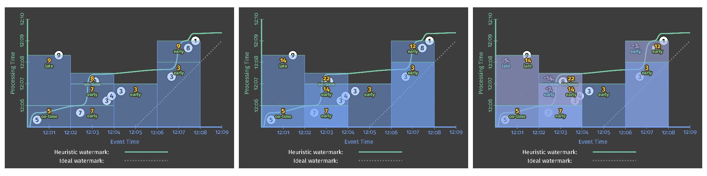

Figure 11. **Side-by-side comparison of accumulation modes: discarding (left), accumulating (center), and accumulating & retracting (right).** Credit: Tyler Akidau.

As you can imagine, the modes in the order presented (discarding, accumulating, accumulating & retracting) are each successively more expensive in terms of storage and computation costs. To that end, choice of accumulation mode provides yet another dimension for making tradeoffs along the axes of correctness, latency, and cost.

## **Intermezzo**

At this point, we’ve touched upon all four questions:

- ***What* results are calculated? **Answered via transformations.
- ***Where* in event time are results calculated?** Answered via windowing.
- ***When* in processing time are results materialized?** Answered via watermarks and triggers.
- ***How* do refinements of results relate?** Answered via accumulation modes.

However, we’ve really only looked at one type of windowing: fixed windowing in event-time. As you know from Streaming 101, there are a number of dimensions to windowing, two of which I’d like to visit before we call it day: **fixed windowing in processing-time** and **session windowing in event-time**.

## *When*/*Where*: Processing-time windows

Processing-time windowing is important for two reasons:

- For certain use cases, such as usage monitoring (e.g., Web service traffic QPS), where you want to analyze an incoming stream of data as it’s observed, processing-time windowing is absolutely the appropriate approach to take.
- For use cases where the time that events happened is important (e.g., analyzing user behavior trends, billing, scoring, etc), processing time windowing is absolutely the wrong approach to take, and being able to recognize these cases is critical.

As such, it’s worth gaining a solid understanding of the differences between processing-time windowing and event-time windowing, particularly given the prevalence of processing-time windowing in most streaming systems today.

When working within a model, such as the one presented in this post, where windowing as a first-class notion is strictly event-time based, there are two methods one can use to achieve processing-time windowing:

- **Triggers: **Ignore event time (i.e., use a global window spanning all of event time) and use triggers to provide snapshots of that window in the processing-time axis.
- **Ingress time**: Assign ingress times as the event times for data as they arrive, and use normal event time windowing from there on. This is essentially what something like Spark Streaming does currently.

Note that the two methods are more or less equivalent, although they differ slightly in the case of multi-stage pipelines: in the triggers version, each stage slices up the processing time “windows” independently, so for example, data in window X for one stage may end up in window X-1 or X+1 in the next stage; in the ingress time version, once a datum is incorporated into window X, it will remain in window X for the duration of the pipeline due to synchronization of progress between stages via watermarks (in the Dataflow case), micro-batch boundaries (in the Spark Streaming case), or whatever other coordinating factor is involved at the engine level.

As I’ve noted to death, the big downside of processing time-windowing is that the contents of the windows change when the observation order of the inputs changes. To drive this point home in a more concrete manner, we’re going to look at these three use cases:

- **Event-time windowing**
- **Processing-time windowing via triggers**
- **Processing-time windowing via ingress time**

We'll apply each to two different input sets (so, six variations total). The two input sets will be for the exact same events (i.e., same values, occurring at the same event times), but with different observation orders. The first set will be the observation order we’ve seen all along, colored white; the second one will have all the values shifted in the processing-time axis as in Figure 12 below, colored purple. You can simply imagine that the purple example is another way reality could have happened if the winds had been blowing in from the east instead of the west (i.e., the underlying set of complex distributed systems had played things out in a slightly different order).

Figure 12. **Shifting input observation order in processing time, holding values and event times constant.** Credit: Tyler Akidau.

### **Event-time windowing**

To establish a baseline, let’s first compare fixed windowing in event-time with a heuristic watermark over these two observation orderings. We’ll reuse the early/late code from [Listing 5](https://www.oreilly.com/ideas/the-world-beyond-batch-streaming-102#L5)/[Figure 7](https://www.oreilly.com/ideas/the-world-beyond-batch-streaming-102#FIG7) to get the results below. The lefthand side is essentially what we saw before; the righthand side is the results over the second observation order. The important thing to note here is: even though the overall shape of the outputs differs (due to the different orders of observation in processing time), **the final results for the four windows remain the same**: 14, 22, 3, and 12:

[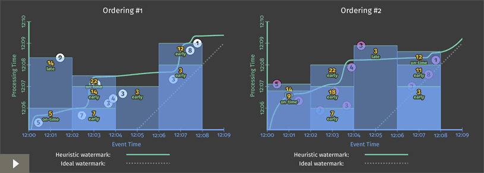](https://www.oreilly.com/ideas/the-world-beyond-batch-streaming-102#)

Figure 13. **Event-time windowing over two different processing-time orderings of the same inputs.** Credit: Tyler Akidau.

### **Processing-time windowing via triggers**

Let’s now compare this to the two processing time methods described above. First, we’ll try the triggers method. There are three aspects to making processing-time “windowing” work in this manner:

- **Windowing:** We use the global event-time window since we’re essentially emulating processing-time windows with event-time panes.
- **Triggering:** We trigger periodically in the processing-time domain, based off of the desired size of the processing-time windows.
- **Accumulation:** We use discarding mode to keep the panes independent from one another, thus letting each of them act like an independent processing-time “window.”

The corresponding code looks something like Listing 9; note that global windowing is the default, hence there is no specific override of the windowing strategy:

PCollection<KV<String, Integer>> scores = input
  .apply(Window.triggering(
                  Repeatedly(AtPeriod(Duration.standardMinutes(2))))
               .discardingFiredPanes())
  .apply(Sum.integersPerKey());

Listing 9. **Processing-time windowing via repeated, discarding panes of a global event-time window.**

When executed on a streaming runner against our two different orderings of the input data, the results look like Figure 14 below. Interesting notes with this figure:

- Since we’re emulating processing time windows via event-time panes, the “windows” are delineated in the processing-time axis, which means their width is measured on the Y axis instead of the X axis.
- Since processing-time windowing is sensitive to the order that input data are encountered, the results for each of the “windows” differs for each of the two observation orders, even though the events themselves technically happened at the same times in each version. On the left we get 12, 21, 18, whereas on the right we get 7, 36, 4.

[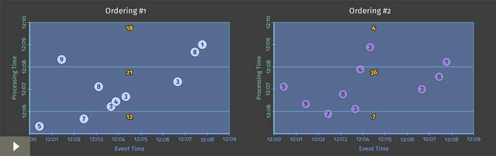](https://www.oreilly.com/ideas/the-world-beyond-batch-streaming-102#)

Figure 14. **Processing-time “windowing” via triggers, over two different processing-time orderings of the same inputs.** Credit: Tyler Akidau.

### **Processing-time windowing via ingress time**

Lastly, let’s look at processing-time windowing achieved by mapping the event times of input data to be their ingress times. Code-wise, there are four aspects worth mentioning here:

- **Time-shifting:** When elements arrive, their event times need to be overwritten with the time of ingress. Note that we don’t currently have a standard API for this in Dataflow, although we may in the future (hence the use of a fictional method on the pseudo-code I/O source to represent this in the code below). For [Google Cloud Pub/Sub](https://cloud.google.com/pubsub/), you simply need to leave the `timestampLabel` field of the message empty when publishing messages; for other sources, you’d need to consult the source-specific documentation.
- **Windowing:** Return to using standard fixed event-time windowing.
- **Triggering:** Since ingress time affords the ability to calculate a perfect watermark, we can use the default trigger, which in this case implicitly fires exactly once when the watermark passes the end of the window.
- **Accumulation mode:** Since we only ever have one output per window, the accumulation mode is irrelevant.

The actual code might thus looks something like this:
PCollection<String> raw = IO.read().withIngressTimeAsTimestamp();
PCollection<KV<String, Integer>> input = raw.apply(ParDo.of(new ParseFn());
PCollection<KV<String, Integer>> scores = input
  .apply(Window.into(FixedWindows.of(Duration.standardMinutes(2))))
  .apply(Sum.integersPerKey());
Listing 10. **Explicit default trigger.**

And execution on a streaming engine would look like Figure 15 below. As data arrive, their event times are updated to match their ingress times (i.e., the processing times at arrival), resulting in a rightward horizontal shift onto the ideal watermark line. Interesting notes in this figure:

- As with the other processing-time windowing example, we get different results when the ordering of inputs change, even though the values and event times for the input stay constant.
- Unlike the other example, the windows are once again delineated in the event-time domain (and thus along the X axis). Despite this, they aren’t bonafide event-time windows; we’ve simply mapped processing time onto the event-time domain, erasing the original record of occurrence for each input and replacing it with a new one that instead represents the time the datum was first observed by the pipeline.
- Despite this, thanks to the watermark, trigger firings still happen at exactly the same time as in the previous processing-time example. Furthermore, the output values produced are identical to that example, as predicted: 12, 21, 18 on the left, and 7, 36, 4 on the right.
- Since perfect watermarks are possible when using ingress time, the actual watermark matches the ideal watermark, ascending up and to the right with a slope of one.

[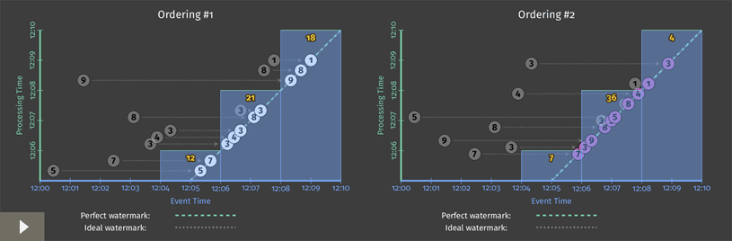](https://www.oreilly.com/ideas/the-world-beyond-batch-streaming-102#)

Figure 15. **Processing-time windowing via the use of ingress time, over two different processing-time orderings of the same inputs.** Credit: Tyler Akidau.

While it’s interesting to see the different ways one can implement processing-time windowing, the big takeaway here is the one I’ve been harping on since the first post: event-time windowing is order-agnostic, at least in the limit (actual panes along the way may differ until the input becomes complete); processing-time windowing is not. **If you care about the times at which your events actually happened, you must use event-time windowing or your results will be meaningless.** I will get off my soapbox now.

### ***Where*: session windows**

We are soooooooo close to being done with examples. If you’ve made it this far, you are a very patient reader. The good news is, your patience has not been for naught. We’re now going to look at one of my favorite features: the dynamic, data-driven windows called sessions. Hold on to your hats and glasses.

Sessions are a special type of window that captures a period of activity in the data that is terminated by a gap of inactivity. They’re particularly useful in data analysis because they can provide a view of the activities for a specific user over a specific period of time where they were engaged in some activity. This allows for the correlation of activities within the session, drawing inferences about levels of engagement based off of the lengths of the sessions, etc.

From a windowing perspective, sessions are particularly interesting in two ways:

- They are an example of a **data-driven window**: the location and sizes of the windows are a direct consequence of the input data themselves, rather than being based off of some predefined pattern within time, like fixed and sliding windows are.
- They are also an example of an **unaligned window**, i.e., a window that does not apply uniformly across the data, but instead only to a specific subset of the data (e.g., per user). This is in contrast to aligned windows like fixed and sliding windows, which typically apply uniformly across the data.

For some use cases, it’s possible to tag the data within a single session with a common identifier ahead of time (e.g., a video player that emits heartbeat pings with quality of service information; for any given viewing, all of the pings can be tagged ahead of time with a single session ID). In this case, sessions are much easier to construct since it’s basically just a form of grouping by key.

However, in the more general case (i.e., where the actual session itself is not known ahead of time), the sessions must be constructed from the locations of the data within time alone. When dealing with out-of-order data, this becomes particularly tricky.

They key insight in providing general session support is that a complete session window is, by definition, a composition of a set of smaller, overlapping windows, each containing a single record, with each record in the sequence separated from the next by a gap of inactivity no larger than a predefined timeout. Thus, even if we observe the data in the session out of order, we can build up the final session simply by merging together any overlapping windows for individual data as they arrive.

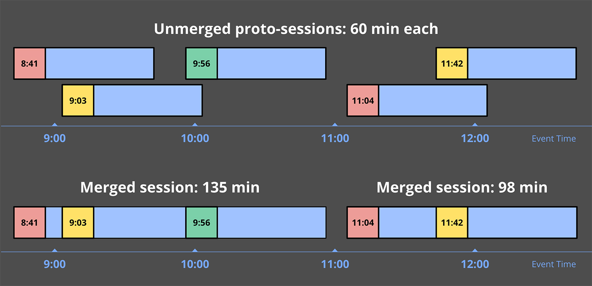

Figure 16. **Unmerged proto-session windows, and the resultant merged sessions.** Credit: Tyler Akidau.

Let’s look at an example, by taking the early/late code with retractions enabled from [Listing 8](https://www.oreilly.com/ideas/the-world-beyond-batch-streaming-102#L8) and updating the windowing to build sessions instead:

PCollection<KV<String, Integer>> scores = input
  .apply(Window.into(Sessions.withGapDuration(Duration.standardMinutes(1)))
               .triggering(
                 AtWatermark()
                   .withEarlyFirings(AtPeriod(Duration.standardMinutes(1)))
                   .withLateFirings(AtCount(1)))
               .accumulatingAndRetractingFiredPanes())
  .apply(Sum.integersPerKey());
Listing 11. **Early and late firings with session windows and retractions.**
Executed on a streaming engine, you’d get something like Figure 17 below:

Figure 17. **Early and late firings with sessions windows and retractions on a streaming engine.** Credit: Tyler Akidau.

There’s quite a lot going on here, so I’ll walk you through some of it:

- When the first record with value 5 is encountered, it’s placed into a single proto-session window that begins at that record’s event-time and spans the width of the session gap duration—e.g., one minute beyond the point at which that datum occurred. Any windows we encounter in the future that overlap this window should be part of the same session, and will be merged into it as such.
- The second record to arrive is the 7, which similarly is placed into its own proto-session window, since it doesn’t overlap with the window for the 5.
- In the meantime, the watermark has passed the end of the first window, so the value of 5 is materialized as an on-time result just before 12:06. Shortly thereafter, the second window is also materialized as a speculative result with value 7, right as processing time hits 12:06.
- We next observe a sequence of records, 3, 4, and 3, the proto-sessions for which all overlap. As a result, they are all merged together, and by the time the early trigger for 12:07 fires, a single window with value 10 is emitted.
- When the 8 arrives shortly thereafter, it overlaps with both the proto-session with value 7, and the session with value 10. All three are thus merged together, forming a new combined session with value 25. When the watermark then passes the end of this session, it materializes both the new session with value 25 as well as retractions for the two windows that were previously emitted, but later incorporated into it: the 7 and the 10.
- A similar dance occurs when the 9 arrives late, joining the proto-session with value 5 and session with value 25 into a single larger session of value 39. The 39 and the retractions for the 5 and 25 windows are all emitted immediately by the late data trigger.

This is some pretty powerful stuff. And what’s really awesome is how easy it is to describe something like this within a model that breaks apart the dimensions of stream processing into distinct, composable pieces. In the end, you can focus more on the interesting business logic at hand and less on the minutiae of shaping the data into some usable form.

If you don’t believe me, check out this blog post describing how to [manually build up sessions on Spark Streaming](http://blog.cloudera.com/blog/2014/11/how-to-do-near-real-time-sessionization-with-spark-streaming-and-apache-hadoop/) (note that this is not done to point fingers at them; the Spark folks have just done a good enough job with everything else that someone’s actually bothered to go to the trouble of documenting what it takes to build a specific variety of sessions support on top of them; I can’t say the same for most other systems out there). It’s quite involved, and they’re not even doing proper event-time sessions, or providing speculative or late firings, nor retractions.

## It’s the end of the blog as we know it, and I feel fine

That’s it! I am done with examples. Applause, applause! You are now well steeped in the foundations of robust stream processing, and ready to go forth into the world and do amazing things. But before you leave, I’d like to recap quickly what we’ve covered, lest you forget any of it in your haste. Firstly, the major concepts we touched upon:

- **Event-time versus processing-time:** The all-important distinction between when events occurred and when they are observed by your data processing system.
- **Windowing:** The commonly utilized approach to managing unbounded data by slicing it up along temporal boundaries (in either processing-time or event-time, though we narrow the definition of windowing in the Dataflow model to mean only within event-time).
- **Watermarks:** The powerful notion of progress in event-time that provides a means of reasoning about completeness in an out-of-order processing system operating on unbounded data.
- **Triggers:** The declarative mechanism for specifying precisely when materialization of output makes sense for your particular use case.
- **Accumulation:** The relationship between refinements of results for a single window in cases where it’s materialized multiple times as it evolves.

Secondly, the four questions we used to frame our exploration (and which I promise I will not make you read any more after this):

- ***What* results are calculated? **= transformations
- ***Where* in event-time are results calculated?** = windowing
- ***When* in processing-time are results materialized?** = watermarks + triggers
- ***How* do refinements of results relate?** = accumulation

Thirdly and lastly, to drive home the flexibility afforded by this model of stream processing (since in the end, that’s really what this is all about: balancing competing tensions like correctness, latency, and cost), a recap of the major variations in output we were able to achieve over the same data set with only a minimal amount of code change:

|     |     |     |
| --- | --- | --- |
| 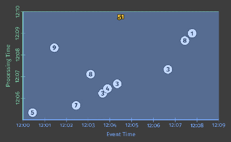 Classic batch [Listing 1](https://www.oreilly.com/ideas/the-world-beyond-batch-streaming-102#L1) / [Figure 2](https://www.oreilly.com/ideas/the-world-beyond-batch-streaming-102#FIG2) | 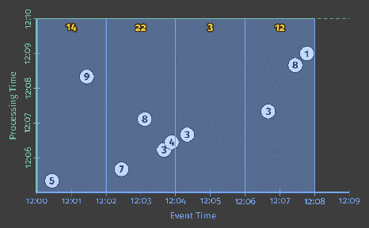 Fixed windows batch [Listing 2](https://www.oreilly.com/ideas/the-world-beyond-batch-streaming-102#L2) / [Figure 4](https://www.oreilly.com/ideas/the-world-beyond-batch-streaming-102#FIG4) | 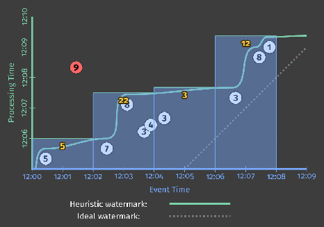 Fixed windows streaming watermark [Listing 2](https://www.oreilly.com/ideas/the-world-beyond-batch-streaming-102#L2) / [Figure 6](https://www.oreilly.com/ideas/the-world-beyond-batch-streaming-102#FIG6) |
| 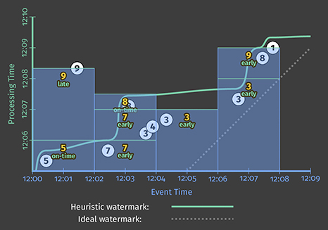 Early/late discarding [Listing 7](https://www.oreilly.com/ideas/the-world-beyond-batch-streaming-102#L7) / [Figure 9](https://www.oreilly.com/ideas/the-world-beyond-batch-streaming-102#FIG9) | 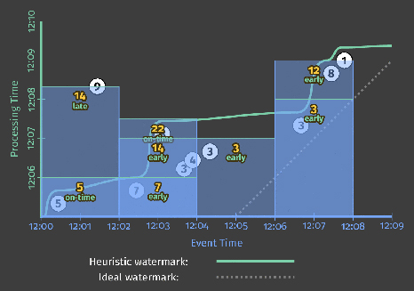 Early/late accumulating Listings [4](https://www.oreilly.com/ideas/the-world-beyond-batch-streaming-102#L4) & [5](https://www.oreilly.com/ideas/the-world-beyond-batch-streaming-102#L5) / [Figure 7](https://www.oreilly.com/ideas/the-world-beyond-batch-streaming-102#FIG7) | 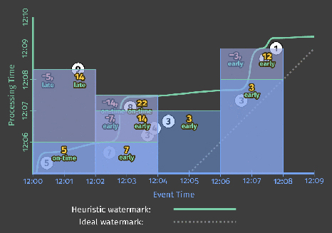 Early/late retracting [Listing 8](https://www.oreilly.com/ideas/the-world-beyond-batch-streaming-102#L8) / [Figure 10](https://www.oreilly.com/ideas/the-world-beyond-batch-streaming-102#FIG10) |
| 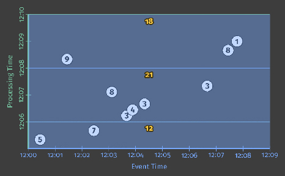 Processing-time (triggers) [Listing 9](https://www.oreilly.com/ideas/the-world-beyond-batch-streaming-102#L9) / [Figure 14](https://www.oreilly.com/ideas/the-world-beyond-batch-streaming-102#FIG14) | 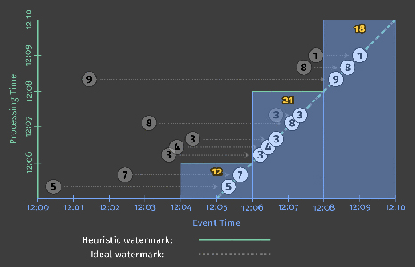 Processing-time (ingress time) [Listing 10](https://www.oreilly.com/ideas/the-world-beyond-batch-streaming-102#L10) / [Figure 15](https://www.oreilly.com/ideas/the-world-beyond-batch-streaming-102#FIG15) | 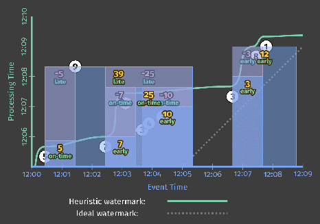 Sessions [Listing 11](https://www.oreilly.com/ideas/the-world-beyond-batch-streaming-102#L11) / [Figure 17](https://www.oreilly.com/ideas/the-world-beyond-batch-streaming-102#FIG17) |

Figure 18. **Nine variations in output over the same input set.** Credit: Tyler Akidau.

Thank you for your patience and interest. I’ll see you all next time!

## **Postscript**

### **Additional resources**

If you’re curious to learn more about Dataflow, we happen to have a [big pile of excellent documentation](https://cloud.google.com/dataflow/docs/) waiting for you. And as noted above, we also have a very nice [code walkthrough](https://cloud.google.com/dataflow/examples/gaming-example) that covers four example pipelines analyzing data in a mobile gaming scenario, with full code available on [GitHub](https://github.com/GoogleCloudPlatform/DataflowJavaSDK-examples/tree/master/src/main/java8/com/google/cloud/dataflow/examples/complete/game); if you’re interested in seeing bonafide Dataflow code in action, that’s your ticket.

If you’re more the video watching type, Frances Perry gave an [excellent presentation](https://www.youtube.com/watch?v=3UfZN59Nsk8) on the Dataflow Model at the @Scale 2015 conference, modulo the part where she says that we call retractions “[backsies](https://www.youtube.com/watch?v=3UfZN59Nsk8&feature=youtu.be&t=1710)”; that part is right out <exasperated-tongue-sticking-out-smiley/>.

And if for some reason you have a craving to hear me wax academic, I wrote a [paper](http://www.vldb.org/pvldb/vol8/p1792-Akidau.pdf) on the subject that the fine folks at VLDB were kind enough to publish last year. While these blog posts are arguably more comprehensive (no artificial page limits!) and notably prettier (colors! animations!), there are some interesting details about motivating use cases from our experiences at Google in that paper which you won’t find anywhere else. Plus, it very clearly and concisely motivates the need for these sorts of semantics, while also providing a nice jumping-off point for exploring some of the related academic literature.

### **Deviations from reality**

For the sake of completeness, I wanted to point a few deviations from reality (by which I mean the current Google Cloud Dataflow implementation at the time of publication) in the examples provided in this post:

1. In Listings [4](https://www.oreilly.com/ideas/the-world-beyond-batch-streaming-102#L4), [5](https://www.oreilly.com/ideas/the-world-beyond-batch-streaming-102#L5), and [6](https://www.oreilly.com/ideas/the-world-beyond-batch-streaming-102#L6), no accumulation mode is specified, but accumulating mode is what we get upon execution. In reality, there is currently no default accumulation mode in Dataflow: you must either specify discarding or accumulating mode. We’re reserving the default for accumulating and retracting mode once that feature is released.

2. Retractions aren’t supported yet. We’re working on it.

3. The default allowed lateness is in fact 0. Thus, for all of the examples where allowed lateness is unspecified, we would never see any late panes since state for each window would be dropped immediately after the watermark passed the end of it.

4. The default trigger is actually a repeated watermark trigger bounded by the default allowed lateness of 0. In [Listing 3](https://www.oreilly.com/ideas/the-world-beyond-batch-streaming-102#L3), I claim (equivalently) that it’s a single watermark trigger, for the sake of simplicity.

## **Acknowledgements**

Last, but certainly not least: many people are awesome, and I would like to acknowledge a specific subset of them here for their help in creating these behemoth blog posts.

The content in these posts distills the work of an untold number of extremely smart individuals across Google, the industry, and academia at large. I owe them all a sincere expression of gratitude, and I regret that I could not possibly list them all here, even if I tried.

Within Google, much credit goes to the Dataflow, Flume, MapReduce, MillWheel, and associated teams, who’ve helped bring these ideas to life over the years. In addition to my original partners in crime in designing our high-level streaming model, Robert Bradshaw and Daniel Mills, as well as Ben Chambers for his ninja engineering skills and insight in realizing the trickier and more subtle parts of this model, I’d like to specifically thank Paul Nordstrom and the MillWheel team of yore for envisioning and building such a comprehensive, robust, and scalable set of low-level primitives on top of which we were later able to construct the high-level model described in this post, and now embodied in the Dataflow SDK. Without their vision and skill, I think the world of massive-scale stream processing would look very different.

And lastly, I’d like to thank the tireless efforts of folks who have repeatedly devoted time, ideas, and support for these posts, specifically: Frances Perry, Rafael J. Fernández-Moctezuma, Grzegorz Czajkowski, and William Vambenepe. And of course my intrepid editor at O’Reilly, Marie Beaugureau, primarily for her insightful comments that helped embiggen these posts into something worth reading (fingers crossed), but also for her continued patience with my incessant attempts at subverting established editing standards <winky-smiley/>.

* * *

[[1]](https://www.oreilly.com/ideas/the-world-beyond-batch-streaming-102#_ftn1) Please note that the O’Reilly editors are technically opposed to the use of this otherwise cromulent word, but have graciously conceded its inclusion at my emphatic request. [(Return)](https://www.oreilly.com/ideas/the-world-beyond-batch-streaming-102#F1)

[[2]](https://www.oreilly.com/ideas/the-world-beyond-batch-streaming-102#_ftn2) Bear with me here. Fine-grained emotional expressions via composite punctuation (i.e. emoticons) are strictly forbidden on oreilly.com <winky-smiley/>. [(Return)](https://www.oreilly.com/ideas/the-world-beyond-batch-streaming-102#F2)

[[3]](https://www.oreilly.com/ideas/the-world-beyond-batch-streaming-102#_ftn3) Note that I specifically chose to omit the value of 9 from the heuristic watermark because it will help me to make some important points about late data and watermark lag; in reality, a heuristic watermark might be just as likely to omit some other value(s) instead, which in turn could have significantly less drastic effect on the watermark. If winnowing late-arriving data from the watermark is your goal (which is very valid in some cases, such as abuse detection, where you just want to see a significant majority of the data as quickly as possible), you don’t necessarily want a heuristic watermark rather than a perfect watermark; what you really want is a percentile watermark, which explicitly drops some percentile of late-arriving data from its calculations. [(Return)](https://www.oreilly.com/ideas/the-world-beyond-batch-streaming-102#F3)

[[4]](https://www.oreilly.com/ideas/the-world-beyond-batch-streaming-102#_ftn4) Truth be told, we actually saw such an implicit trigger in use in all of the examples thus far, even the batch ones; in batch processing, the watermark conceptually advances to infinity at the end of the batch, thus triggering all active windows, even global ones spanning all of event time. [(Return)](https://www.oreilly.com/ideas/the-world-beyond-batch-streaming-102#F4)

[[5]](https://www.oreilly.com/ideas/the-world-beyond-batch-streaming-102#_ftn5) It may seem a little odd to be specifying a horizon for handling late data using the very metric that resulted in the late data in the first place (i.e., the heuristic watermark). And in some sense it is. But of the options available, it’s arguably the best. The only other practical option would be to specify the horizon in processing time (e.g., keep windows around for 10 minutes of processing time after the watermark passes the end of the window), but using processing time would leave the garbage collection policy vulnerable to issues within the pipeline itself (e.g., workers crashing, causing the pipeline to stall for a few minutes), which could lead to windows that didn’t actually have a chance to handle late data that they otherwise should have. By specifying the horizon in the event time domain, garbage collection is directly tied to the actual progress of the pipeline, which decreases the likelihood that a window will miss its opportunity to handle late data appropriately. [(Return)](https://www.oreilly.com/ideas/the-world-beyond-batch-streaming-102#F5)

[[6]](https://www.oreilly.com/ideas/the-world-beyond-batch-streaming-102#_ftn6) One might note that there should logically be a fourth mode, discarding and retracting; that mode isn’t terribly useful in most cases, so I won’t discuss it further here. [(Return)](https://www.oreilly.com/ideas/the-world-beyond-batch-streaming-102#F6)

Article image: "Boatmen on the Missouri" by George Caleb Bingham (source: [Wikimedia Commons](https://commons.wikimedia.org/wiki/File:George_Caleb_Bingham_-_Boatmen_on_the_Missouri_-_Google_Art_Project.jpg)).