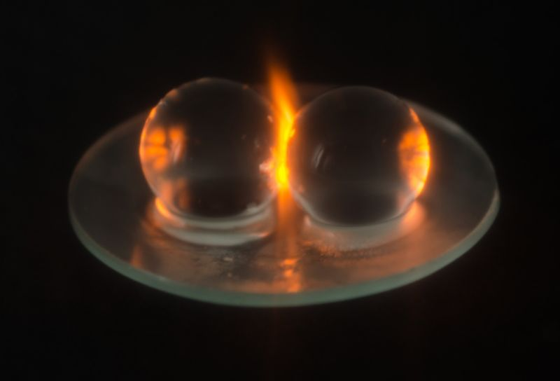

The wrath of grapes: A tale of 12 dead microwaves and plasma-spewing grapes

####  Don't try this at home —

# The wrath of grapes: A tale of 12 dead microwaves and plasma-spewing grapes

## Trent University researchers found that the effect is due to "hot spot."

 [Jennifer Ouellette](https://arstechnica.com/author/jenniferouellette/) - 2/18/2019, 1:00 PM

 

[Enlarge](https://cdn.arstechnica.net/wp-content/uploads/2019/02/plasmaTOP.jpg)  / Not just for grapes: plasma formed between a pair of hydrogel beads irradiated in a household microwave oven.

**[Hamza K. Khattak](http://dx.doi.org/10.1073/pnas.1818350116)

 [134 with 89 posters participating](https://arstechnica.com/science/2019/02/these-scientists-broke-12-microwaves-to-learn-how-grapes-create-plasmas/?comments=1)

- [Share on Facebook](https://www.facebook.com/sharer.php?u=https%3A%2F%2Farstechnica.com%2F%3Fpost_type%3Dpost%26p%3D1458471)

- [Share on Twitter](https://twitter.com/share?text=The+wrath+of+grapes%3A+A+tale+of+12+dead+microwaves+and+plasma-spewing+grapes&url=https%3A%2F%2Farstechnica.com%2F%3Fpost_type%3Dpost%26p%3D1458471)

-

DIY science enthusiasts know that, if you put a halved grape into a microwave with just a bit of skin connecting the halves, it'll produce sparks and a fiery plume of ionized gas known as a plasma. There are thousands of YouTube videos documenting the effect. But the standard explanation offered for why this occurs isn't quite right, according to [a new paper](http://www.pnas.org/cgi/doi/10.1073/pnas.1818350116) in the *Proceedings of the National Academy of Sciences*. And its authors only needed to destroy a dozen microwaves to prove it.

"Many microwaves were in fact harmed during the experiments," admitted co-author Hamza Khattak of Trent University in Canada. "At one point, we had a microwave graveyard in the lab before disposing of the many early iterations in electronic waste."

Co-author Aaron Slepkov first became interested in the phenomenon when, as an undergraduate in 1995, he noticed there was no formal (i.e., scientifically rigorous and peer-reviewed) explanation for how the plasma was being generated. Once he'd finished his PhD and established his own research group at Trent University, he started doing his own experiments (microwaving grapes for science) with one of his undergraduate students. They used thermal imaging and computer simulations of both grapes and hydrogel beads in their experiments.

In order to capture the process on camera, certain modifications to the microwaves were needed, including drilling holes and removing the door, the better to peek inside while the machine was active (the opening was carefully covered with mesh to prevent leakage). And of course, the experiment itself can be hazardous to microwaves: running the oven nearly empty produces a ton of damaging unabsorbed radiation. That's why the group plowed through 12 microwave ovens over the course of the study.

Microwaving two halves of a grape produces sparks, then a fiery plasma plume.
**H.K. Khattak et al.

The [usual explanation](https://www.sciencealert.com/watch-here-s-how-to-make-plasma-by-microwaving-a-grape) for the generation of plasmas is that grapes are so small that the irradiating microwaves become [highly concentrated](https://van.physics.illinois.edu/qa/listing.php?id=818) in the grape tissue, [ripping some the molecules apart](https://www.vox.com/xpress/2014/12/3/7326643/grape-plasma-microwave) to generate charged ions (adding to the electrolytes already present in the grapes). The electromagnetic field that forms causes ions to flow from one grape half to the other via the connecting skin—at least at first. That's when you get the initial sparks. Eventually, the ions start passing through the surrounding air as well, ionizing it to produce that hot plume of plasma.

"Previous explanations leaned on the idea that the grape was acting as an antenna and that an electrical current was being generated across the 'skin bridge' holding the two halves to a grape together," said co-author Pablo Bianucci of Concordia University in Montreal, who did the computer simulations for the study. It's that current, conventional wisdom goes, that generates the plasma.

These new experiments show that's not quite right. The skin bridge isn't necessary for the effect to occur.

Rather, "Our interpretation is that the plasma is generated by an electromagnetic 'hot spot' that is a purely (microwave) bulk effect," said Bianucci. "The grapes have the right refractive index and size to 'trap' microwaves, and putting two of them close together leads to the generation of this hot spot between them."

Once that hot spot is created, the strong electromagnetic fields at that spot transfer energy to ions in the grape. *Voilà!* A fiery plasma.

The Trent scientists found that the trick also works with gooseberries, large blackberries, and quail eggs, as well as hydrogel beads—plastic beads soaked in water. Pretty much anything grape-sized will work, because that's the ideal size to best amplify the microwaves to produce that intensely focused hot spot.

DOI: *PNAS*, 2019. [10.1073/pnas.1818350116](http://dx.doi.org/10.1073/pnas.1818350116)  ([About DOIs](http://arstechnica.com/science/news/2010/03/dois-and-their-discontents-1.ars)).