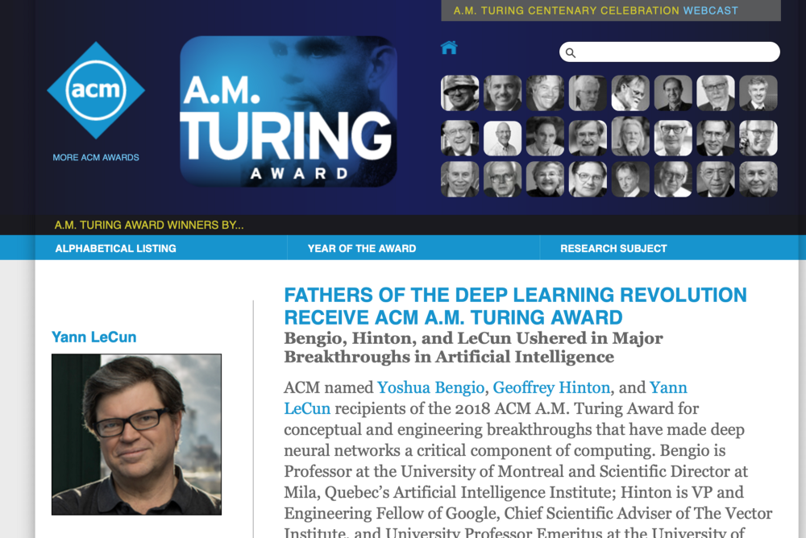

The year in AI: 2019 ML/AI advances recap - Xavier Amatriain - Medium

# The year in AI: 2019 ML/AI advances recap

[Xavier Amatriain](https://medium.com/@xamat?source=post_page-----c6cc1d902d5----------------------)

[Dec 16](https://medium.com/@xamat/the-year-in-ai-2019-ml-ai-advances-recap-c6cc1d902d5?source=post_page-----c6cc1d902d5----------------------) · 13 min read

It has become somewhat of a tradition for me to do an end-of-year retrospective of advances in AI/ML (see [last year’s round up](https://medium.com/@xamat/the-year-in-ai-ml-advances-2018-roundup-db52f7f96358) for example), so here we go again! This year started with a big recognition to the impact of Deep Learning when Hinton, Bengio, and Lecun were awarded [the Turing award](https://www.nytimes.com/2019/03/27/technology/turing-award-ai.html). You might think that after a few years of neck-breaking speed in innovation, this kind of recognition might be signaling that we are getting near some sort of plateau. Well, think again. That is nowhere in sight yet. It is true that hot areas have clearly shifted and while a few years ago image recognition was all the rave this year we have seen more impressive advances in language. I will go into all of this below, but let me start by summarizing the biggest headlines of AI in 2019, in my own very biased opinion:

- Computers learn to talk (i.e. language models like Bert and specially GPT-2 get **scaringly** good)
- AI becoming good at creating synthetic content has some serious consequences
- The biggest theoretical controversy continues to be how to incorporate innate knowledge or structure into machine learned models. There has been little practical progress towards this end, and little progress towards any other theoretical breakthrough.
- The revolution may get unsupervised at some point, but for now we can make it self-supervised
- Computers continue to get better at playing games and can now collaborate in multi-agent escenarios
- Other areas like Healthcare and Recommender Systems continue to see advances by using Deep Learning, but some of these advances are questioned
- The war between frameworks continues, with a major TensorFlow release and also big movements on the Pytorch arena.

But, let’s get right into it and dive into each of these fascinating 2019 headlines.

**The year of the Language Models**

I think it is hard to argue against the fact that this has been the year of Deep Learning and NLP. Or more concretely, the year of language models. Or even more concretely the year of Transformers and GPT-2. Yes, it might be hard to believe, but it has been less than a year since OpenAI first released talked about their [GPT-2 language model](https://openai.com/blog/better-language-models/). That blog post sparked a lot of discussions about AI safety since OpenAI did not feel comfortable releasing the model. Since then, the model was publicly replicated (see [here](https://medium.com/@NPCollapse/replicating-gpt2-1-5b-86454a7f26af) and [here](https://blog.usejournal.com/opengpt-2-we-replicated-gpt-2-because-you-can-too-45e34e6d36dc)), and [finally released](https://openai.com/blog/gpt-2-1-5b-release/). However, this has not been the only advance in this space. We have seen Google publish [AlBERT](https://arxiv.org/pdf/1909.11942.pdf), [XLNET](https://arxiv.org/abs/1906.08237), and [Universal Transformers](https://ai.google/research/pubs/pub48062), and also talk about how BERT has been the [largest improvement to Google search in years](https://www.blog.google/products/search/search-language-understanding-bert). Besides Google, most of the other big players in the AI space have also published their own language models: [Salesforce](https://blog.einstein.ai/introducing-a-conditional-transformer-language-model-for-controllable-generation/), [Amazon](https://arxiv.org/abs/1904.09408), [Microsoft](https://github.com/microsoft/dialogpt), or [Facebook](https://ai.facebook.com/blog/a-new-generative-qa-model-that-learns-to-answer-the-whole-question/) seem to all have really bought into the Language Model revolution.

What can these models do in practice? Besides the obvious and scary “generate credible fake tweets”, there are much more constructive ones that we have seen during this past year. For example, Google told us how they were using them not only for search as mentioned above, but also for their [Smart compose](https://arxiv.org/abs/1906.00080) feature. Facebook learned models [to answer questions wholistically](https://ai.facebook.com/blog/a-new-generative-qa-model-that-learns-to-answer-the-whole-question/) and [Allen Institute’s Aristo AI passed an eighth-grade science test](https://www.geekwire.com/2019/allen-institutes-aristo-ai-program-finally-passes-8th-grade-science-test/). In fact, if we look at the SQUAD leaderboard, it seems nowadays anyone can surpass human-level reading comprehension by combining some of these known approaches (see image below).

I do expect to see many more impressive advances in this space in 2020 as it seems we are getting closer and closer to passing the Turing Test and having computers that “can speak human”. That being said, we should also temper our expectations since there have been many papers that have also identified the limitations of the current approaches. To start with, [Google’s impressive study](https://arxiv.org/abs/1910.10683) sets a good backdrop on the limitations of transfer learning in language. In [Limitations of Language Models for generating text or storytellers](https://arxiv.org/abs/1909.10705), the Stanford NLP folks walk us through situations when these language models work, and many others where they don’t. Of course, a key aspect of these limitations is the fact that these models are expected to generalize across a wide range of tasks and even domains. However, we know that, as shown in “[To Tune or Not to Tune? Adapting Pretrained Representations to Diverse Tasks](https://arxiv.org/abs/1903.05987)”, it usually pays off to fine tune models to specific tasks. Our team at Curai came to that exact conclusion when comparing general language models to those trained on the medical domain in “[Domain-Relevant Embeddings for Medical Question Similarity](https://arxiv.org/pdf/1910.04192.pdf)”. So, we are still far from having general-purpose language models that can tell good stories and adapt to different tasks and domains. Finally, I could not finish this paragraph on limitations of language models without mentioning Merity’s great “[Stop Thinking With Your Head](https://arxiv.org/abs/1911.11423)” where he shows how for many tasks a simple LSTM model can perform almost as well as the most complicated Transformer.

**Combining knowledge/structure with deep learning**

In 2019 we continued to hear loud voices advocating for AI not to get stuck in a Deep local maxima. According to many, me included, we should be able to combine data-intensive deep learning approaches with more knowledge-intensive methods to add some form of innate structure. While it is true that there is a lot of work to be done in that space, we did see many examples of research combining deep learning and more “traditional” AI.

In “[Transferable Multi-Domain State Generator for Task-Oriented Dialogue Systems](https://arxiv.org/abs/1905.08743)”, Salesforce presents a state-of-the-art approach for slot-filling task-oriented dialogue systems that combines deep learning with more traditional conversational methods. “[Neural Assistant: Joint Action Prediction, Response Generation, and Latent Knowledge Reasoning](https://arxiv.org/abs/1910.14613)” is a recent paper from Google that also combines several deep and knowledge-intensive approaches for the same purpose. [Wizard of Wikipedia: Knowledge-Powered Conversational agents](https://arxiv.org/abs/1811.01241?fbclid=IwAR3ca-6Dy2nP1cxl8D0iG0QxAyqLIAvJixRqApWZn5IVXSsAQXqf7LDDsEE) is Facebook’s response in that same space.

“[ERNIE: A knowledge graph-enhanced language model](https://arxiv.org/abs/1905.07129)” is a novel approach where a language model is trained not only on natural language data, but also a knowledge graph. Interestingly though, it turns out that while language models might benefit from being trained on knowledge graphs, they themselves also encode knowledge and can be used as knowledge bases (see “[Language Models as Knowledge Bases?](https://arxiv.org/abs/1909.01066)”). Similarly, deep learning models like BERT or ELMO do not only encode knowledge, but also syntax. The Stanford NLP team showed how [syntax trees can be directly inferred from such models](https://nlp.stanford.edu/~johnhew/structural-probe.html).

**The self-supervised revolution**

If I had to name two important fundamental trends behind many of the advances highlighted above those would be: transfer learning, and self-supervision. Transfer learning (the idea that you can train a model on an original dataset and apply the resulting model elsewhere) is a pretty obvious idea behind language models, but also earlier image models trained on Imagenet and the like. The idea of self-supervision might be a bit less obvious. Maybe that is why some are calling it [The Quiet Revolution](https://towardsdatascience.com/the-quiet-semi-supervised-revolution-edec1e9ad8c) despite Yan LeCun having screamed it out loud for years to anyone who was listening. In any case, self-supervision, the idea that you can train a model on unlabelled data by exploiting the context in the data itself, is catching on. Not only language models like BERT or [ALBERT](https://arxiv.org/abs/1909.11942) use the idea extensively, but this same notion is being applied to other domains, making it easier to train on large corpuses without needing to spend huge efforts in annotation. For example, self-supervision is being used to improve image classification models. See for example “[Self-Supervised Learning of Pretext-Invariant Representations](https://arxiv.org/abs/1912.01991)”, “[Data-Efficient Image Recognition with Contrastive Predictive Coding](https://arxiv.org/abs/1905.09272v2)”, or the recent “[Self-training with Noisy Student improves ImageNet classification](https://arxiv.org/abs/1911.04252)”. All of these approaches improve on SOTA supervised methods while using much less labeled data.

A fascinating application of self-supervision that takes the idea a step further is Facebook’s “[Unsupervised Question Answering by Cloze Translation](https://ai.facebook.com/blog/research-in-brief-unsupervised-question-answering-by-cloze-translation/)” where they split the question answering problem into two steps. The first steps generates synthetic training data with a model that synthesizes fill-in-the-gap questions from documents. The second step uses a traditional Q&A model. This is similar to our “[Learning from the experts](https://arxiv.org/abs/1804.08033)” where we sidestep the need for costly and noisy labeling of medical data by generating synthetic training data.

**Other miscellaneous research advances**

The year also came with other advances that don’t neatly fit into the main trends of combining knowledge with deep learning, or self-supervision. What follows are some of my favorite highlights in this miscellaneous category.

In “[The Lottery ticket hypothesis](https://arxiv.org/pdf/1803.03635.pdf)” the authors show a fascinating result: due to sheer chance, some subnetworks with many less parameters than the original network have comparable accuracy. For some reason their connections have initial weights that result in a much more effective training. The authors also present an algorithm to identify those “winning tickets”. In the same vein of finding more efficient yet performing models, “[EfficientNet: Rethinking Model Scaling for Convolutional Neural Networks](https://arxiv.org/abs/1905.11946)” introduces an approach to uniformly scale all dimensions in a CNN.

[Rectified Adam](https://medium.com/@lessw/new-state-of-the-art-ai-optimizer-rectified-adam-radam-5d854730807b) is a variation over the well-known Adam optimizer that results in better training and higher accuracy (if you don’t know Adam, you probably should since, [according to Chip Huyen](https://twitter.com/chipro/status/1152079136908648448), it’s the most commonly asked question during interviews).

In “[Classification Accuracy Score for Conditional Generative Models](https://arxiv.org/abs/1905.10887)” the authors present a new way to evaluate generative models by training a classifier on synthetic data but predicting labels on real data. While this is not strictly speaking a novel idea (see e.g. “[LR-GAN: Layered Recursive Generative Adversarial Networks for Image Generation](https://arxiv.org/abs/1703.01560)”), and the paper applies it only on GANs for image, it does show an interesting path for evaluating other generative models in different domains. In “[Training on Synthetic Noise Improves Robustness to Natural Noise in Machine Translation](https://arxiv.org/abs/1902.01509)” we see how injecting synthetic noise during training can improve the quality of the trained models. I personally believe that the use of synthetic data plus noise is going to bring a lot of advances in AI in the near future. But, maybe I am just biased because our own publication “[Learning from the experts: From expert systems to machine-learned diagnosis models](https://arxiv.org/abs/1804.08033)” already proposed a combination of these two techniques.

Another important line of research is on how to apply learned models in “the wild” by modeling uncertainty and out-of-distribution modeling. In real-life it is important to understand the uncertainty of model predictions and whether the data point is outside of the distribution on which the model was trained on. A few papers on this space have been presented at NeurIPS 2019 (see e.g. ”[Modeling Uncertainty by Learning a Hierarchy of Deep Neural Connections](https://arxiv.org/abs/1905.13195)” and “[Likelihood Ratios for Out-of-Distribution Detection](https://arxiv.org/abs/1906.02845)”. This is also a very important aspect to tackle in healthcare, and it is indeed the focus of our recent paper “[Open Set Medical Diagnosis](https://arxiv.org/abs/1910.02830)”.

Finally, I should note that there have been a lot of publications in the broad space of what I would call human-AI-Interaction that includes research areas like fairness, bias, or interpretability. Hard to pick the most impactful works in this space, but I will highlight two with almost opposite takeaways. AI2 presented [AllenNLP-Interpret](https://allennlp.org/interpret), a toolkit for interactive model interpretations and explanations. This work won the EMNLP best demo award. On the other extreme, in “[Manipulating and Measuring Model Interpretability](https://arxiv.org/pdf/1802.07810.pdf)” Microsoft researchers surprisingly concluded that model transparency and interpretability not only did not help, but could hamper user ability to detect model mistakes. And one last, and very recent, piece of news on this space of human-AI is Facebook’s announcement of a [$1M deep-fake detection challenge](https://ai.facebook.com/blog/deepfake-detection-challenge-launches-with-new-data-set-and-kaggle-site/). Clearly detecting fake content is going to be a huge deal in the future, and it is good to see that we are already putting efforts into this.

**Let’s keep playing**

It has been more than 3 years since Alpha Go beat Lee Sedol, but we are still receiving the aftershocks of such a feat with Sedol recently [announcing his retirement](https://www.businessinsider.com/deep-mind-alphago-ai-lee-sedol-south-korea-go-2019-11) because of that defeat. And, while it might seem like there is not much more progress to be made in AI for games, computers insist on getting better at more, and more complex games. This year we saw two major feats, with DeepMind reaching [human-level performance in Quake III Arena Capture the Flag](https://deepmind.com/blog/article/capture-the-flag-science) and wining the [Starcraft competition with AlphaStar](https://deepmind.com/blog/article/AlphaStar-Grandmaster-level-in-StarCraft-II-using-multi-agent-reinforcement-learning). Both these advances show us the ability of algorithms not only to master complicated but highly structured games like Go, but also to adapt to more fuzzy strategic goals in which even collaboration is needed.

A final, and pretty recent, advance in this space is [Mastering Atari, Go, Chess and Shogi by Planning with a Learned Model](https://arxiv.org/abs/1911.08265) where Deepmind again shows like a combination of search and a learned model can be applied to gain superhuman performance not only in a single game, but in a range of games.

**Is there room for deep outside of text and image?**

Of course the Deep revolution is impacting way beyond text and image. I will focus on the two areas I follow most closely: recommender systems and healthcare. Interestingly, I have seen a similar pattern in both areas this year (warning: you should know that us “scientists” see patterns all around us).

In recommender systems, Deep Learning has been impacting the research community for some time now, probably ever since Youtube published their[first paper on using Deep Learning for recommendations](https://static.googleusercontent.com/media/research.google.com/en//pubs/archive/45530.pdf) in 2016. Maybe unsurprisingly, most of the results related to deep learning continue to come from industry continues. My former team at Netflix has definitely jumped on the DL train, and they have been speaking publicly about different deep learning enhancements to the Netflix recommender system. See this [recent tutorial](https://www.slideshare.net/AnoopDeoras/tutorial-on-deep-learning-in-recommender-system-lars-summer-school-2019) by Anoop Deoras on using Deep Learning for recommendations. Even Facebook, who are honestly not very active in the recommendation arena, made quite a splash this year by [open-sourcing a Deep Learning recsys model/framework](https://ai.facebook.com/blog/dlrm-an-advanced-open-source-deep-learning-recommendation-model/). But, not everything is shiny and bright on the deep side of the recsys street. As a matter of fact, the best paper award at the Recsys conference went to [a paper](https://arxiv.org/pdf/1907.06902.pdf) that questions most of the recent advances in using deep learning approaches and shows how simpler methods obtain similar to better results.

In healthcare, the deep learning revolution has already been here for some time too. There have been many research papers in this intersection. So much, that Stanford/Google felt like we are at a point when we can even publish “[A guide to deep learning in healthcare](https://www.nature.com/articles/s41591-018-0316-z.epdf?author_access_token=6pwmnaFm6innDwDCVpb3ydRgN0jAjWel9jnR3ZoTv0NKvdocQpp0HGqaPYdoBZOn-AH9UBsE2ULhICB_2tJMiCRHhApSSPRBzd-SgEHKQH4qtEbGcs9Cf-AHQfYwaHZKKnBsJOeRQBEGpNaa_mMCzg%3D%3D)”. Truth be told, the most interesting/credible applications of deep learning to healthcare are actually still when applied to either images or text (see some of our own examples in “[Domain-Relevant Embeddings for Medical Question Similarity](https://arxiv.org/abs/1910.04192)” or “[Prototypical Clustering Networks for Dermatological Disease Diagnosis](https://arxiv.org/abs/1811.03066)”). However, when applied to more complex data like Electronic Health Records (EHR) we show that much simpler models perform just as well as deep neural networks (see our upcoming “The accuracy vs. coverage trade-off in patient-facing diagnosis models”).

**The Framework/Platform war**

Unsurprisingly, the “AI framework war” that I already mentioned in [last year’s round up](https://medium.com/@xamat/the-year-in-ai-ml-advances-2018-roundup-db52f7f96358) has not cooled down. The two main contenders continue to be Google’s TensorFlow and Facebook’s Pytorch. Who will win the war remains to be seen, but [according to some data](https://thegradient.pub/state-of-ml-frameworks-2019-pytorch-dominates-research-tensorflow-dominates-industry/), Pytorch continues to win the research battle, while TensorFlow dominates in production-ready systems.

This last year, TensorFlow released the highly-anticipated [TF 2.0](https://github.com/tensorflow/tensorflow/releases/tag/v2.0.0), its main highlights being tight integration with Keras, default eager execution mode, and more Pythonic function execution. In other words, TF is trying to become more usable and friendly… more Pytorch-like. TensorFlow also introduced its [Swift library](https://www.tensorflow.org/swift), which immediately attracted many programmers. Even fast.ai [announced that it would embrace Swift](https://www.fast.ai/2019/03/06/fastai-swift/), and maybe question the use of Pytorch over time, which would be a huge deal. On the other hand, Pytorch has continued to evolve. Probably the most notable news late this year was another popular library [Chainer merging into Pytorch](https://preferred.jp/en/news/pr20191205/).

There was a lot of movement outside of the two big players too. Microsoft recently announced a really interesting [serving infrastructure](https://github.com/microsoft/onnxruntime), which provides highly efficient production-ready serving of models trained with any framework supporting the ONNX standard. This can be a huge win for Pytorch since its serving infrastructure is lagging behind TensorFlow’s for sure. On the NLP-frameworks arena, I have to obviously mention the great work by the folks at [Huggingface](https://arxiv.org/abs/1910.03771) who seem to release the code to any NLP advance before the paper even hits arxiv. A huge accomplishment especially given that all big players are interested in this space. Even Uber published their own [framework for dialogue system research](https://eng.uber.com/plato-research-dialogue-system/).

**What to expect in 2020**

Thanks for making it this far! I know this is a long post. Plus, I am always much better at explaining the past than predicting the future. So, I won’t keep you here much longer. I don’t have risky predictions for what 2020 will bring, but I am sure of a few things:

1. There will be more advances in NLP, some of which will be categorized as breakthroughs

2. AI will get better at faking all kinds of content, and we will see efforts on how to avoid the possible negative side effects

3. Aspects such as uncertainty modeling, out-of-distribution modeling, metalearning, or interpretability will continue to be top of mind for many.

4. AI will continue to hugely impact broad application areas such as Healthcare
5. We won’t get see self-driving Teslas on the roads
6. We won’t solve AGI
Hope you enjoyed the post, and looking forward to your feedback and comments!
*Thanks to Anitha Kannan for feedback on an early version of this post.*