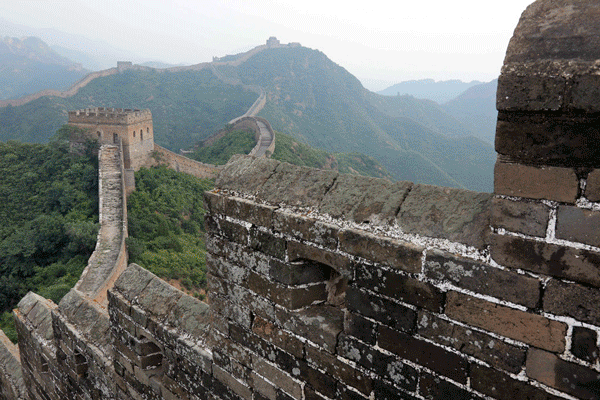
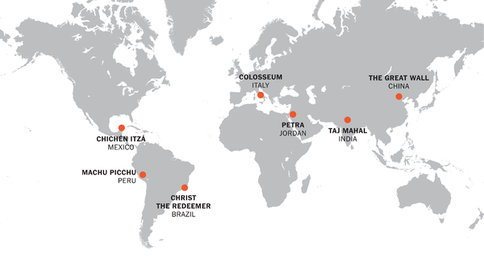
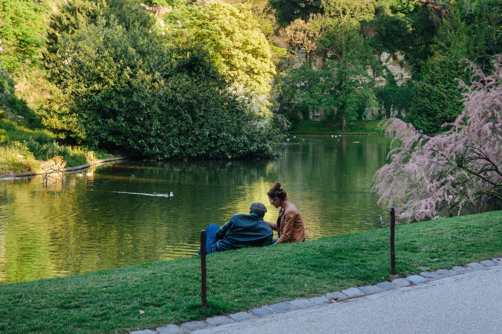
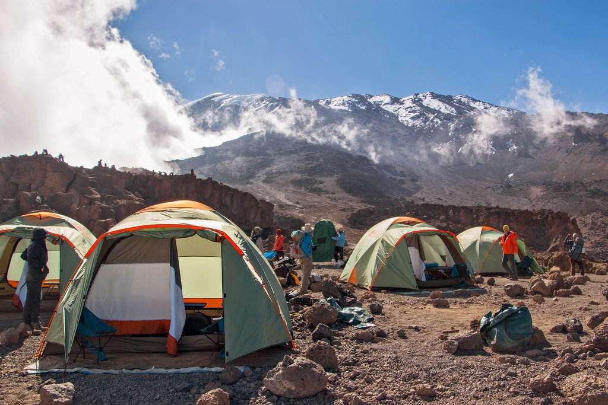
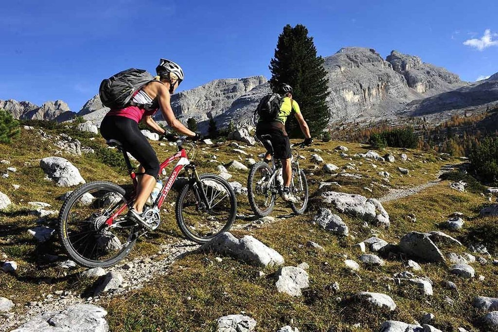

The ‘New Seven Wonders of the World’

[Skip to content](https://mobile.nytimes.com/2017/12/01/travel/the-new-seven-wonders-of-the-world.html?referer=https://mobile.nytimes.com/?referer=#site-content)[Skip to site index](https://mobile.nytimes.com/2017/12/01/travel/the-new-seven-wonders-of-the-world.html?referer=https://mobile.nytimes.com/?referer=#site-index)

[(L)](https://mobile.nytimes.com/)

[Travel](https://www.nytimes.com/section/travel)

- [**](https://www.facebook.com/dialog/feed?app_id=9869919170&link=https%3A%2F%2Fwww.nytimes.com%2F2017%2F12%2F01%2Ftravel%2Fthe-new-seven-wonders-of-the-world.html&smid=fb-share&name=The%20%E2%80%98New%20Seven%20Wonders%20of%20the%20World%E2%80%99&redirect_uri=https%3A%2F%2Fwww.facebook.com%2F)
- [**](https://twitter.com/intent/tweet?url=https%3A%2F%2Fwww.nytimes.com%2F2017%2F12%2F01%2Ftravel%2Fthe-new-seven-wonders-of-the-world.html&text=The%20%E2%80%98New%20Seven%20Wonders%20of%20the%20World%E2%80%99)
- [**](https://mobile.nytimes.com/2017/12/01/travel/the-new-seven-wonders-of-the-world.html?referer=https://mobile.nytimes.com/?referer=mailto:?subject=NYTimes.com%3A%20The%20%E2%80%98New%20Seven%20Wonders%20of%20the%20World%E2%80%99&body=From%20The%20New%20York%20Times%3A%0A%0AThe%20%E2%80%98New%20Seven%20Wonders%20of%20the%20World%E2%80%99%0A%0AExperience%20these%20majestic%20sites%20during%20moments%20of%20solitude%20in%20360%20video.%20%0A%0Ahttps%3A%2F%2Fwww.nytimes.com%2F2017%2F12%2F01%2Ftravel%2Fthe-new-seven-wonders-of-the-world.html)

-
-

# The ‘New Seven Wonders of the World’

Experience these majestic sites during moments of solitude in 360 video.

Image

By Veda Shastri, Guglielmo Mattioli and Kaitlyn Mullin
Dec. 1, 2017

The Great Wall of China. The Taj Mahal. Petra. The Colosseum. Christ the Redeemer. Chichén Itzá. Machu Picchu.

Image

These sites and monuments are popularly known as the “new Seven Wonders of the World,” modern additions to the ancient Seven Wonders laid out by Philo of Byzantium in 250 B.C., which included the hanging gardens of Babylon and the pyramids of Giza. (Of those ancient seven, only the pyramids remain.)

The new wonders were chosen in 2007 through an online contest put on by a Swiss company, the New 7 Wonders Foundation, in which more than tens of millions of people voted. All are Unesco World Heritage sites.

Built on four continents, most by ancient and medieval empires, the sites selected in 2007 are all architectural marvels of enormous scale — and are among the most visited tourist attractions in the world.

 [(L)](http://adclick.g.doubleclick.net/pcs/click?xai=AKAOjsv9lIoeJ8mW6rciAfpXTPJwWNk69A5b-Jw1f_GjSYotuOqFehselKJ4a6kw9WItx75EP92DsKL7jhvySA7CmqVkUu7qFNdwHP0vhP-w1XY6DM_-BRylY8WA4UTKsABqDM4cT1Pxrl67vXaH84oHNu2fcdjf5NBC5vfxx59FBa5LkQOCVHrm-s6VD6TjHx54VfiFEvvW-KQYp1Y4Q7vKBBRQWFnAnWcp6lxRA0xGpvGsaM2fPBF9jLCH8lz9&sig=Cg0ArKJSzH0SstBKuKqIEAE&urlfix=1&adurl=http://turismomadrid.es/en/)

ADVERTISEMENT: Madrid Region

 
Madrid is much more than Madrid... Discover its region!

 [Let's go! Madrid](http://adclick.g.doubleclick.net/pcs/click?xai=AKAOjsv9lIoeJ8mW6rciAfpXTPJwWNk69A5b-Jw1f_GjSYotuOqFehselKJ4a6kw9WItx75EP92DsKL7jhvySA7CmqVkUu7qFNdwHP0vhP-w1XY6DM_-BRylY8WA4UTKsABqDM4cT1Pxrl67vXaH84oHNu2fcdjf5NBC5vfxx59FBa5LkQOCVHrm-s6VD6TjHx54VfiFEvvW-KQYp1Y4Q7vKBBRQWFnAnWcp6lxRA0xGpvGsaM2fPBF9jLCH8lz9&sig=Cg0ArKJSzH0SstBKuKqIEAE&urlfix=1&adurl=http://turismomadrid.es/en/)

 1 of 4

 [(L)](http://adclick.g.doubleclick.net/pcs/click?xai=AKAOjsv9lIoeJ8mW6rciAfpXTPJwWNk69A5b-Jw1f_GjSYotuOqFehselKJ4a6kw9WItx75EP92DsKL7jhvySA7CmqVkUu7qFNdwHP0vhP-w1XY6DM_-BRylY8WA4UTKsABqDM4cT1Pxrl67vXaH84oHNu2fcdjf5NBC5vfxx59FBa5LkQOCVHrm-s6VD6TjHx54VfiFEvvW-KQYp1Y4Q7vKBBRQWFnAnWcp6lxRA0xGpvGsaM2fPBF9jLCH8lz9&sig=Cg0ArKJSzH0SstBKuKqIEAE&urlfix=1&adurl=http://turismomadrid.es/en/)

 [(L)](http://adclick.g.doubleclick.net/pcs/click?xai=AKAOjsv9lIoeJ8mW6rciAfpXTPJwWNk69A5b-Jw1f_GjSYotuOqFehselKJ4a6kw9WItx75EP92DsKL7jhvySA7CmqVkUu7qFNdwHP0vhP-w1XY6DM_-BRylY8WA4UTKsABqDM4cT1Pxrl67vXaH84oHNu2fcdjf5NBC5vfxx59FBa5LkQOCVHrm-s6VD6TjHx54VfiFEvvW-KQYp1Y4Q7vKBBRQWFnAnWcp6lxRA0xGpvGsaM2fPBF9jLCH8lz9&sig=Cg0ArKJSzH0SstBKuKqIEAE&urlfix=1&adurl=http://turismomadrid.es/en/)

 [(L)](http://adclick.g.doubleclick.net/pcs/click?xai=AKAOjsv9lIoeJ8mW6rciAfpXTPJwWNk69A5b-Jw1f_GjSYotuOqFehselKJ4a6kw9WItx75EP92DsKL7jhvySA7CmqVkUu7qFNdwHP0vhP-w1XY6DM_-BRylY8WA4UTKsABqDM4cT1Pxrl67vXaH84oHNu2fcdjf5NBC5vfxx59FBa5LkQOCVHrm-s6VD6TjHx54VfiFEvvW-KQYp1Y4Q7vKBBRQWFnAnWcp6lxRA0xGpvGsaM2fPBF9jLCH8lz9&sig=Cg0ArKJSzH0SstBKuKqIEAE&urlfix=1&adurl=http://turismomadrid.es/en/)

 [(L)](http://adclick.g.doubleclick.net/pcs/click?xai=AKAOjsv9lIoeJ8mW6rciAfpXTPJwWNk69A5b-Jw1f_GjSYotuOqFehselKJ4a6kw9WItx75EP92DsKL7jhvySA7CmqVkUu7qFNdwHP0vhP-w1XY6DM_-BRylY8WA4UTKsABqDM4cT1Pxrl67vXaH84oHNu2fcdjf5NBC5vfxx59FBa5LkQOCVHrm-s6VD6TjHx54VfiFEvvW-KQYp1Y4Q7vKBBRQWFnAnWcp6lxRA0xGpvGsaM2fPBF9jLCH8lz9&sig=Cg0ArKJSzH0SstBKuKqIEAE&urlfix=1&adurl=http://turismomadrid.es/en/)

What makes a site a wonder? What would you put on this list? We want to hear from you. At the bottom of this page is a form in which you can submit your thoughts.

* * *

## The Great Wall, China

### Built from 220 B.C. to A.D. 1644 by several emperors and dynasties.

Video

 Click and drag your mouse to explore.

 **

 Video by Sarah Li  1:16

 New Seven Wonders in 360: The Great Wall

The Great Wall of China was built over a period of 1800 years to protect against invaders.Published OnDec. 1, 2017CreditImage by Robb Kendrick for The New York Times. Technology by Samsung.

tens of millions visit each year

Now a Chinese national symbol, the vast Great Wall was built over nearly 1800 years. The Great Wall is actually many walls that overlap; the combined length of those layers is estimated to be 10,000 to 20,000 kilometers. The design of the wall, which is constructed across mountain passes and ridges, makes strategic use of the natural terrain. The best preserved portion of the wall runs east to west from southeastern Liaoning Province to northwestern Gansu Province. The Ming dynasty strengthened and maintained these sections from 1368 to 1644.

* * *

## The Taj Mahal, India

### Built 1632-48. Commissioned by the Mughal emperor Shah Jahan.

Video

 Click and drag your mouse to explore.

 **

 Video by Poras Chaudhary  1:07

 New Seven Wonders in 360: Taj Mahal

Mughal emperor Shah Jahan built a mausoleum in memory of his wife, Mumtaz, in Agra, India.Published OnDec. 1, 2017CreditImage by Jeremy Woodhouse/Getty Images. Technology by Samsung.

over Six million visitors in 2016

The Taj Mahal is one of the crowning architectural achievements of the Mughal empire, which ruled most of the Indian subcontinent from 1526 to 1761. It took around 20,000 workers and 16 years to build. The building reflects the Mughal architectural style, stressing symmetry and balance. In recent years, restoration efforts have been focused on protecting the ivory marble facades from pollution.

* * *

## Petra, Jordan

### Built 4th century B.C. to 2nd century A.D. by the Nabatean kingdom.

Video

 Click and drag your mouse to explore.

 **

 Video by Tamir Kalifa  1:09

 New Seven Wonders in 360: Petra

The Nabateans built the city, now in modern-day Jordan, in a strategic spot located along early silk and spice trade routes.Published OnDec. 1, 2017CreditImage by Tamir Kalifa for The New York Times. Technology by Samsung.

over 450,000 visitors in 2016

The city of Petra was built by the Nabateans, who lived in the Wadi Musa valley for more than 400 years, in a spot strategically located along early silk and spice trade routes. The city fell to the Roman Empire in A.D. 106.

The Hellenistic facades are carved directly into the canyons and use the natural terrain as guides. Today, the monuments are vulnerable to flash flooding in the Wadi Musa and continuing erosion from wind and rain.

The number of visitors to Petra has decreased in recent years, in part because of instability and violence in the Middle East.

* * *

## The Colosseum, Italy

### Built A.D. 72-82. Commissioned by Flavian emperors during the first century of the Roman Empire.

Video

 Click and drag your mouse to explore.

 **

 Video by Guglielmo Mattioli  1:19

 New Seven Wonders in 360: The Colosseum

The largest amphitheater of the Roman Empire could hold up to 70,000 people.Published OnDec. 1, 2017CreditImage by Guglielmo Mattioli/The New York Times. Technology by Samsung.

over Six million visitors in 2016

The Colosseum — an amphitheater with arcades and half columns — is an example of the Roman Empire’s architectural innovation. It was used for gladiator and hunting shows, as well as public executions, for four centuries. After the fall of the Roman Empire, it was used temporarily as a housing complex.

Earthquake damage and the mining of the Colosseum’s materials have left just one-third of the original structure in place.

 [(L)](http://adclick.g.doubleclick.net/pcs/click?xai=AKAOjsvFdiJwrV1MwmMNyd8kMAo4x1zzrXL7TPi6ZQAo9qL6QZSuFPSZdUCawcwwR003cJNFOCizuY1QR684FlUymFbaG7_T7VdD1l3ImZiGje3NOCky3ZNzTWUjUtjlCgJg10Kpw_X8wthGnjZvVU_KzzhYUJTVkQ7maIzucjtmZaFsHvKMUKO5R8N2H-VYGSvhO9y1PvlUC3dZOwmbG4ZnVfYTMS-WUGEqMa-ifh5ekaCE_B9dqv_QDwKIlkZL&sig=Cg0ArKJSzF2lvIbZWooJEAE&urlfix=1&adurl=http://turismomadrid.es/en/)

ADVERTISEMENT: Madrid Region

 
Madrid is much more than Madrid... Discover its region!

 [Let's go! Madrid](http://adclick.g.doubleclick.net/pcs/click?xai=AKAOjsvFdiJwrV1MwmMNyd8kMAo4x1zzrXL7TPi6ZQAo9qL6QZSuFPSZdUCawcwwR003cJNFOCizuY1QR684FlUymFbaG7_T7VdD1l3ImZiGje3NOCky3ZNzTWUjUtjlCgJg10Kpw_X8wthGnjZvVU_KzzhYUJTVkQ7maIzucjtmZaFsHvKMUKO5R8N2H-VYGSvhO9y1PvlUC3dZOwmbG4ZnVfYTMS-WUGEqMa-ifh5ekaCE_B9dqv_QDwKIlkZL&sig=Cg0ArKJSzF2lvIbZWooJEAE&urlfix=1&adurl=http://turismomadrid.es/en/)

 1 of 4

 [(L)](http://adclick.g.doubleclick.net/pcs/click?xai=AKAOjsvFdiJwrV1MwmMNyd8kMAo4x1zzrXL7TPi6ZQAo9qL6QZSuFPSZdUCawcwwR003cJNFOCizuY1QR684FlUymFbaG7_T7VdD1l3ImZiGje3NOCky3ZNzTWUjUtjlCgJg10Kpw_X8wthGnjZvVU_KzzhYUJTVkQ7maIzucjtmZaFsHvKMUKO5R8N2H-VYGSvhO9y1PvlUC3dZOwmbG4ZnVfYTMS-WUGEqMa-ifh5ekaCE_B9dqv_QDwKIlkZL&sig=Cg0ArKJSzF2lvIbZWooJEAE&urlfix=1&adurl=http://turismomadrid.es/en/)

 [(L)](http://adclick.g.doubleclick.net/pcs/click?xai=AKAOjsvFdiJwrV1MwmMNyd8kMAo4x1zzrXL7TPi6ZQAo9qL6QZSuFPSZdUCawcwwR003cJNFOCizuY1QR684FlUymFbaG7_T7VdD1l3ImZiGje3NOCky3ZNzTWUjUtjlCgJg10Kpw_X8wthGnjZvVU_KzzhYUJTVkQ7maIzucjtmZaFsHvKMUKO5R8N2H-VYGSvhO9y1PvlUC3dZOwmbG4ZnVfYTMS-WUGEqMa-ifh5ekaCE_B9dqv_QDwKIlkZL&sig=Cg0ArKJSzF2lvIbZWooJEAE&urlfix=1&adurl=http://turismomadrid.es/en/)

 [(L)](http://adclick.g.doubleclick.net/pcs/click?xai=AKAOjsvFdiJwrV1MwmMNyd8kMAo4x1zzrXL7TPi6ZQAo9qL6QZSuFPSZdUCawcwwR003cJNFOCizuY1QR684FlUymFbaG7_T7VdD1l3ImZiGje3NOCky3ZNzTWUjUtjlCgJg10Kpw_X8wthGnjZvVU_KzzhYUJTVkQ7maIzucjtmZaFsHvKMUKO5R8N2H-VYGSvhO9y1PvlUC3dZOwmbG4ZnVfYTMS-WUGEqMa-ifh5ekaCE_B9dqv_QDwKIlkZL&sig=Cg0ArKJSzF2lvIbZWooJEAE&urlfix=1&adurl=http://turismomadrid.es/en/)

 [(L)](http://adclick.g.doubleclick.net/pcs/click?xai=AKAOjsvFdiJwrV1MwmMNyd8kMAo4x1zzrXL7TPi6ZQAo9qL6QZSuFPSZdUCawcwwR003cJNFOCizuY1QR684FlUymFbaG7_T7VdD1l3ImZiGje3NOCky3ZNzTWUjUtjlCgJg10Kpw_X8wthGnjZvVU_KzzhYUJTVkQ7maIzucjtmZaFsHvKMUKO5R8N2H-VYGSvhO9y1PvlUC3dZOwmbG4ZnVfYTMS-WUGEqMa-ifh5ekaCE_B9dqv_QDwKIlkZL&sig=Cg0ArKJSzF2lvIbZWooJEAE&urlfix=1&adurl=http://turismomadrid.es/en/)

Restoration efforts have been stepped up since the early 19th century. In 2016, a three-year restoration of the building’s facade was completed.

* * *

## Christ the Redeemer, Brazil

### Built 1926-31. Commissioned by the Roman Catholic archdiocese of Rio de Janeiro.

Video

 Click and drag your mouse to explore.

 **

 Video by Dado Galdieri  1:05

 New Seven Wonders in 360: Christ the Redeemer

A colossal statue of Jesus Christ on top of Mount Corcovado in Rio de Janeiro.Published OnNov. 30, 2017CreditImage by Andy Caulfield/Getty Images. Technology by Samsung.

over Two million visit each year

The Christ the Redeemer statue in Brazil, the most recently constructed of the new Seven Wonders, stands 125 feet tall. At the time the statue was commissioned by the Catholic Church in the early 20th century, over 90 percent of Brazilians were Catholic. Images of the Christ statue are reproduced throughout Brazil.

In order for the statue, which weighs 1,145 tons, to support its massive arm span, it was made with reinforced concrete. It is considered the largest Art Deco sculpture in the world.

Its location, atop a 710-meter-tall mountain, has left it vulnerable to weather and damage from lightning. One of the greatest restoration challenges presented by the statue is matching the color of its six million stone tiles.

* * *

## Chichén Itzá, Mexico

### Built 5th-13th century by the Maya-Toltec civilization.

Video

 Click and drag your mouse to explore.

 **

 Video by Adriana Zehbrauskas  00:57

 New Seven Wonders in 360: Chichén Itzá

An ancient Maya city that eventually became part of the Maya-Toltec civilization.Published OnDec. 1, 2017CreditImage by Nicholas Sumner/Getty Images. Technology by Samsung.

over Two million visitors in 2016

Chichén Itzá was an ancient Maya city that eventually became part of the Maya-Toltec civilization. It flourished until around A.D. 1200, and later joined a political alliance with the cities of Mayapán and Uxmal. It had already been abandoned by the time the Spanish arrived in the 16th century. Archaeological excavations began in the early 19th century.

The ruins feature religious temples that epitomize Maya innovation in astronomy and science. The Temple of Kukulkán has 365 steps, one for each day in the Haab solar calendar. The temple is crowned by a carving of Kukulkán, also known as Quetzalcoatl, the feathered serpent deity.

* * *

## Machu Picchu, Peru

### Built in the mid-15th century by the Incas.

Video

 Click and drag your mouse to explore.

 **

 Video by Deborah Acosta  00:57

 New Seven Wonders in 360: Machu Picchu

The Incan settlement nestled 2,430 meters above sea level in the eastern Andes mountains.Published OnDec. 1, 2017CreditImage by Justin Setterfield/Getty Images. Technology by Samsung.

Over one million visitors in 2016

Machu Picchu is a pre-Columbian Incan settlement, one of the few that remain intact. Situated on the eastern slope of the Andes Mountains, it was probably built as a royal retreat for the Incan emperor Pachacuti Inca Yupanqui, not intended to be visited by the masses. In use from the mid-15th century to the mid-16th century, it was eventually abandoned, although the reason is not clear.

Though the Incan empire was conquered by the Spanish in 1532, the conquistadors did not find the site; it was eventually “discovered” in 1911. The architecture was integrated into the natural terrain, its walls and terraces cut into the rock. Today, it is reached either by hiking up the Incan trail through the Andes or by train.

 [    ADVERTISEMENT:Fairmont](https://adclick.g.doubleclick.net/pcs/click?xai=AKAOjssgZ79CCmf_eJRhwUqf-dZsyc7j1rLSZASEmMlS0gyzsPiG1oVlPaNFyh6VwCcx119WbnGXHx5tMklj_fpgmm-SuBydhGczpBaTzX9SVy-HcVqAw8pmIAAETftXv4gwy-gXMlG9wgOfK6trTiddC1pIhNQMlY6g0h04Hgoh72KxsNIBEHMqqMf0XX2s9s-fZSDYTyI8cnW2FmABnr1y-HJwWbN8vjzOOzur8PD3EIeOM7ZFtquUUsTDP1US&sig=Cg0ArKJSzI3XKIc2yfGgEAE&urlfix=1&adurl=https://paidpost.nytimes.com/fairmont/the-spirit-of-the-city.html)

In order to better preserve the structures, the Peruvian government has started to limit the amount of time tourists may spend at the site.

* * *

## We want to hear from you.

These 360 videos explore seven places that are often called the new wonders of the world. The Times wants to know what you consider a wonder of the world. Would you pick another site? Tell us about it. Your name and comments may be published.

Required fields are marked with an asterisk.

 Where have you traveled that you'd consider a wonder of the world? Tell us why you chose it, and describe your experience there. *

 What is your name? *
First and last preferred, please.

 What is your email? *

By submitting to us, you are promising that the content is original, does not plagiarize from anyone or infringe a copyright or trademark, does not violate anyone’s rights and is not libelous or otherwise unlawful or misleading. You are agreeing that we can use your submission in all manner and media of The New York Times and that we shall have the right to authorize third parties to do so. And you agree to our [Terms of Service.](http://www.nytimes.com/content/help/rights/terms/terms-of-service.html)

- [**](https://www.facebook.com/dialog/feed?app_id=9869919170&link=https%3A%2F%2Fwww.nytimes.com%2F2017%2F12%2F01%2Ftravel%2Fthe-new-seven-wonders-of-the-world.html&smid=fb-share&name=The%20%E2%80%98New%20Seven%20Wonders%20of%20the%20World%E2%80%99&redirect_uri=https%3A%2F%2Fwww.facebook.com%2F)
- [**](https://twitter.com/intent/tweet?url=https%3A%2F%2Fwww.nytimes.com%2F2017%2F12%2F01%2Ftravel%2Fthe-new-seven-wonders-of-the-world.html&text=The%20%E2%80%98New%20Seven%20Wonders%20of%20the%20World%E2%80%99)
- [**](https://mobile.nytimes.com/2017/12/01/travel/the-new-seven-wonders-of-the-world.html?referer=https://mobile.nytimes.com/?referer=mailto:?subject=NYTimes.com%3A%20The%20%E2%80%98New%20Seven%20Wonders%20of%20the%20World%E2%80%99&body=From%20The%20New%20York%20Times%3A%0A%0AThe%20%E2%80%98New%20Seven%20Wonders%20of%20the%20World%E2%80%99%0A%0AExperience%20these%20majestic%20sites%20during%20moments%20of%20solitude%20in%20360%20video.%20%0A%0Ahttps%3A%2F%2Fwww.nytimes.com%2F2017%2F12%2F01%2Ftravel%2Fthe-new-seven-wonders-of-the-world.html)

-

## Get the Travel Dispatch Newsletter

Every Saturday, get travel tips, destination coverage, photos from all over the world and more.

[SEE SAMPLE](https://www.nytimes.com/newsletters/sample/travel-dispatch)

You agree to receive occasional updates and special offers for The New York Times products and services.

I'm not a robot

reCAPTCHA

[Privacy](https://www.google.com/intl/en/policies/privacy/) - [Terms](https://www.google.com/intl/en/policies/terms/)

- [Manage Email Preferences](https://www.nytimes.com/mem/email.html)
- [Opt out or contact us anytime](https://www.nytimes.com/help/index.html)
- [Privacy Policy](https://www.nytimes.com/privacy)

## [More in Travel](https://www.nytimes.com/section/travel?action=click&module=MoreInSection&pgtype=Article&region=Footer&contentCollection=Travel)

[   Andy Haslam for The New York Times](https://mobile.nytimes.com/2017/12/05/travel/eataly-world-fico-bologna-italy.html?action=click&module=MoreInSection&pgtype=Article&region=Footer&contentCollection=Travel)

[ ## An Amusement Park for Foodies   The new FICO Eataly World in Bologna is a million square feet of food: pasta, porchetta, gelato and more. And then there’s the volleyball court.](https://mobile.nytimes.com/2017/12/05/travel/eataly-world-fico-bologna-italy.html?action=click&module=MoreInSection&pgtype=Article&region=Footer&contentCollection=Travel)

10h ago

[   Alex Cretey-Systermans for The New York Times](https://mobile.nytimes.com/2017/12/05/travel/five-travel-stories-from-2017-to-help-you-escape-into-the-world.html?action=click&module=MoreInSection&pgtype=Article&region=Footer&contentCollection=Travel)

[ ## Five Travel Stories From 2017 to Help You Escape Into the World   From the coastlines of Europe to remote Kodiak Island, Alaska, here are five of our favorite stories to help you explore the world from your comfort of your screen.](https://mobile.nytimes.com/2017/12/05/travel/five-travel-stories-from-2017-to-help-you-escape-into-the-world.html?action=click&module=MoreInSection&pgtype=Article&region=Footer&contentCollection=Travel)

10h ago

[   REI Adventures](https://mobile.nytimes.com/2017/12/05/travel/mobile-camping-tours.html?action=click&module=MoreInSection&pgtype=Article&region=Footer&contentCollection=Travel)

[ ## With Mobile Camping, Remote Destinations and Light Footprints   In Tanzania, Bolivia, India and Thailand, visitors can experience places that are breathtaking but hard to get to.](https://mobile.nytimes.com/2017/12/05/travel/mobile-camping-tours.html?action=click&module=MoreInSection&pgtype=Article&region=Footer&contentCollection=Travel)

10h ago

[   Finca Cortesin](https://mobile.nytimes.com/2017/11/29/travel/fitness-exercise-hotels-resorts.html?action=click&module=MoreInSection&pgtype=Article&region=Footer&contentCollection=Travel)

[ ## A New Kind of Fitness Retreat for New Year’s Fitness Goals    These new fitness retreats exchange pain and suffering for patience and pleasure to help you achieve your New Year’s fitness goals.](https://mobile.nytimes.com/2017/11/29/travel/fitness-exercise-hotels-resorts.html?action=click&module=MoreInSection&pgtype=Article&region=Footer&contentCollection=Travel)

Dec. 4

[   Wesley Bedrosian](https://mobile.nytimes.com/2017/12/01/travel/travel-security-apps.html?action=click&module=MoreInSection&pgtype=Article&region=Footer&contentCollection=Travel)

[ ## Sending Out an SOS: The Rise of Travel Security Apps    Safety apps aim to offer assurance on the road.](https://mobile.nytimes.com/2017/12/01/travel/travel-security-apps.html?action=click&module=MoreInSection&pgtype=Article&region=Footer&contentCollection=Travel)

Dec. 1

Advertisement

## Site Index

[(L)](https://mobile.nytimes.com/)
[Go to Home Page »](https://mobile.nytimes.com/)
news
opinion
arts
living
listings & more

## Site Information Navigation

- [© 2017 The New York Times Company](https://www.nytimes.com/content/help/rights/copyright/copyright-notice.html)
- [Contact Us](https://myaccount.nytimes.com/membercenter/feedback.html)
- [Work with us](http://www.nytco.com/careers)
- [Advertise](http://nytmediakit.com/)
- [Your Ad Choices](https://www.nytimes.com/content/help/rights/privacy/policy/privacy-policy.html#pp)
- [Privacy](https://www.nytimes.com/privacy)
- [Terms of Service](https://www.nytimes.com/ref/membercenter/help/agree.html)
- [Terms of Sale](https://www.nytimes.com/content/help/rights/sale/terms-of-sale.html)
- [Site Map](http://spiderbites.nytimes.com/)
- [Help](https://mobile.nytimes.com/help)
- [Subscriptions](https://www.nytimes.com/subscriptions/Multiproduct/lp5558.html?campaignId=37WXW)

 