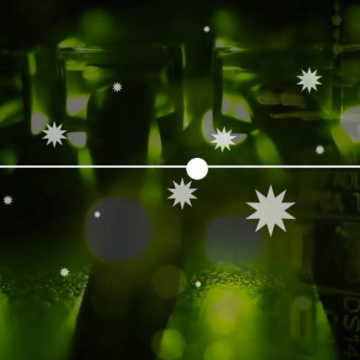

The ‘father of information theory’, Claude Shannon brought us our digital world | Aeon Videos

The ‘father of information theory’, Claude Shannon brought us our digital world | Aeon Videos

https://aeon.co/videos/the-father-of-information-theory-claude-shannon-brought-us-our-digital-world

If 100 years ago futurists were imagining things that were not so different from Skype-like global communications technologies and wonders such as a device that could encompass all the instruments of an orchestra, they did so on distinctly analogue lines. What no one foresaw, however, was that a single system would underpin nearly every innovation of the coming information revolution. Enter Claude Shannon, the Massachusetts Institute of Technology-educated mathematician who solved the communication proble