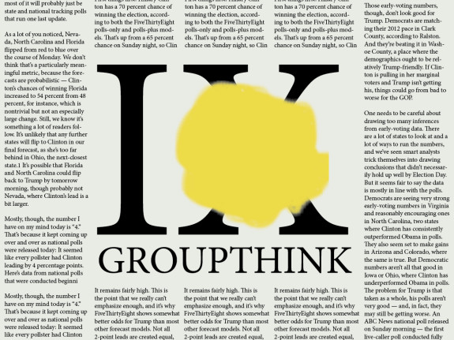
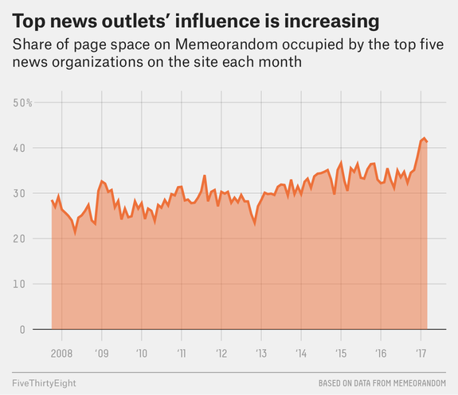

There Really Was A Liberal Media Bubble

# There Really Was A Liberal Media Bubble

## Groupthink produced a failure of the “wisdom of crowds” and an underestimate of Trump’s chances.

By [Nate Silver](https://fivethirtyeight.com/contributors/nate-silver/)

Filed under [The Real Story Of 2016](https://fivethirtyeight.com/tag/the-real-story-of-2016/)

Published Mar. 10, 2017

- [](https://fivethirtyeight.com/features/there-really-was-a-liberal-media-bubble/?share=facebook&nb=1)
- [](https://fivethirtyeight.com/features/there-really-was-a-liberal-media-bubble/?share=twitter&nb=1)
- [](https://fivethirtyeight.com/features/there-really-was-a-liberal-media-bubble/?utm_source=pocket&utm_medium=email&utm_campaign=pockethitsmailto:?subject=I%20thought%20you%E2%80%99d%20like%20this%20article%20from%20FiveThirtyEight&body=https%3A%2F%2Ffivethirtyeight.com%2Ffeatures%2Fthere-really-was-a-liberal-media-bubble%2F?ex_cid=538email)

*This is the ninth article in a *[*series*](https://fivethirtyeight.com/tag/the-real-story-of-2016/)* that reviews news coverage of the 2016 general election, explores how Donald Trump won and why his chances were underrated by most of the American media.*

Last summer, the United Kingdom voted to leave the European Union in what bettors, financial markets and the London-based media [regarded as a colossal upset](https://www.theguardian.com/business/2016/jun/24/bookies-got-eu-vote-wrong-ladbrokes-says). Reporters and pundits were [quick to blame](https://www.theguardian.com/politics/2016/jun/24/how-eu-referendum-pollsters-wrong-opinion-predict-close) the polls for the unexpected result. But the polls had been fine, more or less: In the closing days of the Brexit campaign, [they’d shown an almost-even race](https://elections.huffingtonpost.com/pollster/uk-european-union-referendum), and Leave’s narrow victory (by a margin just under 4 percentage points) was about as consistent with them as it was with anything else. The failure was [not so much with the polls](http://www.realclearpolitics.com/articles/2016/11/12/it_wasnt_the_polls_that_missed_it_was_the_pundits_132333.html) but with the people who were analyzing them.

The U.S. presidential election, as I’ve argued, was [something of a similar case](https://fivethirtyeight.com/features/the-real-story-of-2016/). No, the polls didn’t show a toss-up, as they had in Brexit. But the [reporting was much more certain of Clinton’s chances](https://fivethirtyeight.com/features/election-update-yes-donald-trump-has-a-path-to-victory/) than it should have been based on the polls. Much of The New York Times’s coverage, for instance, implied that Clinton’s odds were close to 100 percent. In an article on [Oct. 17](http://www.nytimes.com/2016/10/18/us/politics/hillary-clinton-campaign.html) — more than three weeks before Election Day — they portrayed the race as being effectively over, the only question being whether Clinton should seek a landslide or instead assist down-ballot Democrats:

> Hillary Clinton’s campaign is planning its most ambitious push yet into traditionally right-leaning states, a new offensive aimed at extending her growing advantage over Donald J. Trump while bolstering down-ballot candidates in what party leaders increasingly suggest could be a sweeping victory for Democrats at every level. […]

> The maneuvering speaks to the unexpected tension facing Mrs. Clinton as she hurtles toward what aides increasingly believe will be a decisive victory — a pleasant problem, for certain, but one that has nonetheless scrambled the campaign’s strategy weeks before Election Day: Should Mrs. Clinton maximize her own margin, aiming to flip as many red states as possible to run up an electoral landslide, or prioritize the party’s congressional fortunes, redirecting funds and energy down the ballot?

This is not to say the election was a toss-up in mid-October, which was one of the [high-water marks of the campaign for Clinton](https://projects.fivethirtyeight.com/2016-election-forecast/national-polls/). But while a Trump win was unlikely, it should hardly have been *unthinkable*.[1](https://fivethirtyeight.com/features/there-really-was-a-liberal-media-bubble/?utm_source=pocket&utm_medium=email&utm_campaign=pockethits#fn-1) And yet the Times, famous for its “to be sure” equivocations,[2](https://fivethirtyeight.com/features/there-really-was-a-liberal-media-bubble/?utm_source=pocket&utm_medium=email&utm_campaign=pockethits#fn-2) wasn’t even contemplating the possibility of a Trump victory.[3](https://fivethirtyeight.com/features/there-really-was-a-liberal-media-bubble/?utm_source=pocket&utm_medium=email&utm_campaign=pockethits#fn-3)

It’s hard to reread this coverage without recalling Sean Trende’s [essay](http://www.realclearpolitics.com/articles/2016/06/28/trump_brexit_and_the_state_of_the_race_131036.html) on “unthinkability bias,” which he wrote in the wake of the Brexit vote. Just as [was the case in the U.S. presidential election](https://fivethirtyeight.com/features/education-not-income-predicted-who-would-vote-for-trump/), voting on the referendum had split strongly along [class, education and regional lines](http://www.newstatesman.com/politics/staggers/2016/06/how-did-different-demographic-groups-vote-eu-referendum), with voters outside of London and without advanced degrees being much more likely to vote to leave the EU. The reporters covering the Brexit campaign, on the other hand, were disproportionately well-educated and principally based in London. They tended to read ambiguous signs — anything from polls to the [musings of taxi drivers](http://www.economist.com/blogs/bagehot/2016/06/brexit-polling) — as portending a Remain win, and many of them never really processed the idea that Britain could vote to leave the EU until it actually happened.

So did journalists in Washington and London make the [apocryphal Pauline Kael mistake](http://www.vanityfair.com/culture/2012/10/The-Fraudulent-Factoid-That-Refuses-to-Die), refusing to believe that Trump or Brexit could win because nobody *they* knew was voting for them? That’s not *quite* what Trende was arguing. Instead, it’s that political experts[4](https://fivethirtyeight.com/features/there-really-was-a-liberal-media-bubble/?utm_source=pocket&utm_medium=email&utm_campaign=pockethits#fn-4) aren’t a very diverse group and tend to place a lot of faith in the opinions of other experts and other members of the political establishment. Once a consensus view is established, it [tends to reinforce itself](http://www.realclearpolitics.com/articles/2016/06/09/trump_and_the_punditrys_scary_groupthink.html) until and unless there’s very compelling evidence for the contrary position. Social media, especially Twitter, can amplify the groupthink further. It can be an echo chamber.

I recently reread James Surowiecki’s book “[The Wisdom of Crowds](https://www.amazon.com/dp/B000FCKC3I/ref=dp-kindle-redirect?_encoding=UTF8&btkr=1)” which, despite its name, spends as much time contemplating the shortcomings of such wisdom as it does celebrating its successes. Surowiecki argues[5](https://fivethirtyeight.com/features/there-really-was-a-liberal-media-bubble/?utm_source=pocket&utm_medium=email&utm_campaign=pockethits#fn-5) that crowds usually make good predictions when they satisfy these four conditions:

1. **Diversity of opinion**. “Each person should have private information, even if it’s just an eccentric interpretation of the known facts.”

2. **Independence**. “People’s opinions are not determined by the opinions of those around them.”

3. **Decentralization**. “People are able to specialize and draw on local knowledge.”

4. **Aggregation**. “Some mechanism exists for turning private judgments into a collective decision.”

Political journalism scores highly on the fourth condition, aggregation. While Surowiecki usually has something like a financial or betting market in mind when he refers to “aggregation,” the broader idea is that there’s some way for individuals to exchange their opinions instead of keeping them to themselves. And my gosh, do political journalists have a *lot *of ways to share their opinions with one another, whether through their columns, at major events such as the political conventions or, especially, through Twitter.

But those other three conditions? Political journalism fails miserably along those dimensions.

*Diversity of opinion?* For starters, American newsrooms are not very diverse along [racial](http://asne.org/content.asp?contentid=147) or [gender](http://asne.org/content.asp?contentid=144) lines, and it’s [not clear the situation is improving much](http://asne.org/content.asp?contentid=129).[6](https://fivethirtyeight.com/features/there-really-was-a-liberal-media-bubble/?utm_source=pocket&utm_medium=email&utm_campaign=pockethits#fn-6) And in a country where educational attainment is an [increasingly important predictor](https://fivethirtyeight.com/features/education-not-income-predicted-who-would-vote-for-trump/) of cultural and political behavior, some [92 percent of journalists](http://news.indiana.edu/releases/iu/2014/05/2013-american-journalist-key-findings.pdf) have college degrees. A degree didn’t used to be a *de facto* prerequisite[7](https://fivethirtyeight.com/features/there-really-was-a-liberal-media-bubble/?utm_source=pocket&utm_medium=email&utm_campaign=pockethits#fn-7) for a reporting job; just 70 percent of journalists had college degrees in 1982 and only 58 percent did in 1971.

The political diversity of journalists is not very strong, either. As of 2013, only [7 percent of them identified as Republicans](http://www.politico.com/blogs/media/2014/05/survey-7-percent-of-reporters-identify-as-republican-188053) (although only 28 percent called themselves Democrats with the majority saying they were independents). And although it’s not a perfect approximation — in most newsrooms, the people who issue endorsements are not the same as the ones who do reporting — there’s reason to think that the industry was particularly out of sync with Trump. Of the major newspapers that endorsed either Clinton or Trump, only [3 percent](http://www.presidency.ucsb.edu/data/2016_newspaper_endorsements.php) (2 of 59) endorsed Trump. By comparison, [46 percent](http://www.presidency.ucsb.edu/data/2012_newspaper_endorsements.php) of newspapers to endorse either Barack Obama or Mitt Romney endorsed Romney in 2012. Furthermore, as the media has become less representative of right-of-center views — and as conservatives have rebelled against the political establishment — there’s been an increasing and perhaps self-reinforcing cleavage between [conservative news and opinion outlets such as Breitbart](http://www.cjr.org/analysis/breitbart-media-trump-harvard-study.php) and the rest of the media.

Although it’s harder to measure, I’d also argue that there’s a lack of diversity when it comes to skill sets and methods of thinking in political journalism. Publications such as Buzzfeed or (the now defunct) Gawker.com [get a lot of shade](https://www.nytimes.com/2017/01/10/business/buzzfeed-donald-trump-russia.html?_r=0) from traditional journalists when they [do things that challenge conventional journalistic paradigms](https://fivethirtyeight.com/features/should-rumors-like-the-trump-dossier-be-news/). But a lot of traditional journalistic practices are done by rote or out of habit, such as routinely granting anonymity to staffers to discuss campaign strategy even when there [isn’t much journalistic merit in it](https://fivethirtyeight.com/features/why-you-shouldnt-always-trust-the-inside-scoop/). Meanwhile, speaking from personal experience, I’ve found the reception of “data journalists” by traditional journalists to be unfriendly, although there have been exceptions.

*Independence?* This is just as much of a problem. Crowds can be wise when people do a lot of thinking for themselves before coming together to exchange their views. But since at least the days of “[The Boys on the Bus](https://www.amazon.com/Boys-Bus-Timothy-Crouse/dp/0812968204),” political journalism has suffered from a pack mentality. Events such as conventions and debates literally gather thousands of journalists together in the same room; attend one of these events, and you can almost smell the conventional wisdom being manufactured in real time. (Consider how a [consensus formed](https://www.washingtonpost.com/blogs/erik-wemple/post/buzzfeed-declares-a-debate-winner-before-halftime/2012/10/04/d4878a82-0e3b-11e2-bd1a-b868e65d57eb_blog.html) that Romney won the first debate in 2012 when it had barely even started, for instance.) Social media — Twitter in particular — can [amplify these information cascades](https://www.fastcompany.com/1749756/infographic-day-cascade-new-york-timess-tool-tracking-how-news-spreads-video), with a single tweet receiving hundreds of thousands of impressions and [shaping the way entire issues are framed](https://shorensteincenter.org/d80-hamby/). As a result, it can be [largely arbitrary](https://fivethirtyeight.com/features/what-makes-a-trump-story-stick/) which storylines gain traction and which ones don’t. What seems like a multiplicity of perspectives might just be one or two, duplicated many times over.

*Decentralization?* Surowiecki writes about the benefit of local knowledge, but the political news industry has become increasingly consolidated in Washington and New York as local newspapers have [suffered from a decade-long contraction](https://www.washingtonpost.com/lifestyle/style/charting-the-years-long-decline-of-local-news-reporting/2014/03/26/977bf088-b457-11e3-b899-20667de76985_story.html). That doesn’t necessarily mean local reporters in Wisconsin or Michigan or Ohio should have picked up Trumpian vibrations on the ground in *contradiction* to the polls. But [as we’ve argued](https://fivethirtyeight.com/features/ohio-was-a-bellwether-after-all/), national reporters often flew into these states with pre-baked narratives — for instance, that they were “[decreasingly representative of contemporary America](http://www.nytimes.com/2016/09/30/us/politics/ohio-campaign-trump-clinton.html)” — and fit the facts to suit them, [neglecting their importance to the Electoral College](https://fivethirtyeight.com/features/the-electoral-college-blind-spot/). A more geographically decentralized reporting pool might have asked more questions about why Clinton wasn’t campaigning in Wisconsin, for instance, or why it wasn’t more of a problem for her that she was struggling in polls of traditional bellwethers such as [Ohio](https://projects.fivethirtyeight.com/2016-election-forecast/ohio/) and [Iowa](https://projects.fivethirtyeight.com/2016-election-forecast/iowa/). If local newspapers had been healthier economically, they might also have commissioned more high-quality state polls; the lack of good polling was a problem in Michigan and Wisconsin especially.

There was once a notion that whatever challenges the internet created for journalism’s business model, it might at least lead readers to a more geographically and philosophically diverse array of perspectives. But it’s not clear that’s happening, either. Instead, based on data from the news aggregation site [Memeorandum](http://www.memeorandum.com/), the top news sources (such as the Times, The Washington Post and Politico) have earned progressively more influence over the past decade:

The share of total exposure[8](https://fivethirtyeight.com/features/there-really-was-a-liberal-media-bubble/?utm_source=pocket&utm_medium=email&utm_campaign=pockethits#fn-8) for the top five news sources[9](https://fivethirtyeight.com/features/there-really-was-a-liberal-media-bubble/?utm_source=pocket&utm_medium=email&utm_campaign=pockethits#fn-9) climbed from roughly 25 percent a decade ago to around 35 percent last year, and has spiked to above 40 percent so far in 2017. While not a perfect measure[10](https://fivethirtyeight.com/features/there-really-was-a-liberal-media-bubble/?utm_source=pocket&utm_medium=email&utm_campaign=pockethits#fn-10), this is one sign the digital age hasn’t necessarily democratized the news media. Instead, the most notable difference in Memeorandum sources between [2007](http://www.memeorandum.com/071001/lb) and [2017](http://www.memeorandum.com/170301/lb) is the decline of independent blogs; many of the most popular ones from the late ’aughts either folded or (like FiveThirtyEight) were bought by larger news organizations. Thus, blogs and local newspapers — two of the better checks on Northeast Corridor conventional wisdom run amok — have both had less of a say in the conversation.

### Related: [Politics Podcast](https://fivethirtyeight.com/tag/politics-podcast/)

[(L)](https://fivethirtyeight.com/features/politics-podcast-the-anatomy-of-a-political-scandal/?ex_cid=podinline)

## [Politics Podcast: The Anatomy Of A Political Scandal](https://fivethirtyeight.com/features/politics-podcast-the-anatomy-of-a-political-scandal/?ex_cid=podinline)

All things considered, then, the conditions of political journalism are poor for crowd wisdom and ripe for groupthink. So … what to do about it, then?

Initiatives to increase decentralization would help, although they won’t necessarily be easy. Increased [subscription revenues](http://money.cnn.com/2017/02/02/media/new-york-times-subscribers-trump/) at newspapers such as The New York Times and The Washington Post is an encouraging sign for journalism, but a revival of local and regional newspapers — or a more sustainable business model for independent blogs — would do more to reduce groupthink in the industry.

Likewise, improving diversity is liable to be a challenge, especially because the sort of diversity that Surowiecki is concerned with will require making improvements on multiple fronts (demographic diversity, political diversity, diversity of skill sets). Still, the research Surowiecki cites is emphatic that there are diminishing returns to having too many of the same types of people in small groups or organizations. Teams that consist entirely of high-IQ people may underperform groups that contain a mix of high-IQ and medium-IQ participants, for example, because the high-IQ people are likely to have redundant strengths and similar blind spots.

That leaves independence. In some ways the best hope for a short-term fix might come from an attitudinal adjustment: Journalists should recalibrate themselves to be more skeptical of the consensus of their peers. That’s because a position that seems to have deep backing from the evidence may really just be a reflection from the echo chamber. You should be looking toward *how much* evidence there is for a particular position as opposed to *how many* people hold that position: Having 20 independent pieces of evidence that mostly point in the same direction might indeed reflect a powerful consensus, while having 20 like-minded people citing the *same* warmed-over evidence is much less powerful. Obviously this can be taken too far and in most fields, it’s foolish (and annoying) to constantly doubt the market or consensus view. But in a case like politics where the conventional wisdom can congeal so quickly — and yet has so often been wrong — a certain amount of contrarianism can go a long way.