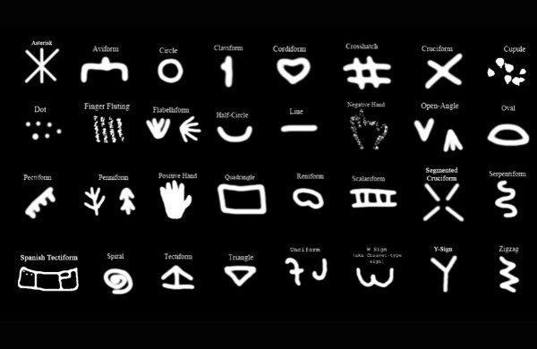

These 32 Symbols Are Found In Caves Across Europe, But What Do They Mean?

### Archaeologist Genevieve von Petzinger has made an incredible discovery.

There’s something about caves that draws you in; as soon as you cross their threshold, you enter a surreal and shadowy alternative world. Back when Europe was deep in the Ice Age something drew people in then too; and they left their marks all over the walls.

Archaeologist Genevieve von Petzinger has been studying these marks, which are not only among some of the world’s oldest art, but also some of the most famous. Who can say they have not been impressed by the paintings of Lascaux or Altamira? But, [says von Petzinger in a landmark TED talk](https://www.ted.com/talks/genevieve_von_petzinger_why_are_these_32_symbols_found_in_ancient_caves_all_over_europe/transcript?language=en), we’ve been so caught up by the beautiful, flowing artistry of these painted animals, that we’ve missed something even more remarkable.

### Don’t let the animals distract you…

Among the elaborate horses, bulls, bears and hunters, there are some other rather less captivating designs – small geometric motifs, etched onto the walls. Until now, they’ve not received much attention. But as it turns out, these humble designs conceal a much more intriguing mystery.

Von Petzinger and her photographer-husband visited 52 caves across Europe recording every instance of these symbols that they could see. They found new, undocumented examples at 75% of the caves they visited, and found the symbols far outnumbered the human and animal images. But the amazing thing was that however many caves they visited, [they found the same 32 shapes](https://www.ted.com/talks/genevieve_von_petzinger_why_are_these_32_symbols_found_in_ancient_caves_all_over_europe/transcript?language=en) being used again and again and again.

### Ice Age alphabet?

The fact that the same 32 symbols are repeated across sites that span 30,000 years and an entire content is nothing less than mindblowing. But what do they actually mean?

The oldest written texts appear well over 5,000 years ago, and these symbols appear some 25,000 years earlier than that, but they don’t quite seem to form a written language – there are neither enough characters to represent all their spoken words, nor do they repeat often enough to be some sort of alphabet.

Nevertheless, they clearly meant something to whoever created them and von Petzinger concludes that whatever that meaning was, these symbols changed the course of human communication; no longer confined to spoken words, or gestural movements, 25,000 years ago human communication finally became graphic too.

Share this article:
AddThis Sharing Buttons

[Share to Facebook]()207[Share to Twitter]()[Share to Google+]()[Share to LinkedIn]()3[Share to Email]()[Share to More]()43

#### Want to do some archaeology?

Crowdfund a dig and make a real discovery!

 [Pledge now](https://digventures.com/projects)

#### Maiya Pina-Dacier

Head of Community at DigVentures, Maiya digs with a trowel in one hand, and a Twitter feed in the other. She reports on all our discoveries live from the trenches, and keeps our Site Hut full of the latest archaeology news. Got a story? Just drop her a line...

[Full Author Profile +](https://digventures.com/author/maiya/)

### Comments (11)

1. 

###### Pamela V. Cullen

December 8, 2015[**Reply](https://digventures.com/2015/12/these-32-symbols-are-found-in-ice-age-caves-across-europe-but-what-do-they-mean/?replytocom=22478#respond).

Have they been compared to the signs used by other hunter-gatherers who left signs with meanings for the next groups to pass by?

.
2. 

###### Hannah

December 8, 2015[**Reply](https://digventures.com/2015/12/these-32-symbols-are-found-in-ice-age-caves-across-europe-but-what-do-they-mean/?replytocom=22483#respond).

I would like to whether this theory considers that the majority of these symbols are prevalent in entoptic imagery.

.

    - 

###### [Holly](http://hollystevenson.com/)

June 12, 2017[**Reply](https://digventures.com/2015/12/these-32-symbols-are-found-in-ice-age-caves-across-europe-but-what-do-they-mean/?replytocom=53066#respond).

Hi Hannah. I agree. I also wonder if there is a connection between these abstractions and what plato called “forms,” math, metaphors and all other abstractions that our brains do.

.
3. 

###### Alan B.

December 8, 2015[**Reply](https://digventures.com/2015/12/these-32-symbols-are-found-in-ice-age-caves-across-europe-but-what-do-they-mean/?replytocom=22487#respond).

Slightly fatuous remark, but love the idea of a Hash-Tag being used during ice-age.

#Chilly
Sorry.
.
4. 

###### [Stannous Flouride](http://stanflouride.com/)

December 9, 2015[**Reply](https://digventures.com/2015/12/these-32-symbols-are-found-in-ice-age-caves-across-europe-but-what-do-they-mean/?replytocom=22554#respond).

I still see that as the ‘pound’ or ‘number’ sign.
.

5. Pingback: [Same 32 Symbols Found In Ice Age Caves Across Europe | Stannous Flouride's Book of Truthiness](http://stanflouride.com/2015/12/09/same-32-symbols-found-in-ice-age-caves-across-europe/)

6. 

###### Karsten

December 10, 2015[**Reply](https://digventures.com/2015/12/these-32-symbols-are-found-in-ice-age-caves-across-europe-but-what-do-they-mean/?replytocom=22605#respond).

They found the signs all over the world…

http://stanflouride.com/2015/12/09/same-32-symbols-found-in-ice-age-caves-across-europe/

.
7. 

###### kakhaber

May 31, 2016[**Reply](https://digventures.com/2015/12/these-32-symbols-are-found-in-ice-age-caves-across-europe-but-what-do-they-mean/?replytocom=35062#respond).

this signs come from georgia
.
8. 

###### victor

October 28, 2017[**Reply](https://digventures.com/2015/12/these-32-symbols-are-found-in-ice-age-caves-across-europe-but-what-do-they-mean/?replytocom=58217#respond).

at first glance,old Phoenician alphabet looks similar
.
9. 

###### Dutch

December 26, 2017[**Reply](https://digventures.com/2015/12/these-32-symbols-are-found-in-ice-age-caves-across-europe-but-what-do-they-mean/?replytocom=61551#respond).

Dare I call them ‘doodles’? Writing didn’t start wholesale. Before characters became symbolic or phonetic, there had to be characters. And aren’t all characters/letters just random doodles? Some of the doodles above are letters we use today. And as for the similarities, don’t we all kind of doodle the same? There are only so many options right? Crossed lines, squiggles, curves, dots, angles. These are the basis of all doodles, and all letters. I think these are just the rudimentary beginnings of that. The ice age was obviously a huge evolutionary driver. It necessarily made us smarter. Doodling is a predictable sideshow to the animal paintings as humans experienced the onset of intellect and expression of that intellect. Especially when there was likely lots of down time. Not surprising to see this popping up across all affects areas during this same window of time. They probably mumbled a lot too. Though it’s obviously impossible to verify it’s easy to imagine.

.
10. 

###### MrLiberty

December 26, 2017[**Reply](https://digventures.com/2015/12/these-32-symbols-are-found-in-ice-age-caves-across-europe-but-what-do-they-mean/?replytocom=61573#respond).

How many of these are also found on the “90 foot stone” found in the Money Pit on Oak Island??

.

### Write a comment

Your Comment
Name
Email
Website

.