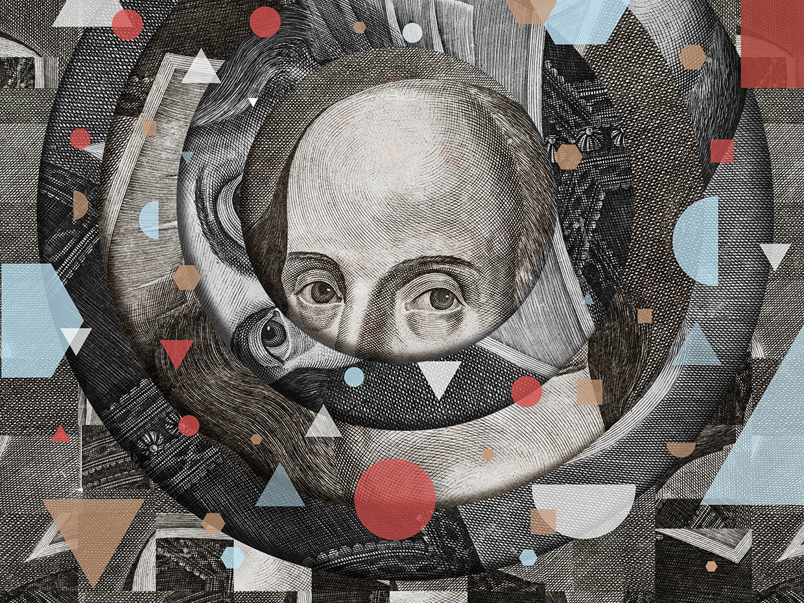
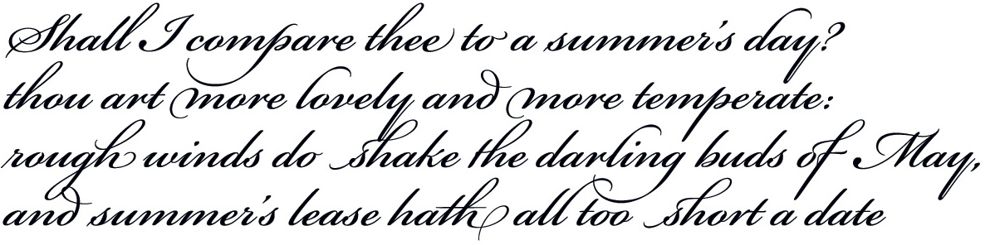
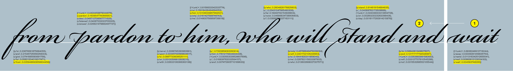
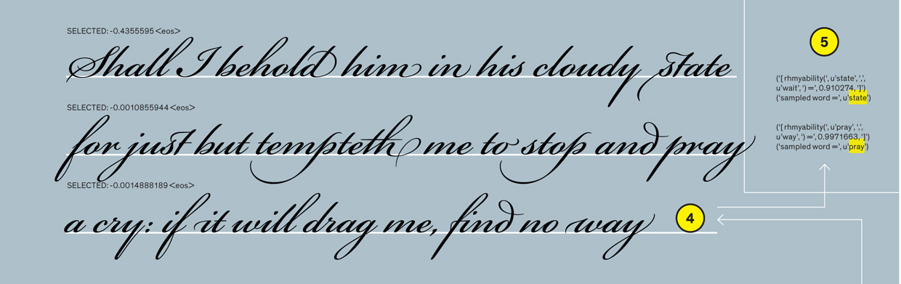
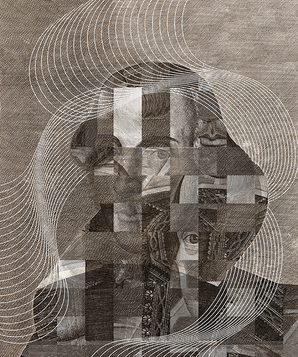

This AI Poet Mastered Rhythm, Rhyme, and Natural Language to Write Like Shakespeare - IEEE Spectrum

- Feature
- [Artificial Intelligence](https://spectrum.ieee.org/artificial-intelligence)
- [Machine Learning](https://spectrum.ieee.org/artificial-intelligence/machine-learning)

30 Apr 2020 | 15:00 GMT

# This AI Poet Mastered Rhythm, Rhyme, and Natural Language to Write Like Shakespeare

## “Deep-speare” crafted Shakespearean verse that most readers couldn’t distinguish from human-written poems

By Jey Han Lau, Trevor Cohn, Timothy Baldwin and Adam Hammond

Advertisement
Editor's Picks

[ #### The Blogger Behind “AI Weirdness” Thinks Today’s AI Is Dumb and Dangerous](https://spectrum.ieee.org/tech-talk/artificial-intelligence/machine-learning/blogger-behind-ai-weirdness-thinks-todays-ai-is-dumb-and-dangerous)[ #### The Birth of Digital Poetry](https://spectrum.ieee.org/tech-history/silicon-revolution/the-birth-of-digital-poetry)[ #### For Centuries, People Dreamed of a Machine That Could Produce Language. Then OpenAI Made One](https://spectrum.ieee.org/tech-talk/artificial-intelligence/machine-learning/for-centuries-people-dreamed-of-a-machine-that-can-produce-language-then-openai-made-one)

 

Illustration: Chad Hagen

**Here’s a stanza** from a sonnet written by William Shakespeare:

 

And here’s one written by [Deep-speare](http://aclweb.org/anthology/P18-1181), an artificial intelligence program that we trained to write sonnets:

 

Deep-speare’s creation is nonsensical when you read it closely, but it certainly “scans well,” as an English teacher would say—its rhythm, rhyme scheme, and the basic grammar of its individual lines all seem fine at first glance. As our research team discovered when we showed our AI’s poetry to the world, that’s enough to fool quite a lot of people; most readers couldn’t distinguish the AI-generated poetry from human-written works.

Our team, composed of three machine-learning researchers and one scholar of literature, trained our AI poet using about 2,700 sonnets taken from the online library [Project Gutenberg](https://www.gutenberg.org/). Our “poet” learned how to compose poetry on its own, using the AI approach known as deep learning—it cranked through the poems in its training database, trying again and again to create lines of poetry that matched the examples. We didn’t give it rhyming dictionaries, pronunciation dictionaries, or other resources, as has often been the case in previous computer-generated poetry projects. Instead, Deep-speare independently learned three sets of rules that pertain to sonnet writing: rhythm, rhyme scheme, and the fundamentals of natural language (which words go together).

Our goal was to see how far we could push deep learning for natural-language generation, and to make use of the interesting qualities of poetry. Poetic forms such as sonnets have fairly rigid patterns when it comes to rhyme and rhythm, and we wondered if we could design the system’s architecture so that Deep-speare would learn these patterns autonomously.

Our efforts fall within the booming research field of computational creativity. AI-generated paintings have been [auctioned off at Christie’s](https://www.christies.com/features/A-collaboration-between-two-artists-one-human-one-a-machine-9332-1.aspx), the [DeepBach program](https://sites.google.com/site/deepbachexamples/) has composed convincing music in the style of Bach, and there has been work in other media such as [sculpture](https://www.theverge.com/tldr/2019/4/12/18306090/ai-generated-sculpture-shredded-remains-ben-snell-dio) and [choreography](https://www.dancemagazine.com/is-google-the-worlds-next-great-choreographer-2625652667.html?rebelltitem=2). In the realm of language and literature, a text-generating system called [GPT-2](https://openai.com/blog/better-language-models/) from the research lab OpenAI proved able to generate fairly coherent paragraphs of text [based on a starter sentence](https://talktotransformer.com/).

These experiments in computational creativity are enabled by the dramatic advances in deep learning over the past decade. Deep learning has several key advantages for creative pursuits. For starters, it’s extremely flexible, and it’s relatively easy to train deep-learning systems (which we call models) to take on a wide variety of tasks. These models are also very good at discovering patterns and generalizing from those patterns—sometimes with surprising results, which can be interpreted as “accidental creativity.” What’s more, the inherent element of randomness within deep-learning algorithms leads to variability in the models’ output. This variability lends itself well to creative applications, assuming the human collaborator has the patience to sift through the different outputs. Finally, it’s relatively easy to build models that work with different types of data, including text, speech, images, and videos.

**A sonnet is chiefly distinguished** by two features: its 14-line length and its two-part “argument” structure, in which the poem first describes a problem or lays out a question and then offers a solution or resolution. In the 16th century, English poets developed a distinctive sonnet style using a rhythm called iambic pentameter, where 10-syllable lines have a regular unstressed-stressed rhythmic pattern. An English sonnet typically consisted of three four-line stanzas (called quatrains) that presented the “problem,” followed by a two-line couplet, often with a rhyme scheme of ABAB CDCD EFEF GG. Shakespeare made such frequent use of this poetic form that today it’s called the Shakespearean sonnet.

In the Deep-speare project, we sought to produce individual quatrains from the problem section of Shakespearean sonnets. We therefore focused on producing verses in iambic pentameter with regular rhyme schemes, rather than trying to replicate the full 14-line form of the sonnet or its two-part argumentative structure. We’d like to work on that greater challenge someday, but first we have to prove that our AI poet has mastered individual quatrains.

### The Poetic Process

The AI poet, Deep-speare, generates stanzas that resemble pieces of Shakespearean sonnets, which are characterized by certain rhyme schemes and a rhythm of alternating stressed and unstressed syllables known as iambic pentameter. Deep-speare employs three natural-language-processing models: One selects each word by assessing word probability, a second checks the rhythm of each line of poetry, and a third ensures that each line adheres to the rhyme scheme.

To create a stanza, the AI chooses one of the classic rhyme schemes at random. In this example, it picks the “ABBA” scheme, which means the first and last lines will rhyme and the two middle lines will rhyme. It then begins to generate the poem in a surprising way—beginning with the last word of the last line and working backward, moving from right to left to assemble each line.

 [ ](https://spectrum.ieee.org/image/MzYxODkxNg.jpeg)

1. Deep-speare begins by choosing the last word of the last line (“wait”). It makes this choice by considering all the words in the English language and assessing each word’s probability of appearing in that spot. You see here the top five contenders and their probability rankings. The model doesn’t choose the word with the highest probability; instead it samples at random from the candidate words. (Note: The symbol “<unk>” is a stand-in for low-frequency or unseen words and is never chosen.)

1. Working backward, the AI poet repeats this selection process for each word in the final line. The probability scores of the candidate words begin to reflect how often certain words appear next to each other or in the same sentence.

 [ ](https://spectrum.ieee.org/image/MzYxNzU1Ng.jpeg)

1. Deep-speare generates many candidate lines of poetry in this way; then its rhythm model looks at those candidates and assigns them rhythm scores. From those candidates, it samples a line that fits the iambic pentameter scheme.

 [ ](https://spectrum.ieee.org/image/MzYxNzU1OA.jpeg)

1. Working from bottom to top, the AI repeats these steps with the other lines of poetry.

1. When choosing words to conclude the second and first lines (“pray” and “state”), the rhyme model gives the candidate words a “rhymability” score, looking for words that rhyme with “way” and “wait.”

Our system was powered by three components: a rhythm model that learned iambic pentameter, a rhyme model that learned which words rhyme with each other, and a language model that learned which words are typically found together. The language model was the main component that generated the sonnet, word by word.

A language model judges which sentences are valid within a language (in this case, English) by ranking any arbitrary sentence with a probability score. A properly trained language model will assign fluent sentences higher probabilities and nonsensical sentences lower probabilities. But consider how language is both produced and interpreted: sequentially, one word after another. This same principle allows us to break down the very complex problem of creating sentences into a series of simpler problems involving words. A language model’s job is to look at a partial sentence and predict what word will come next. To make this prediction, it looks at all of the words it knows and gives each possible next word an individual probability score, which is contingent on the words that are already in the sentence.

A language model learns these probabilities by ingesting all the words and sentences in its training corpus; researchers use Wikipedia entries, discussions on Reddit, or databases specifically constructed for training ­natural-language-processing systems. From that trove of text, the AI learns which words are most often found together. In the case of our Deep-speare project, the model learned basic lessons about language from ­Project ­Gutenberg’s whole collection of poetry, and refined its sonnet-writing abilities using roughly 2,700 Shakespearean sonnets in the online library, which contained about 367,000 words.

The quality of a language model can be characterized by measuring the amount of “surprise” upon observing the next word. If it is assigned a high probability score, the word is unsurprising; words with low probability scores are quite surprising. This degree of surprise is used as a signal while training a language model from text. If the model is not surprised by each successive word, as we progress one word at a time through a large corpus of text, then the model can be considered to have captured much of the complexity of language. This includes the existence of multiword units like “San ­Francisco” that frequently co-occur, the rules of grammar and syntax that govern sentence structure, and semantic information, such as the fact that “coffee” tends to be “strong” or “weak,” but rarely “powerful” or “lightweight.”

Once we had our trained language model, it could finish a sentence or generate sentences entirely from scratch. It performed either function by randomly choosing a word that had a high probability score, adding it to the growing sentence, and recomputing the probabilities of all the possible words that could come next. By repeating this process, Deep-speare generated its lines of poetry.

While Deep-speare’s language model was learning about word probabilities from Project Gutenberg’s collection of sonnets, a separate rhythm model was learning about iambic pentameter. We told the rhythm model that each line was composed of 10 syllables in a stressed-unstressed pattern. The model looked at the letters and punctuation within each line and determined which characters corresponded to a syllable and which syllables received the stress. For example, the word “summer” should be understood as two syllables—the stressed “sum” and the unstressed “mer.” When Deep-speare was writing its quatrains, the language model generated candidate lines of poetry, from which the rhythm model picked one that fit the iambic pentameter pattern. Then the process repeated for the next line.

The rhyme model also learned its lessons from the collection of sonnets, but it looked only at the characters within the final word of each line. During its training process, we told the model that each sentence-ending word should rhyme with one other word within the quatrain, and then we let it figure out which of those words were most similar and thus most likely to rhyme. To take the example of the Shakespeare sonnet quoted earlier, the rhyme model determined that “day” and “May” had a high “rhymability” score, as did “temperate” and “date.”

Once Deep-speare was trained and ready to compose, we gave it three different rhyme templates to choose from: AABB, ABBA, and the ABAB that’s most typical of Shakespearean sonnets. During its writing process, Deep-speare first randomly picked one of the templates. Then the language model proceeded to generate the lines of poetry, word by word; when it reached a word that should rhyme, it offered candidate words to the rhyme model.

Here are two examples of quatrains generated by Deep-speare. The first shows a slightly trained model that’s beginning to grasp the rhyme scheme but hasn’t yet found the rhythm, and isn’t making much sense.

>   *> by complex grief’s petty nurse. had wise upon
>  along
>  came all me’s beauty, except a nymph of song*>
>   *> to be in the prospect, he th of forms i join*>
>   *> and long in the hears and must can god to run*>

This second quatrain shows the progress made by a model that has nearly finished its training. Its rhymes (in the ABBA pattern) are correct, it nails the iambic pentameter, and its language is not just coherent, it’s reasonably poetic!

>   *> shall i behold him in his cloudy state*>
>   *> for just but tempteth me to stop and pray *>
>   *> a cry: if it will drag me, find no way *>
>   *> from pardon to him, who will stand and wait*>

**In assessing Deep-speare’s** poetic output, we first checked to be sure it wasn’t just copying sentences from its training data. We found that the phrases in its generated poems didn’t overlap much with phrases in the training data, so we were confident that Deep-speare wasn’t merely memorizing existing sonnets; it was creating original poems.

But an original sonnet isn’t necessarily a good sonnet. To assess the quality of Deep-speare’s quatrains, we worked with two types of human evaluators. The first judges were crowdworkers employed through Amazon’s Mechanical Turk platform who had a basic command of the English language but no expertise in poetry. We presented them with a pair of sonnet quatrains, one composed by a human and the other generated by a machine, and asked them to guess which one was written by a human.

 

Illustration: Chad Hagen

We were greatly dismayed by the initial results. When we first posted the task, the crowdworkers identified the human-written sonnets with near-perfect accuracy. It seemed like the end of the road for our research, as the results indicated that the machine-generated poems were clearly not up to standard.

Then we considered an alternative explanation for the near-perfect accuracy: The crowdworkers had cheated. As our human-written poems were taken from Project ­Gutenberg (in which all text is indexed online and searchable), we wondered if the workers had copied the poems’ text and searched for it online. We tested this ourselves, and it worked—the human-written poem always returned some search results, so achieving perfect accuracy on the guessing game was a trivial accomplishment.

To discourage the crowdworkers from cheating, we converted all the poems’ text into images, then put the task up for evaluation again. Lo and behold, the workers’ accuracy plunged from nearly 100 percent to about 50 percent, indicating that they could not reliably distinguish between human poetry and machine poetry. Although the workers could still cheat by manually typing the text of the poems into a Google search bar, that procedure apparently required too much effort.

[Our second evaluator was coauthor]()[Adam Hammond](http://www.adamhammond.com/about/), an assistant professor of literature at the University of Toronto. Unlike the crowdworker experiment, this evaluation did not involve a guessing game. Instead, Hammond received a random mix of human-written and machine-generated sonnets and had to rate each poem on four attributes: rhyme, rhythm, readability, and emotional impact.

Hammond gave Deep-speare’s quatrains very high marks for rhyme and rhythm. In fact, they got higher ratings on these attributes than the human-written sonnets. Hammond wasn’t surprised by this result, explaining that human poets often break rules to achieve certain effects. But in the readability and emotional-impact categories, Hammond judged the machine-generated sonnets to be markedly inferior. The literature expert could easily tell which poems were generated by Deep-speare.

**One of the most interesting** aspects of the project was the response it elicited. Shortly after we presented our paper at a [2018 conference on computational linguistics](https://acl2018.org/), news outlets around the world picked up the story. Many articles quoted the following quatrain as evidence of the humanlike poetry Deep-speare was capable of producing:

>   *> With joyous gambols gay and still array,*>
>   *> no longer when he ’twas, while in his day*>
>   *> at first to pass in all delightful ways*>
>   *> around him, charming, and of all his days.*>

When Hammond was interviewed on BBC Radio, the presenter read this same quatrain aloud and asked for an interpretation. Hammond responded by asking the presenter if she had noticed that the quatrain contained a glaring grammatical error: “he ’twas,” a contraction of the nonsense phrase “he it was.” The presenter’s response indicated that she had not noticed.

Such willingness to look past obvious errors in order to marvel at the wonders of AI, a phenomenon that the social scientist [Sherry Turkle](https://www.mit.edu/~sturkle/) names “the Eliza effect,” dates back to the earliest experiments in text-based AI. At MIT in the 1960s, computer scientist [Joseph Weizenbaum](https://en.wikipedia.org/wiki/Joseph_Weizenbaum) developed Eliza, the first chatbot, which replicated the conversational style of a psychotherapist. Although the program was quite crude, and its limitations easy to expose, Weizenbaum was shocked to discover how easily users were [taken in by his creation](https://spectrum.ieee.org/tech-talk/robotics/artificial-intelligence/why-people-demanded-privacy-to-confide-in-the-worlds-first-chatbot). Turkle, a colleague of Weizenbaum’s at MIT in the 1970s, noticed that even graduate students who understood Eliza’s limitations nonetheless fed it questions it was able to answer in a humanlike way.

The Eliza effect—which Turkle defines as “human complicity in a digital fantasy”—seems to have been at work in the public response to Deep-speare as well. The public so wanted the quatrains to demonstrate the powers of AI that it looked past evidence to the contrary.

Such willful misunderstandings of AI may be increasingly problematic as Deep-speare’s capacities grow. We’re continuing with this research, and one of our goals is to improve our AI poet’s scores on readability and emotional impact. To improve overall coherence, one tactic may be to “pretrain” the language model on a very large corpus of text, such as the entirety of Wikipedia, to give it a better grasp of which words are likely to appear together in a long narrative; then we could take that general language model and give it special training in the language of sonnets.

We’re also thinking about how human poets compose their works: A poet doesn’t sit down at a desk and think, “Hmm, what should my first word be?” and then, having made that tough decision, contemplate the second word. Instead, the poet has a theme or narrative in mind, and then searches for the words to express that idea. We’ve already taken a step in that direction by giving Deep-speare the ability to generate a poem based on a specific topic, such as love or loss. Sticking to one topic may increase the coherence and continuity of the quatrain; the model’s word choices will be constrained because it will have learned which words fit with a given theme. We’re also planning experiments with a more hierarchical language model that first generates a high-level narrative for the poem, and then uses that framework to generate the individual words.

It’s an ambitious goal, to be sure. We hope that Deep-speare will measure up, if not to Shakespeare, then to a character described in [one of Shakespeare’s poems](https://en.wikipedia.org/wiki/A_Lover's_Complaint):

>   *> He had the dialect and different skill,
>  Catching all passions in his craft of will.*>

*This article appears in the May 2020 print issue as “The AI Poet.”*

Advertisement