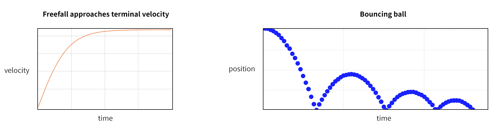
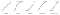

This Ain’t Disney: A practical guide to CSS transitions and animations

# This Ain’t Disney: A practical guide to CSS transitions and animations

[Mohammed Ibrahim](https://blog.prototypr.io/@ibrahim.mohammed_35833?source=post_page---------------------------)

[Aug 2](https://blog.prototypr.io/this-aint-disney-a-practical-guide-to-css-transitions-and-animations-a8b87e7c5531?source=post_page---------------------------) · 8 min read

Oh, animation… we want to get it right so badly, don’t we? I mean, does anybody really enjoy a stiff, snappy UI? Can anyone admit they’re not delighted when a component slides into view and appears to slow down before coming to a complete stop? There’s something nice about that. So what is that special touch, and why is it so hard to reproduce?

The answer is physics. Specifically **Newtonian physics**, the branch of science dedicated to apples falling from trees onto scientists, also referred to as classical mechanics.

The moment before an apple begins to fall from a tree, it’s moving at zero meters per second. Depending on atmospheric pressure, wind, and other elements, it accelerates from zero toward its terminal velocity at a specific rate, until it makes impact. Then, depending on the elasticity of the apple and the contact surface, the apple will bounce a number of times, with the bounce height decreasing by about half after each bounce.

Examining the two charts above, one may notice a symmetry in the curves of an object in freefall and one bouncing on the ground. This symmetry is a result of gravity.

Gravity is unique to each celestial body depending on how much stuff it’s made of, and how dense that stuff is. Earth’s unique gravity signature is familiar to us, and so by association, anything following that signature also feels familiar.

Furthermore, anything *not* in line with Earth’s gravity would be jarring to witness on Earth. For instance, imagine witnessing a ball which appeared to bounce in slow motion, or one which bounced higher and higher, or a ball which popped in and out of existence depending on its height — it would be a disturbing experience in physical reality.

Digital user experiences, however, are not bound by strict laws governing the physics of movement; designers are essentially left to their own devices to come up with a physics pattern and apply it effectively to their design. This do-it-yourself culture around animation introduces a risk factor, and designers don’t really get a share of the project’s “risk budget,” which is usually reserved for new tech, so this often takes animation off the table for smaller teams.

With that said, you’re not completely in the dark when using CSS. You have useful tools and defaults to get started, and with some basic knowledge, you can begin introducing a pleasant animated experience for your users.

* * *

*...*

# Timing

Before we get into transitions vs animations, let us first discuss timing, which is a concept needed for both. Timing is the measure of how animation progress changes throughout a given interval. Animation timing in CSS is done using the cubic-bezier function:

`cubic-bezier(a, b, c, d)`

Derived from the [Bezier curve in mathematics](https://www.jasondavies.com/animated-bezier/), this function takes parameters for start and end points (`a` and `d`) called “anchors,” and two middle points (`b` and `c`) called “handles.”

CSS also has five predefined instances of the cubic-bezier function based on the most commonly used timings:

X-axis represents time (moving right), Y-axis represents animation progress (moving up)

- **linear:** Starts and ends at the same speed. Better for properties like color and opacity rather than motion.
- **ease:** Accelerates quickly and slows down gradually. This is the CSS default, a nice all-purpose function.
- **ease-in:** Accelerates gradually and ends at speed. Ideal for animating elements out of view.
- **ease-out:** Starts at speed and slows down. Ideal for animating elements into view.
- **ease-in-out:** Accelerates gradually then slows down. Like ease, but with a slower start. Can be useful for animations which start and end on screen.

Here’s how you would use the aliases in CSS:
#div1 {transition-timing-function: linear;}
#div2 {transition-timing-function: ease;}
#div3 {transition-timing-function: ease-in;}
#div4 {transition-timing-function: ease-out;}
#div5 {transition-timing-function: ease-in-out;}

The code below shows each alias from above replaced with its respective cubic-bezier function. Note that `linear` only has two true points, since its middle points are also its start and end points. `ease-in` has three true points, since its last two points are 1. `ease-out` also has three true points, since its first two points are 0. You can match each instance to its respective curve, and notice how the number of points affects the curve shape.

#div1 {transition-timing-function: cubic-bezier(0,0,1,1);}
#div2 {transition-timing-function: cubic-bezier(0.25,0.1,0.25,1);}
#div3 {transition-timing-function: cubic-bezier(0.42,0,1,1);}
#div4 {transition-timing-function: cubic-bezier(0,0,0.58,1);}
#div5 {transition-timing-function: cubic-bezier(0.42,0,0.58,1);}

Keep in mind that in the code above, we are using `transition-timing-function` which is used for transitions. There is also `animation-timing-function` which works the same way, but applies to animations.

# Transitions

Transitions are triggered by changes in an element’s state (mouseover, click, drag, etc.). When you mouse over a button and it changes color smoothly, that is a hover transition. All transitions have an initial state and a final state, and for anything more elaborate, you will likely want to use animation, which we will cover later. For now, let’s begin with code structure:

transition: [*property] [*transition-duration] [transition-timing-function] [transition-delay];

The transition property takes two required parameters, and two optional parameters which have defaults. You can also pass multiple transitions by separating them with commas.

- ***property:** Which CSS property of the element will have a transition.
- ***transition-duration:** How long the animation should run.
- **transition-timing-function:** Easing function. Default is `ease`.
- **transition-delay:** How long before the animation begins. Default is `0`.

/*1*/ transition: background-color 2s;
/*2*/ transition: background-color 2s 0.5s;
/*3*/ transition: background-color 2s ease-in;
/*4*/ transition: background-color 2s ease-out 0.5s;
/*5*/ transition: background-color 2s, height 1s ease-in-out;
/*6*/ transition: all 1s ease-out;

In the code above, you can see variations of the CSS transition property. The first five instances have a background color transition of two seconds. The second and fourth have a transition delay of 0.5 seconds. The fifth example has a second transition for height, and you can see how the transitions are comma-separated. The final example uses `all` which means any visible change to the element will occur over the given period of time, in this case one second.

The code below is a simple example of an element using a CSS transition:
.glowAndGrow {
height: 100px;
transition: background-color 0.5s, height 1s;
}.glowAndGrow:hover {
background-color: gold;
height: 200px;
}
This box glows and grows on hover

Keep in mind that CSS will also transition the element *back to its initial state* so, in the example above for instance, there’s no need to add a transition property for the hover case, unless you want the reverse transition to be different. (Sometimes you want an element to leave faster than it came in, especially large ones.)

# Animations

Unlike transitions which are triggered by state changes, animations are used with CSS functions called **keyframes. **Also, animations can have more than just initial and final states, they can have many in between.

animation: [*animation-name] [*animation-duration] [animation-timing-function] [animation-delay] [animation-iteration-count] [animation-direction] [animation-fill-mode] [animation-play-state];

Like the transition property, the animation property takes two required parameters, as well as two optional parameters for timing and delay, and can also take multiple animations. However, because animations are more robust, they also have optional parameters for iteration count, direction, fill mode, and play state.

- ***animation-name:** Name of the keyframe.
- ***animation-duration:** How long the animation should run.
- **animation-timing-function:** Easing function. Default is `ease`.
- **animation-delay:** How long before the animation begins. Default is `0`.
- **animation-iteration-count:** How many times the animation should run. Could be a number, or `infinite` which is the default.
- **animation-direction:** Whether to animate forward, backward, or alternating. Default is `normal`.
- **animation-fill-mode:** When the animation styles should appear. Default is `none`.
- **animation-play-state:** Whether or not the animation is playing. Default is `running`.

The second half of the animation code is the keyframe. A keyframe is a sequence of states which make up the animation:

@keyframes bounce {
0% {
transform: scale(0.1);
opacity: 0;
}
60% {
transform: scale(1.2);
opacity: 1;
}
100% {
transform: scale(1);
}
}.ball {
animation: bounce 2s infinite;
}

In the example above, the element begins in the first step of the sequence as transparent, and scaled down to 10% of its size. The second step is complete at 60% of the duration, and since this animation has a duration of two seconds, this means for the first 1.2 seconds of the animation, the element changes from transparent to opaque, and from 10% scale to 120% scale. Finally, in the last 0.8 seconds, it scales back to 100% of its size.

# When to use

In a previous article, I wrote about how shade and tint in UI design are most pleasant when they mimic the physical properties of light. Likewise, when it comes to transitions and animations, the ideal experience is one which respects the laws of gravity.

With that said, unless you’re a game designer, be selective with your animation choices. A nice effect may be appealing at first, but after the thousandth time, the user may grow tired of seeing it.

Functional animation, on the other hand, never gets old. If you find a way to leverage animation to communicate with your users, then you will have found a real opportunity to maximize on a vibrant experience.

Below are some resourceful examples which may inspire you:

Gleb Stroganov on Dribbble

smashingmagazine.com

codemyui.com

smashingmagazine.com

freefrontend.com

* * *

*...*