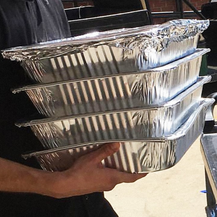

This App Delivers Leftover Food To The Hungry, Instead Of To The Trash

This App Delivers Leftover Food To The Hungry, Instead Of To The Trash

https://www.fastcompany.com/40562448/this-app-delivers-leftover-food-to-the-hungry-instead-of-the-trash?utm_source=nextdraft&utm_medium=email

Goodr has created a system that has diverted nearly a million pounds of food in Atlanta from landfills–and into kitchens.