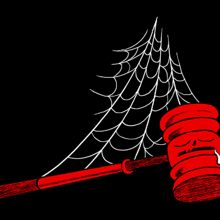

This Is What Happens When You Try to Sue Your Boss

This Is What Happens When You Try to Sue Your Boss

https://www.bloomberg.com/features/2019-arbitration-hell/

If you have a job in the U.S., chances are good you’ve signed an arbitration agreement that will stop you from suing your bosses in court for pretty much any reason.