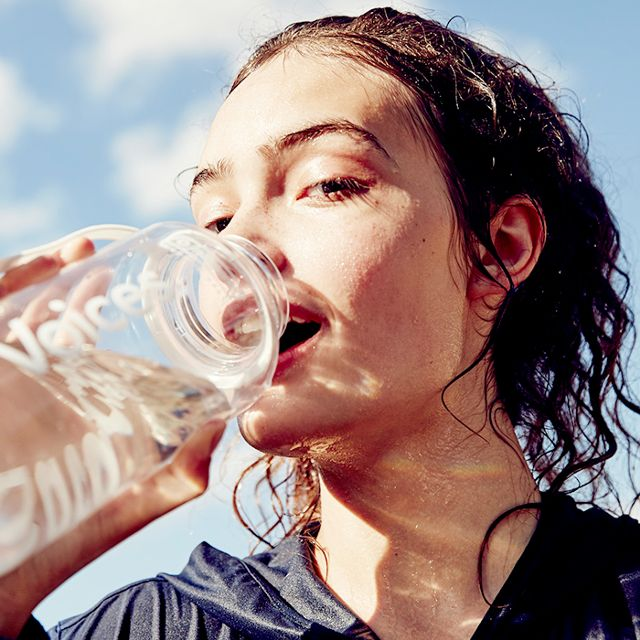

This Is What Happens to Your Body When You Drink a Gallon of Water a Day

July 24, 2017
 | [frombyrdie.com](http://www.byrdie.com/section/health)

# This Is What Happens to Your Body When You Drink a Gallon of Water a Day

 

by [Hallie Gould](http://www.byrdie.co.uk/author/hallie-gould)

 [**](http://facebook.com/sharer.php?u=http%3A%2F%2Fwww.byrdie.com%2Fdrinking-a-gallon-of-water-a-day%3Futm_campaign%3Darticle-share%26utm_source%3Dsocial-facebook-button%26utm_medium%3Dsocial&title=This+Is+What+Happens+to+Your+Body+When+You+Drink+a+Gallon+of+Water+a+Day)  [**](http://pinterest.com/pin/create/link/?url=http%3A%2F%2Fwww.byrdie.com%2Fdrinking-a-gallon-of-water-a-day%3Futm_campaign%3Darticle-share%26utm_source%3Dsocial-pinterest-button%26utm_medium%3Dsocial&media=https%3A%2F%2Fcdn.cliqueinc.com%2Fposts%2F230412%2Fdrinking-a-gallon-of-water-a-day-230412-1500858509580-promo.700x0c.jpg&description=This+Is+What+Happens+to+Your+Body+When+You+Drink+a+Gallon+of+Water+a+Day+via+%40ByrdieBeautyUK)  [**](http://www.byrdie.co.uk/drinking-a-gallon-of-water-a-daymailto:?subject=This%20made%20me%20think%20of%20you...&body=I%20just%20found%20this%20story%20on%20Byrdie%20and%20thought%20of%20you%3A%0A%0DThis%20Is%20What%20Happens%20to%20Your%20Body%20When%20You%20Drink%20a%20Gallon%20of%20Water%20a%20Day%0A%0Dhttp://byrdie.us/4wZwlzu)

   [**](http://pinterest.com/pin/create/link/?url=http%3A%2F%2Fwww.byrdie.com%2Fdrinking-a-gallon-of-water-a-day%3Futm_campaign%3Darticle-share%26utm_source%3Dsocial-pinterest-button%26utm_medium%3Dsocial&media=https%3A%2F%2Fcdn.cliqueinc.com%2Fposts%2F230412%2Fdrinking-a-gallon-of-water-a-day-230412-1500858558339-main.700x0c.jpg&description=This+Is+What+Happens+to+Your+Body+When+You+Drink+a+Gallon+of+Water+a+Day+via+%40ByrdieBeautyUK)

PHOTO:
Outdoor Voices

Age-old stories and advice would have us believe drinking a gallon of water a day will solve every problem we have—from weight loss to anti-aging. But is it a myth? I can't imagine it would help much more than the frequency of my trips to the bathroom. So before trying it myself and subsequently carrying a gallon-size water bottle around with me all day, I decided to ask experts in fitness, nutrition, and skin what that water would really affect.

Turns out, it's not a cure-all for any and every body-related issue. But there are a few surprising things that added hydration helps with. **Below, top trainers, estheticians, and nutritionists discuss the truth behind the water bottle. **

1. Your metabolic rate will spike.

"Get this," says Heidi Powell, celebrity trainer and fitness blogger, "If the human body consumes 16 ounces of water in a given hour, the metabolic rate will spike by as much as 30% for the next 30 to 40 minutes. By committing to drinking half your body weight in ounces of water each day (or aim for that gallon), research says you can expect to lose [more weight](https://academic.oup.com/jcem/article-lookup/doi/10.1210/jc.2003-030780)." She continues, "There is a single enzyme—called lipase—that must be activated in your body in order to mobilize fat (i.e., get rid of it). Water is one of the many necessary components in the activation of lipase."

2. Your workouts improve on a cellular level.

"In terms of fitness," says Kara Griffin, a personal trainer, holistic nutritionist, and health coach, "water is the key to healthy, well-functioning cells. So drinking enough is going to help with exercise on a cellular level. Studies have shown dehydration most negatively affects endurance exercise, so make sure you are hydrated during a long run. Strength and power workouts (think CrossFit) are less affected by dehydration, but studies have shown [some detriment](http://journals.lww.com/acsm-essr/Citation/1999/00270/6_Influence_of_Body_Water_and_Blood_Volume_on.8.aspx) to or lack in performance. Staying hydrated will increase performance across all exercise forms, but chugging water before a workout can not only [cramp you up](https://link.springer.com/article/10.2165/00007256-200737100-00006) but also can make you feel more sluggish and less focused on the task at hand. Drink a glass of water 20 to 30 minutes before your next workout, and take little sips throughout (if needed) to get you closer to your personal peak performance."

3. Your wrinkles will not disappear.

"When you drink water, it [doesn't go directly to the skin](http://www.byrdie.com/water-skin)," says celebrity esthetician Renée Rouleau. "It runs through the intestines, gets absorbed into your bloodstream, and then is filtered out by the kidneys. At this point, it will hydrate the cells inside the body.

"Wrinkles are due to DNA damage from the UV light. Drinking water will not reverse this process, and hydration levels in the skin have very little to do with drinking water internally. Rather, how you treat your skin on the surface [is important]. For example, if you’re using harsh bar soaps and detergent-based cleansers to wash your face, they will have a bigger impact on the lack of surface hydration in the skin than not drinking water ever will. You can make wrinkles soften and appear less noticeable with regular use of exfoliants, retinol, barrier-repairing moisturizers, and masks."

4. You'll stop retaining excess fluid around your eyes.

"From personal experience, Rouleau says, "there can be a very noticeable difference in the skin when it comes to under-eye puffiness. Both eating high-sodium foods (particularly at night) and not drinking an adequate amount of water can definitely cause you to retain excess fluids around the eyes and experience more-than-normal under-eye puffiness. I know firsthand that when I have not been drinking enough water during the day, the following morning I will always be puffier under my eyes than normal. Add in a high-sodium dinner, and no matter how much water I drink, I will always be puffy.

"Bottom line," continues Rouleau, "drinking water is very important for keeping the body hydrated, but from a skin standpoint, it can make far more of an improvement for unnecessary under eye puffiness than it will to keep your skin hydrated."

5. You cut unnecessary calories from your diet.

"First, drinking this much water will replace sugary drinks," says Griffin. "It's also important to remember that water intake doesn't just come from guzzling water—it also comes from what you eat! You naturally up your water intake by eating clean, unprocessed, whole fruits and vegetables." An easy example? Watermelon is 93% water.

Drinking enough water and eating whole fruits and veggies also means you're cutting processed foods that usually have high sodium content. Salt stimulates the appetite but also makes you retain water, causing you to eat more and bloat from the water you've been drinking throughout the day. Without the salt, the water will help with intestinal motility and urination, two ways your body releases toxins.

**FYI: This is what you need to do to actually have a "[high metabolism](http://www.byrdie.com/high-metabolism-diet)."

**

 Explore:   [drinking a gallon of water a day](http://www.byrdie.co.uk/tags/drinking-a-gallon-of-water-a-day)

- [**](http://facebook.com/sharer.php?u=http%3A%2F%2Fwww.byrdie.com%2Fdrinking-a-gallon-of-water-a-day%3Futm_campaign%3Darticle-share%26utm_source%3Dsocial-facebook-button%26utm_medium%3Dsocial&title=This+Is+What+Happens+to+Your+Body+When+You+Drink+a+Gallon+of+Water+a+Day)

- [**](http://pinterest.com/pin/create/link/?url=http%3A%2F%2Fwww.byrdie.com%2Fdrinking-a-gallon-of-water-a-day%3Futm_campaign%3Darticle-share%26utm_source%3Dsocial-pinterest-button%26utm_medium%3Dsocial&media=https%3A%2F%2Fcdn.cliqueinc.com%2Fposts%2F230412%2Fdrinking-a-gallon-of-water-a-day-230412-1500858509580-promo.700x0c.jpg&description=This+Is+What+Happens+to+Your+Body+When+You+Drink+a+Gallon+of+Water+a+Day+via+%40ByrdieBeautyUK)

#### Add a Comment

 **