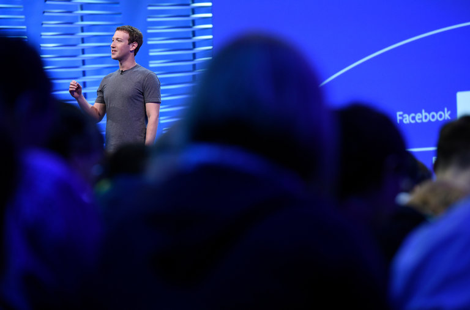
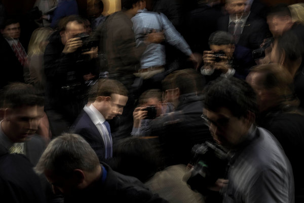
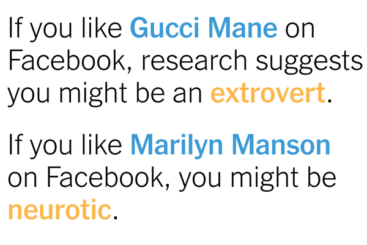
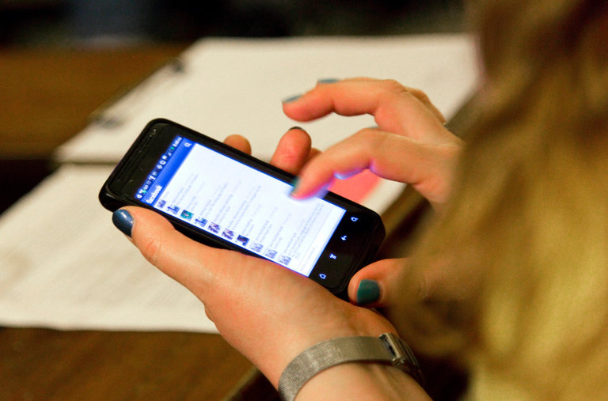

This Is Your Brain Off Facebook

# This Is Your Brain Off FacebookThis Is Your Brain Off Facebook

Planning on quitting the social platform? A major new study offers a glimpse of what unplugging might do for your life. (Spoiler: It’s not so bad.)

Subjects in a Stanford study had to be paid $100 on average to quit Facebook for a month. At the end, they were less politically polarized than people in a comparison group.CreditMarcio Jose Sanchez/Associated Press

Image

Subjects in a Stanford study had to be paid $100 on average to quit Facebook for a month. At the end, they were less politically polarized than people in a comparison group.CreditCreditMarcio Jose Sanchez/Associated Press

By [Benedict Carey](https://www.nytimes.com/by/benedict-carey)

- Jan. 30, 2019

-

    - 
    - 
    - %0A%0Ahttps%3A%2F%2Fwww.nytimes.com%2F2019%2F01%2F30%2Fhealth%2Ffacebook-psychology-health.html)

    -
    -
    -

The world’s most common digital habit is not easy to break, even in a fit of moral outrage over the privacy risks and political divisions Facebook has created, or amid concerns about how the habit might affect emotional health.

Although four in 10 Facebook users say they have taken long breaks from it, the digital platform keeps growing. A recent study found that the average user would have to be paid $1,000 to $2,000 to [be pried away for a year](https://journals.plos.org/plosone/article?id=10.1371/journal.pone.0207101).

So what happens if you actually do quit? [A new study](http://web.stanford.edu/~gentzkow/research/facebook.pdf), the most comprehensive to date, offers a preview.

Expect the consequences to be fairly immediate: More in-person time with friends and family. Less political knowledge, but also less partisan fever. A small bump in one’s daily moods and life satisfaction. And, for the average Facebook user, an extra hour a day of downtime.

Advertisement

[      The truth is worth it.         See the stories               ](https://adclick.g.doubleclick.net/pcs/click?xai=AKAOjstkwXfm-nNtR7WBX-2WY6b9k4he13tzOYEKscrefeHC_eVVAR40LSYuKdfPIawB0V0zEwu7hzFKM2zOwwnj-CqsZNAFujLPA4XzqYvcwE-9Kl9N_ZdYPr9QguXWXqOF-aM348xXn8N-1uLNZVFPwWM8JXiVA4-3cTAFwW8ENsihJdcSA2TulEclMwUU-7cumEtC9A96cixxn7MrbWnS_Ukgnt3HGQ_4RMqtsmhQtfv_2CE43isKe9cnbHvEkba_&sig=Cg0ArKJSzL-hvyMTBNTZEAE&urlfix=1&adurl=https://ad.doubleclick.net/ddm/trackclk/N296811.6440THENEWYORKTIMESCOMPA/B22187340.237970964%3Bdc_trk_aid%3D435228218%3Bdc_trk_cid%3D111025435%3Bdc_lat%3D%3Bdc_rdid%3D%3Btag_for_child_directed_treatment%3D%3Btfua%3D)

The study, by researchers at Stanford University and New York University, helps clarify the ceaseless debate over Facebook’s influence on the behavior, thinking and politics of its active monthly users, who number some 2.3 billion worldwide. The study was posted recently on the Social Science Research Network, an open access site.

“For me, Facebook is one of those compulsive things,” said Aaron Kelly, 23, a college student in Madison, Wis. “It’s really useful, but I always felt like I was wasting time on it, distracting myself from study, using it whenever I got bored.”

Mr. Kelly, who estimated that he spent about an hour a day on the platform, took part in the study “because it was kind of nice to have an excuse to deactivate and see what happened,” he said.

***[*****[*Like the Science Times page on Facebook.*](http://on.fb.me/1paTQ1h)*****  ****| Sign up for the ***[*Science Times newsletter.*](http://nyti.ms/1MbHaRU)*****]***

Well before news broke that [Facebook had shared users’ data without consent](https://www.nytimes.com/2018/12/18/technology/facebook-privacy.html?login=email&auth=login-email&module=inline), scientists and habitual users debated how the platform had changed the experience of daily life.

A cadre of psychologists has argued for years that the use of Facebook and other social media is linked to mental distress, [especially in adolescents](https://www.ncbi.nlm.nih.gov/pubmed/30406005). Others have likened habitual Facebook use to a mental disorder, comparing it to drug addiction and even publishing magnetic-resonance images of what Facebook addiction “[looks like in the brain](http://healthland.time.com/2013/08/31/this-is-your-brain-on-facebook/).”

## Editors’ Picks

[  ### Is Ancient DNA Research Revealing New Truths — or Falling Into Old Traps?](https://www.nytimes.com/2019/01/17/magazine/ancient-dna-paleogenomics.html?fallback=0&recId=1Ga7tSA7pEmo1UDv0ZzgOUTaXwM&locked=0&geoContinent=EU&geoRegion=CMD&recAlloc=random&geoCountry=GB&blockId=signature-journalism-random&imp_id=62218276&action=click&module=editorContent&pgtype=Article&region=CompanionColumn&contentCollection=Trending)

[  ### What Driving Can Teach Us About Living](https://www.nytimes.com/2019/01/03/magazine/driving-living-reality.html?fallback=0&recId=1Ga7tSA7pEmo1UDv0ZzgOUTaXwM&locked=0&geoContinent=EU&geoRegion=CMD&recAlloc=random&geoCountry=GB&blockId=signature-journalism-random&imp_id=301362833&action=click&module=editorContent&pgtype=Article&region=CompanionColumn&contentCollection=Trending)

[  ### In 12 Minutes, Everything Went Wrong](https://www.nytimes.com/interactive/2018/12/26/world/asia/lion-air-crash-12-minutes.html?fallback=0&recId=1Ga7tSA7pEmo1UDv0ZzgOUTaXwM&locked=0&geoContinent=EU&geoRegion=CMD&recAlloc=random&geoCountry=GB&blockId=signature-journalism-random&imp_id=631723033&action=click&module=editorContent&pgtype=Article&region=CompanionColumn&contentCollection=Trending)

Advertisement

When Facebook has published [its own analyses to test such claims](https://www.pnas.org/content/111/24/8788.full), the company has[been roundly criticized.](https://www.nytimes.com/2014/07/01/opinion/jaron-lanier-on-lack-of-transparency-in-facebook-study.html?module=inline)

The new study, a randomized trial financed principally by the [Alfred P.](https://sloan.org/)[Sloan](https://sloan.org/)[Foundation](https://sloan.org/), a nonpartisan supporter of research in science, technology and economics, sketches out a nuanced, balanced portrait of daily use that is unlikely to satisfy either critics or supporters of the platform.

The paper, [along with similar analyses](https://robertomosquera.weebly.com/research.html) by other research groups, has not yet undergone peer review. The Times asked five independent experts to look at the methodology and findings.

“This is impressive work, and they do a good job sorting out causality,” said Erik Brynjolfsson, director of the Massachusetts Institute of Technology Initiative on the Digital Economy, who was not involved in the research.

“This is the way to answer these kinds of questions; it’s the gold standard for how to do science. A lot of what we’ve heard before about social media’s effects was based on surveys.”

A Facebook press officer said, in a prepared statement: “This is one study of many on this topic, and it should be considered that way.” The statement quoted from the study itself, which noted that “Facebook produces large benefits for its users,” and that “any discussion of social media’s downsides should not obscure the fact that it fulfills deep and widespread needs.”

The researchers — led by Hunt Allcott, an associate professor of economics at N.Y.U., and Matthew Gentzkow, a Stanford economist — used Facebook ads to recruit participants over age 18 who spent at least 15 minutes on the platform each day; the daily average was an hour, with heavy users logging two to three hours, or more.

## Sign up for Science Times

We’ll bring you stories that capture the wonders of the human body, nature and the cosmos.

Advertisement

Nearly 3,000 users agreed and filled out extensive questionnaires, which asked about their daily routines, political views and general state of mind.

Half the users were randomly assigned to deactivate their Facebook accounts for a month, in exchange for payment. The price point for that payment was itself of great interest to the researchers: How much is a month’s access to photos, commentary, Facebook groups, friends and newsfeeds worth? On average, about $100, the study found, which is in line with previous analyses.

During the month of abstinence, the research team, which included Sarah Eichmeyer and Luca Braghieri of Stanford, regularly checked the Facebook accounts of the study’s subjects to make sure those who had agreed to stay away had not reactivated them. (Only about 1 percent did.)

The subjects also regularly received text messages to assess their moods. This kind of real-time monitoring is thought to provide a more accurate psychological assessment than, say, a questionnaire given hours or days later.

Some participants said that they had not appreciated the benefits of the platform until they had shut it down. “What I missed was my connections to people, of course, but also streaming events on Facebook Live, politics especially, when you know you’re watching with people interested in the same thing,” said Connie Graves, 56, a professional home health aide in Texas, and a study subject. “And I realized I also like having one place where I could get all the information I wanted, boom-boom-boom, right there.”

She and her fellow abstainers all had access to Facebook Messenger throughout the study. Messenger is a different product, and the research team decided to allow it because it has similarities with other person-to-person media services.

When the month was over, the quitters and control subjects again filled out extensive surveys that assessed changes in their state of mind, political awareness and partisan passion, as well as the ebb and flow of their daily activities, online and off, since the experiment began.

For abstainers, breaking up with Facebook freed up about an hour a day, on average, and more than twice that for the heaviest users. They also reported spending more time offline, including with friends and family, or watching TV.

“I would have expected more substitution from Facebook to other digital things — Twitter, Snapchat, online browsing,” said Dr. Gentzkow. “That didn’t happen, and for me, at least, it was a surprise.”

On tests of political knowledge, the abstainers scored a few points lower than they did before deactivating their accounts.

“The political-knowledge findings suggest that Facebook is an important source of news that people pay attention to,” said David Lazer, a professor of political science and computer and information science at Northeastern University. “This is not a trivial finding. It could have gone either way. You could imagine that the other chatter and information on Facebook was crowding out news consumption.”

Scores on several measures of political polarization were mixed, although one scale, called “polarization on issues,” dropped for the abstainers by 5 percent to 10 percent, whereas the control group remained the same.

“It’s hard to know what to make of this,” Dr. Gentzkow said. “It may be that seeing a lot of news and politics on Facebook tends to polarize people. But once they’re off Facebook, it doesn’t necessarily mean they’re using the extra time to read The New York Times.”

Reduced knowledge, in short, may blunt partisanship, although this relationship is far from clear.

The most striking result from the study may be that deactivating Facebook had a positive but small effect on people’s moods and life satisfaction. The finding tempers the widely held presumption that habitual social-media use causes real psychological distress.

Advertisement

[                           ‘Reform Pioneer’ Honored for Role in China’s Economic Blossoming    A Hong Kong entrepreneur who left his mark.    Find Out More](https://adclick.g.doubleclick.net/pcs/click?xai=AKAOjsshnJV3Z7C1G8Y8cFXSxhf7eccG3txldrE37HSmJ-eXIKYFpYOVZyuVdwxPcbmjz_256Ak0Hbvajui4NlmnFO1KCHtmrc-UnYrKpY79zAVmIEfT8wDnrHBkgXiB14ax6yh0URltdjiZNYXEJ_DALSViWfzPcNL6_CRerURfpjcLjj3xS9vlP4YE4DEus8BukcxUtq-MyABz78d8W1mTF4zy9AKgx2b3O6P5S6Q5mgF6Lmh4xsITYFdpCHZKR9cD&sig=Cg0ArKJSzESHstbwdFfQEAE&urlfix=1&adurl=https://www.nytimes.com/paidpost/china-daily/henry-fok-ying-tung-the-man-who-helped-build-a-stronger-china.html)

[(L)](https://adclick.g.doubleclick.net/pcs/click?xai=AKAOjsshnJV3Z7C1G8Y8cFXSxhf7eccG3txldrE37HSmJ-eXIKYFpYOVZyuVdwxPcbmjz_256Ak0Hbvajui4NlmnFO1KCHtmrc-UnYrKpY79zAVmIEfT8wDnrHBkgXiB14ax6yh0URltdjiZNYXEJ_DALSViWfzPcNL6_CRerURfpjcLjj3xS9vlP4YE4DEus8BukcxUtq-MyABz78d8W1mTF4zy9AKgx2b3O6P5S6Q5mgF6Lmh4xsITYFdpCHZKR9cD&sig=Cg0ArKJSzESHstbwdFfQEAE&urlfix=1&adurl=https://www.nytimes.com/paidpost/china-daily/henry-fok-ying-tung-the-man-who-helped-build-a-stronger-china.html)

This notion is drawn in part from surveys that ask social-media users about their extent of use and overall moods. For instance, research led by Ethan Kross, a professor of psychology at the University of Michigan, [has found that](https://psycnet.apa.org/record/2015-08049-001) high levels of passive browsing on social media predict lowered moods, compared to more active engagement.

But previous research could not discern whether mood problems followed heavy usage, or moody people tended to be the heaviest users. The new study supported the latter explanation.

If heavy Facebook use caused mood problems, the researchers would have expected to see the moods of heavy users improve by a greater amount relative to lightweight users. But that didn't happen, which suggested that the heavy users were moody before they were sucked deeply into Facebook.

In an interview, Dr. Kross said that it was too early to draw hard conclusions on the psychological effects of quitting Facebook. He pointed to two recent, smaller randomized studies that found users’ moods lifted when their access to social media was restricted.

“What I take away from these three papers” — the Stanford study and the two smaller ones — “is we need to know more about how and when social-media use impacts well-being, not conclude that the relationship doesn’t exist,” or is very mild, Dr. Kross said.

Thus far, the debate over the effects of social media on mental health has focused mostly on children and adolescents, not on the older population that was the focus of the new study.

“In terms of age groups, they’re comparing apples and oranges,” said Jean Twenge, a psychologist and author of “iGen: Why Today’s Super-Connected Kids Are Growing Up Less Rebellious, More Tolerant, Less Happy.”

Advertisement

[](https://adclick.g.doubleclick.net/pcs/click?xai=AKAOjsvoXxUATI7FoMHmWHz1anJ6-jNAJvFgl9Orl7VPLBBWfA0dF2ebsezrRmiY1kmI0EKs36AysSWIzdBKXQ6vu_mGBYxNLf8wJM1QO7foNulTDrnvJeh0WFt4LtYiFpTdPtHiv2iT8Wqt7p_j4hHs0vh-A9B7TCSDF94PHD9d-z1KkJKPSLRHCr17UIUhyONpFJSoljB8gs-I7tJBkpAiPOLDyMj4oCEzkmwZzvfYn5L_Yz_NrMzU01pffAHsNc7l&sig=Cg0ArKJSzLr4Ckh21ftOEAE&urlfix=1&adurl=https://ad.doubleclick.net/ddm/trackclk/N296811.6440THENEWYORKTIMESCOMPA/B22187340.237970964%3Bdc_trk_aid%3D435228218%3Bdc_trk_cid%3D111025435%3Bdc_lat%3D%3Bdc_rdid%3D%3Btag_for_child_directed_treatment%3D%3Btfua%3D)

[      The truth is worth it.        See the stories               ](https://adclick.g.doubleclick.net/pcs/click?xai=AKAOjsvoXxUATI7FoMHmWHz1anJ6-jNAJvFgl9Orl7VPLBBWfA0dF2ebsezrRmiY1kmI0EKs36AysSWIzdBKXQ6vu_mGBYxNLf8wJM1QO7foNulTDrnvJeh0WFt4LtYiFpTdPtHiv2iT8Wqt7p_j4hHs0vh-A9B7TCSDF94PHD9d-z1KkJKPSLRHCr17UIUhyONpFJSoljB8gs-I7tJBkpAiPOLDyMj4oCEzkmwZzvfYn5L_Yz_NrMzU01pffAHsNc7l&sig=Cg0ArKJSzLr4Ckh21ftOEAE&urlfix=1&adurl=https://ad.doubleclick.net/ddm/trackclk/N296811.6440THENEWYORKTIMESCOMPA/B22187340.237970964%3Bdc_trk_aid%3D435228218%3Bdc_trk_cid%3D111025435%3Bdc_lat%3D%3Bdc_rdid%3D%3Btag_for_child_directed_treatment%3D%3Btfua%3D)

“It is entirely possible, and likely, that the dynamics of social media and well-being are different for teens versus those ages 30 and over.”

Psychologists and computer scientists have made the case that social media are addictive, and few habitual Facebook users would disagree. The new experiment provided plenty of supporting evidence: After it ended, the subjects who had quit for a month said they planned to use Facebook less, and they did so, reducing their previous habit — at least for a while.

About 10 percent were still abstaining a week later, compared with 3 percent of the control group, who had voluntarily deactivated; and 5 percent were abstaining two months later, compared with 1 percent in the control group.

The financial incentives told a similar story. After the monthlong portion of the study ended, the researchers asked the abstainers how much they would need to be paid to stay off Facebook for another month, hypothetically. This time, the price point dropped below $100 — though not for everyone.

“I told them $200 for another four weeks,” said Ms. Graves, who has not yet returned to Facebook. “Minimum.”

Earlier reporting on Facebook

[ Facebook Conceded It Might Make You Feel Bad. Here’s How to Interpret That. Dec. 15, 2017  ](https://www.nytimes.com/2017/12/15/technology/facebook-blog-feel-bad.html?action=click&module=RelatedLinks&pgtype=Article)

[ Facebook, Generator of Envy and Dread April 13, 2018  ](https://www.nytimes.com/2018/04/13/nyregion/facebook-generator-of-envy-and-dread.html?action=click&module=RelatedLinks&pgtype=Article)

[ How Researchers Learned to Use Facebook ‘Likes’ to Sway Your Thinking March 20, 2018  ](https://www.nytimes.com/2018/03/20/technology/facebook-cambridge-behavior-model.html?action=click&module=RelatedLinks&pgtype=Article)

[ How to Log Off of Facebook Forever, With All Its Perks and Pitfalls March 24, 2017  ](https://www.nytimes.com/2017/03/24/technology/delete-facebook-twitter-accounts.html?action=click&module=RelatedLinks&pgtype=Article)

Benedict Carey has been a science reporter for The Times since 2004. He has also written three books, “How We Learn” about the cognitive science of learning; “Poison Most Vial” and “Island of the Unknowns,” science mysteries for middle schoolers.

A version of this article appears in print on Feb. 1, 2019, on Page B7 of the New York edition with the headline: Unplugging Facebook: The Results. [Order Reprints](http://www.nytreprints.com/) | [Today’s Paper](http://www.nytimes.com/pages/todayspaper/index.html) | [Subscribe](https://www.nytimes.com/subscriptions/Multiproduct/lp8HYKU.html?campaignId=48JQY)

- 
- 
- %0A%0Ahttps%3A%2F%2Fwww.nytimes.com%2F2019%2F01%2F30%2Fhealth%2Ffacebook-psychology-health.html)

-
Advertisement