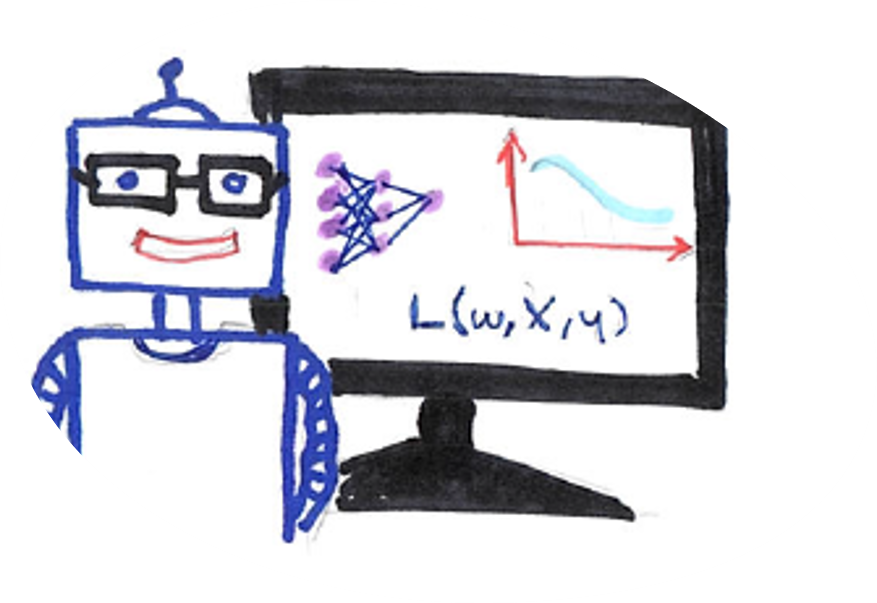
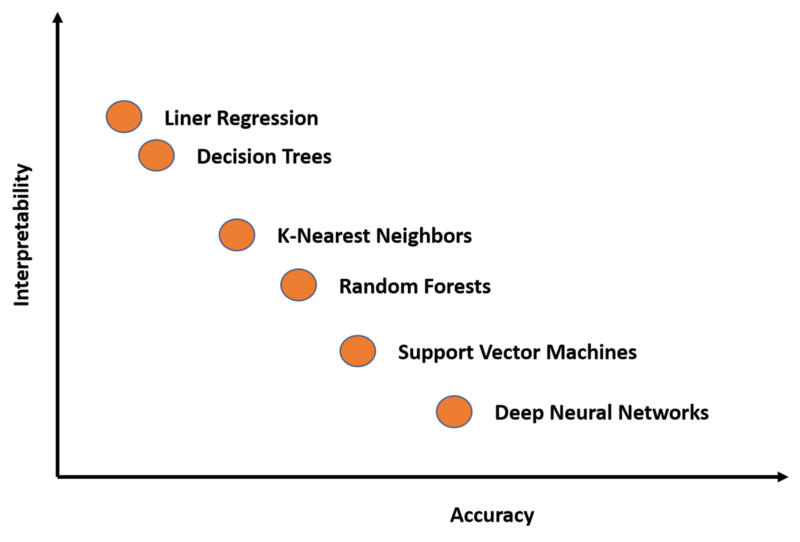
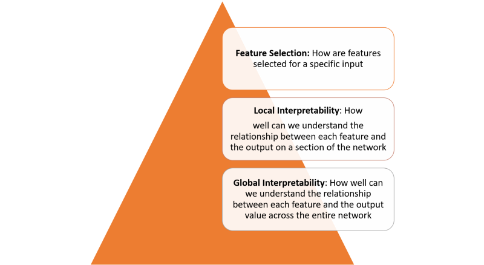

This New Google Technique Help Us Understand How Neural Networks are Thinking

# This New Google Technique Help Us Understand How Neural Networks are Thinking

[Jesus Rodriguez](https://towardsdatascience.com/@jrodthoughts?source=post_page---------------------------)

[Jul 5](https://towardsdatascience.com/this-new-google-technique-help-us-understand-how-neural-networks-are-thinking-229f783300?source=post_page---------------------------) · 6 min read

Interpretability remains one of the biggest challenges of modern deep learning applications. The recent advancements in computation models and deep learning research have enabled the creation of highly sophisticated models that can include thousands of hidden layers and tens of millions of neurons. While its relatively simple to create incredibly advanced deep neural network models, its understanding how those models create and use knowledge remains a challenge. Recently, researchers from the Google Brain team [published a paper proposing a new method called Concept Activation Vectors](https://arxiv.org/pdf/1711.11279.pdf)(CAVs) that takes a new angle to the interpretability of deep learning models.

# Interpretability vs. Accuracy

To understand the CAV technique, it is important to understand the nature of the interpretability challenge in deep learning models. In the current generation of deep learning technologies, there is a permanent friction between the accuracy of a model and our ability to interpret its knowledge. The interpretability-accuracy friction is the friction between being able to accomplish complex knowledge tasks and understanding how those tasks were accomplished. Knowledge vs. Control, Performance vs. Accountability, Efficiency vs. Simplicity…pick your favorite dilemma and they all can be explained by balancing the tradeoffs between accuracy and interpretability.

Do you care about obtaining the best results or do you care about understanding how those results were produced? That’s a question that data scientists need to answer in every deep learning scenario. Many deep learning techniques are complex in nature and, although they result very accurate in many scenarios, they can become incredibly difficult to interpret. If we can plot some of the best-known deep learning models in a chart that correlates accuracy and interpretability, we will get something like the following:

Interpretability in deep learning models is not a single concept and can be seen across multiple layers:

Achieving interpretability across each one of the layers defined in the previous figure requires several fundamental building blocks. [In a recent paper](https://distill.pub/2018/building-blocks/), researchers from Google outlined what they considered some of the foundational building blocks of interpretability.

Google summarizes the principles of interpretability as the following:

**— Understanding what Hidden Layers Do:** The bulk of the knowledge in a deep learning model is formed in the hidden layers. Understanding the functionality of the different hidden layers at a macro level is essential to be able to interpret a deep learning model.

**— Understanding How Nodes are Activated:** The key to interpretability is not to understand the functionality of individual neurons in a network but rather groups of interconnected neurons that fire together in the same spatial location. Segmenting a network by groups of interconnected neurons will provide a simpler level of abstraction to understand its functionality.

**— Understanding How Concepts are Formed:** Understanding how deep neural network forms individual concepts that can then be assembled into the final output is another key building block of interpretability.

Those principles were the theoretical foundation behind Google’s new CAV technique.

# Concept Activation Vectors

Following the ideas discussed in the previous section, the natural approach to interpretability should be to describe an deep learning model’s predictions in terms of the input features it considers. A classic examples would be a logistic regression classifier in which coefficient weights are often interpreted as the importance of each feature. However, most deep learning models operate on features, such as pixel values, that do not correspond to high level concepts that humans easily understand. Furthermore, a model’s internal values (e.g., neural activations) can seem incomprehensible. While techniques such as saliency maps are effective at measuring the importance of specific pixel regions they fail to correlate to higher level concepts.

The core idea behind CAV is to measure of the relevance of a concept in the model’s outputs. A CAV for a concept is simply a vector in the direction of the values (e.g., activations) of that concept’s set of examples. In their paper, the Google research team outlines a new linear interpretability method called Testing with CAV(TCAV) that uses directional derivatives to quantify the model prediction’s sensitivity to an underlying high level concept, learned by a CAV. Conceptually, TCAV was defined with four goals in mind:

**— Accessibility:** Requires little to no ML expertise of user.

**— Customization:** Adapts to any concept (e.g., gender) and is not limited to concepts considered during training.

**— Plug-in readiness:** Works without any retraining or modification of the ML model.

**— Global quantification**: Can interpret entire classes or sets of examples with a single quantitative measure, and not just explain individual data inputs.

To achieve the aforementioned goals, the TCAV methodology is defined in three fundamental steps:

1) Define relevant concepts to a model.
2) Understand the sensitivity of the prediction to those concepts.

3) Extrapolate a global quantitative explanation of the relative importance of each concept to each model prediction class.

The first step in the TCAV method is to define a concept of interest(CAV). TCAV achieves this simply by choosing a set of examples that represent this concept or find an independent data set with the concept labeled. CAVs are learned by training a linear classifier to distinguish between the activations produced by a concept’s examples and examples in any layer.

The second step is to generate a TCAV score that quantifies the sensitivity of the predictions to a specific concept. TCAV achieves that by using directional derivatives that gauge the sensitivity of ML predictions to changes in inputs towards the direction of a concept, at neural activation layer.

The final step tries to evaluate the global relevance of the learned CAVs to avoid relying on non-relevant CAVs. After all, one pitfall with the TCAV technique is the potential for learning a meaningless CAV. After all, using a randomly chosen set of images will still produce a CAV. A test based on such a random concept is unlikely to be meaningful. To address that challenge, TCAV introduces a statistical significance test that evaluates a CAV against a random number of training runs, typically 500. The idea is that a meaningful concept should lead to TCAV scores that behave consistently across training runs.

# TCAV in Action

The Google Brain team conducted several experiments to evaluate the efficiency of TCAV compared to other interpretability methods. In one of the most remarkable tests, the team used a saliency map that attempts to predict the relevance of a caption or an image to understand the concept of a taxi. The output of the saliency map looks like the following:

Using those images as a test dataset, the Google Brain team conducted experiments using 50 people on Amazon Mechanical Turk. *Each worker did a series of six tasks (3 object classes x 2s aliency map types), all for a single model. Task order was randomized. In each task, the worker first saw four images along with their corresponding saliency masks. They then rated how important they thought the image was to the model (10-point scale), how important the caption was to the model (10-point scale), and how confident they were in their answers (5-point scale). In total, turkers rated 60 unique images (120 unique saliency maps).*

The ground truth of the experiment was that the image concept was more relevant than the caption concept. However, when looking at saliency maps, humans perceived the caption concept as being more important (model with 0% noise), or did not discern a difference (model with 100% noise). In contrast, TCAV results correctly show that the image concept was more important.

TCAV is one of the most innovative approaches to neural network interpretability of the last few years. The code for the initial techniques is [available on GitHub](https://github.com/tensorflow/tcav)and we should expect to see some of these ideas adapted by mainstream deep learning frameworks.